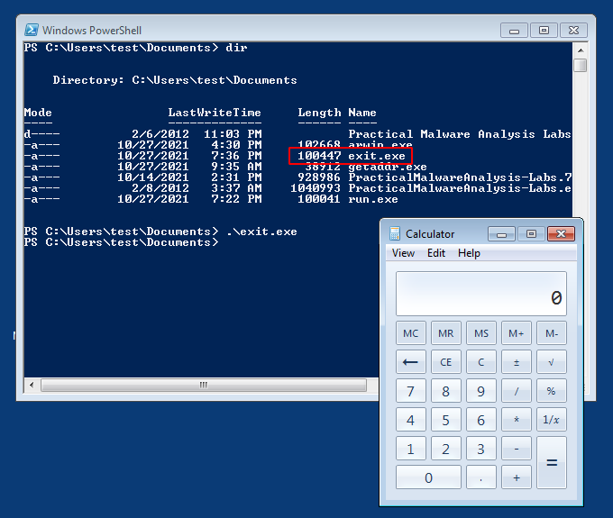
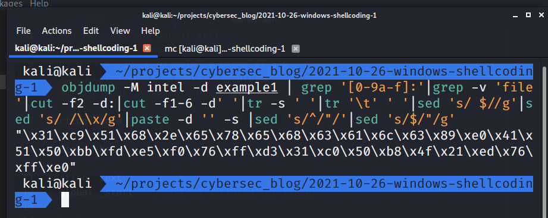

## 10. windows shellcoding - part 1. Simple example

{width="80%"}          

In the previous sections about shellcoding, we worked with linux examples. In this section my goal will be to write shellcode for windows machine.        

### testing shellcode

When testing shellcode, it is nice to just plop it into a program and let it run. We will use the same code as in the first post (`run.c`):           
```cpp
/*
run.c - a small skeleton program to run shellcode
*/
// bytecode here
char code[] = "my shellcode here";

int main(int argc, char **argv) {
  int (*func)();             // function pointer
  func = (int (*)()) code;   // func points to our shellcode
  (int)(*func)();            // execute a function code[]
  // if our program returned 0 instead of 1, 
  // so our shellcode worked
  return 1;
}
```

### first example. run calc.exe

First, we will write something like a prototype of the shellcode in C. For simplicity, let's write the following source code (`exit.c`): 
```cpp
/*
exit.c - run calc.exe and exit
*/
#include <windows.h>

int main(void) {
  WinExec("calc.exe", 0);
  ExitProcess(0);
}
```

As you can see, the logic of this program is simple: launch the calculator (`calc.exe`) and exit. Let's make sure our code actually works. Compile:          
```bash
i686-w64-mingw32-gcc -o exit.exe exit.c -mconsole -lkernel32
```

{width="80%"}          

Then run in windows machine (`Windows 7 x86 SP1`):              
```cmd
.\exit.exe
```

{width="80%"}          

So everything is worked perfectly.           

Let's now try to write this logic in assembly language. The Windows kernel is completely different from the Linux kernel. At the very beginning of our program, we have `#include <windows.h>`, which in turn means that the windows library will be included in the code and this will dynamically link dependencies by default. However, we cannot do the same with ASM. In the case of ASM, we need to find the location of the [WinExec](https://docs.microsoft.com/en-us/windows/win32/api/winbase/nf-winbase-winexec) function, load the arguments onto the stack, and call the register that has a pointer to the function. Likewise for the [ExitProcess](https://docs.microsoft.com/en-us/windows/win32/api/processthreadsapi/nf-processthreadsapi-exitprocess) function. It is important to know that most windows functions are available from three main libraries: `ntdll.dll`, `Kernel32.DLL` and `KernelBase.dll`. If you run our example in a debugger (`x32dbg` in my case), you can make sure of this:          

{width="80%"}          

### finding function's addresses

So, we need to know the `WinExec` address in memory. We'll find it!       

```cpp
/*
getaddr.c - get addresses of functions 
(ExitProcess, WinExec) in memory
*/
#include <windows.h>
#include <stdio.h>

int main() {
  unsigned long Kernel32Addr;      // kernel32.dll address
  unsigned long ExitProcessAddr;   // ExitProcess address
  unsigned long WinExecAddr;       // WinExec address

  Kernel32Addr = GetModuleHandle("kernel32.dll");
  printf("KERNEL32 address in memory: 0x%08p\n", Kernel32Addr);

  ExitProcessAddr = GetProcAddress(Kernel32Addr, "ExitProcess");
  printf("ExitProcess address in memory is: 0x%08p\n", ExitProcessAddr);

  WinExecAddr = GetProcAddress(Kernel32Addr, "WinExec");
  printf("WinExec address in memory is: 0x%08p\n", WinExecAddr);

  getchar();
  return 0;
}
```

This program will tell you the kernel address and the `WinExec` address in `kernel32.dll`. Let's compile it:               
```bash
i686-w64-mingw32-gcc -O2 getaddr.c -o getaddr.exe \
-mconsole -I/usr/share/mingw-w64/include/ -s \
-ffunction-sections -fdata-sections -Wall \
-fno-exceptions -fmerge-all-constants -static-libstdc++ \
-static-libgcc >/dev/null 2>&1
```

{width="80%"}          

and run in our target machine:
```cmd
.\getaddr.exe
```

{width="80%"}          

Now we know the addresses of our functions. Note that our program found the kernel32 address correctly. 

### assembly time

The `WinExec()` function within `kernel32.dll` can be used to launch any program that the user running the process can access:
```cpp
UINT WinExec(LPCSTR lpCmdLine, UINT uCmdShow);
```

In our case, `lpCmdLine` is equal to `calc.exe`, `uCmdShow` is equal to 1 (`SW_NORMAL`).        
Firstly convert `calc.exe` to hex via python script (`conv.py`):
```python
# convert string to reversed hex
import sys

input = sys.argv[1]
chunks = [input[i:i+4] for i in range(0, len(input), 4)]
for chunk in chunks[::-1]:
    print (chunk[::-1].encode("utf-8").hex())
```

{width="80%"}          

Then, create our assembly code:
```nasm
xor  ecx, ecx         ; zero out ecx
push ecx              ; string terminator 0x00 for 
                      ; "calc.exe" string
push 0x6578652e       ; exe. : 6578652e
push 0x636c6163       ; clac : 636c6163

mov  eax, esp         ; save pointer to "calc.exe" 
                      ; string in ebx

; UINT WinExec([in] LPCSTR lpCmdLine, [in] UINT uCmdShow);
inc  ecx              ; uCmdShow = 1
push ecx              ; uCmdShow *ptr to stack in 
                      ; 2nd position - LIFO
push eax              ; lpcmdLine *ptr to stack in 
                      ; 1st position
mov  ebx, 0x76f0e5fd  ; call WinExec() function 
                      ; addr in kernel32.dll
call ebx
```

> To put something in Little Endian format, just put the hex of the bytes in as reverse

So, what about `ExitProcess` function?
```cpp
void ExitProcess(UINT uExitCode);
```

It's used to gracefully close the host process after the `calc.exe` process is launched using the `WinExec` function:       
```nasm
; void ExitProcess([in] UINT uExitCode);
xor  eax, eax         ; zero out eax
push eax              ; push NULL
mov  eax, 0x76ed214f  ; call ExitProcess 
                      ; function addr in kernel32.dll
jmp  eax              ; execute the ExitProcess function
```

So, final code is:
```nasm
; run calc.exe and normal exit
; author @cocomelonc
; nasm -f elf32 -o example1.o example1.asm
; ld -m elf_i386 -o example1 example1.o
; 32-bit linux (work in windows as shellcode)

section .data

section .bss

section .text
  global _start   ; must be declared for linker

_start:
  xor  ecx, ecx         ; zero out ecx
  push ecx              ; string terminator 0x00 
                        ; for "calc.exe" string
  push 0x6578652e       ; exe. : 6578652e
  push 0x636c6163       ; clac : 636c6163

  mov  eax, esp         ; save pointer to "calc.exe" 
                        ; string in ebx

  ; UINT WinExec([in] LPCSTR lpCmdLine, [in] UINT   uCmdShow);
  inc  ecx              ; uCmdShow = 1
  push ecx              ; uCmdShow *ptr to stack in 
                        ; 2nd position - LIFO
  push eax              ; lpcmdLine *ptr to stack in 
                        ; 1st position
  mov  ebx, 0x76f0e5fd  ; call WinExec() function 
                        ; addr in kernel32.dll
  call ebx

  ; void ExitProcess([in] UINT uExitCode);
  xor  eax, eax         ; zero out eax
  push eax              ; push NULL
  mov  eax, 0x76ed214f  ; call ExitProcess function 
                        ; addr in kernel32.dll
  jmp  eax              ; execute the ExitProcess function
```

Compile:
```bash
nasm -f elf32 -o example1.o example1.asm
ld -m elf_i386 -o example1 example1.o
objdump -M intel -d example1
```

{width="80%"}          

Then, let's go to extract byte code via bash-hacking and `objdump` again:
```bash
objdump -M intel -d example1 | grep '[0-9a-f]:'|grep -v 
'file'|cut -f2 -d:|cut -f1-6 -d' '|tr -s ' '|tr '\t' ' '|
sed 's/ $//g'|sed 's/ /\\x/g'|paste -d '' -s |sed 's/^/"/'|
sed 's/$/"/g'
```

{width="80%"}          

So, our bytecode is:                      

```bash
"\x31\xc9\x51\x68\x2e\x65\x78\x65\x68\x63\x61\x6c
\x63\x89\xe0\x41\x51\x50\xbb\xfd\xe5\xf0\x76\xff
\xd3\x31\xc0\x50\xb8\x4f\x21\xed\x76\xff\xe0"
```

> compiled as ELF file for linux 32-bit because we are only using nasm to translate the opcodes for us

Then, replace the code at the top (`run.c`) with:
```cpp
/*
run.c - a small skeleton program to run shellcode
*/
// bytecode here
char code[] = "\x31\xc9\x51\x68\x2e\x65\x78\x65\x68\x63\x61"
"\x6c\x63\x89\xe0\x41\x51\x50\xbb\xfd\xe5\xf0"
"\x76\xff\xd3\x31\xc0\x50\xb8\x4f\x21\xed\x76"
"\xff\xe0";

int main(int argc, char **argv) {
  int (*func)();             // function pointer
  func = (int (*)()) code;   // func points to our shellcode
  (int)(*func)();            // execute a function code[]
  // if our program returned 0 instead of 1,
  // so our shellcode worked
  return 1;
}
```

Compile:
```bash
i686-w64-mingw32-gcc run.c -o run.exe
```

{width="80%"}          

And run:
```cmd
.\run.exe
```

{width="80%"}          

> The `calc.exe` process runs even after the host process dies because it is it's own process.            

So our shellcode is perfectly worked :)        

This is how you create your own shellcode for windows, for example.                         

But, there is one caveat. This shellcode will only work on this machine. Because, the addresses of all DLLs and their functions change on reboot and are different on each system. In order for it to work on any windows 7 x86 sp1, ASM needs to find the addresses of the functions by itself. I will do this in the next part.               


[WinExec](https://docs.microsoft.com/en-us/windows/win32/api/winbase/nf-winbase-winexec)                 
[ExitProcess](https://docs.microsoft.com/en-us/windows/win32/api/processthreadsapi/nf-processthreadsapi-exitprocess)               
[The Shellcoder's Handbook](https://www.wiley.com/en-us/The+Shellcoder%27s+Handbook%3A+Discovering+and+Exploiting+Security+Holes%2C+2nd+Edition-p-9780470080238)              
[my intro to x86 assembly](https://cocomelonc.github.io/tutorial/2021/10/03/malware-analysis-1.html)          
[my nasm tutorial](https://cocomelonc.github.io/tutorial/2021/10/08/malware-analysis-2.html)           
[linux shellcoding part 1](https://cocomelonc.github.io/tutorial/2021/10/09/linux-shellcoding-1.html)                
[linux shellcoding part 2](https://cocomelonc.github.io/tutorial/2021/10/17/linux-shellcoding-2.html)                
[Source code in Github](https://github.com/cocomelonc/2021-10-26-windows-shellcoding-1)        
