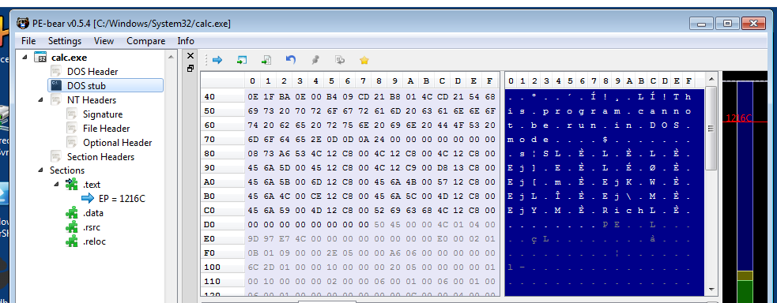
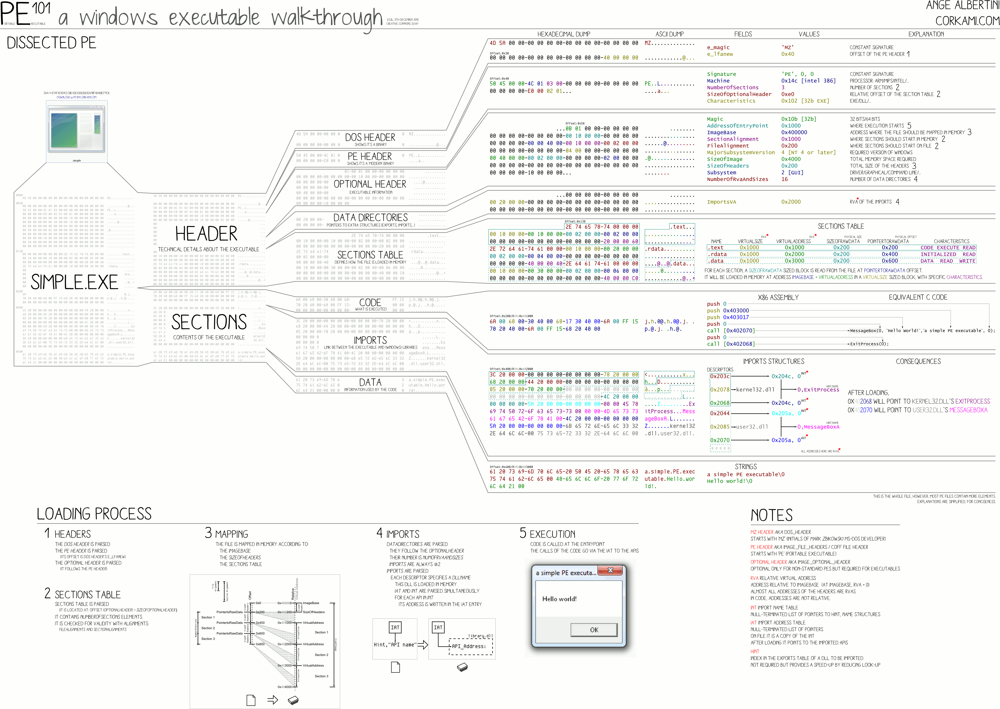

## 12. windows shellcoding - part 3. PE file format

{width="80%"}         

This section can be read not only as a continuation of the previous ones, but also as a separate material. This one is overview of PE file format.           

### PE file

What is PE file format? It's the native file format of Win32. Its specification is derived somewhat from the Unix Coff (common object file format). The meaning of "portable executable" is that the file format is universal across win32 platform: the PE loader of every win32 platform recognizes and uses this file format even when Windows is running on CPU platforms other than Intel. It doesn't mean your PE executables would be able to port to other CPU platforms without change. Thus studying the PE file format gives you valuable insights into the structure of Windows.     

Basically PE file structure looks like this:                     

{width="80%"}         


The PE File Format is essentially defined by the PE Header so you will want to read about that first, you don't need to understand every single part of it but you should get an idea about it's structure and be able to identify the parts that are most important.

### DOS header

DOS header store the information needed to load the PE file. Therefore, this header is mandatory for loading a PE file.            

DOS header structure:          
```cpp
typedef struct _IMAGE_DOS_HEADER {// DOS .EXE header
    WORD   e_magic;       // Magic number
    WORD   e_cblp;        // Bytes on last page of file
    WORD   e_cp;          // Pages in file
    WORD   e_crlc;        // Relocations
    WORD   e_cparhdr;     // Size of header in paragraphs
    WORD   e_minalloc;    // Minimum extra paragraphs needed
    WORD   e_maxalloc;    // Maximum extra paragraphs needed
    WORD   e_ss;          // Initial (relative) SS value
    WORD   e_sp;          // Initial SP value
    WORD   e_csum;        // Checksum
    WORD   e_ip;          // Initial IP value
    WORD   e_cs;          // Initial (relative) CS value
    WORD   e_lfarlc;      // File address of relocation table
    WORD   e_ovno;        // Overlay number
    WORD   e_res[4];      // Reserved words
    WORD   e_oemid;       // OEM identifier (for e_oeminfo)
    WORD   e_oeminfo;     // OEM information; e_oemid specific
    WORD   e_res2[10];    // Reserved words
    LONG   e_lfanew;      // File address of new exe header
  } IMAGE_DOS_HEADER, *PIMAGE_DOS_HEADER;
```

and it is `64` bytes in size. In this structure, the most important fields are `e_magic` and `e_lfanew`. The first two bytes of the header are the magic bytes which identify the file type, `4D 5A` or "MZ" which are the initials of Mark Zbikowski who worked on DOS at Microsoft. These magic bytes define it as a PE file:

{width="80%"}         

`e_lfanew` - is at offset `0x3c` of the DOS HEADER and contains the offset to the PE header:

{width="80%"}         

### DOS stub

After the first `64` bytes of the file, a dos stub starts. This area in memory is mostly filled with zeros:     

{width="80%"}         

### PE header

This portion is small and simply contains a file signature which are the magic bytes `PE\0\0` or `50 45 00 00`:

{width="80%"}         

It's structure:        
```cpp
typedef struct _IMAGE_NT_HEADERS {
    DWORD Signature;
    IMAGE_FILE_HEADER FileHeader;
    IMAGE_OPTIONAL_HEADER32 OptionalHeader;
} IMAGE_NT_HEADERS32, *PIMAGE_NT_HEADERS32;
```

Let's take a closer look at this structure.        

**File Header** (or COFF Header) - a set of fields describing the basic characteristics of the file:       
```cpp
typedef struct _IMAGE_FILE_HEADER {
    WORD    Machine;
    WORD    NumberOfSections;
    DWORD   TimeDateStamp;
    DWORD   PointerToSymbolTable;
    DWORD   NumberOfSymbols;
    WORD    SizeOfOptionalHeader;
    WORD    Characteristics;
} IMAGE_FILE_HEADER, *PIMAGE_FILE_HEADER;
```

{width="80%"}         

**Optional Header** - it's optional in context of COFF object files but not PE files. It contains many important variables such as `AddressOfEntryPoint`, `ImageBase`, `Section Alignment`, `SizeOfImage`, `SizeOfHeaders` and the `DataDirectory`. This structure has 32-bit and 64-bit versions:

```cpp
typedef struct _IMAGE_OPTIONAL_HEADER {
    //
    // Standard fields.
    //

    WORD    Magic;
    BYTE    MajorLinkerVersion;
    BYTE    MinorLinkerVersion;
    DWORD   SizeOfCode;
    DWORD   SizeOfInitializedData;
    DWORD   SizeOfUninitializedData;
    DWORD   AddressOfEntryPoint;
    DWORD   BaseOfCode;
    DWORD   BaseOfData;

    //
    // NT additional fields.
    //

    DWORD   ImageBase;
    DWORD   SectionAlignment;
    DWORD   FileAlignment;
    WORD    MajorOperatingSystemVersion;
    WORD    MinorOperatingSystemVersion;
    WORD    MajorImageVersion;
    WORD    MinorImageVersion;
    WORD    MajorSubsystemVersion;
    WORD    MinorSubsystemVersion;
    DWORD   Win32VersionValue;
    DWORD   SizeOfImage;
    DWORD   SizeOfHeaders;
    DWORD   CheckSum;
    WORD    Subsystem;
    WORD    DllCharacteristics;
    DWORD   SizeOfStackReserve;
    DWORD   SizeOfStackCommit;
    DWORD   SizeOfHeapReserve;
    DWORD   SizeOfHeapCommit;
    DWORD   LoaderFlags;
    DWORD   NumberOfRvaAndSizes;
    IMAGE_DATA_DIRECTORY 
    DataDirectory[IMAGE_NUMBEROF_DIRECTORY_ENTRIES];
} IMAGE_OPTIONAL_HEADER32, *PIMAGE_OPTIONAL_HEADER32;
```

{width="80%"}         

Here I want to draw you attention to `IMAGE_DATA_DIRECTORY`:
```cpp
typedef struct _IMAGE_DATA_DIRECTORY {
  DWORD VirtualAddress;
  DWORD Size;
} IMAGE_DATA_DIRECTORY, *PIMAGE_DATA_DIRECTORY;
```

it's data directory. Simply it is an array (`16` in size), each element of which contains a structure of 2 `DWORD` values.    

Currently, PE files can contain the following data directories:       

- Export Table
- Import Table
- Resource Table
- Exception Table
- Certificate Table
- Base Relocation Table
- Debug
- Architecture
- Global Ptr
- TLS Table
- Load Config Table
- Bound Import
- IAT (Import Address Table)
- Delay Import Descriptor
- CLR Runtime Header
- Reserved, must be zero

As I wrote earlier, I will consider in more detail only some of them.                 

### Section Table

Contains an array of `IMAGE_SECTION_HEADER` structs which define the sections of the PE file such as the `.text` and `.data` sections.
`IMAGE_SECTION_HEADER` structure is:
```cpp
typedef struct _IMAGE_SECTION_HEADER {
    BYTE    Name[IMAGE_SIZEOF_SHORT_NAME];
    union {
            DWORD   PhysicalAddress;
            DWORD   VirtualSize;
    } Misc;
    DWORD   VirtualAddress;
    DWORD   SizeOfRawData;
    DWORD   PointerToRawData;
    DWORD   PointerToRelocations;
    DWORD   PointerToLinenumbers;
    WORD    NumberOfRelocations;
    WORD    NumberOfLinenumbers;
    DWORD   Characteristics;
} IMAGE_SECTION_HEADER, *PIMAGE_SECTION_HEADER;
```

and consists of `0x28` bytes.                  

### Sections

After the section table comes the actual sections:             

{width="80%"}         

Applications do not directly access physical memory, they only access virtual memory. Sections are an area that is paged out into virtual memory and all work is done directly with this data. The address in virtual memory, without any offsets, is called the **Virtual Address**, or **VA** for short. In other words, the Virtual Addresses (VAs) are the memory addresses that are referenced by an application. Preferred download location for the application, set in the **ImageBase** field. It is like the point at which an application area begins in virtual memory. And the offsets **RVA (Relative Virtual Address)** are measured relative to this point. We can calculate RVA with the help of the following formula: `RVA = VA - ImageBase`. `ImageBase` is always known to us and having received VA or RVA at our disposal, we can express one through the other.     

The size of each section is fixed in the section table, so the sections must be of a certain size, and for this they are supplemented with `NULL` bytes (`00`).              

An application in Windows NT typically has different predefined sections, such as `.text`, `.bss`, `.rdata`, `.data`, `.rsrc`. Depending on the application, some of these sections are used, but not all are used.         

##### .text

In Windows, all code segments reside in a section called `.text`. 

##### .rdata

The read-only data on the file system, such as strings and constants reside in a section called `.rdata`.

##### .rsrc

The `.rsrc` is a resource section, which contains resource information. In many cases it shows icons and images that are part of the file's resources. It begins with a resource directory structure like most other sections, but this section's data is further structured into a resource tree. `IMAGE_RESOURCE_DIRECTORY`, shown below, forms the root and nodes of the tree:           
```cpp
typedef struct _IMAGE_RESOURCE_DIRECTORY {
    DWORD   Characteristics;
    DWORD   TimeDateStamp;
    WORD    MajorVersion;
    WORD    MinorVersion;
    WORD    NumberOfNamedEntries;
    WORD    NumberOfIdEntries;
} IMAGE_RESOURCE_DIRECTORY, *PIMAGE_RESOURCE_DIRECTORY;
```

##### .edata

The `.edata` section contains export data for an application or DLL. When present, this section contains an export directory for getting to the export information. `IMAGE_EXPORT_DIRECTORY` structure is:            
```cpp
typedef struct _IMAGE_EXPORT_DIRECTORY {
    ULONG   Characteristics;
    ULONG   TimeDateStamp;
    USHORT  MajorVersion;
    USHORT  MinorVersion;
    ULONG   Name;
    ULONG   Base;
    ULONG   NumberOfFunctions;
    ULONG   NumberOfNames;
    PULONG  *AddressOfFunctions;
    PULONG  *AddressOfNames;
    PUSHORT *AddressOfNameOrdinals;
} IMAGE_EXPORT_DIRECTORY, *PIMAGE_EXPORT_DIRECTORY;
```

Exported symbols are generally found in DLLs, but DLLs can also import symbols. The main purpose of the export table is to associate the names and / or numbers of the exported functions with their RVA, that is, with the position in the process memory card. 

### Import Address Table
The Import Address Table is comprised of function pointers, and is used to get the addresses of functions when the DLLs are loaded. A compiled application was designed so that all API calls will not use direct hardcoded addresses but rather work through a function pointer.  

### Conclusion

The PE file format is more complex than I wrote in this post, for example, an interesting illustration about windows executable can be found on the Ange Albertini's github project [corkami](https://github.com/corkami/pics/blob/master/binary/pe101/README.md):       

{width="80%"}         

[PE bear](https://github.com/hasherezade/pe-bear-releases)                  
[MSDN PE format](https://docs.microsoft.com/en-us/windows/win32/debug/pe-format)                
[corkami](https://github.com/corkami/pics/blob/master/binary/pe101/README.md)                    
[An In-Depth Look into the Win32 Portable Executable File Format](https://docs.microsoft.com/en-us/archive/msdn-magazine/2002/february/inside-windows-win32-portable-executable-file-format-in-detail)            
[An In-Depth Look into the Win32 Portable Executable File Format, Part 2](https://docs.microsoft.com/en-us/archive/msdn-magazine/2002/march/inside-windows-an-in-depth-look-into-the-win32-portable-executable-file-format-part-2)                 
[MSDN IMAGE_NT_HEADERS](https://docs.microsoft.com/en-us/windows/win32/api/winnt/ns-winnt-image_nt_headers32)                
[MSDN IMAGE_FILE_HEADER](https://docs.microsoft.com/en-us/windows/win32/api/winnt/ns-winnt-image_file_header)               
[MSDN IMAGE_OPTIONAL_HEADER](https://docs.microsoft.com/en-us/windows/win32/api/winnt/ns-winnt-image_optional_header32)             
[MSDN IMAGE_DATA_DIRECTORY](https://docs.microsoft.com/en-us/windows/win32/api/winnt/ns-winnt-image_data_directory)           
