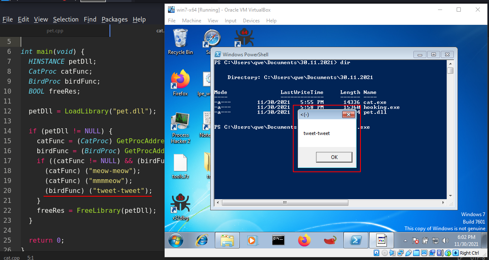
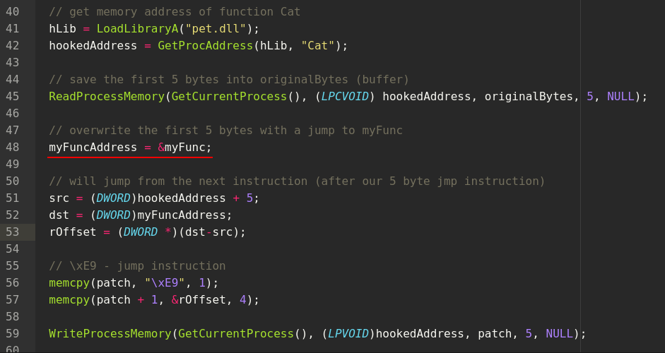
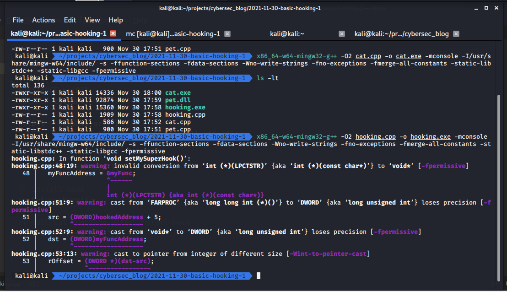
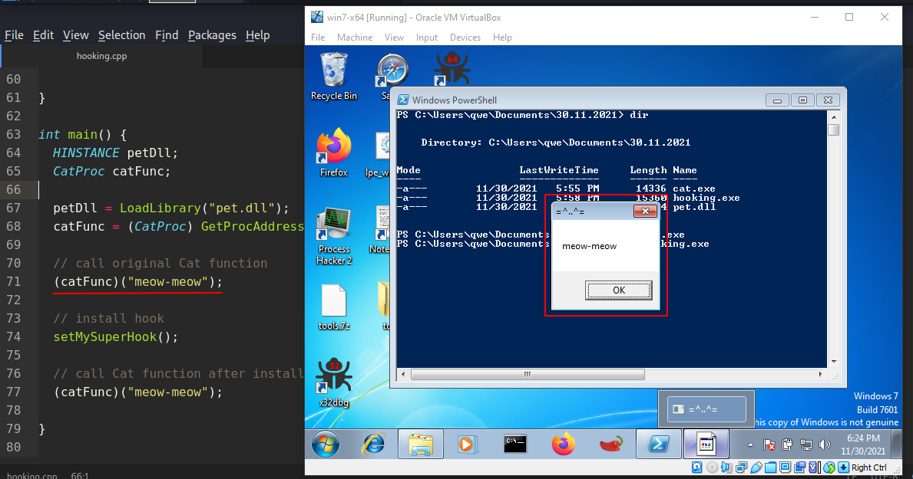
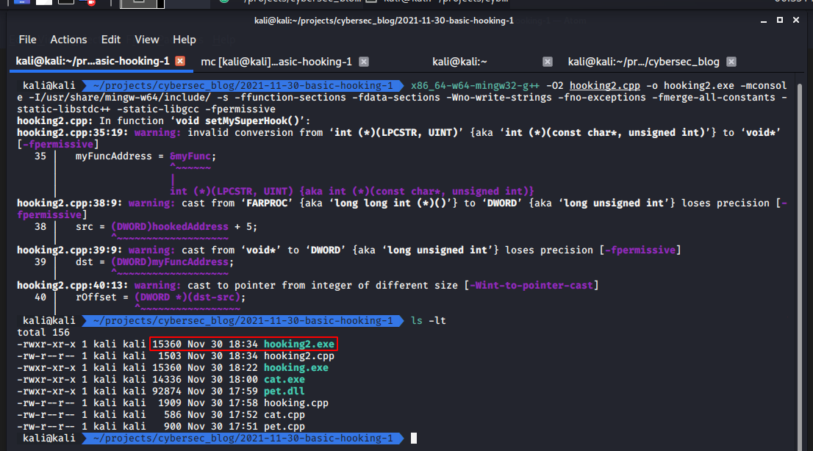
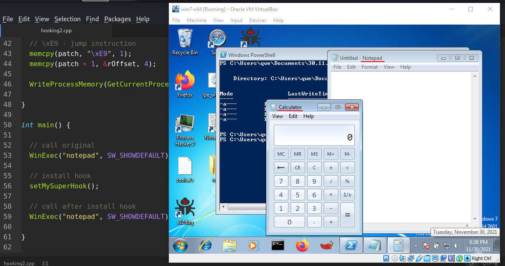

## 19. windows API hooking. Simple C++ example.

{width="80%"}    

### what is API hooking?

API hooking is a technique by which we can instrument and modify the behaviour and flow of API calls. This technique is also used by many AV solutions to detect if code is malicious.   

### example 1

Before hooking windows API functions I will consider the case of how to do this with an exported function from a DLL.    

For example we have DLL with this logic (`pet.cpp`):    

```cpp
/*
pet.dll - DLL example for basic hooking
*/

#include <windows.h>
#pragma comment (lib, "user32.lib")

BOOL APIENTRY DllMain(HMODULE hModule, 
DWORD ul_reason_for_call, LPVOID lpReserved) {
  switch (ul_reason_for_call) {
    case DLL_PROCESS_ATTACH:
      break;
    case DLL_PROCESS_DETACH:
      break;
    case DLL_THREAD_ATTACH:
      break;
    case DLL_THREAD_DETACH:
      break;
  }
  return TRUE;
}

extern "C" {
  __declspec(dllexport) int _cdecl Cat(LPCTSTR say) {
    MessageBox(NULL, say, "=^..^=", MB_OK);
	  return 1;
	}
}

extern "C" {
  __declspec(dllexport) int _cdecl Mouse(LPCTSTR say) {
    MessageBox(NULL, say, "<:3()~~", MB_OK);
	  return 1;
	}
}

extern "C" {
  __declspec(dllexport) int _cdecl Frog(LPCTSTR say) {
    MessageBox(NULL, say, "8)~", MB_OK);
	  return 1;
	}
}

extern "C" {
  __declspec(dllexport) int _cdecl Bird(LPCTSTR say) {
    MessageBox(NULL, say, "<(-)", MB_OK);
	  return 1;
	}
}
```

As you can see this DLL have simplest exported functions: `Cat`, `Mouse`, `Frog`, `Bird` with one param `say`. As you can see the logic of this functions is simplest, just pop-up message with title.       

Let's go to compile it:   
```bash
x86_64-w64-mingw32-gcc -shared -o pet.dll pet.cpp -fpermissive
```

{width="80%"}    

and then, create a simple code to validate this DLL (`cat.cpp`):
```cpp
#include <windows.h>

typedef int (__cdecl *CatProc)(LPCTSTR say);
typedef int (__cdecl *BirdProc)(LPCTSTR say);

int main(void) {
  HINSTANCE petDll;
  CatProc catFunc;
  BirdProc birdFunc;
  BOOL freeRes;

  petDll = LoadLibrary("pet.dll");

  if (petDll != NULL) {
    catFunc = (CatProc) GetProcAddress(petDll, "Cat");
    birdFunc = (BirdProc) GetProcAddress(petDll, "Bird");
    if ((catFunc != NULL) && (birdFunc != NULL)) {
      (catFunc) ("meow-meow");
      (catFunc) ("mmmmeow");
      (birdFunc) ("tweet-tweet");
    }
    freeRes = FreeLibrary(petDll);
  }

  return 0;
}

```

Let's go to compile it:   
```bash
x86_64-w64-mingw32-g++ -O2 cat.cpp -o cat.exe \
-mconsole -I/usr/share/mingw-w64/include/ -s \
-ffunction-sections -fdata-sections -Wno-write-strings \
-fno-exceptions -fmerge-all-constants -static-libstdc++ \
-static-libgcc -fpermissive
```

{width="80%"}    

and run on `Windows 7 x64`:
```cmd
.\cat.exe
```

{width="80%"}    

{width="80%"}    

{width="80%"}    

and as you can see, everything works as expected.   

Then, for example `Cat` function will be hooked in this scenario, but it could be any.   

The workflow of this technique is as follows:   

First, get memory address of the `Cat` function.    

{width="80%"}    

then, save the first `5` bytes of the `Cat` function. We will need this bytes:

{width="80%"}    

then, create a `myFunc` function that will be executed when the original `Cat` is called:

{width="80%"}    

overwrite `5` bytes with a jump to `myFunc`:

{width="80%"}    

Then, create a "patch":    

{width="80%"}    

in the next step, patch our `Cat` function (redirect `Cat` function to `myFunc`):    

{width="80%"}    

So what have we done here? This trick is *"classic 5-byte hook"* technique. If we disassemble function:

{width="80%"}    

The highlighted `5` bytes is a fairly typical prologue found in many API functions. By overwriting these first `5` bytes with a `jmp` instruction, we are redirecting execution to our own defined function. We will save the original bytes so that they can be referenced later when we want to pass execution back to the hooked function.    

So firstly, we call original `Cat` function, set our hook and call `Cat` again:

{width="80%"}    

Full source code is:
```cpp
/*
hooking.cpp
basic hooking example
author: @cocomelonc
https://cocomelonc.github.io/tutorial/
2021/11/30/basic-hooking-1.html
*/
#include <windows.h>

typedef int (__cdecl *CatProc)(LPCTSTR say);

// buffer for saving original bytes
char originalBytes[5];

FARPROC hookedAddress;

// we will jump to after the hook has been installed
int __stdcall myFunc(LPCTSTR say) {
  HINSTANCE petDll;
  CatProc catFunc;

  // unhook the function: rewrite original bytes
  WriteProcessMemory(GetCurrentProcess(), 
  (LPVOID)hookedAddress, 
  originalBytes, 5, NULL);

  // return to the original function and modify the text
  petDll = LoadLibrary("pet.dll");
  catFunc = (CatProc) GetProcAddress(petDll, "Cat");

  return (catFunc) ("meow-squeak-tweet!!!");
}

// hooking logic
void setMySuperHook() {
  HINSTANCE hLib;
  VOID *myFuncAddress;
  DWORD *rOffset;
  DWORD src;
  DWORD dst;
  CHAR patch[5]= {0};

  // get memory address of function Cat
  hLib = LoadLibraryA("pet.dll");
  hookedAddress = GetProcAddress(hLib, "Cat");

  // save the first 5 bytes into originalBytes (buffer)
  ReadProcessMemory(GetCurrentProcess(), 
  (LPCVOID) hookedAddress, 
  originalBytes, 5, NULL);

  // overwrite the first 5 bytes with a jump to myFunc
  myFuncAddress = &myFunc;

  // will jump from the next instruction 
  // (after our 5 byte jmp instruction)
  src = (DWORD)hookedAddress + 5;
  dst = (DWORD)myFuncAddress;
  rOffset = (DWORD *)(dst-src);

  // \xE9 - jump instruction
  memcpy(patch, "\xE9", 1);
  memcpy(patch + 1, &rOffset, 4);

  WriteProcessMemory(GetCurrentProcess(), 
  (LPVOID)hookedAddress, patch, 
  5, NULL);

}

int main() {
  HINSTANCE petDll;
  CatProc catFunc;

  petDll = LoadLibrary("pet.dll");
  catFunc = (CatProc) GetProcAddress(petDll, "Cat");

  // call original Cat function
  (catFunc)("meow-meow");

  // install hook
  setMySuperHook();

  // call Cat function after install hook
  (catFunc)("meow-meow");

}

```

Let's go to compile this:
```bash
x86_64-w64-mingw32-g++ -O2 hooking.cpp -o hooking.exe \
-mconsole -I/usr/share/mingw-w64/include/ -s \
-ffunction-sections -fdata-sections -Wno-write-strings \
-fno-exceptions -fmerge-all-constants -static-libstdc++ \
-static-libgcc -fpermissive
```

{width="80%"}    

And see it in action (on `Windows 7 x64` in this case):
```cmd
.\hooking.exe
```

{width="80%"}    

{width="80%"}    

As you can see our hook is worked perfectly!! Cat goes `meow-squeak-tweet!!!` instead `meow-meow`!   

### example 2

Similarly, you can hook for example, a function `WinExec` from `kernel32.dll` (`hooking2.cpp`):   
```cpp
#include <windows.h>

// buffer for saving original bytes
char originalBytes[5];

FARPROC hookedAddress;

// we will jump to after the hook has been installed
int __stdcall myFunc(LPCSTR lpCmdLine, UINT uCmdShow) {

  // unhook the function: rewrite original bytes
  WriteProcessMemory(GetCurrentProcess(), 
  (LPVOID)hookedAddress, originalBytes, 5, NULL);

  // return to the original function and modify the text
  return WinExec("calc", uCmdShow);
}

// hooking logic
void setMySuperHook() {
  HINSTANCE hLib;
  VOID *myFuncAddress;
  DWORD *rOffset;
  DWORD src;
  DWORD dst;
  CHAR patch[5]= {0};

  // get memory address of function MessageBoxA
  hLib = LoadLibraryA("kernel32.dll");
  hookedAddress = GetProcAddress(hLib, "WinExec");

  // save the first 5 bytes into originalBytes (buffer)
  ReadProcessMemory(GetCurrentProcess(), 
  (LPCVOID) hookedAddress, originalBytes, 5, NULL);

  // overwrite the first 5 bytes with a jump to myFunc
  myFuncAddress = &myFunc;

  // will jump from the next instruction 
  // (after our 5 byte jmp instruction)
  src = (DWORD)hookedAddress + 5;
  dst = (DWORD)myFuncAddress;
  rOffset = (DWORD *)(dst-src);

  // \xE9 - jump instruction
  memcpy(patch, "\xE9", 1);
  memcpy(patch + 1, &rOffset, 4);

  WriteProcessMemory(GetCurrentProcess(), 
  (LPVOID)hookedAddress, patch, 5, NULL);

}

int main() {

  // call original
  WinExec("notepad", SW_SHOWDEFAULT);

  // install hook
  setMySuperHook();

  // call after install hook
  WinExec("notepad", SW_SHOWDEFAULT);

}
```

Let's go to compile:
```bash
x86_64-w64-mingw32-g++ -O2 hooking2.cpp -o hooking2.exe \
-mconsole -I/usr/share/mingw-w64/include/ -s \
-ffunction-sections -fdata-sections -Wno-write-strings \
-fno-exceptions -fmerge-all-constants -static-libstdc++ \
-static-libgcc -fpermissive
```

{width="80%"}    

and run:   
```cmd
.\hooking2.exe
```

{width="80%"}    

So everything worked as expected.   

[Source code in Github](https://github.com/cocomelonc/2021-11-30-basic-hooking-1)   

[MessageBox](https://docs.microsoft.com/en-us/windows/win32/api/winuser/nf-winuser-messagebox)    
[WinExec](https://docs.microsoft.com/en-us/windows/win32/api/winbase/nf-winbase-winexec)    
[Exporting from DLL using __declspec](https://docs.microsoft.com/en-us/cpp/build/exporting-from-a-dll-using-declspec-dllexport?view=msvc-170)    
