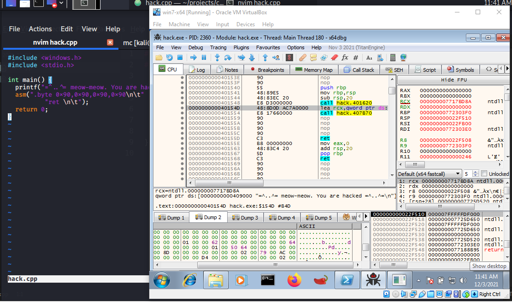
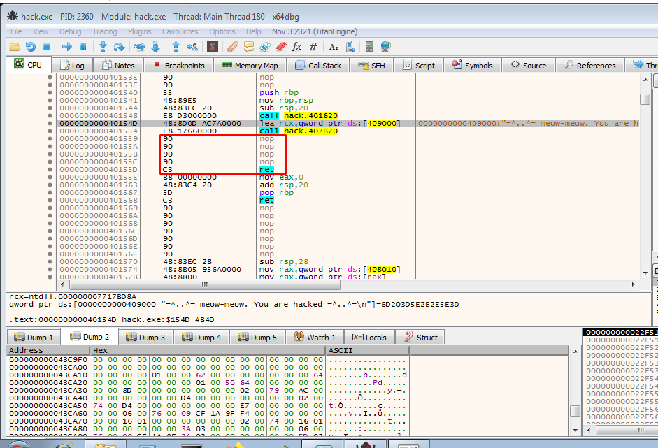

## 20. run shellcode via inline ASM. Simple C++ example.

{width="80%"}    

This is a very short section and it describes an example usage inline assembly for running shellcode in malware.   

Let's take a look at example C++ source code of our malware:    

```cpp
/*
hack.cpp
code inject via inline ASM
author: @cocomelonc
https://cocomelonc.github.io/tutorial/
2021/12/03/inline-asm-1.html
*/
#include <windows.h>
#include <stdio.h>

int main() {
  printf("=^..^= meow-meow. You are hacked =^..^=\n");
  asm(".byte 0x90,0x90,0x90,0x90\n\t"
          "ret \n\t");
  return 0;
}

```

As you can see, the logic is simplest, I'm just adding 4 NOP instructions and printing `meow-meow` string before. I can easily find the shellcode in the debugger based on this `meow` string:   

{width="80%"}    

Let's go to compile:   
```bash
x86_64-w64-mingw32-g++ hack.cpp -o hack.exe \
-mconsole -fpermissive
```

{width="80%"}    

And run in `x96dbg` (on `Windows 7 x64` in my case):

{width="80%"}    

As you can see, the highlighted instructions are my NOP instructions, so everything work perfectly as expected.    

The reason why it's good to have this technique in your arsenal is because it does not require you to allocate new `RWX` memory to copy your shellcode over to by using `VirtualAlloc` which is more popular and suspicious and which is more closely investigated by the blue teamers. 

I hope this post spreads awareness to the blue teamers of this interesting technique, and adds a weapon to the red teamers arsenal.      

[inline assembly](https://docs.microsoft.com/en-us/cpp/assembler/inline/inline-assembler?view=msvc-170)    
[source code in Github](https://github.com/cocomelonc/2021-12-03-inline-asm-1)    
