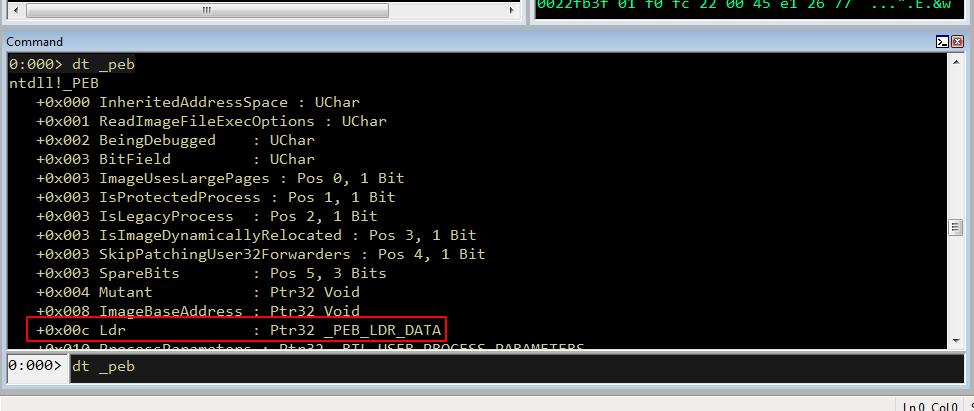
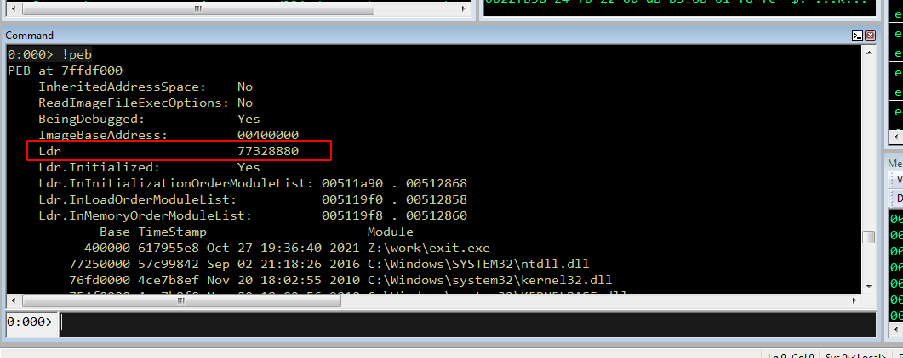
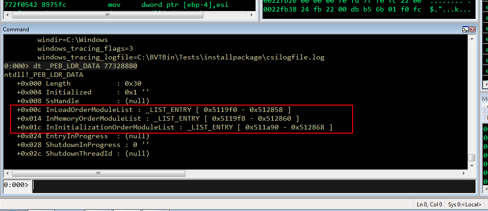
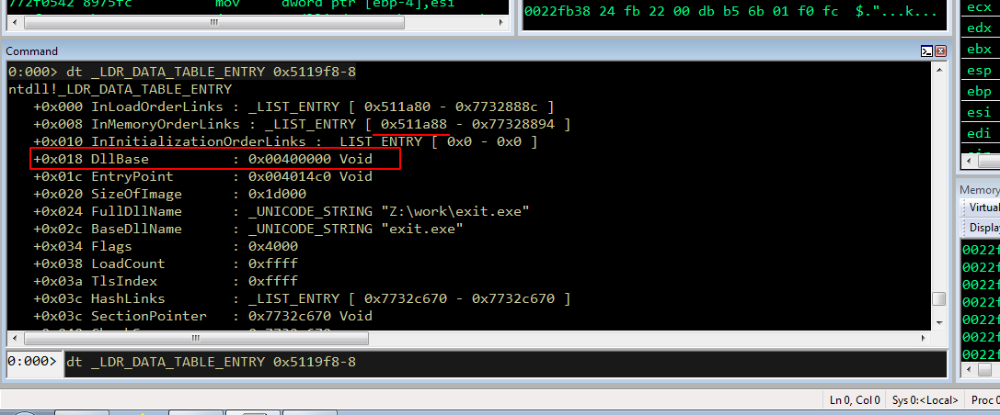
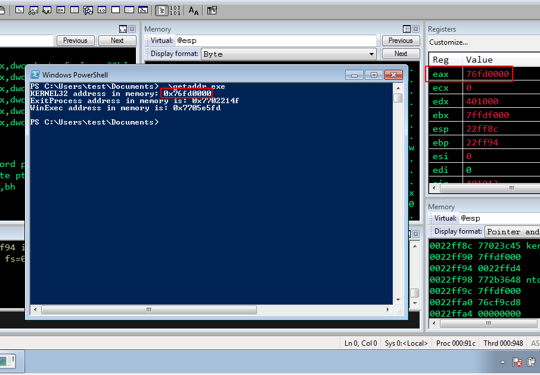

\newpage
\subsection{11. windows shellcoding - part 2. Find kernel32 address}

﷽

{width="80%"}         

In the [first](https://cocomelonc.github.io/tutorial/2021/10/27/windows-shellcoding-1.html) part of my post about windows shellcoding we found the addresses of `kernel32` and functions using the following logic:
```cpp
/*
getaddr.c - get addresses of functions
(ExitProcess, WinExec) in memory
*/
#include <windows.h>
#include <stdio.h>

int main() {
  unsigned long Kernel32Addr;      // kernel32.dll address
  unsigned long ExitProcessAddr;   // ExitProcess address
  unsigned long WinExecAddr;       // WinExec address

  Kernel32Addr = GetModuleHandle("kernel32.dll");
  printf("KERNEL32 address in memory: 0x%08p\n", Kernel32Addr);

  ExitProcessAddr = GetProcAddress(Kernel32Addr, "ExitProcess");
  printf("ExitProcess address in memory is: 0x%08p\n", 
  ExitProcessAddr);

  WinExecAddr = GetProcAddress(Kernel32Addr, "WinExec");
  printf("WinExec address in memory is: 0x%08p\n", WinExecAddr);

  getchar();
  return 0;
}
```

Then we entered the found address into our shellcode:
```nasm
; void ExitProcess([in] UINT uExitCode);
xor  eax, eax         ; zero out eax
push eax              ; push NULL
mov  eax, 0x76ed214f  ; call ExitProcess function 
                      ; addr in kernel32.dll
jmp  eax              ; execute the ExitProcess function
```

The caveat is that the addresses of all DLLs and their functions change upon reboot and differ in each system. For this reason, we cannot hard-code any addresses in our ASM code:        

{width="80%"}        

First of all, how do we find the address of `kernel32.dll`?         

### TEB and PEB structures

Whenever we execute any exe file, the first thing that is created (at least to my knowledge) in the OS are [PEB](https://docs.microsoft.com/en-us/windows/win32/api/winternl/ns-winternl-peb):                  
```cpp
typedef struct _PEB {
  BYTE                          Reserved1[2];
  BYTE                          BeingDebugged;
  BYTE                          Reserved2[1];
  PVOID                         Reserved3[2];
  PPEB_LDR_DATA                 Ldr;
  PRTL_USER_PROCESS_PARAMETERS  ProcessParameters;
  PVOID                         Reserved4[3];
  PVOID                         AtlThunkSListPtr;
  PVOID                         Reserved5;
  ULONG                         Reserved6;
  PVOID                         Reserved7;
  ULONG                         Reserved8;
  ULONG                         AtlThunkSListPtr32;
  PVOID                         Reserved9[45];
  BYTE                          Reserved10[96];
  PPS_POST_PROCESS_INIT_ROUTINE PostProcessInitRoutine;
  BYTE                          Reserved11[128];
  PVOID                         Reserved12[1];
  ULONG                         SessionId;
} PEB, *PPEB;
```

and [TEB](https://docs.microsoft.com/en-us/windows/win32/api/winternl/ns-winternl-teb):        

```cpp
typedef struct _TEB {
  PVOID Reserved1[12];
  PPEB  ProcessEnvironmentBlock;
  PVOID Reserved2[399];
  BYTE  Reserved3[1952];
  PVOID TlsSlots[64];
  BYTE  Reserved4[8];
  PVOID Reserved5[26];
  PVOID ReservedForOle;
  PVOID Reserved6[4];
  PVOID TlsExpansionSlots;
} TEB, *PTEB;
```

`PEB` - process structure in windows, filled in by the loader at the stage of process creation, which contains the information necessary for the functioning of the process.     

`TEB` is a structure that is used to store information about threads in the current process, each thread has its own TEB.        

Let's open some program in the windbg debugger and run command:
```cmd
dt _teb
```

{width="80%"}        

As we can see, PEB has an offset of `0x030`. Similarly, we can see the contents of the PEB structure using command:
```cmd
dt _peb
```

{width="80%"}        

We now need to look at the member that is at an offset of `0x00c` from the base of the PEB structure, which is the [PEB_LDR_DATA](https://docs.microsoft.com/en-us/windows/win32/api/winternl/ns-winternl-peb_ldr_data). `PEB_LDR_DATA` contains information about the loaded modules for the process.     

Then, we can also examine `PEB_LDR_DATA` structure via windbg:
```cmd
dt _PEB_LDR_DATA
```

{width="80%"}        

Here we can see that the offset of `InLoadOrderModuleList` is `0x00c`, `InMemoryOrderModuleList` is `0x014`, and `InInitializationOrderModuleList` is `0x01c`.

`InMemoryOrderModuleList` is a doubly linked list where each list item points to an `LDR_DATA_TABLE_ENTRY` structure, so Windbg suggests the structure type is `LIST_ENTRY`.      

Before we continue let's run the command:             
```cmd
!peb
```

{width="80%"}        

As we can see, LDR (PEB structure) address is - `77328880`.        

Now to see the addresses of the `InLoadOrderModuleList`, `InMemoryOrderModuleList` and `InInitializationOrderModuleList` run the command:
```cmd
dt _PEB_LDR_DATA 77328880
```

This will show us the corresponding start addresses and end addresses of linked lists:        

{width="80%"}        

Let's try to view the modules loaded into the `LDR_DATA_TABLE_ENTRY` structure, and we will also indicate the starting address of this structure at `0x5119f8` so that we can see the base addresses of the loaded modules. Remember that `0x5119f8` is the address of this structure, so the first entry will be 8 bytes less than this address:          

```cmd
dt _LDR_DATA_TABLE_ENTRY 0x5119f8-8
```

{width="80%"}        

As you can see `BaseDllName` is our `exit.exe`. This is exe I executed.         
Also, you can see that the `InMemoryOrderLinks` address is now `0x511a88`. `DllBase` at offset `0x018` contains the base address `BaseDllName`. Now our next loaded module should be 8 bytes away from `0x511a88`, namely `0x5119f8-8`:          

```cmd
dt _LDR_DATA_TABLE_ENTRY 0x5119f8-8
```

{width="80%"}        

As you can see `BaseDllName` is `ntdll.dll`. It's address is `0x77250000` and the next module is 8 bytes after `0x511e58`. So, then:

```cmd
dt _LDR_DATA_TABLE_ENTRY 0x511e58-8
```

{width="80%"}        

As you can see our third module is `kernel32.dll` and it's address is `0x76fd0000`, offset is `0x018`. To make sure that it is correct, we can run our `getaddr.exe`:

{width="80%"}        

This module loading order will always be fixed (at least to my knowledge) for Windows 10, 7. So when we write in ASM, we can go through the entire PEB LDR structure and find the `kernel32.dll` address and load it into our shellcode.       

As I wrote in the [first part](https://cocomelonc.github.io/tutorial/2021/10/27/windows-shellcoding-1.html), The next module should be `kernelbase.dll`. Just for experiment, to make sure that it is correct, we can run:

```cmd
dt _LDR_DATA_TABLE_ENTRY 0x511f70-8
```

{width="80%"}        

Thus, the following is obtained:    
1. offset to the `PEB` struct is `0x030`    
2. offset to `LDR` within `PEB` is `0x00c`    
3. offset to `InMemoryOrderModuleList` is `0x014`    
4. 1st loaded module is our `.exe`    
5. 2nd loaded module is `ntdll.dll`    
6. 3rd loaded module is `kernel32.dll`    
7. 4th loaded module is `kernelbase.dll`    

In all recent versions of the Windows OS (at least to my knowledge), the FS register points to the `TEB`. Therefore, to get the base address of our `kernel32.dll` (`kernel.asm`):        
```nasm
; find kernel32
; author @cocomelonc
; nasm -f win32 -o kernel.o kernel.asm
; ld -m i386pe -o kernel.exe kernel.o
; 32-bit windows

section .data

section .bss

section .text
  global _start               ; must be declared for linker

_start:
  mov eax, [fs:ecx + 0x30]    ; offset to the PEB struct
  mov eax, [eax + 0xc]        ; offset to LDR within PEB
  mov eax, [eax + 0x14]       ; offset to 
                              ; InMemoryOrderModuleList
  mov eax, [eax]              ; kernel.exe address loaded 
                              ; in eax (1st module)
  mov eax, [eax]              ; ntdll.dll address loaded
                              ; (2nd module)
  mov eax, [eax + 0x10]       ; kernel32.dll address 
                              ; loaded (3rd module)
```

With this assembly code we can find the `kernel32.dll` address and store it in `EAX` register, so compile it:
```bash
nasm -f win32 -o kernel.o kernel.asm
ld -m i386pe -o kernel.exe kernel.o
```

{width="80%"}        

Copy it and run it in debugger on windows 7:         

{width="80%"}       

run:

{width="80%"}       

As you can see everything is worked perfectly!    

The next step is to find the address of function (for example `ExitProcess`) using `LoadLibraryA` and call the function. This will be in the next part.           

[History and Advances in Windows Shellcode](http://www.phrack.org/archives/issues/62/7.txt)       
[PEB structure](https://docs.microsoft.com/en-us/windows/win32/api/winternl/ns-winternl-peb)        
[TEB structure](https://docs.microsoft.com/en-us/windows/win32/api/winternl/ns-winternl-teb)       
[PEB_LDR_DATA structure](https://docs.microsoft.com/en-us/windows/win32/api/winternl/ns-winternl-peb_ldr_data)            
[The Shellcoder's Handbook](https://www.wiley.com/en-us/The+Shellcoder%27s+Handbook%3A+Discovering+and+Exploiting+Security+Holes%2C+2nd+Edition-p-9780470080238)              
[windows shellcoding part 1](https://cocomelonc.github.io/tutorial/2021/10/27/windows-shellcoding-1.html)             
[Source code in Github](https://github.com/cocomelonc/2021-10-30-windows-shellcoding-2)         
