\newpage
\subsection{23. code injection via undocumented Native API functions. Simple C++ example.}

﷽

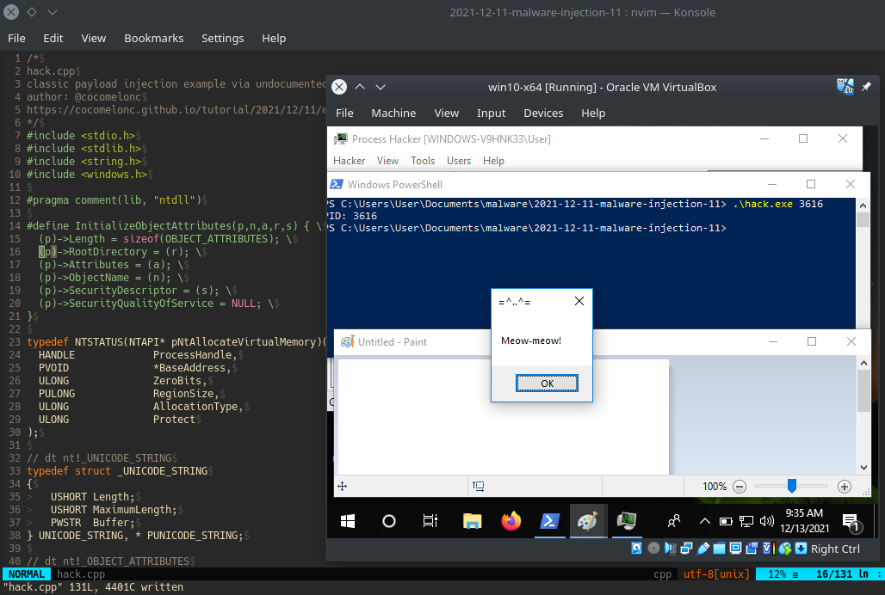{width="80%"}    

In the previous sections I wrote about DLL injection via undocumented `NtCreateThreadEx` and `NtAllocateVirtualMemory`.   

The following post is a result of self-research of malware development technique which is interaction with the undocumented Native API.   

Today I tried to replace another function `OpenProcess` with undocumented Native API function `NtOpenProcess`.    

First of all, let's take a look at function `NtOpenProcess` syntax:    
```cpp
__kernel_entry NTSYSCALLAPI NTSTATUS NtOpenProcess(
  [out]          PHANDLE            ProcessHandle,
  [in]           ACCESS_MASK        DesiredAccess,
  [in]           POBJECT_ATTRIBUTES ObjectAttributes,
  [in, optional] PCLIENT_ID         ClientId
);
```

Here it is worth paying attention to the `ObjectAttributes` and `ClientId` parameters. `ObjectAttributes` - a pointer to an OBJECT_ATTRIBUTES structure that specifies the attributes to apply to the process object handle. This has to be defined and initialized prior to opening the handle. `ClientId` - a pointer to a client ID that identifies the thread whose process is to be opened.    

In order to use `NtOpenProcess` function, we have to define its definition in our code:

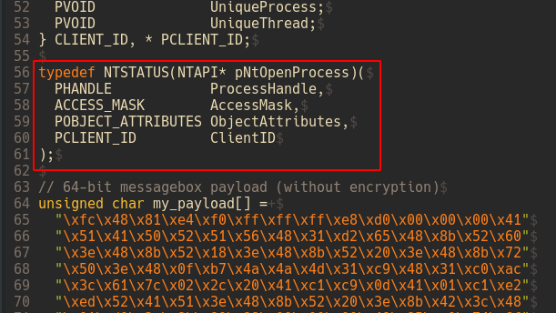{width="80%"}    

Similarly, `OBJECT_ATTRIBUTES` and `PCLIENT_ID` need to be defined. These structures are defined under NT Kernel header files.   

We can run `WinDBG` in local kernel mode and run:    
```bash
dt nt!_OBJECT_ATTRIBUTES
```

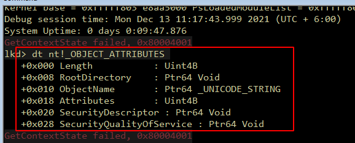{width="80%"}    

{width="80%"}    

Then run:
```bash
dt nt!_CLIENT_ID
```

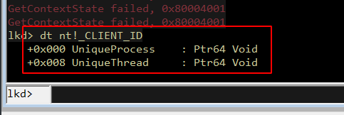{width="80%"}    

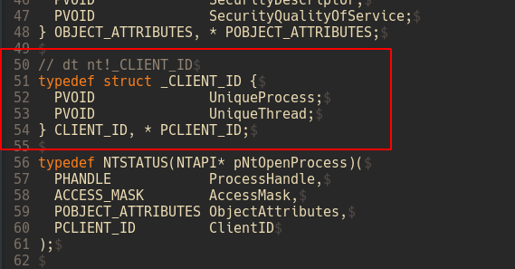{width="80%"}    

and:
```bash
dt nt!_UNICODE_STRING
```

{width="80%"}    

{width="80%"}    

There is one more caveat. Before returning the handle by the `NtOpenProcess` function/ routine, the Object Attributes need to be initialized which can be applied to the handle. To initialize the Object Attributes an `IntitializeObjectAttributes` macro is defined and invoked which specifies the properties of an object handle to routines that open handles.    

{width="80%"}    

{width="80%"}    

> [IntitializeObjectAttributes](https://docs.microsoft.com/en-us/windows/win32/api/ntdef/nf-ntdef-initializeobjectattributes)    

Then, loading the `ntdll.dll` library to invoke `NtOpenProcess`:    

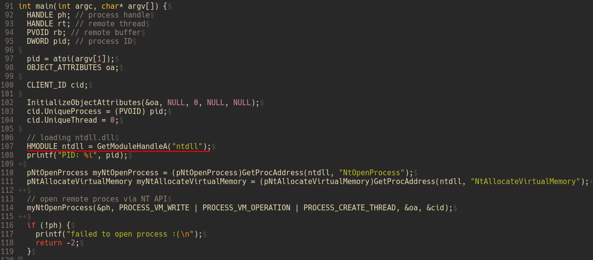{width="80%"}    

And then get starting addresses of the our functions:   

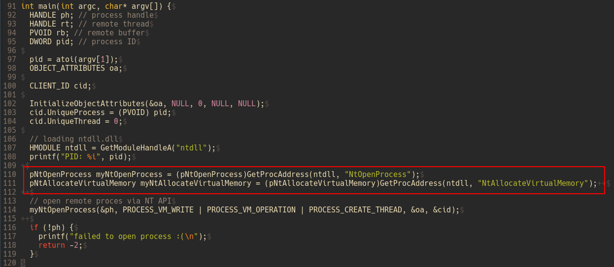{width="80%"}    

And finally open process:   

{width="80%"}    

And otherwise the main logic is the same.     

{width="80%"}    

As shown in this code, the Windows API call `OpenProcess` can be replaced with Native API call function `NtOpenProcess`. But we need to define the structures which are defined in the NT kernel header files.    

The downside to this method is that the function is undocumented so it may change in the future.

Let's go to see our simple malware in action. Compile `hack.cpp`:
```bash
x86_64-w64-mingw32-g++ hack.cpp -o hack.exe -mconsole \
-I/usr/share/mingw-w64/include/ -s -ffunction-sections \
-fdata-sections -Wno-write-strings -fno-exceptions \
-fmerge-all-constants -static-libstdc++ -static-libgcc \
-fpermissive
```

{width="80%"}    

Then, run process hacker 2:

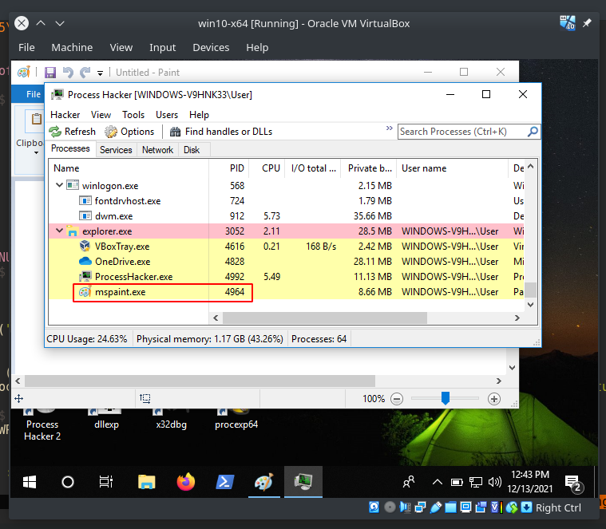{width="80%"}    

For example, the highlighted process `mspaint.exe` is our victim.    

Let's run our simple malware:   
```cmd
.\hack.exe 4964
```

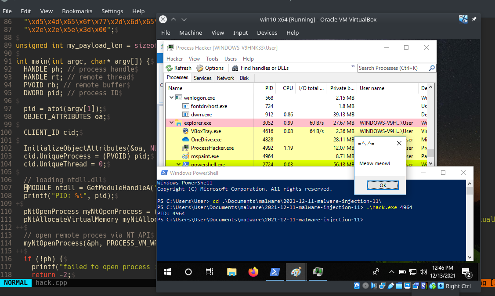{width="80%"}    

As you can see our `meow-meow` messagebox is popped-up.    

Let's go to investigate properties of our victim process `PID: 4964`:   

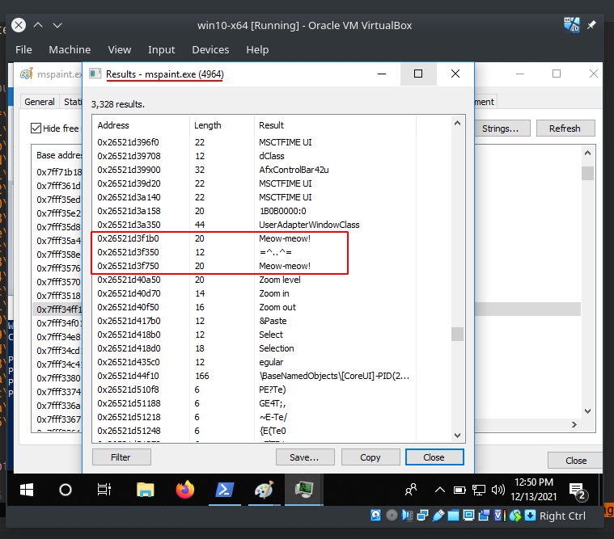{width="80%"}    

As you can see, our `meow-meow` payload successfully injected as expected!   

As you can see the main logic is the same with previous NT API function call techniques but there is a caveat with defining the structures and associated parameters. Without defining this structures the code will not run.    

The reason why it's good to have this technique in your arsenal is because we are not using `OpenProcess` which is more popular and suspicious and which is more closely investigated by the blue teamers.    

Let’s go to upload our new `hack.exe` with encrypted command to Virustotal (13.12.2021):

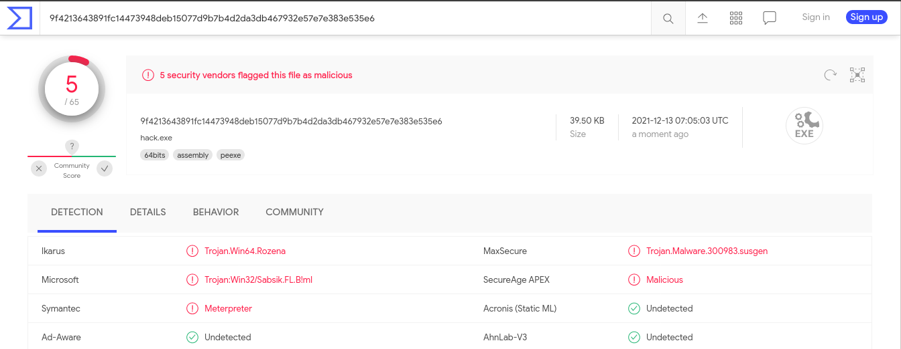{width="80%"}    

[https://www.virustotal.com/gui/file/9f4213643891fc14473948deb15077d9b7b4d2da3db467932e57e7e383e535e6?nocache=1](https://www.virustotal.com/gui/file/9f4213643891fc14473948deb15077d9b7b4d2da3db467932e57e7e383e535e6?nocache=1)    

**So, 5 of 65 AV engines detect our file as malicious.** 

If we want, for better result, we can add [payload encryption](https://cocomelonc.github.io/tutorial/2021/09/04/simple-malware-av-evasion.html) with key or [obfuscate](https://cocomelonc.github.io/tutorial/2021/09/06/simple-malware-av-evasion-2.html) functions, or combine both of this techniques.    

I hope this section spreads awareness to the blue teamers of this interesting technique, and adds a weapon to the red teamers arsenal.      

[WinDBG kernel debugging](https://docs.microsoft.com/en-us/windows-hardware/drivers/debugger/performing-local-kernel-debugging)    
[VirtualAllocEx](https://docs.microsoft.com/en-us/windows/win32/api/memoryapi/nf-memoryapi-virtualallocex)    
[NtOpenProcess](https://docs.microsoft.com/en-us/windows-hardware/drivers/ddi/ntddk/nf-ntddk-ntopenprocess)    
[NtAllocateVirtualMemory](https://docs.microsoft.com/en-us/windows-hardware/drivers/ddi/ntifs/nf-ntifs-ntallocatevirtualmemory)    
[WriteProcessMemory](https://docs.microsoft.com/en-us/windows/win32/api/memoryapi/nf-memoryapi-writeprocessmemory)    
[CreateRemoteThread](https://docs.microsoft.com/en-us/windows/win32/api/processthreadsapi/nf-processthreadsapi-createremotethread)    
[source code in Github](https://github.com/cocomelonc/2021-12-11-malware-injection-11)    
