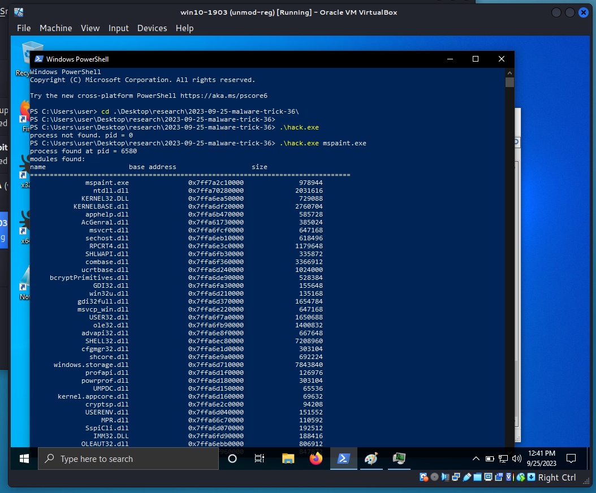
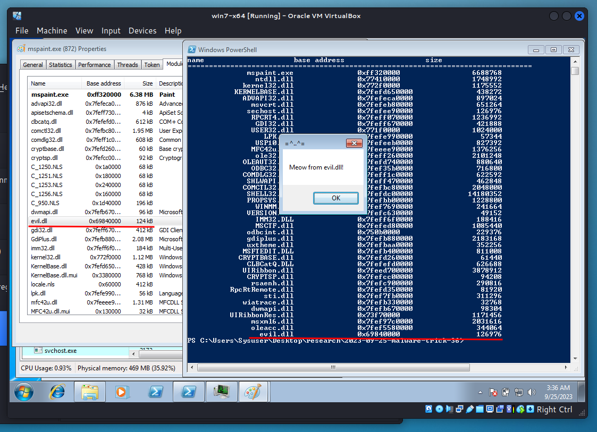

\newpage
\subsection{47. malware development trick. Enumerate process modules. Simple C++ example.}

﷽

{width="80%"}      

Today, this post is the result of my own research on another popular malware development trick: get list of modules of target process.     

Let's say we created successfully DLL injection to process. How to check if DLL in list of modules of our process?     

{width="80%"}      

### practical example

First of all, we just use one of the methods to find target process PID. For example I used [this one](https://cocomelonc.github.io/malware/2023/05/26/malware-tricks-30.html):     

```cpp
typedef NTSTATUS (NTAPI * fNtGetNextProcess)(
  _In_ HANDLE ph,
  _In_ ACCESS_MASK DesiredAccess,
  _In_ ULONG HandleAttributes,
  _In_ ULONG Flags,
  _Out_ PHANDLE Newph
);

int findMyProc(const char * procname) {
  int pid = 0;
  HANDLE current = NULL;
  char procName[MAX_PATH];

  // resolve function address
  fNtGetNextProcess myNtGetNextProcess = 
  (fNtGetNextProcess) GetProcAddress(GetModuleHandle("ntdll.dll"), "NtGetNextProcess");

  // loop through all processes
  while (!myNtGetNextProcess(current, MAXIMUM_ALLOWED, 0, 0, &current)) {
    GetProcessImageFileNameA(current, procName, MAX_PATH);
    if (lstrcmpiA(procname, PathFindFileName((LPCSTR) procName)) == 0) {
      pid = GetProcessId(current);
      break;
    }
  }

  return pid;
}
```

Then, just use `Module32First` and `Module32Next` functions from Windows API.     

```cpp
// function to list modules loaded by a specified process
int listModulesOfProcess(int pid) {

  HANDLE mod;
  MODULEENTRY32 me32;

  mod = CreateToolhelp32Snapshot(TH32CS_SNAPMODULE | TH32CS_SNAPMODULE32, pid);
  if (mod == INVALID_HANDLE_VALUE) { 
    printf("CreateToolhelp32Snapshot error :(\n"); 
    return -1; 
  }

  me32.dwSize = sizeof(MODULEENTRY32); 
  if (!Module32First(mod, &me32)) {
    CloseHandle(mod);
    return -1;
  }
  
  printf("modules found:\n");
  printf("name\t\t\t base address\t\t\tsize\n");
  printf("======================================================================\n");
  do {
    printf("%#25s\t\t%#10llx\t\t%#10d\n", me32.szModule, me32.modBaseAddr, 
    me32.modBaseSize);
  } while (Module32Next(mod, &me32));
  CloseHandle(mod);
  return 0;
}
```

As you can see, the code is a bit similar to the PID search logic with `CreateToolHelp32Snapshot`, `Process32First` and `Process32Next`.      

So, the full source code is looks like this (`hack.c`):     

```cpp
/*
 * hack.c - get the list of modules of the process. C++ implementation
 * @cocomelonc
 * https://cocomelonc.github.io/malware/2023/09/25/malware-tricks-36.html
*/
#include <windows.h>
#include <stdio.h>
#include <winternl.h>
#include <tlhelp32.h>
#include <shlwapi.h>
#include <psapi.h>

#pragma comment(lib, "ntdll.lib")
#pragma comment(lib, "shlwapi.lib")

typedef NTSTATUS (NTAPI * fNtGetNextProcess)(
  _In_ HANDLE ph,
  _In_ ACCESS_MASK DesiredAccess,
  _In_ ULONG HandleAttributes,
  _In_ ULONG Flags,
  _Out_ PHANDLE Newph
);

int findMyProc(const char * procname) {
  int pid = 0;
  HANDLE current = NULL;
  char procName[MAX_PATH];

  // resolve function address
  fNtGetNextProcess myNtGetNextProcess = 
  (fNtGetNextProcess) GetProcAddress(GetModuleHandle("ntdll.dll"), "NtGetNextProcess");

  // loop through all processes
  while (!myNtGetNextProcess(current, MAXIMUM_ALLOWED, 0, 0, &current)) {
    GetProcessImageFileNameA(current, procName, MAX_PATH);
    if (lstrcmpiA(procname, PathFindFileName((LPCSTR) procName)) == 0) {
      pid = GetProcessId(current);
      break;
    }
  }

  return pid;
}

// function to list modules loaded by a specified process
int listModulesOfProcess(int pid) {

  HANDLE mod;
  MODULEENTRY32 me32;

  mod = CreateToolhelp32Snapshot(TH32CS_SNAPMODULE | TH32CS_SNAPMODULE32, pid);
  if (mod == INVALID_HANDLE_VALUE) { 
    printf("CreateToolhelp32Snapshot error :(\n"); 
    return -1; 
  }

  me32.dwSize = sizeof(MODULEENTRY32); 
  if (!Module32First(mod, &me32)) {
    CloseHandle(mod);
    return -1;
  }
  
  printf("modules found:\n");
  printf("name\t\t\t base address\t\t\tsize\n");
  printf("======================================================================\n");
  do {
    printf("%#25s\t\t%#10llx\t\t%#10d\n", me32.szModule, me32.modBaseAddr, 
    me32.modBaseSize);
  } while (Module32Next(mod, &me32));
  CloseHandle(mod);
  return 0;
}

int main(int argc, char* argv[]) {
  int pid = 0; // process ID
  pid = findMyProc(argv[1]);
  printf("%s%d\n", pid > 0 ? "process found at pid = " : 
  "process not found. pid = ", pid);
  if (pid != 0)
    listModulesOfProcess(pid);
  return 0;
}
```

You can use this code to check if a DLL is in the list of modules of the target process.      

### demo

Let's go to see this logic in action.      

Compile it:     

```bash
x86_64-w64-mingw32-g++ -O2 hack.c -o hack.exe \
-I/usr/share/mingw-w64/include/ \
-s -ffunction-sections \
-fdata-sections -Wno-write-strings -fno-exceptions \ -fmerge-all-constants -static-libstdc++ -static-libgcc \
-fpermissive -lshlwapi
```

{width="80%"}      

Then, open target process in the victim's machine:     

{width="80%"}      

{width="80%"}      

And just run our `hack.exe`:    

```powershell
.\hack.exe mspaint.exe
```

{width="80%"}      

{width="80%"}      

{width="80%"}      

Also, check with [DLL injection](https://cocomelonc.github.io/tutorial/2021/09/20/malware-injection-2.html) logic:    

{width="80%"}      

As you can see, everything is worked perfectly! =^..^=     

Keep in mind that this code may have limitations and dependencies on specific Windows APIs. Additionally, it relies on the process name for identification, which may not be unique.     

This trick is used by [4H RAT](https://attack.mitre.org/software/S0065/) and [Aria-body](https://attack.mitre.org/software/S0456/) in the wild.     

I hope this post spreads awareness to the blue teamers of this interesting malware dev technique, and adds a weapon to the red teamers arsenal.      

[Find process ID by name and inject to it](https://cocomelonc.github.io/pentest/2021/09/29/findmyprocess.html)     
[Find PID via NtGetNextProcess](https://cocomelonc.github.io/malware/2023/05/26/malware-tricks-30.html)     
[4H RAT](https://attack.mitre.org/software/S0065/)      
[Aria-body](https://attack.mitre.org/software/S0456/)      
[source code in github](https://github.com/cocomelonc/meow/tree/master/2023-09-25-malware-trick-36)           
