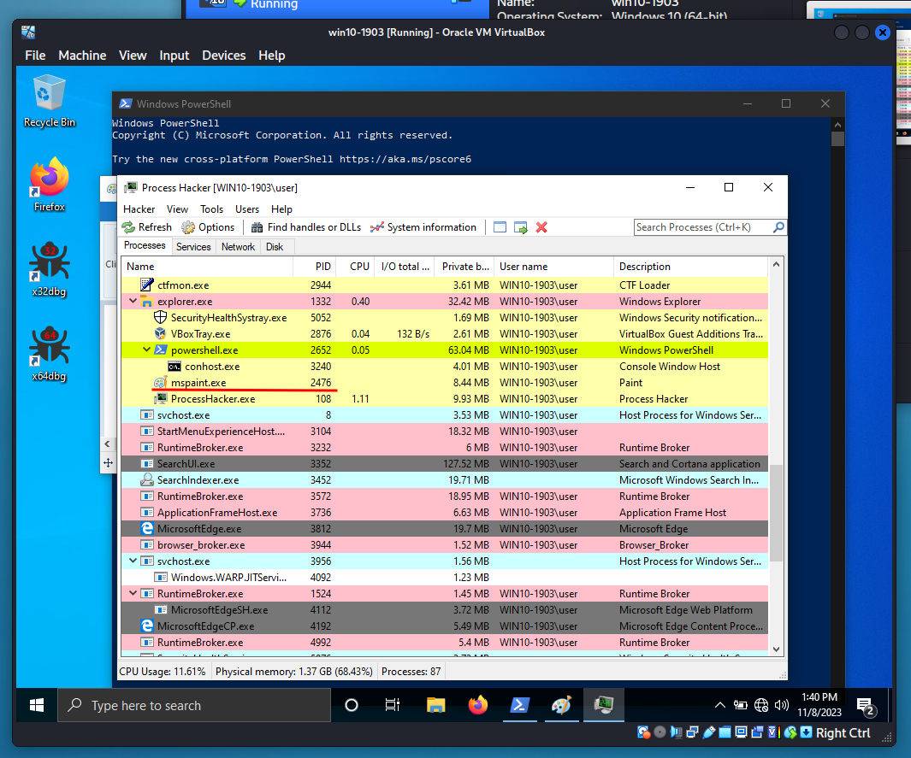
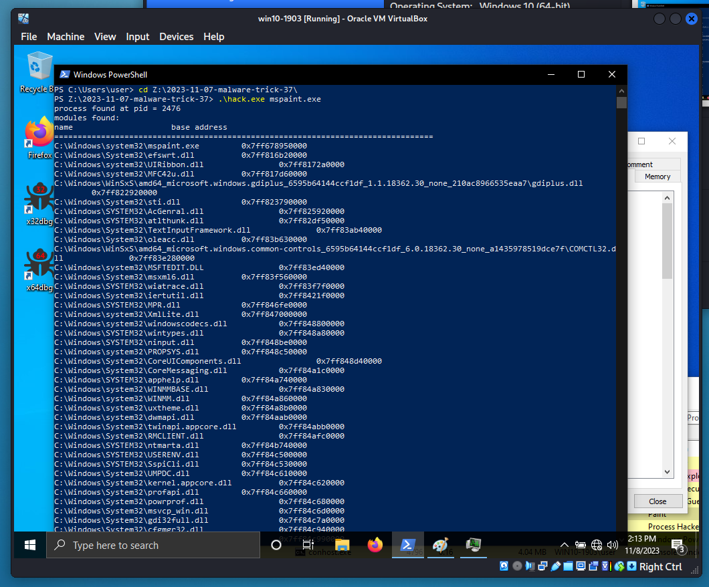
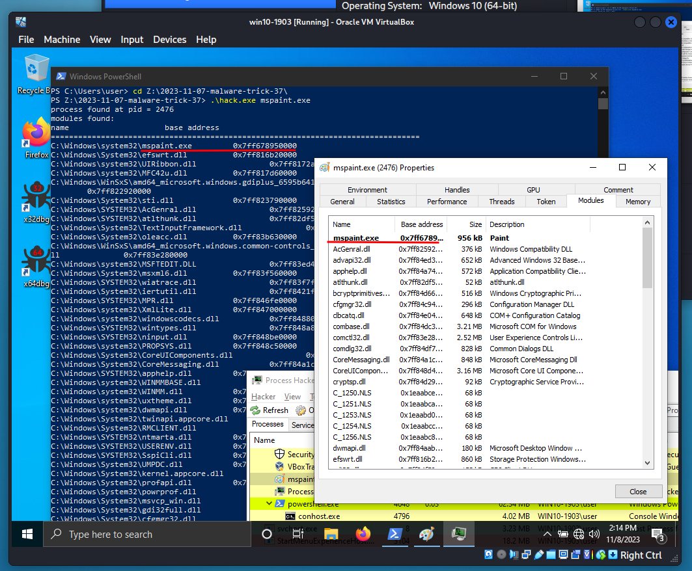

\newpage
\subsection{48. malware development trick. Enumerate process modules via VirtualQueryEx. Simple C++ example.}

﷽

{width="80%"}      

Today, this post is the result of my own research on another popular malware development trick: get list of modules of target process.     

It's similar to my previous post about enum list of modules, but in this case I used [VirtualQueryEx](https://learn.microsoft.com/en-us/windows/win32/api/memoryapi/nf-memoryapi-virtualqueryex)     

### practical example

First of all, we just use one of the methods to find target process PID. For example I used [this one](https://cocomelonc.github.io/malware/2023/05/26/malware-tricks-30.html):     

```cpp
typedef NTSTATUS (NTAPI * fNtGetNextProcess)(
  _In_ HANDLE ph,
  _In_ ACCESS_MASK DesiredAccess,
  _In_ ULONG HandleAttributes,
  _In_ ULONG Flags,
  _Out_ PHANDLE Newph
);

int findMyProc(const char * procname) {
  int pid = 0;
  HANDLE current = NULL;
  char procName[MAX_PATH];

  // resolve function address
  fNtGetNextProcess myNtGetNextProcess = (fNtGetNextProcess) 
  GetProcAddress(GetModuleHandle("ntdll.dll"), "NtGetNextProcess");

  // loop through all processes
  while (!myNtGetNextProcess(current, MAXIMUM_ALLOWED, 0, 0, &current)) {
    GetProcessImageFileNameA(current, procName, MAX_PATH);
    if (lstrcmpiA(procname, PathFindFileName((LPCSTR) procName)) == 0) {
      pid = GetProcessId(current);
      break;
    }
  }

  return pid;
}
```

Then, create function which opens a specified process, iterates through its memory regions using `VirtualQueryEx`, and retrieves information about the loaded modules, including their names and base addresses:     

```cpp
// function to list modules loaded by a specified process
int listModulesOfProcess(int pid) {
  HANDLE ph;
  MEMORY_BASIC_INFORMATION mbi;
  char * base = NULL;

  ph = OpenProcess(PROCESS_QUERY_INFORMATION | PROCESS_VM_READ, FALSE, pid);
  if (ph == NULL)
    return -1;

  printf("modules found:\n");
  printf("name\t\t\t base address\n");
  printf("======================================================================\n");

  while (VirtualQueryEx(ph, base, &mbi, sizeof(mbi)) == 
  sizeof(MEMORY_BASIC_INFORMATION)) {
    char szModName[MAX_PATH];

    // only focus on the base address regions
    if ((mbi.AllocationBase == mbi.BaseAddress) && (mbi.AllocationBase != NULL)) {
      if (GetModuleFileNameEx(ph, (HMODULE) mbi.AllocationBase, 
      (LPSTR) szModName, sizeof(szModName) / sizeof(TCHAR)))
        printf("%#25s\t\t%#10llx\n", szModName, 
        (unsigned long long)mbi.AllocationBase);
      }
      // check the next region
      base += mbi.RegionSize;
    }
  
  CloseHandle(ph);
  return 0;
}
```

As you can see, the code enters a while loop that continues as long as the `VirtualQueryEx` function successfully retrieves memory information. This loop iterates through memory regions within the target process.     

Then checks whether the `AllocationBase` of the current memory region matches the `BaseAddress`. This condition ensures that it only focuses on the base address regions. If the conditions are met, it proceeds to retrieve the module name.     

`if (GetModuleFileNameEx(ph, (HMODULE) mbi.AllocationBase, (LPSTR) szModName, sizeof(szModName) / sizeof(TCHAR)))` - The `GetModuleFileNameEx` function is called to retrieve the module filename associated with the current memory region's base address. If successful, it stores the filename in `szModName`.    

If the module name retrieval was successful, the code prints the module name and base address in a formatted manner.     

After processing the current region, the `base` pointer is incremented by the size of the region to check the next region in the subsequent iteration of the loop.     

That's all.     

So, the full source code is looks like this (`hack.c`):     

```cpp
/*
 * hack.c - get the list of 
 * modules of the process via VirtualQueryEx. C++ implementation
 * @cocomelonc
 * https://cocomelonc.github.io/malware/2023/11/07/malware-tricks-37.html
*/
#include <windows.h>
#include <stdio.h>
#include <winternl.h>
#include <tlhelp32.h>
#include <shlwapi.h>
#include <psapi.h>

#pragma comment(lib, "ntdll.lib")
#pragma comment(lib, "shlwapi.lib")

typedef NTSTATUS (NTAPI * fNtGetNextProcess)(
  _In_ HANDLE ph,
  _In_ ACCESS_MASK DesiredAccess,
  _In_ ULONG HandleAttributes,
  _In_ ULONG Flags,
  _Out_ PHANDLE Newph
);

int findMyProc(const char * procname) {
  int pid = 0;
  HANDLE current = NULL;
  char procName[MAX_PATH];

  // resolve function address
  fNtGetNextProcess myNtGetNextProcess = (fNtGetNextProcess) 
  GetProcAddress(GetModuleHandle("ntdll.dll"), "NtGetNextProcess");

  // loop through all processes
  while (!myNtGetNextProcess(current, MAXIMUM_ALLOWED, 0, 0, &current)) {
    GetProcessImageFileNameA(current, procName, MAX_PATH);
    if (lstrcmpiA(procname, PathFindFileName((LPCSTR) procName)) == 0) {
      pid = GetProcessId(current);
      break;
    }
  }

  return pid;
}

// function to list modules loaded by a specified process
int listModulesOfProcess(int pid) {
  HANDLE ph;
  MEMORY_BASIC_INFORMATION mbi;
  char * base = NULL;

  ph = OpenProcess(PROCESS_QUERY_INFORMATION | PROCESS_VM_READ, FALSE, pid);
  if (ph == NULL)
    return -1;

  printf("modules found:\n");
  printf("name\t\t\t base address\n");
  printf("=====================================================================\n");

  while (VirtualQueryEx(ph, base, &mbi, sizeof(mbi)) == 
  sizeof(MEMORY_BASIC_INFORMATION)) {
    char szModName[MAX_PATH];

    // only focus on the base address regions
    if ((mbi.AllocationBase == mbi.BaseAddress) && (mbi.AllocationBase != NULL)) {
      if (GetModuleFileNameEx(ph, (HMODULE) mbi.AllocationBase, 
      (LPSTR) szModName, sizeof(szModName) / sizeof(TCHAR)))
        printf("%#25s\t\t%#10llx\n", szModName, (unsigned long long)mbi.AllocationBase);
      }
      // check the next region
      base += mbi.RegionSize;
    }
  
  CloseHandle(ph);
  return 0;
}

int main(int argc, char* argv[]) {
  int pid = 0; // process ID
  pid = findMyProc(argv[1]);
  printf("%s%d\n", pid > 0 ? "process found at pid = " : 
  "process not found. pid = ", pid);
  if (pid != 0)
    listModulesOfProcess(pid);
  return 0;
}
```

### demo

Let's go to see this logic in action.      

Compile it:     

```bash
x86_64-w64-mingw32-g++ -O2 hack.c -o hack.exe \
-I/usr/share/mingw-w64/include/ \
-s -ffunction-sections -fdata-sections -Wno-write-strings -fno-exceptions \
-fmerge-all-constants -static-libstdc++ -static-libgcc \
-fpermissive -lpsapi -lshlwapi
```

{width="80%"}      

Then, open target process in the victim's machine:     

{width="80%"}      

And just run our `hack.exe`:    

```powershell
.\hack.exe mspaint.exe
```

{width="80%"}      

{width="80%"}      

As you can see, everything is worked perfectly! =^..^=     

Keep in mind that this code may have limitations and dependencies on specific Windows APIs. Additionally, it relies on the process name for identification, which may not be unique.     

This code can also help you develop your own script to work with process memory, for example for forensics or other tasks on blue team practical cases.     

I hope this post spreads awareness to the blue teamers of this interesting malware dev technique, and adds a weapon to the red teamers arsenal.      

[VirtualQueryEx](https://learn.microsoft.com/en-us/windows/win32/api/memoryapi/nf-memoryapi-virtualqueryex)    
[GetModuleFileNameEx](https://learn.microsoft.com/en-us/windows/win32/api/psapi/nf-psapi-getmodulefilenameexa)    
[Find process ID by name and inject to it](https://cocomelonc.github.io/pentest/2021/09/29/findmyprocess.html)     
[Find PID via NtGetNextProcess](https://cocomelonc.github.io/malware/2023/05/26/malware-tricks-30.html)     
[source code in github](https://github.com/cocomelonc/meow/tree/master/2023-11-07-malware-trick-37)           
