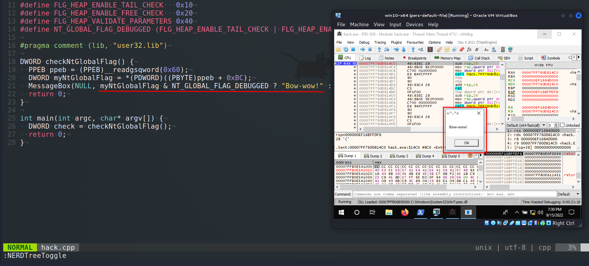
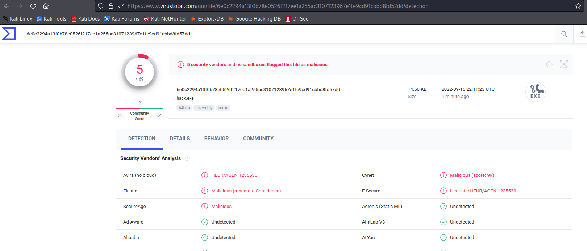

\newpage
\subsection{63. Malware AV/VM evasion - part 10: anti-debugging. NtGlobalFlag. Simple C++ example.}

﷽

{width="80%"}      

This post is the result of my own research into interesting anti-debugging trick: checking `NtGlobalFlag`.    

This is just another way how malware can detect that it is running in a debugger.     

### NtGlobalFlag

During debugging, the system sets the `FLG_HEAP_ENABLE_TAIL_CHECK` (`0x10`), `FLG_HEAP_ENABLE_FREE_CHECK` (`0x20`) and `FLG_HEAP_VALIDATE_PARAMETERS` (`0x40`) flags in the `NtGlobalFlag` field, which is located in the `PEB` structure.    

The `NtGlobalFlag` has the value `0x68` offset on `32-bit` Windows, the value of `0xbc` on `64-bit` Windows and both of them are set to `0`:    

{width="80%"}      

### practical example

Simple PoC code for anti-debugging:     

```cpp
/*
hack.cpp
anti-debugging via NtGlobalFLag
author: @cocomelonc
https://cocomelonc.github.io/malware/2022/09/15/malware-av-evasion-10.html
*/
#include <winternl.h>
#include <windows.h>
#include <stdio.h>

#define FLG_HEAP_ENABLE_TAIL_CHECK   0x10
#define FLG_HEAP_ENABLE_FREE_CHECK   0x20
#define FLG_HEAP_VALIDATE_PARAMETERS 0x40
#define NT_GLOBAL_FLAG_DEBUGGED (FLG_HEAP_ENABLE_TAIL_CHECK | 
FLG_HEAP_ENABLE_FREE_CHECK | FLG_HEAP_VALIDATE_PARAMETERS)

#pragma comment (lib, "user32.lib")

DWORD checkNtGlobalFlag() {
  PPEB ppeb = (PPEB)__readgsqword(0x60);
  DWORD myNtGlobalFlag = *(PDWORD)((PBYTE)ppeb + 0xBC);
  MessageBox(NULL, myNtGlobalFlag & NT_GLOBAL_FLAG_DEBUGGED ? "Bow-wow!" : 
  "Meow-meow!", "=^..^=", MB_OK);
  return 0;
}

int main(int argc, char* argv[]) {
  DWORD check = checkNtGlobalFlag();
  return 0;
}
```

As you can see, the logic is pretty simple, we just check a combination of flags.    

> For simplicity, I have only considered 64-bit Windows

### demo

Let's go to see everything in action. Compile:    

```bash
x86_64-w64-mingw32-g++ -O2 hack.cpp -o hack.exe \
-I/usr/share/mingw-w64/include/ -s \
-ffunction-sections -fdata-sections -Wno-write-strings \
-fno-exceptions -fmerge-all-constants -static-libstdc++ \
-static-libgcc -fpermissive
```

{width="80%"}      

Run it via `x64dbg` debugger:    

{width="80%"}      

and run from cmd:   

{width="80%"}      

As you can see everything is worked perfectly :)   

Upload it to VirusTotal:    

{width="80%"}      

**As you can see, 5 of 69 AV engines detect our PoC file as malicious.**    

[https://www.virustotal.com/gui/file/6e0c2294a13f0b78e0526f217ee1a255ac3107123967e1fe9cd91cbbd8fd57dd/detection](https://www.virustotal.com/gui/file/6e0c2294a13f0b78e0526f217ee1a255ac3107123967e1fe9cd91cbbd8fd57dd/detection)     

I hope this post spreads awareness to the blue teamers of this interesting technique, and adds a weapon to the red teamers arsenal.

[MITRE ATT&CK: Debugger evasion](https://attack.mitre.org/techniques/T1622/)       
[MSDN: PEB structure](https://docs.microsoft.com/en-us/windows/win32/api/winternl/ns-winternl-peb)     
[x64dbg](https://github.com/x64dbg/x64dbg)     
[al-khaser](https://github.com/LordNoteworthy/al-khaser)    
[source code in github](https://github.com/cocomelonc/meow/tree/master/2022-09-15-malware-av-evasion-10)    
